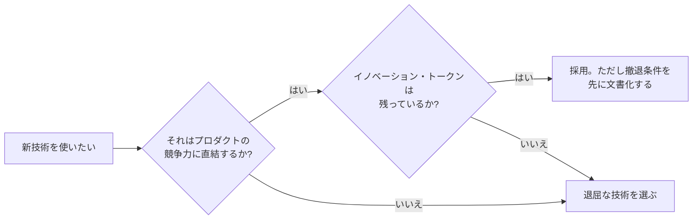

# 01. 技術選定の原則 — 地図より先に「地図の読み方」を

各論(何がデファクトか)は 1〜2 年で腐りますが、この章の内容は腐りにくい。
技術選定を初めて任される日のために、**判断の骨格**を先に作ります。

---

## 1. すべての対立は「前提の違い」に還元できる

技術論争を眺めるときの最重要スキルは、「どちらが正しいか」を判定することではなく、
**「この 2 派は何の前提が違うのか」を特定すること**です。

例として、このフォルダで繰り返し出てくる 3 大対立を先取りします。

| 対立 | A 派の前提 | B 派の前提 |
|---|---|---|
| Next.js(サーバーファースト) vs TanStack Start(クライアントファースト) | コンテンツ中心・SEO 重要・初期表示命 | ログイン後のアプリ画面中心・操作性命 |
| Vercel(マネージド) vs セルフホスト回帰 | 人件費 > サーバー代、運用者がいない | サーバー代 > 人件費、運用できる人がいる |
| Prisma(抽象化) vs Drizzle/sqlc(SQL 回帰) | SQL を書きたくない・書けない人が多いチーム | SQL は資産、隠すとチューニングで詰む |

どの対立も、**前提を固定すれば答えはほぼ自動的に決まります**。逆に言うと、
前提の確認をせずに「X がいいらしい」で選ぶのが、技術選定の失敗パターンの 8 割です。

> 💡 **ポイント**: 技術記事や X(Twitter)の論争を読むときは、筆者の前提
> (チーム規模・プロダクトの性質・運用体制)を復元しながら読む癖をつけてください。
> 「Vercel は高すぎる!」という記事は、たいてい「運用できる人がいる前提」で書かれています。

---

## 2. 退屈な技術を選べ(Choose Boring Technology)

2015 年に Dan McKinley が定式化した、技術選定でもっとも引用される原則です。
要旨はこうです:

- 組織が同時に扱える「新しい技術」の枠(**イノベーション・トークン**)は **3 枚程度** しかない
- 枠は、**プロダクトの競争力に直結する場所**にだけ使う
- それ以外は「退屈な技術」——枯れていて、失敗パターンが出尽くしていて、
  検索すれば必ず答えが見つかる技術——を選ぶ

「退屈」は侮辱ではなく最高の褒め言葉です。Postgres は退屈です。Go は退屈になるよう
設計されています([Go の思想](../03-go-fable-101/language-overview/README.md)そのものです)。
退屈な技術は **深夜 2 時の障害対応で牙を剥かない**。

---

## 3. 可逆性で慎重さを変えろ(One-way door / Two-way door)

Amazon の意思決定原則からの輸入です。決定には 2 種類あります。

- **Two-way door(あとで戻れる)**: リンタの選択、状態管理ライブラリ、テストランナー。
  → **さっさと決めて進む**。間違えたら移行すればいい
- **One-way door(ほぼ戻れない)**: **言語**、**データベース**、**API の公開スキーマ**、
  マルチテナントの設計、マイクロサービス分割。
  → ここにだけ時間をかける

技術選定の会議が紛糾するのは、たいてい Two-way door(タブ vs スペース級)に
One-way door 級の時間をかけているときです。逆に、DB スキーマや API 設計という
本物の One-way door が「あとで直せるでしょ」と 5 分で決まっていたら、それが危険信号です。

> ⚙️ **実務のコツ**: 選定ドキュメント(ADR: Architecture Decision Record)に
> 「この決定は可逆か?撤退コストは?」の欄を作っておくと、議論の熱量が自動調整されます。

---

## 4. ハイプサイクルのどこにいるかを読む

新技術への世間の温度は、ほぼ必ずこの曲線を描きます:

**過剰な期待 → 幻滅(「X はもう終わった」記事の量産)→ 実用の定着(適材適所が判明)**

2026 年時点の主要技術をこの曲線に置くと:

| フェーズ | 2026 年の住人 |
|---|---|
| 過剰な期待の坂 | AI エージェント駆動開発の周辺ツール群 |
| 幻滅のくぼ地 | エッジコンピューティング万能論、tRPC、GraphQL(2 度目のくぼ地) |
| 実用の高原(定着) | TypeScript、React、Vite、Tailwind、Postgres、コンテナ、OpenTelemetry |
| 高原だが世代交代の圧力 | ESLint/Prettier(→ Rust 製へ)、Jest(→ Vitest)、webpack(→ Vite/Rspack) |

読み方のコツは 2 つ。**「幻滅期」は買い時であることが多い**(誇大広告が剥がれて
本当の用途が見えた状態)。そして **「定着した技術への批判記事」は割り引いて読む**
(批判はニュースになるが、静かに動き続ける多数派はニュースにならない)。

---

## 5. 技術の「勢い」の測り方 — スター数に騙されない

デファクトかどうかを測る指標には信頼度の序列があります。

1. **求人数・採用実績**(もっとも遅行だが、もっとも嘘がない)
2. **npm 週間ダウンロード数の推移**(絶対値でなく傾き。例: 2026 年 5 月に
   Drizzle が Prisma を DL 数で逆転——これは「新規プロジェクトの選択」の変化を映す)
3. **大規模サーベイ**(State of JS、Stack Overflow Survey、JetBrains 調査。
   ただし回答者バイアス——新しもの好きが答えがち——を差し引く)
4. **メンテナンスの健全性**(コミット頻度、issue 対応、資金源。GitHub スター数より
   「**誰がなぜ金を出しているか**」を見る)
5. GitHub スター数、バズった記事(もっとも先行するが、もっとも嘘をつく)

> 📜 **「誰が金を出しているか」の例**: Next.js は Vercel(ホスティングを売る)、
> Vite 周辺は VoidZero(VC 出資のスタートアップ)、Go は Google、React は Meta。
> スポンサーの事業モデルは技術の進化方向を予言します。「Vercel に置くと一番快適」
> なのは偶然ではありません。同時に、**企業スポンサーは持続性の保証でもある**——
> 個人メンテナ 1 人のライブラリを基盤に据えるより安全な面もある。毒にも薬にもなる情報です。

---

## 6. 2026 年の新基準 — AI に書かせやすい技術か

この数年で技術選定に**本当に新しい基準**がひとつ加わりました。コードの相当部分を
AI(Copilot / Claude Code / Cursor など)が書く時代には:

- **学習データに大量に存在する技術**(= 退屈で有名な技術)は、AI の出力精度が高い
- ニッチな技術・最新すぎる API は、AI が **古い書き方や存在しない API を幻覚する**
- 型が強い言語(TS、Go)は、AI の間違いを**コンパイラが機械的に検出**してくれるため
  相性がよい。同じ理由で、リンタ・フォーマッタ・テストの整備は「AI の暴走防止柵」になる

つまり **「退屈な技術を選べ」の原則は、AI 時代にさらに強化されました**。
Boring は人間にとって安全なだけでなく、AI にとって書きやすい。
一方で新しすぎる技術を使う場合は、公式ドキュメントを AI に渡す運用
(llms.txt、MCP サーバー経由のドキュメント参照など)がセットで必要になります。

---

## 7. まとめ — 選定チェックリスト(短縮版)

技術 X を選ぶ前に、この 7 問に答えられるか:

1. この決定は **可逆か**?(不可逆なら以降の質問を 3 倍真剣に)
2. X が解く問題を、**うちのチームは本当に持っているか**?(他社の規模の問題を輸入していないか)
3. **前提が同じ**採用事例はあるか?(チーム規模・ドメインが違う成功例は参考にならない)
4. X の**メンテナンスは誰が、何のために**続けているか?
5. チームの**既存スキルと採用市場**で回せるか?
6. **撤退パス**はあるか?(エクスポート手段、標準への準拠度)
7. 5 年後もこの選定理由を**新人に説明できるか**?

完全版のチェックリストと実戦での使い方は [06 章](06_playbook.md) で。
次章からは、この眼鏡をかけて 2026 年の各レイヤーを見ていきます。

---

[← 目次](README.md) | [02. フロントエンド →](02_frontend.md)
