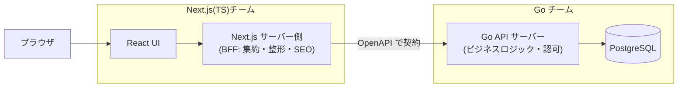

# 06. 選定プレイブック — シナリオ別の推奨と「Go + Next.js 職場」の歩き方

最終章は総合演習です。02〜05 章の地図を、実際の状況に当てはめます。
前半はシナリオ別の「2026 年の無難で強い構成」、後半は**あなたの転職先
(Go + Next.js + React)を想定した実戦ガイド**です。

---

## 1. シナリオ別・推奨スタック

### 🧑‍🎨 個人開発・MVP(1 人、最速で公開したい)

```
Next.js + Tailwind/shadcn + Drizzle + Neon(Postgres) + Better Auth or Clerk + Vercel
```

- 思想: **イノベーション・トークンをプロダクトに全部使う**。インフラは考えない
- フルスタック TS 一択。API 層は Server Actions で省略。デプロイは git push
- 落とし穴: Vercel の無料枠を超えて伸びたら、その時こそ[05 章](05_infra.md)を再読

### 🚀 スタートアップの B2B SaaS(2〜10 人)

```
フロント: Next.js(または TanStack Start)+ TanStack Query + Zustand
バック: TS なら Hono、運用重視なら Go(chi + sqlc)
境界: OpenAPI スキーマ駆動 / DB: マネージド Postgres
デプロイ: front = Vercel、back = コンテナ PaaS
```

- SaaS(ログイン内が主戦場)なら RSC の利得は小さい——SPA 寄り構成も堂々と合法
- **最初はモジュラーモノリス**。マイクロサービスは組織が要求してから
- 認証・課金(Stripe)・メールは買う(作らない)

### 🏢 中〜大規模組織(複数チーム)

```
ポリグロット前提: Go(サービス群)+ Next.js(フロント)+ Python(データ/ML)
境界: OpenAPI(外向き)+ gRPC/Connect(サービス間)
インフラ: クラウド直(ECS/GKE)+ Terraform/OpenTofu + OpenTelemetry
```

- 争点は技術よりも**境界の統治**(スキーマレジストリ、破壊的変更の運用ルール)
- 「共通基盤チーム」の有無が K8s 採用可否の分水嶺

### 📝 コンテンツサイト・EC(SEO が売上)

```
Astro(コンテンツ純度高)or Next.js(アプリ要素が濃い)+ ヘッドレス CMS + Vercel/Cloudflare
```

- ここは**サーバーファースト派の完勝地帯**。[02 章](02_frontend.md)の対立軸を思い出す

---

## 2. 転職先スタック(Go + Next.js + React)の解剖

この構成は 2026 年の中規模 Web 企業でもっとも標準的な布陣のひとつです。
**なぜこの組み合わせが選ばれるのか**を言語化できると、入社後の設計議論に参加できます。

### この構成の設計思想



- **Go 側**: ドメインロジック・データ・認可の本丸。単一バイナリ+コンテナで運用が軽い。
  高並行(goroutine)で API の性能が読みやすい
- **Next.js 側**: 画面と配信の最適化(SSR/SSG・画像・SEO)+ **BFF**(複数 API の
  集約、フロント都合のデータ整形)
- **契約**: 2 言語をまたぐので [tRPC は使えず](03_backend.md)、
  **OpenAPI スキーマ駆動が実質一択**。スキーマから Go サーバー(oapi-codegen 等)と
  TS クライアント(openapi-typescript 等)を自動生成し、「型の共有」を言語の壁を
  越えて実現する

### 入社後に確認すべき設計論点(そのまま質問リストとして使える)

1. **API スキーマはどう管理されていますか?**(OpenAPI を書いてコード生成?
   コードからスキーマ生成?手書きで乖離?——ここが一番事故る場所)
2. **認証・セッションはどちらが持っていますか?**(Go 側で発行し Next は素通し?
   Next 側 BFF で終端?Cookie と CORS の扱いは?)
3. **Next.js サーバー側から Go API を呼ぶのか、ブラウザから直接呼ぶのか?**
   (BFF 経由ならキャッシュ戦略、直接ならCORS と認可の設計が論点)
4. **リポジトリは分離?モノレポ?** スキーマファイルはどこに置いて、
   破壊的変更をどう検知していますか?
5. **Next.js のデプロイ先は?**(Vercel?セルフホスト?——
   [05 章](05_infra.md)の宗派がわかる)
6. **Go 側は stdlib 派?フレームワーク派?** DB アクセスは sqlc / GORM / 生 SQL?
7. **キャッシュは誰の責務ですか?**(Next のフルルートキャッシュ?Go 側?CDN?
   多層キャッシュは責務が曖昧だと必ず事故る)

> 💡 これらは「正解のある質問」ではなく、**チームの前提と流派を読むための質問**です。
> [01 章](01_principles.md)の通り、答えそのものより「なぜそうしたか」を聞くと、
> そのチームの技術選定の成熟度がわかります。

### この構成でよくある失敗パターン

| 失敗 | 症状 | 予防 |
|---|---|---|
| スキーマの乖離 | 「API 仕様書と実装が違う」 | スキーマ→コード生成を CI に組み込む(手書き同期は必ず腐る) |
| BFF の肥大化 | Next 側にビジネスロジックが漏れ出す | 「整形・集約は BFF、判断は Go」の線引きを文書化 |
| 二重キャッシュ事故 | 「更新したのに画面が変わらない」 | キャッシュ層の一覧表を作る([nextjs-fable-101 第10章](../06-nextjs-fable-101/chapters/10_caching.md)) |
| 認可の入口依存 | Middleware だけで認可(CVE-2025-29927 型) | データに近い層(Go のハンドラ/クエリ)で必ず再検証 |

---

## 3. 技術選定チェックリスト(完全版)

いつか自分が選定する日のために。[01 章](01_principles.md)の 7 問の実務展開です。

**Phase 1: 問題の確認**
- [ ] 解きたい問題を、技術名を使わずに 3 行で書けるか
- [ ] その問題は現在の規模の問題か、想像上の将来の問題か
- [ ] 既存スタックで解けない理由を説明できるか

**Phase 2: 候補の評価**
- [ ] この決定は可逆か(Two-way door なら即決してよい)
- [ ] 候補のメンテナンス主体と資金源を確認したか
- [ ] 同じ前提(規模・ドメイン)の採用事例を 2 つ以上見つけたか
- [ ] 「幻滅期の記事」を最低 1 本読んだか(賞賛記事だけで決めていないか)
- [ ] チームの既存スキル・採用市場で回るか
- [ ] AI コーディング支援は効くか(学習データ量・公式ドキュメントの質)

**Phase 3: 決定と記録**
- [ ] ADR(選定理由・却下した代替案・撤退条件)を書いたか
- [ ] 撤退条件を具体化したか(「○○が起きたら乗り換える」)
- [ ] 5 年後の新人に説明できる理由か(「流行っていたから」は説明ではない)

---

## 4. おわりに — 地図は古びる、羅針盤は古びない

このフォルダの各論は、2027 年には少しずつ、2029 年にはかなり古くなっているはずです。
それでも変わらないものを最後にもう一度:

1. **対立は前提の違い**。前提を特定すれば、宗教戦争は選定基準に変わる
2. **退屈な技術に賭け、イノベーションはプロダクトに使う**
3. **不可逆な決定(言語・DB・公開スキーマ)にだけ時間をかける**
4. **勢いは求人と DL 数の傾きで測る。スターとバズで測らない**
5. **境界にはスキーマを。スキーマからは生成を**
6. そして——デファクトを知った上で外すのと、知らずに外すのは全く違う。
   **この地図は「従うため」でなく「確信を持って外れるため」にある**

良い選定を。🧭

---

[← 05. インフラとデータ](05_infra.md) | [目次](README.md)
