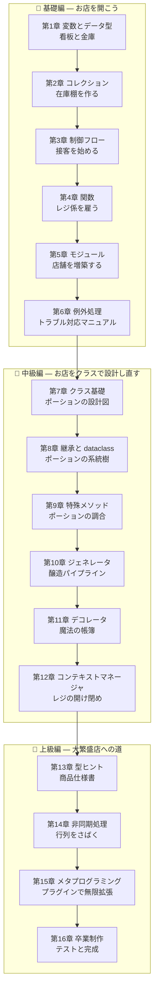

# 🧪 Python Fable 101 — 魔法薬店で学ぶ Python 基礎から上級まで

ようこそ!この教材では、あなたは魔法薬(ポーション)店 **「Pythonic Potions」** の新米店主になります。

最初は看板を出すことしかできませんが、章を進めるごとに Python の新しい概念を学び、
それをお店のシステムに組み込んでいきます。最終章では、テスト付き・プラグイン対応の
本格的な店舗管理システムが完成します。

## 📖 この教材の読み方

- 各章は **前の章のコードを土台に** 進みます。順番に読むのがおすすめです。
- コードは実際に手を動かして実行してください(Python 3.10 以上を推奨)。
- 各章の最後に「今日の開店準備(演習)」があります。
- 図は [Mermaid](https://mermaid.js.org/) 記法で書かれています。VS Code の Markdown プレビュー
  (拡張機能 *Markdown Preview Mermaid Support*)や GitHub 上でそのまま表示できます。

## 🗺️ 学習マップ



## 📚 目次

| 章 | タイトル | 学ぶ Python の概念 | お店に起きること |
|---|---|---|---|
| [第1章](chapters/01_variables.md) | 看板と金庫 | 変数、データ型、f-string | 開店!看板と所持金の管理 |
| [第2章](chapters/02_collections.md) | 在庫棚を作る | list / dict / tuple / set | 商品棚と価格表ができる |
| [第3章](chapters/03_control_flow.md) | 接客を始める | if / for / while / match | お客さんと会話できる |
| [第4章](chapters/04_functions.md) | レジ係を雇う | 関数、引数、スコープ、lambda | 会計処理が自動化される |
| [第5章](chapters/05_modules.md) | 店舗を増築する | モジュール、パッケージ、venv | コードがファイルに整理される |
| [第6章](chapters/06_exceptions.md) | トラブル対応マニュアル | 例外処理、独自例外 | 在庫切れ・お金不足に強くなる |
| [第7章](chapters/07_classes.md) | ポーションの設計図 | クラス、インスタンス、プロパティ | 商品と在庫がオブジェクトになる |
| [第8章](chapters/08_inheritance.md) | ポーションの系統樹 | 継承、ABC、dataclass | 商品の種類が体系化される |
| [第9章](chapters/09_dunder.md) | ポーションの調合 | 特殊メソッド(`__add__` など) | ポーション同士を `+` で調合できる |
| [第10章](chapters/10_generators.md) | 醸造パイプライン | イテレータ、ジェネレータ、yield | 大量生産ラインが動き出す |
| [第11章](chapters/11_decorators.md) | 魔法の帳簿 | クロージャ、デコレータ | 売上が自動で記録される |
| [第12章](chapters/12_context_managers.md) | レジの開け閉め | with、コンテキストマネージャ | 閉店時の精算ミスがなくなる |
| [第13章](chapters/13_typing.md) | 商品仕様書 | 型ヒント、Protocol、Generics | コードが自己文書化される |
| [第14章](chapters/14_async.md) | 行列をさばく | asyncio、並行処理、GIL | 複数のお客さんを同時に接客 |
| [第15章](chapters/15_metaprogramming.md) | プラグインで無限拡張 | ディスクリプタ、メタクラス | 新商品が自動登録される |
| [第16章](chapters/16_final.md) | 卒業制作 | pytest、プロジェクト構成 | テスト付き完成品が納品される |

## 🎯 対象読者

- プログラミング未経験〜他言語経験者で Python を体系的に学びたい人
- 基礎は知っているが、ジェネレータ・デコレータ・メタクラスなどに苦手意識がある人

## 🛠️ 準備

```bash
# Python 3.10 以上を確認
python3 --version

# 教材用の作業ディレクトリ(この教材では shop/ 以下にコードを育てていきます)
mkdir -p shop
```

それでは、[第1章](chapters/01_variables.md) から開店準備を始めましょう!🧙‍♂️
