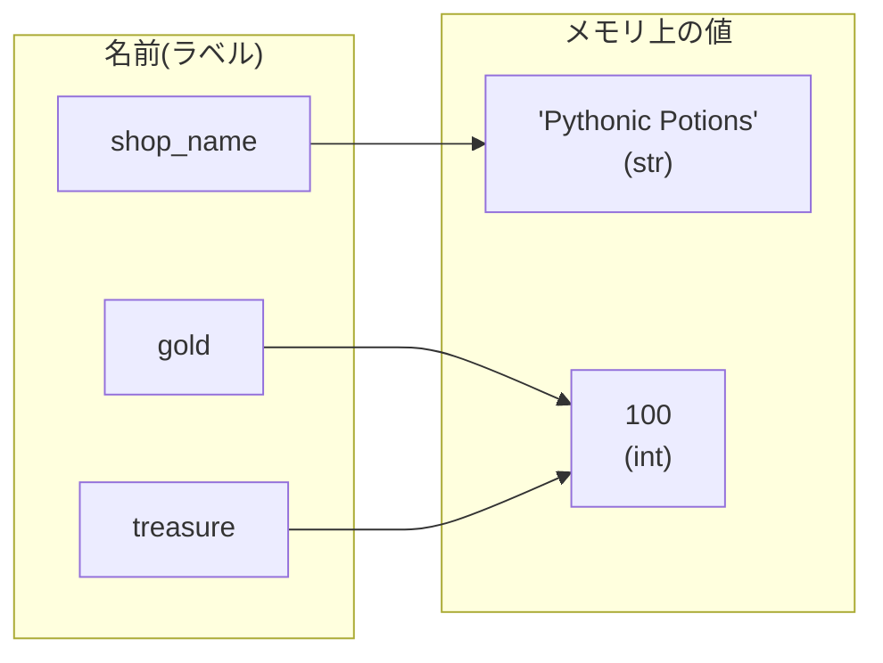
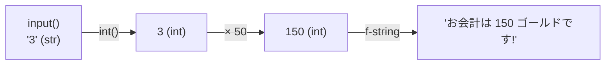

# 第1章 看板と金庫 — 変数とデータ型

## 🏪 今日のお話

あなたは今日から魔法薬店「Pythonic Potions」の店主です。
まずやることは 2 つ。**看板を出す** ことと、**金庫にいくら入っているか記録する** ことです。

プログラムの世界では、こうした「名前を付けて値を覚えておく」仕組みを **変数** と呼びます。

## 変数 — 値にラベルを貼る

```python
shop_name = "Pythonic Potions"   # 店の名前(文字列)
gold = 100                       # 所持金(整数)
tax_rate = 0.1                   # 消費税率(小数)
is_open = True                   # 開店中かどうか(真偽値)

print(shop_name)   # Pythonic Potions
print(gold)        # 100
```

`=` は「等しい」ではなく **「右の値に左の名前を付ける」** という意味です。

Python の変数は「値が入る箱」というより「**値に貼るラベル(付箋)**」とイメージすると
後々(特に第2章のリストで)混乱しません。



上の図のように、`treasure = gold` と書くと **同じ値に 2 枚目のラベルが貼られる** だけで、
値のコピーが 2 つできるわけではありません。

## 基本のデータ型

| 型 | 名前 | 例 | お店での用途 |
|---|---|---|---|
| `int` | 整数 | `100`, `-5` | 所持金、在庫数 |
| `float` | 浮動小数点数 | `0.1`, `3.14` | 税率、割引率 |
| `str` | 文字列 | `"回復薬"` | 商品名、看板 |
| `bool` | 真偽値 | `True`, `False` | 開店中フラグ |
| `None` | 「値がない」 | `None` | まだ決まっていないもの |

型は `type()` で確認できます。

```python
print(type(gold))      # <class 'int'>
print(type(tax_rate))  # <class 'float'>
```

> 💡 **Python は動的型付け言語**:変数自体に型はなく、値に型があります。
> `gold = "たくさん"` と書き直すことも(推奨はしませんが)できてしまいます。
> 第13章で「型ヒント」を学ぶと、この自由さに秩序を与えられます。

## 数値の計算 — 金庫の出し入れ

```python
gold = 100
gold = gold + 50    # 回復薬が売れた! → 150
gold += 30          # さらに売れた(省略記法)→ 180
gold -= 25          # 材料を仕入れた → 155

print(10 / 3)    # 3.3333... (割り算は必ず float)
print(10 // 3)   # 3         (切り捨て割り算)
print(10 % 3)    # 1         (余り)
print(2 ** 10)   # 1024      (べき乗)
```

## 文字列と f-string — 看板を作る

文字列は `"` でも `'` でも作れます。強力なのが **f-string**(フォーマット済み文字列)です。
`f"..."` の中に `{}` で変数や式を埋め込めます。

```python
shop_name = "Pythonic Potions"
gold = 155
potion_price = 50

sign = f"""
==============================
  ようこそ {shop_name} へ!
  本日の回復薬: {potion_price} ゴールド
  (税込 {potion_price * (1 + 0.1):.0f} ゴールド)
==============================
"""
print(sign)
```

- `{potion_price * (1 + 0.1):.0f}` のように **式** も書けます
- `:.0f` は「小数点以下 0 桁で表示」という **書式指定** です(`:,` で 3 桁区切り、`:>10` で右寄せなど)

文字列の便利な操作もいくつか:

```python
name = "  healing potion  "
print(name.strip())        # "healing potion"(前後の空白除去)
print(name.strip().title())# "Healing Potion"(単語の先頭を大文字に)
print("po" in name)        # True(部分文字列の検索)
print(len(name.strip()))   # 14(文字数)
```

## 型変換 — お客さんの入力を受け取る

`input()` はユーザーの入力を **必ず文字列で** 返します。数値として使うには変換が必要です。

```python
answer = input("回復薬を何本買いますか? > ")  # 例: "3" (str)
count = int(answer)                            # 3 (int) に変換
total = count * 50
print(f"お会計は {total} ゴールドです!")
```



## 🧪 完成コード: `shop/day1.py`

今日の成果をまとめましょう。

```python
"""Pythonic Potions — 開店 1 日目"""

shop_name = "Pythonic Potions"
gold = 100          # 開店資金
potion_price = 50   # 回復薬の価格
tax_rate = 0.1

print(f"🧪 {shop_name} 開店!")
print(f"金庫の中身: {gold} ゴールド")

count = int(input("回復薬を何本買いますか? > "))
total = int(potion_price * count * (1 + tax_rate))
gold += total

print(f"お会計は {total} ゴールド(税込)です。ありがとうございました!")
print(f"金庫の中身: {gold} ゴールド")
```

実行してみましょう:

```bash
python3 shop/day1.py
```

## 📝 今日の開店準備(演習)

1. `mana_potion_price = 80` を追加し、回復薬とマナポーションの両方の合計金額を出す看板を作ってください。
2. `discount = 0.2`(2割引)を定義し、割引後の価格を `:.1f` で小数第 1 位まで表示してください。
3. `print(0.1 + 0.2)` を実行して結果を観察してください。なぜ `0.3` ぴったりにならないのか調べてみましょう(ヒント: 浮動小数点数の仕組み。お金の計算を厳密にやりたいときは `decimal` モジュールを使います)。

---

次章、お店に **商品棚** がやってきます。1 つの変数では 1 つの値しか覚えられませんが、
商品が 10 種類になったらどうしましょう? → [第2章 在庫棚を作る](02_collections.md)
