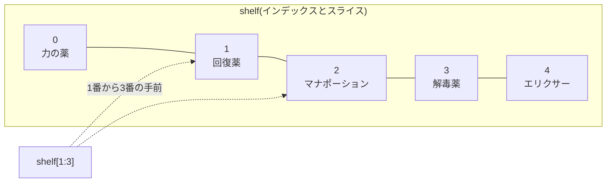
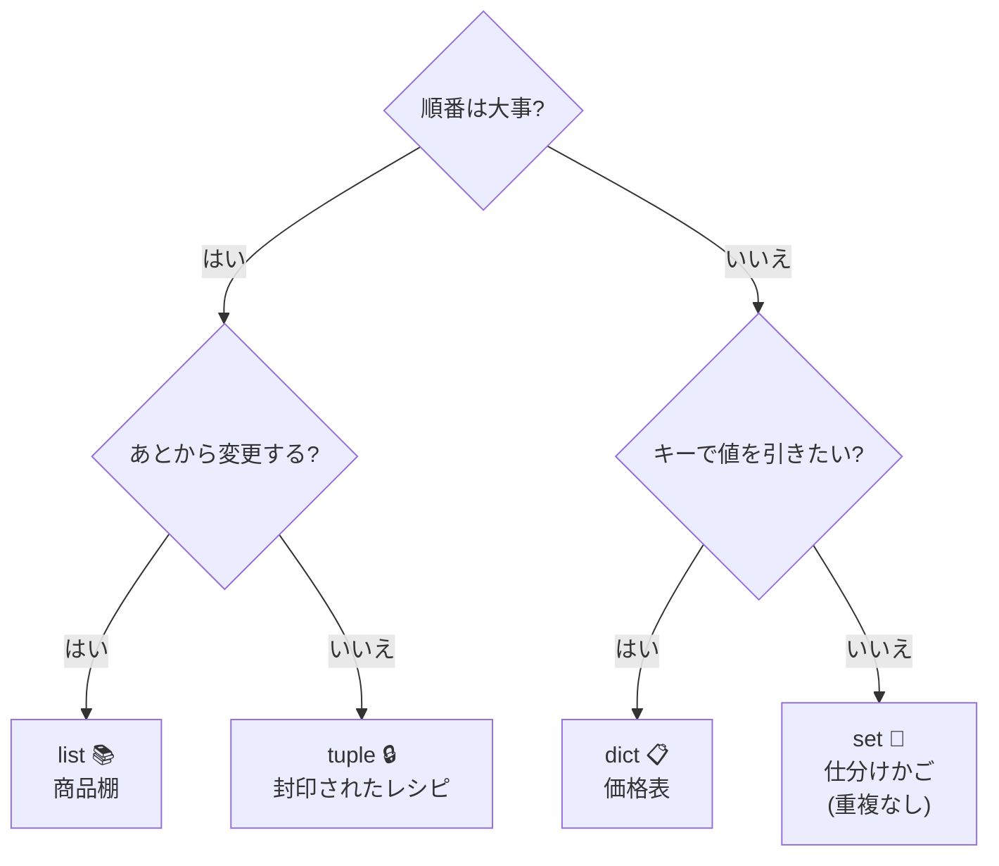
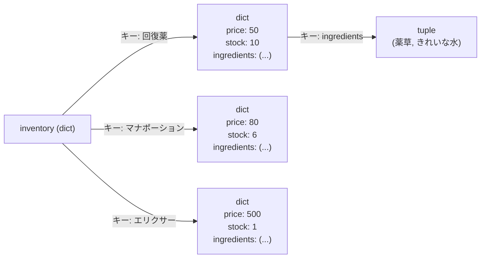

# 第2章 在庫棚を作る — コレクション

## 🏪 今日のお話

開店 2 日目。商品が回復薬 1 種類では寂しいので、品揃えを増やします。
しかし変数を `potion1 = ...`, `potion2 = ...` と増やしていくのは大変です。

Python には複数の値をまとめて扱う **コレクション** が 4 種類あります。
それぞれ「お店の道具」に対応させて覚えましょう。

| 型 | お店の道具 | 特徴 |
|---|---|---|
| `list` | 商品棚 | 順番あり・変更できる |
| `tuple` | 封印されたレシピ | 順番あり・**変更できない** |
| `dict` | 価格表(名前→値段) | キーで引ける・変更できる |
| `set` | 材料の仕分けかご | 重複なし・順番なし |

## list — 商品棚

```python
shelf = ["回復薬", "マナポーション", "解毒薬"]

print(shelf[0])      # 回復薬(先頭は 0 番!)
print(shelf[-1])     # 解毒薬(マイナスは後ろから)
print(len(shelf))    # 3

shelf.append("エリクサー")     # 棚の末尾に追加
shelf.insert(0, "力の薬")      # 先頭に割り込み
shelf.remove("解毒薬")         # 取り除く
sold = shelf.pop()             # 末尾から取り出す(エリクサーが売れた)

print(shelf)  # ['力の薬', '回復薬', 'マナポーション']
```

### スライス — 棚の一部を眺める

```python
shelf = ["力の薬", "回復薬", "マナポーション", "解毒薬", "エリクサー"]

print(shelf[1:3])    # ['回復薬', 'マナポーション']  (1番から3番の手前まで)
print(shelf[:2])     # ['力の薬', '回復薬']          (先頭から)
print(shelf[2:])     # ['マナポーション', '解毒薬', 'エリクサー']
print(shelf[::-1])   # 逆順のコピー
```



### ⚠️ ラベルの罠 — 第1章の伏線回収

第1章で「変数はラベル」と学びました。リストで実害が出ます。

```python
shelf_a = ["回復薬"]
shelf_b = shelf_a          # 同じ棚に 2 枚目のラベルを貼っただけ!
shelf_b.append("毒薬")

print(shelf_a)  # ['回復薬', '毒薬'] ← A の棚にも毒薬が!?

shelf_c = shelf_a.copy()   # 独立したコピーが欲しいときは copy()
```

## dict — 価格表

「回復薬はいくら?」に即答するには、**キー→値** の対応表 `dict` が最適です。

```python
prices = {
    "回復薬": 50,
    "マナポーション": 80,
    "解毒薬": 120,
}

print(prices["回復薬"])          # 50
prices["エリクサー"] = 500        # 新商品を追加
prices["回復薬"] = 55             # 値上げ(上書き)

# 存在しないキーを [] で引くとエラー。get() なら既定値を返せる
print(prices.get("賢者の石", "取り扱いなし"))  # 取り扱いなし

# 中身の眺め方
print(prices.keys())    # 商品名の一覧
print(prices.values())  # 価格の一覧
print(prices.items())   # (商品名, 価格) のペア一覧
```

## tuple — 封印されたレシピ

タプルは **変更できない** リストです。「変わってはいけないもの」に使います。
秘伝のレシピが接客中にうっかり書き換わったら大変ですからね。

```python
elixir_recipe = ("世界樹の葉", "妖精の涙", "月光水")

# elixir_recipe.append("砂糖")  # ← AttributeError! 封印済み

# アンパック(まとめて取り出す)
first, second, third = elixir_recipe
print(f"まず {first} を用意します")
```

タプルは dict のキーにもできます(リストはできません)。

## set — 材料の仕分けかご

集合 `set` は **重複を許さない** コレクション。仕入れた材料のダブりチェックに使えます。

```python
today = {"薬草", "きれいな水", "薬草", "月光水"}
print(today)  # {'薬草', 'きれいな水', '月光水'} ← 重複が消えた!

in_stock = {"薬草", "きれいな水"}
needed = {"薬草", "月光水", "妖精の涙"}

print(needed - in_stock)  # {'月光水', '妖精の涙'} ← 買い足すべきもの(差集合)
print(needed & in_stock)  # {'薬草'}               ← 両方にあるもの(積集合)
print(needed | in_stock)  # 全部合わせたもの        (和集合)
```

## どれを使えばいい?



## 入れ子 — 本格的な在庫台帳

### まずは困りごとから

「回復薬」1 品の情報(値段・在庫・材料)を dict で書くと、こうなります。

```python
hp_potion = {"price": 50, "stock": 10, "ingredients": ("薬草", "きれいな水")}
```

でも商品は 1 つだけじゃありません。これを商品ごとに増やすと…

```python
hp_potion   = {"price": 50,  "stock": 10, "ingredients": ("薬草", "きれいな水")}
mp_potion   = {"price": 80,  "stock": 6,  "ingredients": ("魔力草", "きれいな水")}
elixir      = {"price": 500, "stock": 1,  "ingredients": ("世界樹の葉", "妖精の涙", "月光水")}
```

第1章の `potion1`, `potion2` と同じ問題が再発しています。変数を増やすのではなく、
**「商品名」をキーにして、この dict たちをまとめて 1 つの箱に入れてしまえばいい** — これが入れ子の発想です。

### dict の中に dict を入れる

「値」の場所には、数値や文字列だけでなく **dict や tuple も置けます**。
つまり、上の 3 つの dict を「商品名 → dict」という台帳(dict)にまとめてしまいましょう。

```python
inventory = {
    "回復薬": {"price": 50, "stock": 10, "ingredients": ("薬草", "きれいな水")},
    "マナポーション": {"price": 80, "stock": 6, "ingredients": ("魔力草", "きれいな水")},
    "エリクサー": {"price": 500, "stock": 1, "ingredients": ("世界樹の葉", "妖精の涙", "月光水")},
}
```

`inventory` は dict で、そのキー(`"回復薬"` など)に対応する値もまた dict です。
さらにその中の `"ingredients"` の値は tuple。**dict → dict → tuple** と 3 階層になっています。



### アクセスは「1段ずつ」たどる

いきなり `inventory["回復薬"]["price"]` と書くと難しく見えますが、実は 1 段ずつ分解できます。

```python
# ステップ1: まず "回復薬" のキーを引く → 中身は dict がまるごと返ってくる
detail = inventory["回復薬"]
print(detail)   # {'price': 50, 'stock': 10, 'ingredients': ('薬草', 'きれいな水')}

# ステップ2: その dict に対して、さらに "price" のキーを引く
print(detail["price"])   # 50

# この2ステップを続けて書いたのが inventory["回復薬"]["price"]
print(inventory["回復薬"]["price"])   # 50
```

「`[キー]` を書くたびに、1 段下の階層に潜っていく」とイメージすると迷いません。
更新も同じ考え方で、潜った先の値を書き換えるだけです。

```python
inventory["回復薬"]["stock"] -= 1                 # 1 本売れた(2段潜って更新)
inventory["解毒薬"] = {"price": 120, "stock": 4}  # 新商品を1段目に丸ごと追加
print(inventory["エリクサー"]["ingredients"][0])   # 3段潜る: 'エリクサー' → 'ingredients' → [0]
```

### ⚠️ ラベルの罠は入れ子でも起きる

`shelf_b = shelf_a` と同じ罠が、入れ子の中の list/dict にも潜んでいます。
`.copy()` は **1 階層分しかコピーしない**(浅いコピー)ので要注意です。

```python
backup = inventory.copy()
backup["回復薬"]["stock"] = 0   # ← inventory["回復薬"] も一緒に 0 になる!(中身は共有されたまま)
```

深いところまで完全に独立したコピーが欲しい場合は `copy.deepcopy(inventory)` を使いますが、
これは今すぐ覚えなくて大丈夫です。「1階層だけのコピーは危ない」とだけ覚えておきましょう。

## 🧪 完成コード: `shop/day2.py`

```python
"""Pythonic Potions — 2 日目: 在庫台帳ができた"""

shop_name = "Pythonic Potions"
gold = 100

inventory = {
    "回復薬": {"price": 50, "stock": 10},
    "マナポーション": {"price": 80, "stock": 6},
    "エリクサー": {"price": 500, "stock": 1},
}

print(f"🧪 {shop_name} — 本日のメニュー")
print(f"{'商品名':<12}{'価格':>6}{'在庫':>6}")
print("-" * 26)
# ↓ 全商品を表示したいけど、3 行コピペするしかない…?(次章で解決!)
print(f"{'回復薬':<12}{inventory['回復薬']['price']:>6}{inventory['回復薬']['stock']:>6}")
```

「全商品ぶん表示したいのに、1 行ずつ書くの…?」— その不満、正解です。次章の `for` 文で解決します。

## 📝 今日の開店準備(演習)

1. `inventory` に「解毒薬(price: 120, stock: 4)」を追加してください。
2. 全商品の在庫数の合計を計算してください(ヒント: 今は手作業で足すしかありませんが、それで OK。次章で自動化します)。
3. `vip_customers = {"アリス", "ボブ"}` を作り、`"アリス" in vip_customers` の結果を確認してください。`in` は list にも dict にも使えます。dict に使うと何を調べることになるか実験してみましょう。

---

台帳はできましたが、お店はまだ一方的に表示するだけ。
次章では **お客さんとの対話** を実装します → [第3章 接客を始める](03_control_flow.md)
