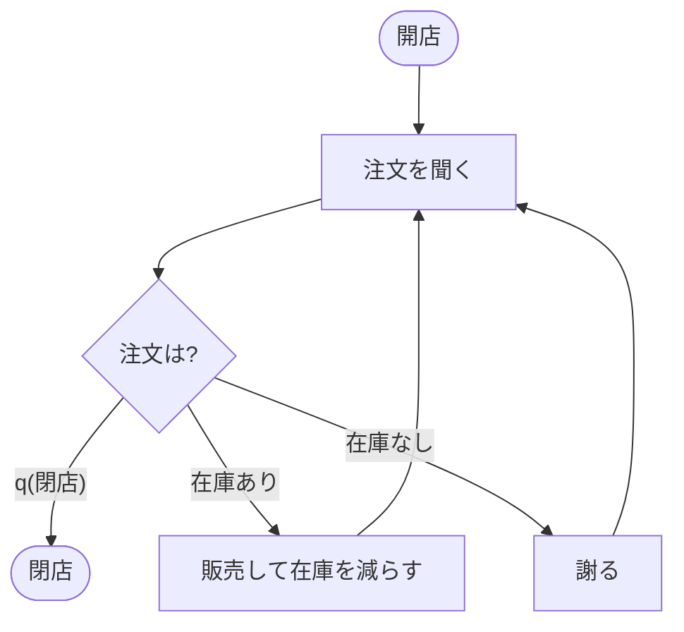

# 第3章 接客を始める — 制御フロー

## 🏪 今日のお話

台帳はできましたが、前章の最後で「全商品を表示するには 1 行ずつ書くしかない」問題が残りました。
さらに、お客さんの注文に応じて対応を **変える** 必要もあります。

- 在庫があれば売る、なければ謝る → **条件分岐 `if`**
- 全商品を順に表示する → **繰り返し `for`**
- 閉店までずっと接客し続ける → **繰り返し `while`**

プログラムの流れ(フロー)を操るので、これらを **制御フロー** と呼びます。

## if / elif / else — 状況に応じた接客

```python
stock = 3

if stock > 5:
    print("在庫は十分です")
elif stock > 0:
    print("残りわずか!お早めに!")
else:
    print("申し訳ありません、売り切れです")
```

Python は **インデント(字下げ)** でブロックを表します。`if` の中身は必ず 4 スペース下げます。

### 比較演算子と論理演算子

```python
gold = 100
price = 50
is_vip = True

if gold >= price and stock > 0:      # 両方成り立つとき
    print("お買い上げ!")
if is_vip or gold >= 1000:           # どちらかが成り立つとき
    print("特別室へご案内します")
if not is_vip:                       # 成り立たないとき
    print("ポイントカードはお作りしますか?")

# Python らしい書き方: 範囲の連結比較
if 0 < stock <= 5:
    print("残りわずか")
```

> 💡 **真偽値のルール**: `if` は `bool` 以外も受け付けます。
> `0`、`""`(空文字)、`[]`(空リスト)、`{}`、`None` は **偽(falsy)**、それ以外は **真(truthy)**。
> `if shelf:` と書けば「棚に商品があれば」の意味になります。

## for — 棚の商品を順番に処理する

前章の不満をいよいよ解決します。`for` はコレクションの要素を **1 つずつ取り出して** 処理します。

```python
inventory = {
    "回復薬": {"price": 50, "stock": 10},
    "マナポーション": {"price": 80, "stock": 6},
    "エリクサー": {"price": 500, "stock": 1},
}

# dict は .items() で (キー, 値) のペアを順に取り出せる
for name, info in inventory.items():
    print(f"{name:<12}{info['price']:>6}G  在庫{info['stock']:>3}")
```

たった 2 行で全商品表示!商品が 100 種類になっても、この 2 行のままです。

```python
# 回数を繰り返すなら range()
for i in range(3):
    print(f"{i + 1} 本目を袋に入れました")

# 番号付きで取り出すなら enumerate()
for i, name in enumerate(inventory, start=1):
    print(f"{i}. {name}")

# 在庫の合計(前章の演習 2 が 1 行に!)
total_stock = sum(info["stock"] for info in inventory.values())
```

### 内包表記 — Python 名物の時短レシピ

「リストから条件に合うものを集めて加工する」処理は **内包表記** で 1 行にできます。

```python
# 100 ゴールド未満のお手頃商品リスト
cheap = [name for name, info in inventory.items() if info["price"] < 100]
print(cheap)  # ['回復薬', 'マナポーション']

# dict も作れる: 全品 1 割引の価格表
sale_prices = {name: int(info["price"] * 0.9) for name, info in inventory.items()}
```

読みにくくなったら普通の `for` に戻して OK。**1 行に詰め込むこと自体は目的ではありません。**

## while — 閉店までずっと

`for` は「回数や対象が決まっている」繰り返し。`while` は「**条件が成り立つ間ずっと**」です。
お店の営業ループにぴったりです。

```python
is_open = True
while is_open:
    order = input("ご注文をどうぞ(qで閉店) > ")
    if order == "q":
        is_open = False
    else:
        print(f"{order} ですね、少々お待ちください")
```

- `break` : ループを即座に脱出(緊急閉店)
- `continue` : 今回の周をスキップして次の周へ(冷やかし客は受け流す)



## match — 注文の振り分け(Python 3.10+)

分岐が増えてきたら `match` 文(構造的パターンマッチ)がきれいです。

```python
command = input("コマンド(buy/list/help) > ")

match command.split():
    case ["list"]:
        print("在庫一覧を表示します")
    case ["buy", item]:
        print(f"{item} をお買い上げですね")
    case ["buy", item, count]:
        print(f"{item} を {count} 個ですね")
    case ["help"] | []:
        print("使い方: buy <商品名> [個数] / list")
    case _:
        print("すみません、聞き取れませんでした")
```

`case ["buy", item]` のように、**形にマッチさせながら変数に取り出せる** のが if との違いです。

## 🧪 完成コード: `shop/day3.py`

いよいよお店が「動き」ます。営業ループの誕生です。

```python
"""Pythonic Potions — 3 日目: 接客開始!"""

gold = 100
inventory = {
    "回復薬": {"price": 50, "stock": 10},
    "マナポーション": {"price": 80, "stock": 6},
    "エリクサー": {"price": 500, "stock": 1},
}

print("🧪 Pythonic Potions へようこそ!(コマンド: list / buy <商品名> / q)")

while True:
    command = input("\n> ").split()

    match command:
        case ["q"]:
            print(f"本日の売上を締めます。金庫: {gold} ゴールド")
            break
        case ["list"]:
            for name, info in inventory.items():
                mark = "🈳" if info["stock"] == 0 else ""
                print(f"  {name:<12}{info['price']:>6}G  在庫{info['stock']:>3} {mark}")
        case ["buy", item]:
            if item not in inventory:
                print(f"  {item} は取り扱いがありません…")
            elif inventory[item]["stock"] == 0:
                print(f"  {item} は売り切れです、ごめんなさい!")
            else:
                inventory[item]["stock"] -= 1
                gold += inventory[item]["price"]
                print(f"  {item} をお買い上げ!ありがとうございました 🎉")
        case _:
            print("  コマンド: list / buy <商品名> / q")
```

## 📝 今日の開店準備(演習)

1. `buy` で個数を指定できるようにしてください(`buy 回復薬 3`)。在庫が足りない場合は売れる分だけ…ではなく、丁寧にお断りしましょう。
2. `restock <商品名> <個数>` コマンドを追加して在庫を補充できるようにしてください(仕入れコストとして 1 個あたり価格の半額を `gold` から引くこと)。
3. 在庫が全商品 0 になったら自動的に閉店するようにしてください(ヒント: `all()` と内包表記、または `sum()`)。

---

営業ループは動きましたが、`while` の中がどんどん長くなってきました。
「お会計」「在庫確認」などの仕事を **名前を付けて切り出す** 時が来ました
→ [第4章 レジ係を雇う](04_functions.md)
