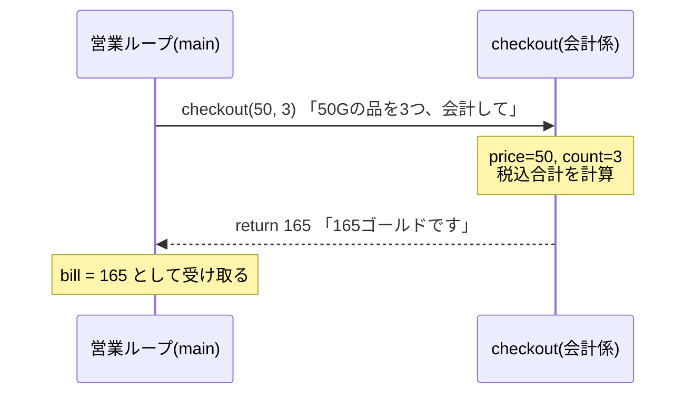
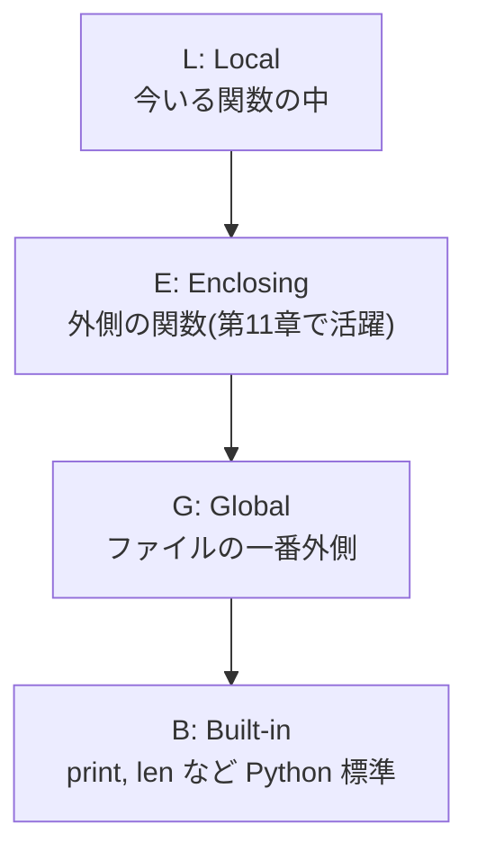

# 第4章 レジ係を雇う — 関数

## 🏪 今日のお話

営業ループが長くなり、店主 1 人では手が回らなくなってきました。
「会計係」「在庫係」のように **仕事に名前を付けて任せる** 仕組みが **関数** です。

関数には 3 つのご利益があります:

1. **再利用** — 同じ処理を何度も書かなくていい
2. **整理** — `main` の流れが読みやすくなる
3. **テスト** — 仕事単位で動作確認できる(第16章で花開きます)

## 関数の基本

```python
def checkout(price, count):
    """会計金額(税込)を計算して返す。"""   # ← docstring(関数の説明書)
    tax_rate = 0.1
    total = int(price * count * (1 + tax_rate))
    return total

bill = checkout(50, 3)   # 呼び出し。price=50, count=3
print(bill)              # 165
```

- `def 名前(引数):` で定義、`return` で結果を **呼び出し元に返す**
- `return` がない関数は自動的に `None` を返します
- 最初の文字列(docstring)は `help(checkout)` で読める説明書になります



## 引数のバリエーション — 柔軟な注文の受け方

### デフォルト引数

```python
def checkout(price, count=1, tax_rate=0.1):
    return int(price * count * (1 + tax_rate))

checkout(50)                 # count=1, tax_rate=0.1 が使われる → 55
checkout(50, 3)              # 165
checkout(50, 3, 0.08)        # 軽減税率 → 162
checkout(50, tax_rate=0.08)  # キーワード指定なら途中を飛ばせる → 54
```

> ⚠️ **有名な落とし穴**: デフォルト値に list や dict を使ってはいけません。
>
> ```python
> def add_order(item, orders=[]):   # ❌ このリストは全呼び出しで共有される!
>     orders.append(item)
>     return orders
>
> add_order("回復薬")   # ['回復薬']
> add_order("解毒薬")   # ['回復薬', '解毒薬'] ← 前回の注文が残っている!?
> ```
>
> デフォルト値は **関数定義時に 1 回だけ** 作られるためです。正しくは
> `orders=None` にして、関数の中で `if orders is None: orders = []` とします。

### *args と **kwargs — 何個でも受け取る

```python
def bundle_price(*prices, discount=0.0, **options):
    """まとめ買い価格。prices はタプル、options は dict として受け取る。"""
    total = sum(prices) * (1 - discount)
    if options.get("gift_wrap"):
        total += 10
    return int(total)

bundle_price(50, 80, 500, discount=0.1, gift_wrap=True)  # 577
```

- `*prices` : 位置引数を何個でも → タプル `(50, 80, 500)` にまとまる
- `**options` : 余ったキーワード引数 → dict `{"gift_wrap": True}` にまとまる
- 逆向きの **展開** もできます: `checkout(*[50, 3])` は `checkout(50, 3)` と同じ

## スコープ — 誰の財布のお金?

関数の中で作った変数は **関数の中だけ** のもの(ローカル変数)です。
Python は変数を **LEGB** の順で探します。



```python
gold = 100  # グローバル変数(お店の金庫)

def sell(price):
    gold = gold + price   # ❌ UnboundLocalError!
    # 代入した瞬間 gold は「ローカル変数」とみなされ、
    # まだ値がないのに読もうとしてエラーになる
```

`global gold` と宣言すれば書き換えられますが、**グローバル変数をあちこちの関数から
書き換えるのは事故のもと**。値は引数で受け取り、結果は `return` で返すのが基本です。

```python
def sell(gold, price):
    """✅ 受け取って、返す。"""
    return gold + price

gold = sell(gold, 50)
```

「でも在庫と金庫を毎回引数で回すのは面倒…」— その感覚は正しく、第7章の **クラス** で解決します。

## 関数も「値」である

Python では関数そのものを変数に入れたり、引数として渡せます。**これが第11章デコレータの土台です。**

```python
def loud(name):  return f"{name}、お買い上げありがとうございます!!"
def quiet(name): return f"({name}…お買い上げどうも…)"

greeting = loud          # ← () を付けない = 関数そのものを渡す
print(greeting("回復薬"))

# 高階関数: 関数を受け取る関数
prices = {"回復薬": 50, "エリクサー": 500, "マナポーション": 80}
ranking = sorted(prices.items(), key=lambda item: item[1], reverse=True)
print(ranking)  # 価格の高い順
```

`lambda 引数: 式` は **その場で作る小さな無名関数** です。`sorted` の `key` のような
「ちょっとした関数を渡したい」場面で使います。複雑になるなら `def` で書きましょう。

## 🧪 完成コード: `shop/day4.py`

営業ループを関数で整理します。`main` を読むだけで店の 1 日が見渡せるようになりました。

```python
"""Pythonic Potions — 4 日目: 役割分担"""

def show_menu(inventory):
    for name, info in inventory.items():
        mark = "🈳" if info["stock"] == 0 else ""
        print(f"  {name:<12}{info['price']:>6}G  在庫{info['stock']:>3} {mark}")

def can_sell(inventory, item, count):
    return item in inventory and inventory[item]["stock"] >= count

def sell(inventory, gold, item, count=1):
    """販売処理。更新後の gold を返す。"""
    inventory[item]["stock"] -= count
    earned = checkout(inventory[item]["price"], count)
    print(f"  {item} × {count} で {earned}G(税込)です。ありがとうございました 🎉")
    return gold + earned

def checkout(price, count=1, tax_rate=0.1):
    return int(price * count * (1 + tax_rate))

def main():
    gold = 100
    inventory = {
        "回復薬": {"price": 50, "stock": 10},
        "マナポーション": {"price": 80, "stock": 6},
        "エリクサー": {"price": 500, "stock": 1},
    }
    print("🧪 Pythonic Potions へようこそ!(list / buy <商品名> [個数] / q)")
    while True:
        match input("\n> ").split():
            case ["q"]:
                print(f"閉店します。金庫: {gold}G")
                break
            case ["list"]:
                show_menu(inventory)
            case ["buy", item, *rest]:
                count = int(rest[0]) if rest else 1
                if can_sell(inventory, item, count):
                    gold = sell(inventory, gold, item, count)
                else:
                    print(f"  ごめんなさい、{item} はご用意できません…")
            case _:
                print("  コマンド: list / buy <商品名> [個数] / q")

main()
```

## 📝 今日の開店準備(演習)

1. `restock(inventory, gold, item, count)` 関数を追加してください(仕入れ値は販売価格の半額、`gold` が足りなければ断る)。
2. `apply_coupon(total, *coupons)` を作ってください。クーポン(割引率 float)を何枚でも受け取り、順に適用します。
3. `sorted()` と `lambda` を使って、「在庫が少ない順」にメニューを表示する `show_menu_by_scarcity` を作ってください。

---

関数は増えましたが、全部 1 ファイルに詰まっています。
店が大きくなってきたので、**部屋(ファイル)を分けて増築** しましょう
→ [第5章 店舗を増築する](05_modules.md)
