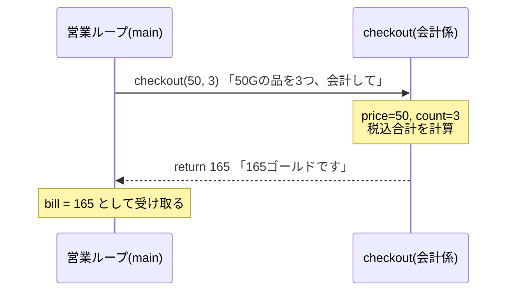
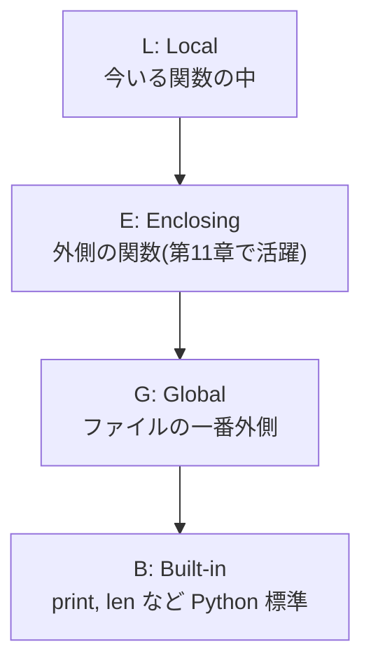

# 第4章 レジ係を雇う — 関数

## 🏪 今日のお話

営業ループが長くなり、店主 1 人では手が回らなくなってきました。
「会計係」「在庫係」のように **仕事に名前を付けて任せる** 仕組みが **関数** です。

関数には 3 つのご利益があります:

1. **再利用** — 同じ処理を何度も書かなくていい
2. **整理** — `main` の流れが読みやすくなる
3. **テスト** — 仕事単位で動作確認できる(第16章で花開きます)

## 関数の基本

```python
def checkout(price, count):
    """会計金額(税込)を計算して返す。"""   # ← docstring(関数の説明書)
    tax_rate = 0.1
    total = int(price * count * (1 + tax_rate))
    return total

bill = checkout(50, 3)   # 呼び出し。price=50, count=3
print(bill)              # 165
```

- `def 名前(引数):` で定義、`return` で結果を **呼び出し元に返す**
- `return` がない関数は自動的に `None` を返します
- 最初の文字列(docstring)は `help(checkout)` で読める説明書になります



## 引数のバリエーション — 柔軟な注文の受け方

### デフォルト引数

```python
def checkout(price, count=1, tax_rate=0.1):
    return int(price * count * (1 + tax_rate))

checkout(50)                 # count=1, tax_rate=0.1 が使われる → 55
checkout(50, 3)              # 165
checkout(50, 3, 0.08)        # 軽減税率 → 162
checkout(50, tax_rate=0.08)  # キーワード指定なら途中を飛ばせる → 54
```

> ⚠️ **有名な落とし穴**: デフォルト値に list や dict を使ってはいけません。
>
> ```python
> def add_order(item, orders=[]):   # ❌ このリストは全呼び出しで共有される!
>     orders.append(item)
>     return orders
>
> add_order("回復薬")   # ['回復薬']
> add_order("解毒薬")   # ['回復薬', '解毒薬'] ← 前回の注文が残っている!?
> ```
>
> デフォルト値は **関数定義時に 1 回だけ** 作られるためです。正しくは
> `orders=None` にして、関数の中で `if orders is None: orders = []` とします。

### *args と **kwargs — 何個でも受け取る

```python
def bundle_price(*prices, discount=0.0, **options):
    """まとめ買い価格。prices はタプル、options は dict として受け取る。"""
    total = sum(prices) * (1 - discount)
    if options.get("gift_wrap"):
        total += 10
    return int(total)

bundle_price(50, 80, 500, discount=0.1, gift_wrap=True)  # 577
```

- `*prices` : 位置引数を何個でも → タプル `(50, 80, 500)` にまとまる
- `**options` : 余ったキーワード引数 → dict `{"gift_wrap": True}` にまとまる
- 逆向きの **展開** もできます: `checkout(*[50, 3])` は `checkout(50, 3)` と同じ

## スコープ — 誰の財布のお金?

関数の中で作った変数は **関数の中だけ** のもの(ローカル変数)です。
Python は変数を **LEGB** の順で探します。



```python
gold = 100  # グローバル変数(お店の金庫)

def sell(price):
    gold = gold + price   # ❌ UnboundLocalError!
    # 代入した瞬間 gold は「ローカル変数」とみなされ、
    # まだ値がないのに読もうとしてエラーになる
```

`global gold` と宣言すれば書き換えられますが、**グローバル変数をあちこちの関数から
書き換えるのは事故のもと**。値は引数で受け取り、結果は `return` で返すのが基本です。

```python
def sell(gold, price):
    """✅ 受け取って、返す。"""
    return gold + price

gold = sell(gold, 50)
```

「でも在庫と金庫を毎回引数で回すのは面倒…」— その感覚は正しく、第7章の **クラス** で解決します。

## 関数も「値」である

### なぜわざわざ関数を「値」として扱うのか

まずは「関数を値として渡せなかったら、どう困るか」を見てみましょう。
「お客さん全員に大声で挨拶する」処理と「小声で挨拶する」処理を書くとします。

```python
# ❌ 関数を渡せないとしたら…ループごと丸ごとコピペする羽目に
def greet_all_loud(names):
    for name in names:
        print(f"{name}、お買い上げありがとうございます!!")

def greet_all_quiet(names):
    for name in names:
        print(f"({name}…お買い上げどうも…)")
```

`for name in names:` というループの骨組みはまったく同じなのに、
2つの関数を丸ごと書いています。違うのは中の `print` の1行、つまり
「1人ずつどう挨拶するか」という **部品** だけです。この部品だけを差し替えられれば、
ループは1つ書くだけで済むはずです。それを可能にするのが「関数を値として渡す」ことです。

```python
# ✅ 挨拶の中身(loud/quiet)を "値" として受け取り、差し替え可能にする
def loud(name):  return f"{name}、お買い上げありがとうございます!!"
def quiet(name): return f"({name}…お買い上げどうも…)"

def greet_all(names, greet):    # ← greet に "挨拶の仕方" そのものを渡してもらう
    for name in names:
        print(greet(name))      # ← ここで初めて中身が決まる

greet_all(["回復薬", "エリクサー"], loud)   # 大声で挨拶
greet_all(["回復薬", "エリクサー"], quiet)  # 小声で挨拶
```

`for` ループ(処理の骨組み)は `greet_all` の中に1回書くだけで、挨拶の中身(`loud`/`quiet`)は
呼び出すたびに差し替えられます。「骨組みは使い回し、中身だけ関数として差し替える」——
これが関数を値として扱う一番のご利益です。**第11章デコレータもこの考え方の延長線上にあります。**

```python
greeting = loud          # ← () を付けない = 関数そのものを渡す(呼び出してはいない)
print(greeting("回復薬"))
```

`greeting = loud` のように、関数は数値や文字列と同じ「値」として変数に代入したり、
**別の関数に渡す** ことができます。この「関数を受け取る関数」を **高階関数** と呼びます。
`sorted()` はその代表例で、「何を基準に並べるか」を関数として渡す `key` 引数を持っています。

### まずは def で渡してみる

商品を「価格が高い順」に並べたいとします。`sorted()` の `key` には
「1つの要素を受け取って、比較に使う値を返す関数」を渡します。

```python
prices = {"回復薬": 50, "エリクサー": 500, "マナポーション": 80}
# prices.items() は [("回復薬", 50), ("エリクサー", 500), ("マナポーション", 80)] のようなペアの並び

def get_price(item):
    return item[1]   # ("回復薬", 50) の [1] → 50 (価格の部分だけ取り出す)

ranking = sorted(prices.items(), key=get_price, reverse=True)
print(ranking)  # [('エリクサー', 500), ('マナポーション', 80), ('回復薬', 50)]
```

`get_price` は `sorted` に渡すためだけの、1 回しか使わない小さな関数です。
わざわざ `def` で名前を付けて定義するほどでもない…そんなときに使うのが **lambda** です。

### lambda に書き換える

```python
ranking = sorted(prices.items(), key=lambda item: item[1], reverse=True)
```

`lambda item: item[1]` は、上の `get_price` とまったく同じ意味です。対応関係はこうなります。

```python
def get_price(item):        lambda item: item[1]
    return item[1]          ------------------------
```

| `def` | `lambda` |
|---|---|
| `def 名前(引数):` | 名前を付けない(`lambda` は無名関数) |
| 本体は複数行書ける | 式 **1つだけ** |
| `return 式` と明示する | 式の結果が自動的に返り値になる(`return` 不要) |

つまり `lambda 引数: 式` は **「名前を付けるほどでもない、1行で書ける関数」を、その場で使い捨てで作る構文** です。

### もう少し例を見てみましょう

**例1: フィルタリング(条件に合うものだけ残す)**

```python
inventory = {"回復薬": {"stock": 10}, "エリクサー": {"stock": 0}, "解毒薬": {"stock": 4}}

# filter(条件関数, 対象) で「条件が True の要素」だけ残す
in_stock = list(filter(lambda item: item[1]["stock"] > 0, inventory.items()))
print(in_stock)  # [('回復薬', {...}), ('解毒薬', {...})]
```

**例2: 変換(全部の要素を加工する)**

```python
prices = [50, 80, 500]

# map(変換関数, 対象) で「全要素に関数を適用した結果」を作る
with_tax = list(map(lambda p: int(p * 1.1), prices))
print(with_tax)  # [55, 88, 550]
```

**例3: 複数条件での並び替え**

```python
items = [("回復薬", 10, 50), ("解毒薬", 10, 120), ("マナポーション", 6, 80)]
# (商品名, 在庫, 価格) のタプル。在庫が同じなら価格が高い順にしたい

ranking = sorted(items, key=lambda x: (-x[1], -x[2]))
# lambda はタプルも返せる → まず在庫の多い順、同点なら価格の高い順
print(ranking)  # [('回復薬', 10, 50), ('解毒薬', 10, 120), ('マナポーション', 6, 80)]
```

### lambda を使うべきとき / 使わないほうがいいとき

- ✅ `sorted()` の `key`、GUI のイベントハンドラなど、**「関数を渡す場所」に一度きりの小さな処理を書きたいとき**
- ❌ 条件分岐や複数行の処理が必要になったら、素直に `def` で名前付き関数にしましょう。無理に1行に詰め込むと読みにくくなります
- ❌ 単純な「集めて加工する」だけなら、`map`/`filter` + `lambda` より **第3章の内包表記**
  (`[p for p in inventory.items() if p[1]["stock"] > 0]`)のほうが Python らしく読みやすいことが多いです。
  lambda の出番は、内包表記が使えない `sorted(key=...)` のような場面が中心と覚えておくとよいでしょう。

## 🧪 完成コード: `shop/day4.py`

営業ループを関数で整理します。`main` を読むだけで店の 1 日が見渡せるようになりました。

```python
"""Pythonic Potions — 4 日目: 役割分担"""

def show_menu(inventory):
    for name, info in inventory.items():
        mark = "🈳" if info["stock"] == 0 else ""
        print(f"  {name:<12}{info['price']:>6}G  在庫{info['stock']:>3} {mark}")

def can_sell(inventory, item, count):
    return item in inventory and inventory[item]["stock"] >= count

def sell(inventory, gold, item, count=1):
    """販売処理。更新後の gold を返す。"""
    inventory[item]["stock"] -= count
    earned = checkout(inventory[item]["price"], count)
    print(f"  {item} × {count} で {earned}G(税込)です。ありがとうございました 🎉")
    return gold + earned

def checkout(price, count=1, tax_rate=0.1):
    return int(price * count * (1 + tax_rate))

def main():
    gold = 100
    inventory = {
        "回復薬": {"price": 50, "stock": 10},
        "マナポーション": {"price": 80, "stock": 6},
        "エリクサー": {"price": 500, "stock": 1},
    }
    print("🧪 Pythonic Potions へようこそ!(list / buy <商品名> [個数] / q)")
    while True:
        match input("\n> ").split():
            case ["q"]:
                print(f"閉店します。金庫: {gold}G")
                break
            case ["list"]:
                show_menu(inventory)
            case ["buy", item, *rest]:
                count = int(rest[0]) if rest else 1
                if can_sell(inventory, item, count):
                    gold = sell(inventory, gold, item, count)
                else:
                    print(f"  ごめんなさい、{item} はご用意できません…")
            case _:
                print("  コマンド: list / buy <商品名> [個数] / q")

main()
```

## 📝 今日の開店準備(演習)

1. `restock(inventory, gold, item, count)` 関数を追加してください(仕入れ値は販売価格の半額、`gold` が足りなければ断る)。
2. `apply_coupon(total, *coupons)` を作ってください。クーポン(割引率 float)を何枚でも受け取り、順に適用します。
3. `sorted()` と `lambda` を使って、「在庫が少ない順」にメニューを表示する `show_menu_by_scarcity` を作ってください。

---

関数は増えましたが、全部 1 ファイルに詰まっています。
店が大きくなってきたので、**部屋(ファイル)を分けて増築** しましょう
→ [第5章 店舗を増築する](05_modules.md)
