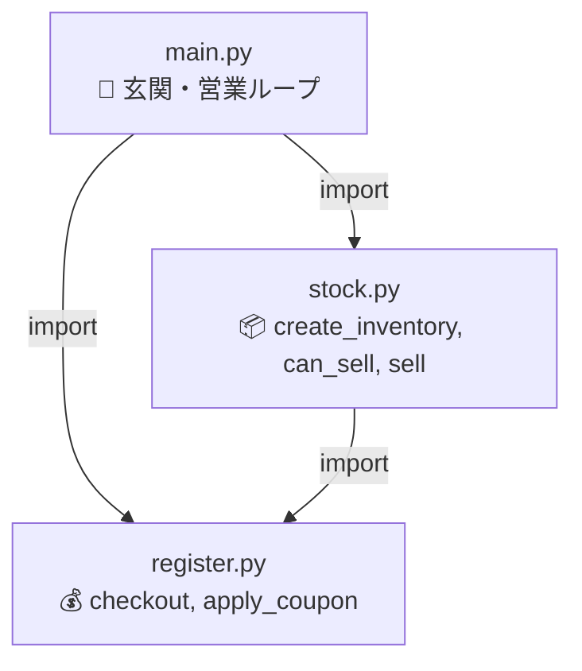
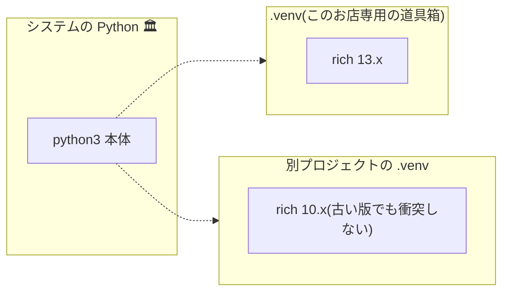

# 第5章 店舗を増築する — モジュールとパッケージ

## 🏪 今日のお話

関数が増えて 1 ファイルが手狭になりました。「会計部門」「在庫部門」と
**部屋を分けて増築** します。Python では:

- **モジュール** = 1 つの `.py` ファイル(部屋)
- **パッケージ** = モジュールを集めたディレクトリ(棟)

さらに、他の魔法使いが作った便利道具(**標準ライブラリ** と **外部パッケージ**)の
借り方も学びます。

## import — 他の部屋の道具を使う

まず標準ライブラリから。Python には「電池付属(batteries included)」と呼ばれる
豊富な標準ライブラリがあります。

```python
import random                       # モジュールごと借りる
from datetime import date           # 中の特定の道具だけ借りる
from collections import Counter

print(random.choice(["晴れ", "雨", "魔素の嵐"]))   # 今日の天気
print(date.today())                                 # 営業日誌の日付

sales = ["回復薬", "回復薬", "エリクサー", "回復薬"]
print(Counter(sales).most_common(1))  # [('回復薬', 3)] 売れ筋 No.1
```

| 書き方 | 使うとき |
|---|---|
| `import random` | 基本形。`random.choice(...)` と呼ぶ |
| `from datetime import date` | よく使う名前を短く呼びたいとき |
| `import numpy as np` | 慣習的な別名があるとき |
| `from x import *` | ❌ 使わない(名前の出所が分からなくなる) |

## 自分のモジュールを作る — 店の増築

`shop/` を次の構成に増築します:

```
shop/
├── main.py          # 玄関(営業ループ)
├── register.py      # 会計部門
└── stock.py         # 在庫部門
```



**`shop/register.py`**

```python
"""会計部門: お金の計算はすべてここ。"""

TAX_RATE = 0.1   # モジュールの「定数」は大文字で書く慣習

def checkout(price, count=1):
    return int(price * count * (1 + TAX_RATE))
```

**`shop/stock.py`**

```python
"""在庫部門: 在庫台帳の管理はすべてここ。"""

from register import checkout   # 同じディレクトリのモジュールを使う

def create_inventory():
    return {
        "回復薬": {"price": 50, "stock": 10},
        "マナポーション": {"price": 80, "stock": 6},
        "エリクサー": {"price": 500, "stock": 1},
    }

def can_sell(inventory, item, count=1):
    return item in inventory and inventory[item]["stock"] >= count

def sell(inventory, item, count=1):
    """売って、税込売上額を返す。"""
    inventory[item]["stock"] -= count
    return checkout(inventory[item]["price"], count)
```

**`shop/main.py`**

```python
"""Pythonic Potions — 玄関。実行はこのファイルから。"""

import stock
from register import checkout

def main():
    gold = 100
    inventory = stock.create_inventory()
    print("🧪 Pythonic Potions へようこそ!")
    while True:
        match input("\n> ").split():
            case ["q"]:
                print(f"閉店します。金庫: {gold}G")
                break
            case ["buy", item, *rest]:
                count = int(rest[0]) if rest else 1
                if stock.can_sell(inventory, item, count):
                    gold += stock.sell(inventory, item, count)
                    print("  ありがとうございました 🎉")
                else:
                    print("  ご用意できません…")
            case _:
                print("  コマンド: buy <商品名> [個数] / q")

if __name__ == "__main__":
    main()
```

## `if __name__ == "__main__":` の謎を解く

すべてのモジュールには `__name__` という変数が自動で入っています。

- `python3 main.py` と **直接実行** したとき → `__name__` は `"__main__"`
- `import main` と **輸入** されたとき → `__name__` は `"main"`(モジュール名)

つまりこの行は「**玄関から入って来た人にだけ営業を始める**」仕掛けです。
これがないと、誰かが `import main` しただけで営業ループが走り出してしまいます。

> 💡 import されたモジュールのコードは **最初の 1 回だけ** 実行され、結果はキャッシュされます。

## パッケージ — 部門をまとめる棟

ファイルがさらに増えたら、ディレクトリでまとめて **パッケージ** にします。

```
pythonic_potions/
├── pyproject.toml        # プロジェクトの説明書(第16章で詳しく)
└── potions/              # ← パッケージ
    ├── __init__.py       # 「これはパッケージです」の目印(空でも OK)
    ├── main.py
    ├── register.py
    └── stock.py
```

パッケージ内では **相対インポート** も使えます:

```python
from .register import checkout    # 同じパッケージ内の register から
```

## 仮想環境と pip — よその魔法道具を借りる

外部パッケージ(PyPI に公開された世界中のライブラリ)を使う前に、
**仮想環境(venv)** を作るのが鉄則です。プロジェクトごとに独立した道具箱を持つイメージです。

```bash
python3 -m venv .venv           # 道具箱を作る
source .venv/bin/activate       # 道具箱を開く(Windows: .venv\Scripts\activate)

pip install rich                # 例: ターミナルを彩る人気ライブラリ
pip list                        # 入っている道具の一覧
pip freeze > requirements.txt   # 道具リストを書き出す(他の人が再現できる)
```



なぜ必要?— プロジェクト A は `rich 10`、B は `rich 13` が必要、という **バージョン衝突** を
防ぐためです。システムの Python に直接 `pip install` するのは避けましょう。

`rich` を入れたらメニューを豪華にできます:

```python
from rich.table import Table
from rich.console import Console

table = Table(title="🧪 Pythonic Potions 本日のメニュー")
table.add_column("商品名"); table.add_column("価格", justify="right")
table.add_row("回復薬", "50G")
Console().print(table)
```

## 📝 今日の開店準備(演習)

1. 上の 3 ファイル構成を実際に作って動かしてください。
2. `stats.py` モジュールを新設し、`Counter` を使って「本日の売れ筋ランキング」を返す関数を作り、`q` で閉店するときに表示してください(売れた商品名を list に記録していく必要があります)。
3. `import this` を実行してみてください。Python の設計哲学「The Zen of Python」が表示されます。お気に入りの 1 行を見つけましょう。

---

店は立派になりましたが、お客さんが変な注文をするとプログラムごと倒れてしまいます
(`buy 回復薬 たくさん` と打たれたら?)。**転んでも営業を続ける** 技術を学びます
→ [第6章 トラブル対応マニュアル](06_exceptions.md)
