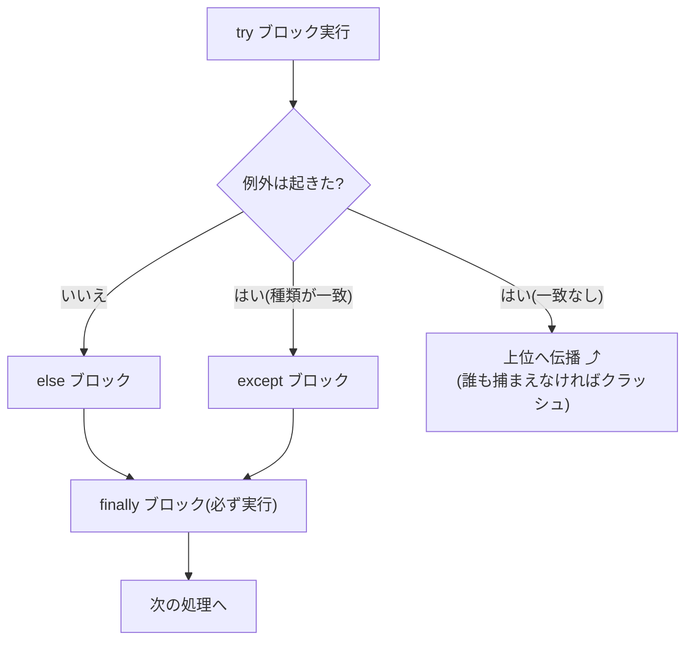
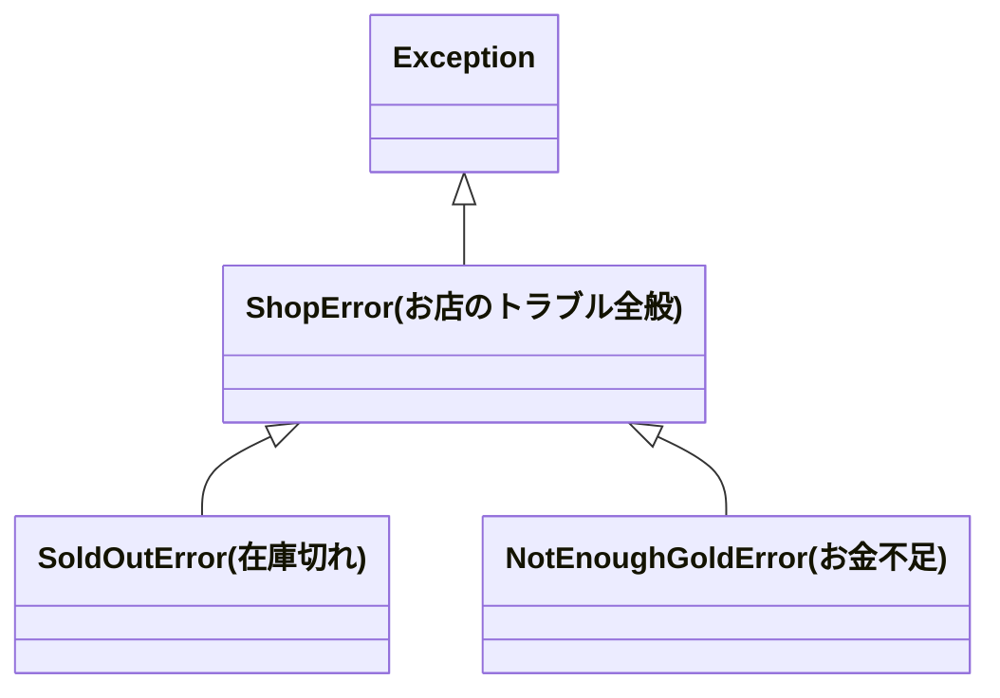

# 第6章 トラブル対応マニュアル — 例外処理

## 🏪 今日のお話

営業中、お客さんが `buy 回復薬 たくさん` と注文しました。
`int("たくさん")` は失敗し、プログラムは **例外(Exception)** を投げて即死します。

```
ValueError: invalid literal for int() with base 10: 'たくさん'
```

店が一瞬で崩壊してはたまりません。今日は **トラブル対応マニュアル(例外処理)** を整備し、
さらに **お店独自のトラブル用語(独自例外)** を定義します。

## try / except — 転んでも立ち上がる

```python
try:
    count = int(input("何個買いますか? > "))
except ValueError:
    print("すみません、数字でお願いします!")
    count = 0
```

`try` ブロックで例外が起きると、処理はその場で中断され、
一致する `except` ブロックへジャンプします。

### フルコース: else と finally

```python
try:
    count = int(text)                 # ① 失敗するかもしれない処理
except ValueError:
    print("数字でお願いします")        # ② 失敗したときだけ
except KeyboardInterrupt:
    print("お客さんが帰ってしまった")  # 例外の種類ごとに分けられる
else:
    print(f"{count} 個ですね")         # ③ 成功したときだけ
finally:
    print("(次のお客さんへ)")         # ④ 成功でも失敗でも必ず実行
```



> ⚠️ **`except:` や `except Exception:` で何でも握りつぶさない!**
> バグまで隠れてしまいます。捕まえるのは「**予期していて、対処できる**」例外だけ。
> 対処できないなら、潰さずに上へ流すのが正解です。

## raise — 自分から報告を上げる

例外は「起きてしまうもの」だけでなく、「**おかしい状況を発見したら自分から投げる**」ものでもあります。

```python
def sell(inventory, item, count=1):
    if count <= 0:
        raise ValueError(f"個数は 1 以上を指定してください: {count}")
    ...
```

## 独自例外 — お店専用のトラブル用語

「在庫切れ」「お金不足」はこのお店特有の事件です。`Exception` を継承して
**独自例外クラス** を作ると、呼び出し側が事件の種類ごとに対応を変えられます。
(クラスの文法は次章で詳しくやります。ここでは「例外に名前を付ける定型文」と思って OK)

**`shop/errors.py`**

```python
"""お店で起こるトラブルの一覧。"""

class ShopError(Exception):
    """このお店のトラブルすべての親。"""

class SoldOutError(ShopError):
    """在庫切れ。"""
    def __init__(self, item):
        super().__init__(f"{item} は売り切れです")
        self.item = item

class NotEnoughGoldError(ShopError):
    """お客さんの所持金不足。"""
    def __init__(self, price, gold):
        super().__init__(f"あと {price - gold}G 足りません")
```



**階層にしておくのがポイント**です。`except ShopError:` と書けば
「お店のトラブルはまとめて接客対応、それ以外の予想外の事故は隠さず上へ」と書き分けられます。

```python
from errors import ShopError, SoldOutError

try:
    stock.sell(inventory, item, count)
except SoldOutError as e:
    print(f"  ごめんなさい、{e.item} は売り切れなんです…")
    suggest_alternative(inventory, e.item)     # 代替品をおすすめ!
except ShopError as e:
    print(f"  {e}")           # その他の店内トラブルは共通の謝り方
```

`as e` で例外オブジェクトを受け取れば、埋め込んだ情報(`e.item`)も使えます。

## EAFP — Python 流の接客哲学

在庫確認のやり方には 2 流派あります。

```python
# LBYL (Look Before You Leap): 石橋を叩いてから渡る
if item in inventory and inventory[item]["stock"] >= count:
    sell(inventory, item, count)

# EAFP (Easier to Ask Forgiveness than Permission): まずやってみて、ダメなら謝る
try:
    sell(inventory, item, count)
except SoldOutError:
    print("売り切れでした、ごめんなさい!")
```

Python コミュニティは **EAFP を好みます**。理由は:

- チェックと実行の間に状況が変わる隙がない(第14章の並行処理で効いてきます)
- 「正常な流れ」がコードの主役になり、読みやすい

## 🧪 完成コード: 例外対応版 `stock.py`

第5章の `stock.py` を、例外を投げるスタイルに書き直します。
**「できるかどうかは呼ぶ前に聞かず、できなかったら例外で知らせる」** 設計です。

```python
"""在庫部門(6 日目): トラブルは例外で報告する。"""

from errors import SoldOutError
from register import checkout

def sell(inventory, item, count=1):
    """売って税込売上額を返す。売れないときは例外を投げる。"""
    if count <= 0:
        raise ValueError(f"個数は 1 以上: {count}")
    if item not in inventory:
        raise KeyError(item)
    if inventory[item]["stock"] < count:
        raise SoldOutError(item)
    inventory[item]["stock"] -= count
    return checkout(inventory[item]["price"], count)
```

`main.py` の営業ループはこうなります。**どんな注文が来ても店は倒れません。**

```python
        match input("\n> ").split():
            case ["buy", item, *rest]:
                try:
                    count = int(rest[0]) if rest else 1
                    gold += stock.sell(inventory, item, count)
                    print("  ありがとうございました 🎉")
                except ValueError:
                    print("  個数は数字でお願いします!")
                except KeyError:
                    print(f"  {item} は取り扱いがありません")
                except SoldOutError as e:
                    print(f"  {e}")
```

## 📝 今日の開店準備(演習)

1. `NotEnoughGoldError` を使い、お客さんの所持金(`customer_gold`)を管理して、足りないときに投げる処理を追加してください。
2. `restock` に「仕入れ資金不足」を表す独自例外を新設してください。`ShopError` の子にすること。
3. わざと `except Exception:` で全部握りつぶす版を書き、`inventory` のキー名を打ち間違えたバグを仕込んでみてください。バグ発見がどれだけ難しくなるか体感しましょう。

---

ここまでで **基礎編は修了** です!🎓
しかし気になりませんか — `inventory` の dict と関数群がバラバラに漂い、
どの関数がどのデータを触るのか追いにくくなってきました。
**データと振る舞いを 1 つに束ねる** 中級編の始まりです → [第7章 ポーションの設計図](07_classes.md)
