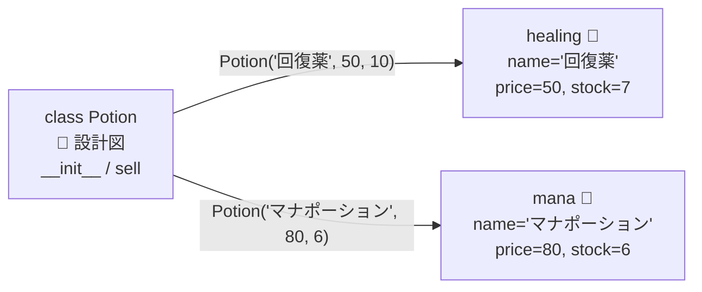

# 第7章 ポーションの設計図 — クラスとオブジェクト

## 🌿 中級編へようこそ

基礎編のお店には、実は構造上の弱点がありました。

```python
inventory = {"回復薬": {"price": 50, "stock": 10}}   # データはここ
def sell(inventory, item, count): ...                 # 振る舞いはあそこ
def restock(inventory, gold, item, count): ...        # 引数リレーが大変
```

**データ(在庫 dict)と、それを扱う関数がバラバラ** なのです。
dict のキーを打ち間違えても誰も気づかず、どの関数が在庫を触るのか一覧もできません。

**クラス** は「データ」と「振る舞い」を 1 つの設計図にまとめる仕組みです。
今日からお店を **オブジェクト指向** で建て直します。

## クラス = 設計図、インスタンス = 実物

```python
class Potion:
    """ポーションの設計図。"""

    def __init__(self, name, price, stock=0):
        self.name = name      # インスタンス属性(この 1 本ごとのデータ)
        self.price = price
        self.stock = stock

    def sell(self, count=1):
        """在庫を減らし、売上額を返す。"""
        self.stock -= count
        return self.price * count

# 設計図から実物(インスタンス)を作る
healing = Potion("回復薬", 50, stock=10)
mana = Potion("マナポーション", 80, stock=6)

print(healing.name)      # 回復薬
earned = healing.sell(3) # healing 自身の在庫が減る
print(healing.stock)     # 7
print(mana.stock)        # 6(mana は無傷。それぞれ独立した実物)
```



### self の正体

`healing.sell(3)` は、実は `Potion.sell(healing, 3)` の省略形です。
**`self` には「メソッドを呼び出された実物自身」が入ります。**
第4章で「在庫を毎回引数で回すのが面倒」と言った問題は、
`self` が自動でデータを届けてくれることで解消しました。

## Inventory クラス — dict を卒業する

在庫台帳もクラスにします。今後この 2 クラスが教材の主役です。

```python
from errors import SoldOutError

class Inventory:
    """お店の在庫台帳。"""

    def __init__(self):
        self._potions = {}    # 名前 → Potion。先頭の _ は「店内専用」の合図

    def add(self, potion):
        self._potions[potion.name] = potion

    def find(self, name):
        if name not in self._potions:
            raise KeyError(name)
        return self._potions[name]

    def sell(self, name, count=1):
        potion = self.find(name)
        if potion.stock < count:
            raise SoldOutError(name)
        return potion.sell(count)

inventory = Inventory()
inventory.add(Potion("回復薬", 50, 10))
inventory.add(Potion("エリクサー", 500, 1))
gold = 100 + inventory.sell("回復薬", 2)
```

> 💡 **アンダースコアの約束**: `_potions` の先頭 `_` は「外から直接触らないでね」という
> 紳士協定です。Python には本物の private はありませんが、この慣習が広く守られています。

## property — 属性のふりをした門番

`potion.price = -100` と書けてしまうのは危険です。
**property** を使うと、「読み書きは普通の属性のまま、裏でチェックを差し込む」ことができます。

```python
class Potion:
    def __init__(self, name, price, stock=0):
        self.name = name
        self.price = price    # ← この代入も下の setter を通る!
        self.stock = stock

    @property
    def price(self):              # 読み取り時に呼ばれる
        return self._price

    @price.setter
    def price(self, value):       # 代入時に呼ばれる(門番)
        if value < 0:
            raise ValueError(f"価格は 0 以上: {value}")
        self._price = value

    @property
    def is_sold_out(self):        # 計算で導く「読み取り専用属性」
        return self.stock == 0

healing = Potion("回復薬", 50)
healing.price = 60        # OK: setter 経由
print(healing.is_sold_out)  # False(() 不要。属性のように読める)
healing.price = -10       # ValueError! 門番が阻止
```

`@property` の `@` 記号は **デコレータ** といいます。正体は第11章で明かされます。
ここでは「メソッドを属性に見せかける魔法の呪文」で OK です。

## クラス属性 — 全店舗共通の掲示

```python
class Potion:
    tax_rate = 0.1            # クラス属性: 全インスタンスで共有

    def __init__(self, name, price):
        self.name = name      # インスタンス属性: 1 本ごと
        self.price = price

    def price_with_tax(self):
        return int(self.price * (1 + Potion.tax_rate))
```

インスタンス属性は「各ポーションの瓶に貼るラベル」、
クラス属性は「壁に貼った全品共通の掲示」です。
`self.tax_rate = 0.08` と代入すると **掲示はそのままで、その瓶にだけ別ラベルが貼られる**
(クラス属性が隠れる)点に注意してください。

## 🧪 完成コード: `shop/models.py`(7 日目版)

```python
"""Pythonic Potions — 7 日目: オブジェクト指向に建て替え"""

from errors import SoldOutError


class Potion:
    tax_rate = 0.1

    def __init__(self, name, price, stock=0):
        self.name = name
        self.price = price
        self.stock = stock

    @property
    def price(self):
        return self._price

    @price.setter
    def price(self, value):
        if value < 0:
            raise ValueError(f"価格は 0 以上: {value}")
        self._price = value

    def price_with_tax(self, count=1):
        return int(self.price * count * (1 + self.tax_rate))

    def sell(self, count=1):
        if self.stock < count:
            raise SoldOutError(self.name)
        self.stock -= count
        return self.price_with_tax(count)


class Inventory:
    def __init__(self):
        self._potions = {}

    def add(self, potion):
        self._potions[potion.name] = potion

    def find(self, name):
        if name not in self._potions:
            raise KeyError(name)
        return self._potions[name]

    def sell(self, name, count=1):
        return self.find(name).sell(count)

    def menu(self):
        for p in self._potions.values():
            mark = "🈳" if p.is_sold_out else ""
            print(f"  {p.name:<12}{p.price:>6}G  在庫{p.stock:>3} {mark}")

    @property
    def is_empty(self):
        return all(p.is_sold_out for p in self._potions.values())
```

`main.py` の営業ループは `inventory.sell(item, count)` を呼ぶだけになり、
在庫の dict 構造を知る必要がなくなりました。これを **カプセル化** といいます。

## 📝 今日の開店準備(演習)

1. `Potion` に `restock(count)` メソッドを追加してください(0 以下は `ValueError`)。
2. `Inventory` に `total_value` プロパティ(全在庫の資産価値 = 価格 × 在庫の総和)を追加してください。
3. `Customer` クラス(name, gold を持ち、`pay(amount)` で `NotEnoughGoldError` を投げる)を作り、営業ループに組み込んでください。

---

商品を増やしたくなりました。「毒薬(飲むとダメージ)」「爆発薬(投げる)」…
種類ごとにクラスを丸ごと書くのは大変。**共通部分を親から受け継ぐ** 技を学びます
→ [第8章 ポーションの系統樹](08_inheritance.md)
