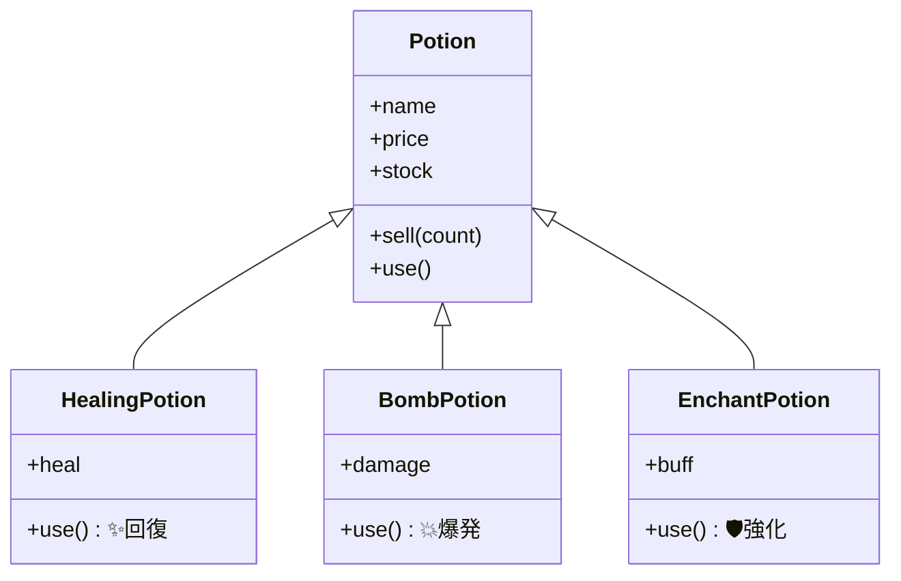
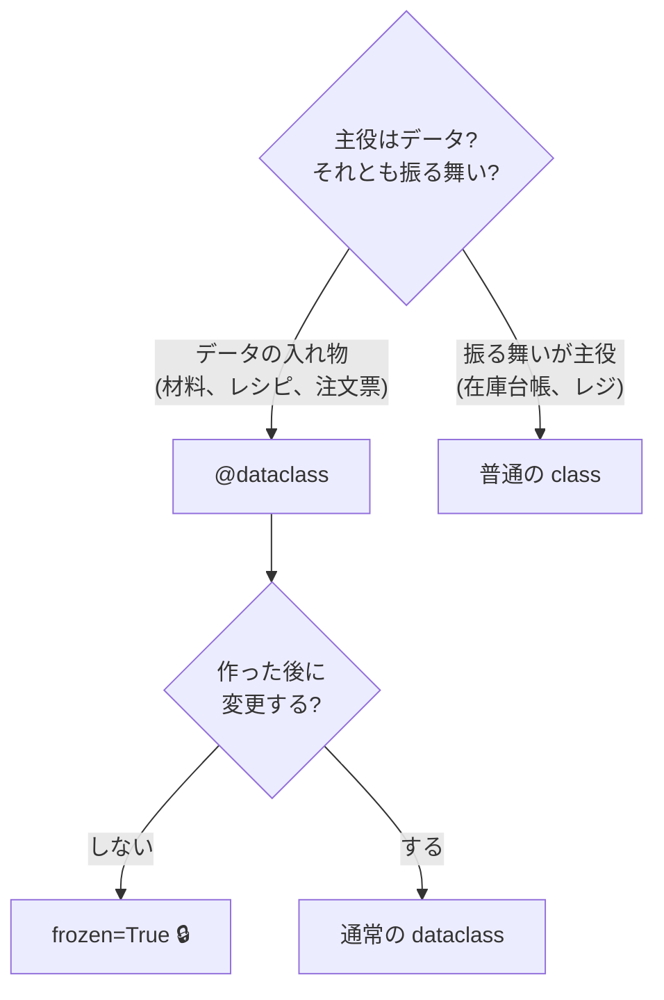

# 第8章 ポーションの系統樹 — 継承・抽象クラス・dataclass

## 🏪 今日のお話

商品ラインナップを拡大します。回復薬、攻撃用の爆発薬、かけると強化されるエンチャント薬…。
どれも「名前・価格・在庫・売る」は共通で、**効果だけが違います**。

共通部分を親クラスに書き、差分だけ子クラスに書く — これが **継承** です。

## 継承の基本

```python
class Potion:                       # 親クラス(第7章のもの)
    def __init__(self, name, price, stock=0):
        self.name = name
        self.price = price
        self.stock = stock

    def use(self):
        return f"{self.name} を使ったが、何も起こらなかった…"


class HealingPotion(Potion):        # ← ( ) に親を書くと継承
    def __init__(self, name, price, stock=0, heal=30):
        super().__init__(name, price, stock)   # 親の __init__ に共通部分を任せる
        self.heal = heal                        # 差分だけ自分で

    def use(self):                              # オーバーライド(上書き)
        return f"✨ {self.name} で HP が {self.heal} 回復した!"


class BombPotion(Potion):
    def __init__(self, name, price, stock=0, damage=50):
        super().__init__(name, price, stock)
        self.damage = damage

    def use(self):
        return f"💥 {self.name} が爆発!{self.damage} ダメージ!"
```



- 子は親のメソッド(`sell` など)を **書かずにそのまま使えます**
- `super()` は「親クラス」を指します。共通の初期化は親に任せるのが鉄則
- 同名メソッドを子で定義すると **オーバーライド**(上書き)になります

## ポリモーフィズム — 呼ぶ側は種類を知らなくていい

継承の真価は「**同じ呼び出し方で、実物ごとに違う動きをする**」ことです。

```python
basket = [
    HealingPotion("回復薬", 50, heal=30),
    BombPotion("爆発薬", 120, damage=50),
    HealingPotion("上回復薬", 150, heal=100),
]

for potion in basket:
    print(potion.use())   # ← 呼ぶ側は if isinstance(...) を書かない!
```

```
✨ 回復薬 で HP が 30 回復した!
💥 爆発薬 が爆発!50 ダメージ!
✨ 上回復薬 で HP が 100 回復した!
```

種類ごとの `if` 分岐が消えました。新種を追加しても **このループは 1 文字も変わりません**。
これが **ポリモーフィズム(多態性)** です。

### ダックタイピング — Python 流の緩さ

実は Python では、継承していなくても `use()` メソッドさえ持っていれば上のループで動きます。

> 「アヒルのように歩き、アヒルのように鳴くなら、それはアヒルだ」

これを **ダックタイピング** といいます。「何を継承しているか」より「何ができるか」を重視する
文化です(第13章の `Protocol` で、この文化に型検査を持ち込みます)。

## 抽象基底クラス(ABC)— 「use は必ず実装せよ」という契約

親の `Potion.use()` の「何も起こらなかった…」は苦し紛れです。
「**子クラスは必ず use を実装すること**」を強制したいなら、抽象基底クラスを使います。

```python
from abc import ABC, abstractmethod

class Potion(ABC):                 # 抽象クラス: 直接インスタンス化できない
    def __init__(self, name, price, stock=0):
        self.name = name
        self.price = price
        self.stock = stock

    @abstractmethod
    def use(self):                 # 中身なし。「契約」だけを宣言
        ...

potion = Potion("謎の薬", 10)      # ❌ TypeError! 抽象クラスは実物にできない
```

`use` を実装し忘れた子クラスも、インスタンス化した瞬間にエラーで教えてくれます。
**設計ミスを実行前ではなく「作った瞬間」に検出できる** のが利点です。

## dataclass — 定型文を自動生成する

`__init__` で `self.name = name` を並べる作業、退屈でしたよね。
**dataclass** はデータ中心のクラスの定型文を自動生成してくれます。

```python
from dataclasses import dataclass, field

@dataclass
class Ingredient:
    """ポーションの材料。"""
    name: str
    unit_cost: int
    rarity: str = "common"                      # デフォルト値
    tags: list[str] = field(default_factory=list)  # 可変デフォルトはこう書く!

herb = Ingredient("薬草", 5)
print(herb)                     # Ingredient(name='薬草', unit_cost=5, ...) ← 表示もタダ
print(herb == Ingredient("薬草", 5))   # True ← 比較もタダ
```

`@dataclass` を付けるだけで `__init__`・`__repr__`(表示)・`__eq__`(比較)が生成されます。
`name: str` の型ヒント文法は第13章で本格的に扱います。

さらに `@dataclass(frozen=True)` にすると **変更不可(イミュータブル)** になり、
第2章のタプルのように「封印されたレシピ」が作れます:

```python
@dataclass(frozen=True)
class Recipe:
    potion_name: str
    ingredients: tuple[str, ...]

recipe = Recipe("エリクサー", ("世界樹の葉", "妖精の涙", "月光水"))
recipe.potion_name = "偽エリクサー"   # ❌ FrozenInstanceError!
```

### 使い分けの指針



## 継承の注意 — 「is-a」のときだけ使う

継承は強力ですが乱用は禁物です。判定基準は **「子 is a 親」と言えるか**:

- ✅ `HealingPotion` is a `Potion` — 回復薬はポーションである → 継承
- ❌ `Inventory` is a `dict` …? — 在庫台帳は dict **を使っている** だけ →
  継承ではなく **属性として持つ(コンポジション)** が正解(第7章の `self._potions` がまさにそれ)

深い継承ツリー(3 段以上)は理解もテストも難しくなります。
迷ったら「**継承よりコンポジション**」と唱えましょう。

## 🧪 完成コード: `shop/models.py`(8 日目版・抜粋)

```python
from abc import ABC, abstractmethod
from dataclasses import dataclass
from errors import SoldOutError


@dataclass(frozen=True)
class Recipe:
    ingredients: tuple[str, ...]
    brew_hours: int = 1


class Potion(ABC):
    tax_rate = 0.1

    def __init__(self, name, price, stock=0, recipe=None):
        self.name = name
        self.price = price
        self.stock = stock
        self.recipe = recipe

    def sell(self, count=1):
        if self.stock < count:
            raise SoldOutError(self.name)
        self.stock -= count
        return int(self.price * count * (1 + self.tax_rate))

    @abstractmethod
    def use(self): ...


class HealingPotion(Potion):
    def __init__(self, name, price, stock=0, heal=30, **kwargs):
        super().__init__(name, price, stock, **kwargs)
        self.heal = heal

    def use(self):
        return f"✨ HP が {self.heal} 回復した!"


class BombPotion(Potion):
    def __init__(self, name, price, stock=0, damage=50, **kwargs):
        super().__init__(name, price, stock, **kwargs)
        self.damage = damage

    def use(self):
        return f"💥 {self.damage} ダメージ!"
```

## 📝 今日の開店準備(演習)

1. `EnchantPotion`(`buff: str` を持ち、`use()` で「🛡️ {buff} が上がった!」)を追加してください。既存コードの変更が **ゼロ行** で済むことを確認しましょう。
2. `Inventory.use_potion(name)` を追加し、営業ループに `try <商品名>`(試飲)コマンドを実装してください。
3. `@dataclass(frozen=True)` の `Recipe` に「同じ材料構成なら等しい」ことを確認するテストコードを書いてください。frozen な dataclass は set にも入れられます。試してみましょう。

---

次章は中級編のハイライト。`print(potion)` で綺麗な表示、`potion_a + potion_b` で **調合**。
Python の演算子そのものにお店の魔法をかけます → [第9章 ポーションの調合](09_dunder.md)
