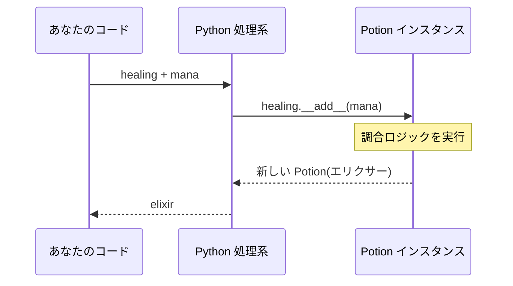

# 第9章 ポーションの調合 — 特殊メソッド(dunder)

## 🏪 今日のお話

魔法薬店の華といえば **調合** です。今日の目標はこれ:

```python
elixir = healing + mana        # ポーション同士を + で調合!
print(elixir)                  # きれいな商品ラベルが表示される
if "回復薬" in inventory: ...   # 在庫台帳に in が使える
for potion in inventory: ...   # 在庫台帳を for で回せる
```

`+` や `in` や `for` が自作クラスで動く — この魔法の正体が **特殊メソッド** です。
`__init__` のように前後に 2 本のアンダースコアが付くので **dunder**(double underscore)
メソッドとも呼ばれます。

## からくり: 演算子はメソッド呼び出しの化粧

Python では、演算子や組み込み関数は裏で dunder メソッドを呼んでいるだけです。

| あなたが書くコード | Python が実際に呼ぶもの |
|---|---|
| `a + b` | `a.__add__(b)` |
| `print(a)` | `a.__str__()` |
| `len(a)` | `a.__len__()` |
| `a == b` | `a.__eq__(b)` |
| `a[key]` | `a.__getitem__(key)` |
| `x in a` | `a.__contains__(x)` |
| `for x in a` | `a.__iter__()` |
| `a()` | `a.__call__()` |



つまり **dunder メソッドを定義すれば、自作クラスが Python の文法に溶け込む** のです。

## `__repr__` と `__str__` — 商品ラベル

まず表示から。今の `print(potion)` は `<HealingPotion object at 0x7f...>` と無愛想です。

```python
class Potion:
    def __init__(self, name, price, stock=0):
        self.name = name
        self.price = price
        self.stock = stock

    def __repr__(self):
        """開発者向け: 再現可能な正確な表現。"""
        return f"Potion(name={self.name!r}, price={self.price}, stock={self.stock})"

    def __str__(self):
        """お客さん向け: 読みやすい表現。"""
        return f"🧪 {self.name}({self.price}G)"

healing = Potion("回復薬", 50, 10)
print(healing)          # 🧪 回復薬(50G)          ← __str__
print([healing])        # [Potion(name='回復薬', ...)]  ← コンテナ内は __repr__
```

- `__str__` = 店頭のポップ(人間向け)、`__repr__` = 棚卸し台帳(開発者向け・デバッグ用)
- `__repr__` だけ定義すれば `__str__` の代わりも務めます。**最低限 `__repr__` は書く** 習慣を

## `__eq__` と `__hash__` — 同じ商品の判定

```python
class Potion:
    ...
    def __eq__(self, other):
        if not isinstance(other, Potion):
            return NotImplemented        # 比べられない相手には「わからない」と返す
        return self.name == other.name and self.price == other.price

    def __hash__(self):
        return hash((self.name, self.price))   # __eq__ を書いたら対で書く
```

`__eq__` を定義すると `==` が「同じ中身か」を見るようになります(定義前は「同じ実物か」)。
`__hash__` も定義すれば set の要素や dict のキーにできます。
第8章の `@dataclass` がこれらを自動生成していたのです。

## `__add__` — いよいよ調合!

```python
class Potion:
    ...
    def __add__(self, other):
        """ポーション同士を調合して新しいポーションを生む。"""
        if not isinstance(other, Potion):
            return NotImplemented
        return Potion(
            name=f"{self.name}×{other.name}の合成薬",
            price=int((self.price + other.price) * 1.5),   # 調合品はプレミア価格
            stock=1,
        )

healing = Potion("回復薬", 50, 10)
mana = Potion("マナポーション", 80, 6)

mixed = healing + mana
print(mixed)   # 🧪 回復薬×マナポーションの合成薬(195G)
```

> 💡 `NotImplemented` を返すと、Python は相手側の `__radd__` を試します(`50 + potion` の
> ような場合)。仲間には `__sub__` `__mul__` `__lt__`(`<`、ソートに必要)などが揃っています。

## Inventory をコンテナに — `len` / `in` / `[]` / `for`

在庫台帳が dict を包んでいることを、使う側はもう知らなくてよい —
それなら **台帳自身をコンテナとして振る舞わせましょう**。

```python
class Inventory:
    def __init__(self):
        self._potions = {}

    def add(self, potion):
        self._potions[potion.name] = potion

    def __len__(self):
        return len(self._potions)

    def __contains__(self, name):
        return name in self._potions

    def __getitem__(self, name):
        if name not in self._potions:
            raise KeyError(name)
        return self._potions[name]

    def __iter__(self):
        return iter(self._potions.values())
```

すると営業コードが自然な Python になります:

```python
if "回復薬" in inventory:            # __contains__
    print(inventory["回復薬"])        # __getitem__

print(f"品数: {len(inventory)}")     # __len__

for potion in inventory:             # __iter__
    print(f"  {potion}")

expensive = [p for p in inventory if p.price >= 100]   # 内包表記まで動く!
```

**第2章で dict に使っていた文法が、そのまま自作クラスで動いています。**
list や dict が特別だったのではなく、彼らも dunder メソッドを持っていただけなのです。

## `__call__` — インスタンスを関数のように

```python
class DiscountCampaign:
    """セール係。呼び出すと割引価格を返す。"""
    def __init__(self, rate):
        self.rate = rate

    def __call__(self, price):
        return int(price * (1 - self.rate))

summer_sale = DiscountCampaign(0.2)
print(summer_sale(500))    # 400 ← インスタンスなのに関数のように呼べる!
```

「設定を抱えた関数」が欲しいときに便利です。第11章のデコレータで再登場します。

## 🧪 完成コード: 調合コマンドを営業ループへ

```python
            case ["mix", name_a, name_b]:
                try:
                    new_potion = inventory[name_a] + inventory[name_b]
                    inventory.add(new_potion)
                    print(f"  ✨ 調合成功! {new_potion} が棚に並びました")
                except KeyError as e:
                    print(f"  {e.args[0]} が見つかりません")
```

```
> mix 回復薬 マナポーション
  ✨ 調合成功! 🧪 回復薬×マナポーションの合成薬(195G) が棚に並びました
```

## 📝 今日の開店準備(演習)

1. `Potion.__mul__(self, n)` を定義して `healing * 3`(3 本セット商品: 名前「回復薬 3本セット」、価格は 10% お得)を作れるようにしてください。
2. `__lt__`(価格で比較)を定義して `sorted(inventory)` が価格順に並ぶことを確認してください。
3. `Inventory.__add__` で 2 つの在庫台帳を合併できるようにしてください(支店の統合!)。同名商品は在庫数を合算します。

---

`__iter__` で `for` が動くようになりましたが、実は `iter(dict.values())` に丸投げでした。
「注文が来てから 1 本ずつ醸造する」**遅延生産ライン** を作るため、
イテレータの仕組みを根本から学びます → [第10章 醸造パイプライン](10_generators.md)
