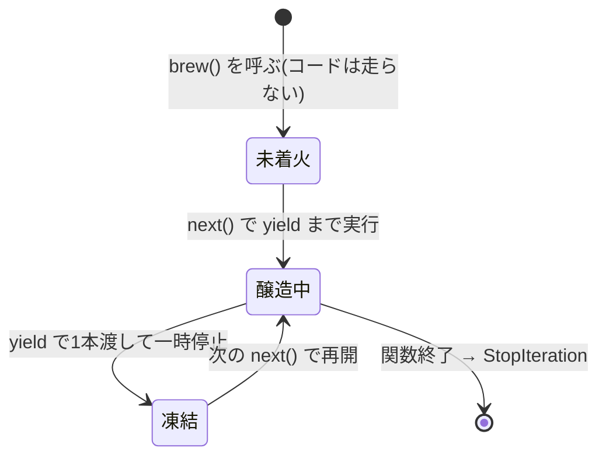

# 第10章 醸造パイプライン — イテレータとジェネレータ

## 🏪 今日のお話

大口注文が入りました。「回復薬 10 万本、納品は順次で構わない」。

10 万本を一気に醸造して倉庫に積む(巨大な list を作る)とメモリが溢れます。
賢い店主はこう考えます — **「注文された分だけ、その都度 1 本ずつ作ればいい」**。

この「**求められたときに 1 つずつ生み出す**」仕組みが **イテレータ**、
それを驚くほど簡単に書ける文法が **ジェネレータ** です。

## for 文の裏側 — イテレータプロトコル

第9章で学んだとおり、`for` も dunder メソッドの化粧です。
`brews` のような「材料の棚」(list)そのものは、実は 1 つずつ物を取り出す機能を持っていません。
棚の前に **「進行役」を 1 人立たせて、その人に "次お願い" と頼み続ける** ―― これが `for` の正体です。

登場人物は 2 人だけです。

- **イテラブル(iterable)**: `brews` のような「材料の棚」。`iter()` に渡すと進行役を生み出せる
- **イテレータ(iterator)**: 進行役そのもの。`next()` と聞かれるたびに 1 つ渡し、渡すものが尽きたら `StopIteration` を投げて「もうありません」と申告する

```python
brews = ["回復薬", "マナポーション", "解毒薬"]

it = iter(brews)      # ① 棚 brews に「進行役をちょうだい」と頼む → イテレータ it が誕生
print(next(it))       # ② it に「次お願い」→ 回復薬
print(next(it))       # 同じ it に聞き続ける → マナポーション
print(next(it))       # 解毒薬
print(next(it))       # ③ もう渡すものがない → StopIteration 例外!
```

ポイントは **同じ `it` に聞き続けている** ことです。`it` は「今どこまで渡したか」を自分の中で覚えていて、
`next()` が呼ばれるたびにその続きを返します。

そして `for` 文は、この①〜③の手順を **人間の代わりに黙ってやってくれる** だけの構文糖です。
実際、次の2つのコードは完全に同じ意味です。

```python
# for 文
for brew in brews:
    print(brew)

# ↑ を「裏側」まで書き下すと ↓ とまったく同じ
it = iter(brews)          # ① 進行役を1人用意する
while True:
    try:
        brew = next(it)   # ② 次の1つを頼む
    except StopIteration: # ③ 尽きたら…
        break              #    黙ってループを抜ける
    print(brew)
```

つまり `for` は「`iter()` で進行役を立てて、`StopIteration` が出るまで `next()` を呼び続け、
出たら例外を握りつぶして終わる」という定型処理を、あの短い1行に圧縮したものです。

## ジェネレータ関数 — yield 一つで生産ライン

### そもそも「ジェネレータ関数」とは何か

先に定義をはっきりさせておきます。**関数定義の中に `yield` が1回でも書かれていれば、
その関数は自動的に「ジェネレータ関数」になります。** 特別な宣言(`async def` のような
専用キーワード)は要りません。`def` のままで構いません ―― `yield` の存在そのものが目印です。

```python
def normal_func():
    return 1
# ↑ 普通の関数。呼ぶと即座に実行され、1 が返る

def generator_func():
    yield 1
# ↑ ジェネレータ関数。中に yield があるという、ただそれだけの理由で扱いが一変する
```

この判定は **実行時ではなく、Python がそのコードを読み込んだ瞬間(コンパイル時)** に、
機械的に行われます。関数の中身をどう実行するかを一切考慮しない、単純に
「ソースコードに `yield` という文字列(構文)が含まれているか」だけのチェックです。
証拠に、こんな極端な例でも判定は変わりません。

```python
def weird_func():
    if False:
        yield 1     # 実行されることは永遠にない、到達不能なコード
    return "普通のreturnのつもり"

result = weird_func()
print(result)        # <generator object weird_func ...> ← 実は普通の関数ではない!
```

`if False` の中にあるので `yield 1` は **実行時には絶対に通らない** コードですが、
それでも `weird_func` は最初から最後までジェネレータ関数として扱われます。
「`yield` を含む関数を呼ぶと、中身は実行されずジェネレータオブジェクトが返る」という、
これまで見てきた挙動すべての大元にあるのが、この単純な1行ルールです。

### 普通の関数と何が変わるのか — 「for で回せる」は結果であって本質ではない

「`yield` を書くと `for` で回せるようになる」というのは事実ですが、それは **副産物** です。
本質的に変わっているのはもっと手前、**「関数を呼ぶ」という行為そのものの意味** です。

| | 普通の関数 | ジェネレータ関数 |
|---|---|---|
| **呼んだ瞬間に何が起きるか** | 中身が **即座に、最後まで** 実行される | 中身は **1行も実行されない**。ジェネレータオブジェクトが返るだけ |
| **実行のされ方** | 1回の呼び出しで **一括実行**(最初から `return`/末尾まで一気に) | `next()` のたびに **分割実行**(`yield` で区切られた区間をひとコマずつ) |
| **呼び出しをまたいだ記憶** | なし。呼ぶたびに **ゼロから** 実行される | あり。ローカル変数も実行位置も **凍結して持ち越す**(前節で見た通り) |
| **1回の"起動"で得られる値の数** | **1個だけ**(`return` の値、または `None`) | **複数個を、時間をかけて順に**(`yield` のたびに1個ずつ) |

つまり `yield` が変えているのは「値の返し方」ではなく、**「関数呼び出し」という概念そのもの** です。
普通の関数は「頼んだら即座に1個の答えが返ってくる自動販売機」ですが、
ジェネレータ関数は「呼ぶと**まだ何も作っていない生産ライン**が手に入り、
`next()` で1回ずつ催促するたびに、そのつど1本だけ流れてくる」という別物になります。

**`for` で回せるのは、この性質の "使い道の1つ" にすぎません。** `for` はしょせん
「`next()` を呼び続けて `StopIteration` で止まる」を自動化した構文糖(第10章冒頭の通り)なので、
`next()` で1回ずつ手動で催促することもできますし、`list(...)` / `sum(...)` / `tuple(...)` に
直接渡して「全部一気に受け取る」こともできます(内部でやっていることは結局 `next()` の連打です)。
主役は「呼び出しても即実行されず、一時停止・再開できる」という性質そのもので、
`for` はその性質を活かす数ある手段の1つ、という位置づけです。

### return と yield の違い — ここが理解の核心

`yield` を最初に見ると、多くの人が `return` の親戚だろうと考えます。半分正解ですが、
決定的に違う点が1つあります。それを、ポーションの話を一旦離れて最小の例で確認します。

```python
def with_return():
    print("A地点")
    return 1
    print("B地点")     # ← ここは絶対に実行されない

def with_yield():
    print("A地点")
    yield 1
    print("B地点")     # ← ここは後で実行される(!)
```

- **`return`**: 値を返すと同時に、**関数の実行を完全に終わらせます**。ローカル変数は全部消え、
  `print("B地点")` は永遠に実行されません。もう一度呼んでも、また最初の "A地点" からやり直しです
- **`yield`**: 値を返しますが、**関数の実行を終わらせません**。その場で **一時停止** するだけです。
  ローカル変数も「今どの行にいたか」も保持されたまま待機し、再開の合図(`next()`)が来たら
  `yield` の **次の行から** 続きを実行します。だから `print("B地点")` はちゃんと実行される日が来ます

つまり `yield` は「値を返す」と「そこで一時停止する(でも記憶は消さない)」を同時にやる、
`return` とは似て非なる命令です。

### 最小の例で、next() を1回ずつ手で追ってみる

`with_yield` を実際に1回ずつ動かして、何が起きているかを完全に追跡します。

```python
def simple_gen():
    print("A地点")
    yield 1
    print("B地点")
    yield 2
    print("C地点")

g = simple_gen()   # ① 呼んだだけ。中身はまだ1行も実行されない(第10章冒頭で見た通り)
```

| 操作 | 実際に起きること | 表示される文字 | 戻り値 |
|---|---|---|---|
| `g = simple_gen()` | インスタンスが作られるだけ。中身は未実行 | (何も表示されない) | — |
| 1回目の `next(g)` | 関数の先頭から実行開始 → `yield 1` に到達し、そこで凍結 | `A地点` | `1` |
| 2回目の `next(g)` | 「`yield 1` の直後」から再開 → `yield 2` に到達し、そこで凍結 | `B地点` | `2` |
| 3回目の `next(g)` | 「`yield 2` の直後」から再開 → もう `yield` がなく関数末尾に到達 | `C地点` | `StopIteration` |

ポイントは表の「実際に起きること」列です。**2回目の `next(g)` は、関数の先頭からではなく
「1回目に凍結した、まさにその地点の次の行」から再開しています。** これが「ローカル変数も
実行位置も覚えたまま止まる」という凍結の意味です。もし `simple_gen` の中に `count = 0` の
ような変数があれば、それも凍結中ずっと値を保持し続けます。

### yield と return は同じ関数内で共存できる? — できます、ただし意味が変わる

結論から言うと **共存できます**。ただし `return` の意味が、普通の関数とは変わります。

```python
def gen_with_return():
    yield 1
    yield 2
    return "醸造完了"    # ← 値を持った return
    yield 3               # ← ここは実行されない(return の後だから)
```

`yield` が1つでも入っている時点で、この関数は **もう普通の関数ではなく「ジェネレータ関数」だ**
とPythonに解釈されます(これは実行時ではなく、関数を定義した瞬間に決まります)。
その結果、中の `return "醸造完了"` は、**呼び出し元に値を返す普通の `return` としては機能しません**
(そもそもジェネレータ関数を呼んでも `with_return()` のように値は返らず、生成器オブジェクトが返るだけでした)。
代わりに `return` は「**ここでジェネレータを終了する**」という合図になり、渡した値は
`StopIteration` 例外にこっそり同梱されます。

```python
g = gen_with_return()
print(next(g))    # 1
print(next(g))    # 2
print(next(g))    # StopIteration: 醸造完了   ← 例外として送出され、値は例外の中に入っている
```

この「`return` の値が `StopIteration` に載る」仕組みは、実は前節の `yield from` と直結しています。
`yield from` は、委譲先のジェネレータが `return` した値を **式の結果として受け取れる** のです。

```python
def sub_brew():
    yield "回復薬 #1"
    yield "回復薬 #2"
    return "sub_brew 完了"          # ← ここの値が…

def main_brew():
    result = yield from sub_brew()  # ← ここで受け取れる!
    print(f"下請けからの報告: {result}")
    yield "元請けの最終チェック完了"

for item in main_brew():
    print(item)
# 回復薬 #1
# 回復薬 #2
# 下請けからの報告: sub_brew 完了
# 元請けの最終チェック完了
```

もう1つよくある実用パターンは、**値を持たない `return`(単なるガード節)** です。
これは「早期リターンで残りの `yield` を全部スキップする」という、普通の関数と同じ感覚で使えます。

```python
def brew(count):
    if count <= 0:
        return              # ガード節。1本もyieldせずに即座に終わる
    for i in range(1, count + 1):
        yield f"回復薬 #{i}"

list(brew(0))    # []  ← 空のまま。エラーにもならない
```

まとめると、「共存できないもの」は **「関数の中身をそのまま同期的に返す `return`」と `yield` の共存**
であって、「ジェネレータの終了合図としての `return`」は問題なく共存できます。
`yield` が1つでも書かれた時点で、その関数の `return` は自動的に **後者の意味に切り替わる** ―― これが正確な理解です。

前節の `it`(イテレータ)は「`__iter__` と `__next__` を持つオブジェクト」でした。
これを **自分でクラスとして書く** と、こうなります。

```python
class BrewIterator:
    """brew("回復薬", 3) を手書きイテレータで再現したもの"""
    def __init__(self, potion_name, count):
        self.potion_name = potion_name
        self.count = count
        self.i = 0                        # ← 「今どこまで渡したか」を自分で覚える

    def __iter__(self):                   # for に「進行役は自分自身です」と答える
        return self

    def __next__(self):                   # next() が呼ばれるたびに実行される
        self.i += 1
        if self.i > self.count:
            raise StopIteration           # 種切れの申告も自分で書く
        return f"{self.potion_name} #{self.i}"
```

`self.i` で進行状況を手動管理し、尽きたら自分で `StopIteration` を投げる ―― これがイテレータプロトコルの正体で、
書くべきことが多く面倒です。**ジェネレータ関数はこれを Python に肩代わりさせる文法** です。
関数の中に `yield` を 1 つ書くだけで、上のクラスと同じ働きをするオブジェクトが自動で組み立てられます。

```python
def brew(potion_name, count):
    """BrewIterator クラスと等価な処理を、yield 1つで実現する。"""
    print(f"🔥 釜に火を入れた({potion_name})")
    for i in range(1, count + 1):
        yield f"{potion_name} #{i}"       # ← ここで一時停止して 1 本渡す(__next__ の return に相当)
    print("🧯 火を消した")
    # ループを抜けて関数が終了 → Python が自動で StopIteration を送出(自分で raise 不要!)

line = brew("回復薬", 3)
print(line)                    # <generator object brew ...> ← まだ火すら入っていない!
print(hasattr(line, "__iter__"), hasattr(line, "__next__"))  # True True ← ちゃんとイテレータ

print(next(line))    # 🔥 釜に火を入れた(回復薬)  →  回復薬 #1
print(next(line))    # 回復薬 #2
```

`brew(...)` を呼んだ瞬間には、`BrewIterator(...)` のように **インスタンスが作られるだけ** で、
関数の中身は **1 行も実行されません**(`self.i = 0` を用意した段階と同じ)。
`next()` されるたびに `yield` まで進んで値を渡し、**その場で凍結** します。
次の `next()` で凍結地点から再開 ―― `self.i` を書き換えて覚えておく代わりに、
ローカル変数も `for` の進行位置もすべて **その場で丸ごと** 覚えたままなのがジェネレータの利点です。



### 遅延評価の威力

```python
def brew_forever(potion_name):
    """無限醸造ライン。listでは絶対に作れない!"""
    i = 0
    while True:
        i += 1
        yield f"{potion_name} #{i}"

line = brew_forever("回復薬")
for potion in line:
    print(potion)
    if potion.endswith("#3"):
        break            # 必要な分だけ取り出して止めればいい
```

- **メモリは常に「今の 1 本」分だけ**。10 万本でも無限でも怖くない
- 計算は **必要になるまで行われない**(遅延評価)

> ⚠️ **ジェネレータは一度きり**: 使い切ったジェネレータは空です。
> もう一周したければ、もう一度 `brew(...)` を呼んで新しいラインを作ります。

### どんな場面で威力を発揮するか(現実のシナリオ)

「無限醸造」は物語としての例ですが、実務でジェネレータが刺さる場面は主にこの3パターンです。
共通点は **「全部を一度に持つと困る」or「そもそも全部が何個あるか分からない」** ケースだということです。

**① 巨大ファイルを1行ずつ処理する**

```python
# NG: 10GBのログファイルを readlines() で全部 list にする → メモリを使い切ってクラッシュ
lines = open("huge.log").readlines()
errors = [line for line in lines if "ERROR" in line]

# OK: ファイルオブジェクト自体がイテレータなので、1行ずつ流れてくる
def read_errors(path):
    with open(path) as f:
        for line in f:              # ← ファイル全体を読み込まず、1行だけメモリに乗る
            if "ERROR" in line:
                yield line

for err in read_errors("huge.log"):
    print(err)
```
ファイルサイズが 10MB でも 10GB でも、消費メモリは「今の1行分」で変わりません。

**② Web API のページネーションを1本の流れに見せる**

```python
def fetch_all_users(api):
    """ページ数を呼び出し側に意識させず、ユーザーを1人ずつ流す。"""
    page = 1
    while True:
        users = api.get(f"/users?page={page}")
        if not users:                # 空ページが来たら終わり
            return
        yield from users
        page += 1

# 呼び出し側は「全ユーザー」だと思って回せる。何ページあるかは知らなくていい
for user in fetch_all_users(api):
    print(user["name"])
    if user["id"] == target_id:
        break                        # 見つかった時点でAPI呼び出しも止まる
```
必要な分だけ取り出したら `break` できるので、無駄なページ取得(=無駄なAPI課金/レート消費)も防げます。

**③ 終わりが分からない/無限のストリームを扱う**

センサーの計測値、株価のティック、チャットのリアルタイム受信など「いつ終わるか分からないデータ」は
そもそも list に収まりません。`brew_forever` はこのパターンのミニチュアです。`while True: yield ...`
の形で「必要なだけ受け取って、要らなくなったら止める」設計にできます。

**④ 変換パイプラインで中間リストを作らない**(→ 詳しくは次の節「パイプライン」)

CSV読み込み → フィルタ → 変換 → 書き込み、のような一連の処理を素直に list で書くと、各段階で
「全件入りのリスト」が一時的に何個もメモリに並びます。ジェネレータでつなぐと、1件がバケツリレー
式に最後まで流れていくので、**途中在庫(中間リスト)がゼロ** になります。

## ジェネレータ式 — 内包表記の遅延版

```python
prices = [50, 80, 500, 120]

total_list = sum([p * 1.1 for p in prices])   # [] : 全部作ってから足す
total_gen  = sum(p * 1.1 for p in prices)     # () : 1 個ずつ流しながら足す(省メモリ)
```

`[ ]` を `( )` に変えるだけでジェネレータ式になります。
`sum` / `max` / `any` などに渡すときは、リストを作らないぶんこちらが得です。

## パイプライン — ジェネレータをつなぐ

ジェネレータの真骨頂は **接続** です。醸造 → 品質検査 → ラベル貼り、の工場ラインを作ります。

```python
def brew(names):
    for name in names:
        yield f"{name}(原液)"

def quality_check(potions):
    for p in potions:
        if "毒" not in p:              # 不良品はラインから外す
            yield p

def label(potions):
    for i, p in enumerate(potions, start=1):
        yield f"[{i:04d}] {p} ✅検査済"

orders = ["回復薬", "毒薬", "マナポーション"]
line = label(quality_check(brew(orders)))     # ラインをつないだだけ。まだ動かない!

for product in line:
    print(product)
# [0001] 回復薬(原液) ✅検査済
# [0002] マナポーション(原液) ✅検査済
```


各段階が 1 本ずつバケツリレーするので、**途中在庫ゼロ**。
巨大なログファイルの処理などでこのパターンは絶大な威力を発揮します。

### yield from — ラインの委譲

まず `yield from` を使わずに、同じことを愚直に書くとどうなるか見てみます。

```python
def brew_one(name, count):
    """1つの注文を1本ずつ醸造する下請けライン。"""
    for i in range(1, count + 1):
        yield f"{name} #{i}"

def brew_all_verbose(orders):
    """複数の注文をまとめて1本のラインにする(yield from なし版)。"""
    for name, count in orders:              # ① 外側: 注文を1件ずつ取り出す
        for item in brew_one(name, count):  # ② 内側: その注文の中身を1本ずつ取り出す
            yield item                      # ③ 受け取ったものを、そのまま右へ横流しする
```

`orders = [("回復薬", 2), ("マナポーション", 1)]` なら、
①「回復薬を2本作る注文」→②`brew_one`が`回復薬 #1`, `回復薬 #2`を出す→③そのまま`yield`、
続いて①「マナポーションを1本作る注文」→②→③ … という流れです。

ここで **②と③はワンセット** で、「下請け(`brew_one`)が出したものを、そっくりそのまま右に渡す」以外のことを
していません。この「中身を素通しするだけの内側ループ」を1語に圧縮したのが `yield from` です。

```python
def brew_all(orders):
    """複数の注文をまとめて1本のラインに。"""
    for name, count in orders:              # ① 外側: これは残る(消せない)
        yield from brew_one(name, count)    # ②+③ 内側ループ+素通しyieldを1行に圧縮
```

**なぜ外側の `for` は消えないのか** ―― `yield from` が肩代わりしてくれるのは
「1つの下請けジェネレータ(`brew_one(name, count)` 1個分)を丸ごと汲み出す」ところまでです。
`orders` には注文が複数件あり、件ごとに **別の `brew_one` インスタンスに切り替える** 必要があります。
どの下請けに委譲するかを選ぶのは `yield from` の仕事ではなく、外側の `for` の仕事です。

- 外側の `for name, count in orders`: **「次はどの下請けラインに委譲するか」を選ぶ**(注文が複数あるので必須)
- `yield from brew_one(...)`: **「選んだ1本の下請けラインを、空になるまで丸ごと吸い上げる」**(内側ループの省略形)

役割が違うので両方必要、というのが「二重ループに見える」理由です。イメージとしては、
元請け(`brew_all`)が下請け業者を1社ずつ切り替えながら(外側)、契約した1社からは
生産分を全部受け取りきる(`yield from` = かつての内側ループ)、という工場委託の構造です。

## itertools — 生産ラインの既製部品

標準ライブラリ `itertools` には、ジェネレータの便利部品が揃っています。

```python
from itertools import islice, chain, count

line = brew_forever("回復薬")
first10 = list(islice(line, 10))          # 無限ラインから最初の 10 本だけ

all_items = chain(shelf_a, shelf_b)       # 2 つの棚を連結して 1 本の流れに

for no in count(start=1):                 # 1, 2, 3, ... 無限の通し番号
    ...
```

## 🧪 完成コード: `shop/brewery.py`

```python
"""Pythonic Potions — 10 日目: 醸造所が稼働"""

def brew(name, count):
    for i in range(1, count + 1):
        yield f"{name} #{i}"

def quality_check(potions, ng_word="毒"):
    for p in potions:
        if ng_word not in p:
            yield p

def label(potions):
    for i, p in enumerate(potions, start=1):
        yield f"[{i:04d}] {p} ✅"

def production_line(name, count):
    """営業ループから使う完成ライン。"""
    return label(quality_check(brew(name, count)))
```

営業ループには受注生産コマンドを追加します:

```python
            case ["order", item, num]:
                print(f"  受注生産を開始します({item} × {num})")
                for product in production_line(item, int(num)):
                    print(f"    {product} 納品")
```

## 📝 今日の開店準備(演習)

1. `discount_every_nth(potions, n, rate)` ジェネレータを作ってください。n 本ごとに「(○割引)」の印を付けて流します。
2. フィボナッチ数列を無限に生む `fib()` ジェネレータを書き、`islice` で最初の 20 個を取り出してください。
3. 第9章の `Inventory.__iter__` をジェネレータで書き直してください(`yield from self._potions.values()` の 1 行になるはず)。関数の中に `yield` を書くと `__iter__` 自体がジェネレータ関数になることを確認しましょう。

---

生産ラインは完璧。次は経営の見える化です。「どのメソッドが呼ばれたか自動で帳簿に付けたい」
— 既存の関数に **あとから機能を巻き付ける** 魔法、デコレータの出番です
→ [第11章 魔法の帳簿](11_decorators.md)
