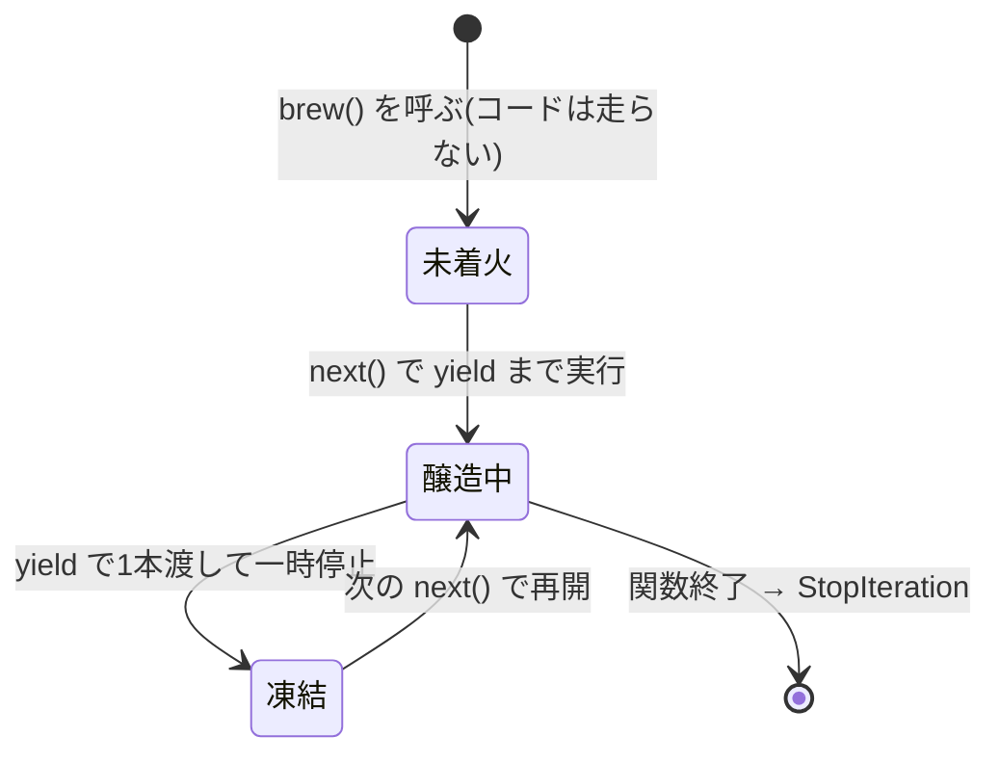

# 第10章 醸造パイプライン — イテレータとジェネレータ

## 🏪 今日のお話

大口注文が入りました。「回復薬 10 万本、納品は順次で構わない」。

10 万本を一気に醸造して倉庫に積む(巨大な list を作る)とメモリが溢れます。
賢い店主はこう考えます — **「注文された分だけ、その都度 1 本ずつ作ればいい」**。

この「**求められたときに 1 つずつ生み出す**」仕組みが **イテレータ**、
それを驚くほど簡単に書ける文法が **ジェネレータ** です。

## for 文の裏側 — イテレータプロトコル

第9章で学んだとおり、`for` も dunder メソッドの化粧です。実際の動きはこう:

```python
brews = ["回復薬", "マナポーション", "解毒薬"]

it = iter(brews)      # ① __iter__() でイテレータ(進行役)を取得
print(next(it))       # ② __next__() で 1 つ取り出す → 回復薬
print(next(it))       # マナポーション
print(next(it))       # 解毒薬
print(next(it))       # ③ 種切れになると StopIteration 例外!
```

`for` 文は「`next()` を呼び続け、`StopIteration` が出たら黙って終わる」だけの構文糖です。

## ジェネレータ関数 — yield 一つで生産ライン

イテレータを手書きすると `__iter__` / `__next__` / 状態管理でクラス 1 つ分の仕事です。
**ジェネレータ関数** なら `yield` を書くだけ:

```python
def brew(potion_name, count):
    """1 本ずつ醸造するジェネレータ。"""
    print(f"🔥 釜に火を入れた({potion_name})")
    for i in range(1, count + 1):
        yield f"{potion_name} #{i}"       # ← ここで一時停止して 1 本渡す
    print("🧯 火を消した")

line = brew("回復薬", 3)
print(line)          # <generator object brew ...> ← まだ火すら入っていない!

print(next(line))    # 🔥 釜に火を入れた(回復薬)  →  回復薬 #1
print(next(line))    # 回復薬 #2
```

`yield` のある関数を呼んでも **中身は 1 行も実行されません**。
`next()` されるたびに `yield` まで進んで値を渡し、**その場で凍結** します。
次の `next()` で凍結地点から再開 — ローカル変数も `for` の進行位置も覚えたままです。



### 遅延評価の威力

```python
def brew_forever(potion_name):
    """無限醸造ライン。listでは絶対に作れない!"""
    i = 0
    while True:
        i += 1
        yield f"{potion_name} #{i}"

line = brew_forever("回復薬")
for potion in line:
    print(potion)
    if potion.endswith("#3"):
        break            # 必要な分だけ取り出して止めればいい
```

- **メモリは常に「今の 1 本」分だけ**。10 万本でも無限でも怖くない
- 計算は **必要になるまで行われない**(遅延評価)

> ⚠️ **ジェネレータは一度きり**: 使い切ったジェネレータは空です。
> もう一周したければ、もう一度 `brew(...)` を呼んで新しいラインを作ります。

## ジェネレータ式 — 内包表記の遅延版

```python
prices = [50, 80, 500, 120]

total_list = sum([p * 1.1 for p in prices])   # [] : 全部作ってから足す
total_gen  = sum(p * 1.1 for p in prices)     # () : 1 個ずつ流しながら足す(省メモリ)
```

`[ ]` を `( )` に変えるだけでジェネレータ式になります。
`sum` / `max` / `any` などに渡すときは、リストを作らないぶんこちらが得です。

## パイプライン — ジェネレータをつなぐ

ジェネレータの真骨頂は **接続** です。醸造 → 品質検査 → ラベル貼り、の工場ラインを作ります。

```python
def brew(names):
    for name in names:
        yield f"{name}(原液)"

def quality_check(potions):
    for p in potions:
        if "毒" not in p:              # 不良品はラインから外す
            yield p

def label(potions):
    for i, p in enumerate(potions, start=1):
        yield f"[{i:04d}] {p} ✅検査済"

orders = ["回復薬", "毒薬", "マナポーション"]
line = label(quality_check(brew(orders)))     # ラインをつないだだけ。まだ動かない!

for product in line:
    print(product)
# [0001] 回復薬(原液) ✅検査済
# [0002] マナポーション(原液) ✅検査済
```


各段階が 1 本ずつバケツリレーするので、**途中在庫ゼロ**。
巨大なログファイルの処理などでこのパターンは絶大な威力を発揮します。

### yield from — ラインの委譲

```python
def brew_all(orders):
    """複数の注文をまとめて 1 本のラインに。"""
    for name, count in orders:
        yield from brew_one(name, count)    # 下請けラインに丸ごと委譲

def brew_one(name, count):
    for i in range(1, count + 1):
        yield f"{name} #{i}"
```

`yield from` は「内側のジェネレータを 1 本ずつ `yield` し直す」二重ループの省略形です。

## itertools — 生産ラインの既製部品

標準ライブラリ `itertools` には、ジェネレータの便利部品が揃っています。

```python
from itertools import islice, chain, count

line = brew_forever("回復薬")
first10 = list(islice(line, 10))          # 無限ラインから最初の 10 本だけ

all_items = chain(shelf_a, shelf_b)       # 2 つの棚を連結して 1 本の流れに

for no in count(start=1):                 # 1, 2, 3, ... 無限の通し番号
    ...
```

## 🧪 完成コード: `shop/brewery.py`

```python
"""Pythonic Potions — 10 日目: 醸造所が稼働"""

def brew(name, count):
    for i in range(1, count + 1):
        yield f"{name} #{i}"

def quality_check(potions, ng_word="毒"):
    for p in potions:
        if ng_word not in p:
            yield p

def label(potions):
    for i, p in enumerate(potions, start=1):
        yield f"[{i:04d}] {p} ✅"

def production_line(name, count):
    """営業ループから使う完成ライン。"""
    return label(quality_check(brew(name, count)))
```

営業ループには受注生産コマンドを追加します:

```python
            case ["order", item, num]:
                print(f"  受注生産を開始します({item} × {num})")
                for product in production_line(item, int(num)):
                    print(f"    {product} 納品")
```

## 📝 今日の開店準備(演習)

1. `discount_every_nth(potions, n, rate)` ジェネレータを作ってください。n 本ごとに「(○割引)」の印を付けて流します。
2. フィボナッチ数列を無限に生む `fib()` ジェネレータを書き、`islice` で最初の 20 個を取り出してください。
3. 第9章の `Inventory.__iter__` をジェネレータで書き直してください(`yield from self._potions.values()` の 1 行になるはず)。関数の中に `yield` を書くと `__iter__` 自体がジェネレータ関数になることを確認しましょう。

---

生産ラインは完璧。次は経営の見える化です。「どのメソッドが呼ばれたか自動で帳簿に付けたい」
— 既存の関数に **あとから機能を巻き付ける** 魔法、デコレータの出番です
→ [第11章 魔法の帳簿](11_decorators.md)
