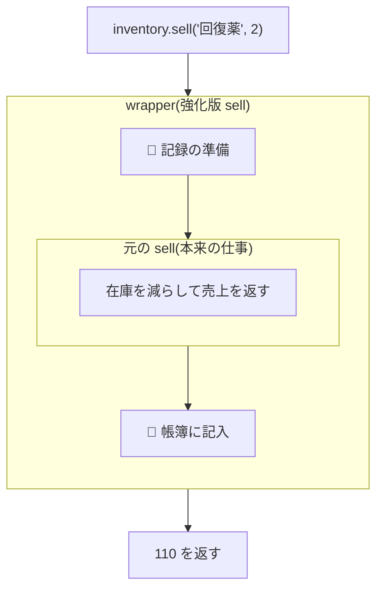

# 第11章 魔法の帳簿 — クロージャとデコレータ

## 🏪 今日のお話

税務署から連絡が来ました。「販売・仕入れ・調合、**すべての取引を帳簿に記録** してください」。

`sell` にも `restock` にも `mix` にも記録処理をコピペする…?
いいえ。**既存の関数に、中身を触らずに機能を巻き付ける** 技があります。
第7章から `@property` として正体を伏せてきた **デコレータ** の登場です。

## 前提知識 1: 関数は値である(第4章の復習)

```python
def greet(name):
    return f"いらっしゃいませ、{name}様"

welcome = greet          # 関数に別のラベルを貼れる
staff = [greet, print]   # リストにも入る
```

## 前提知識 2: クロージャ — 関数を作る関数

関数の中で関数を定義して返すと、内側の関数は **外側の変数を覚えたまま** 持ち出されます。

```python
def make_discounter(rate):
    def discounter(price):
        return int(price * (1 - rate))    # ← 外側の rate を参照
    return discounter                      # 関数そのものを返す

summer = make_discounter(0.2)   # rate=0.2 を「閉じ込めた」関数
winter = make_discounter(0.5)

print(summer(500))   # 400
print(winter(500))   # 250  ← それぞれ別の rate を記憶している
```

`make_discounter` の実行はとっくに終わっているのに、`summer` は `rate=0.2` を覚えています。
この「**環境を閉じ込めた関数**」を **クロージャ** と呼びます。
第4章の LEGB の **E(Enclosing)** スコープが、ここでついに主役になりました。

## デコレータ = 関数を受け取り、強化版の関数を返すクロージャ

帳簿係を作ります:

```python
import functools

def log_transaction(func):
    """func を「帳簿に記録してから実行する」版に強化して返す。"""
    @functools.wraps(func)                    # 名前や docstring を引き継ぐお守り
    def wrapper(*args, **kwargs):
        result = func(*args, **kwargs)        # 本来の仕事
        print(f"📖 帳簿: {func.__name__}{args[1:]} → {result}")
        return result
    return wrapper
```

使い方は 2 通り。まず素朴な方法:

```python
sell = log_transaction(sell)     # sell を強化版に差し替え
```

そして、これと **完全に同じ意味** の糖衣構文が `@` です:

```python
class Inventory:
    @log_transaction
    def sell(self, name, count=1):
        return self.find(name).sell(count)

    @log_transaction
    def restock(self, name, count):
        ...
```

```
> buy 回復薬 2
📖 帳簿: sell('回復薬', 2) → 110
  ありがとうございました 🎉
```

**`sell` の中身は 1 文字も変えていない** のに、全取引が記録されるようになりました。



呼び出しは玉ねぎのように包まれます。`@a` `@b` と重ねれば `a(b(func))` の多重包装です。

> 💡 **`functools.wraps` を忘れずに**: これがないと `sell.__name__` が `"wrapper"` になり、
> help もデバッグ表示も壊れます。デコレータを書くときの定型お守りです。

## 引数付きデコレータ — 三段ロケット

「記録するのは 100G 以上の取引だけ」にしたい。デコレータ自体に設定を渡すには、
**デコレータを返す関数** を作ります(クロージャがもう一段増えます)。

```python
def log_transaction(min_amount=0):            # ① 設定を受け取る
    def decorator(func):                       # ② 関数を受け取る
        @functools.wraps(func)
        def wrapper(*args, **kwargs):          # ③ 実行時の引数を受け取る
            result = func(*args, **kwargs)
            if result >= min_amount:
                print(f"📖 帳簿: {func.__name__} → {result}G")
            return result
        return wrapper
    return decorator

class Inventory:
    @log_transaction(min_amount=100)    # ← () 付きで呼ぶと decorator が返る
    def sell(self, name, count=1): ...
```

`@log_transaction(min_amount=100)` は「まず `log_transaction(100)` を実行し、
返ってきた `decorator` を `@` する」という 2 段階の動きです。

## 標準ライブラリの名デコレータたち

自作する前に、既製品も知っておきましょう。

```python
import functools

@functools.lru_cache(maxsize=None)      # 同じ引数の結果を記憶(メモ化)
def appraise(potion_name):
    """鑑定は高コスト。2 回目からは記憶から即答。"""
    print(f"🔮 {potion_name} を時間をかけて鑑定中…")
    return len(potion_name) * 100

appraise("エリクサー")   # 🔮 鑑定中… → 500
appraise("エリクサー")   # (即答)→ 500
```

| デコレータ | 効果 |
|---|---|
| `@property` | メソッドを属性に見せる(第7章) |
| `@staticmethod` | self 不要のメソッド(ただの関数を作法上クラスに置く) |
| `@classmethod` | インスタンスでなくクラスを受け取る(別名コンストラクタに便利) |
| `@functools.lru_cache` | 結果をキャッシュ |
| `@dataclass` | クラスに定型メソッドを注入(第8章) |
| `@abstractmethod` | 実装を義務化(第8章) |

`@classmethod` は「別名コンストラクタ」の定番なので例を挙げます:

```python
class Potion:
    ...
    @classmethod
    def from_csv_row(cls, row):
        """'回復薬,50,10' のような文字列からポーションを作る。"""
        name, price, stock = row.split(",")
        return cls(name, int(price), int(stock))   # cls はクラス自身
```

## 🧪 完成コード: `shop/ledger.py`

```python
"""Pythonic Potions — 11 日目: 魔法の帳簿"""

import functools
from datetime import datetime

HISTORY = []

def log_transaction(min_amount=0):
    def decorator(func):
        @functools.wraps(func)
        def wrapper(*args, **kwargs):
            result = func(*args, **kwargs)
            if isinstance(result, int) and result >= min_amount:
                entry = f"{datetime.now():%H:%M} {func.__name__} {result}G"
                HISTORY.append(entry)
            return result
        return wrapper
    return decorator

def require_open(func):
    """閉店中の操作を防ぐ番犬デコレータ。self.is_open を確認する。"""
    @functools.wraps(func)
    def wrapper(self, *args, **kwargs):
        if not getattr(self, "is_open", True):
            raise RuntimeError("閉店中です!")
        return func(self, *args, **kwargs)
    return wrapper
```

営業ループに `ledger` コマンドを追加すれば、`HISTORY` がいつでも閲覧できます。

## 📝 今日の開店準備(演習)

1. 実行時間を測る `@stopwatch` デコレータを書いてください(`time.perf_counter()` を使用)。第10章の大量醸造に付けて計測してみましょう。
2. `@retry(times=3)` を書いてください。関数が例外を投げたら最大 `times` 回まで再試行します(気まぐれな配達妖精の呼び出しに使います)。
3. 第9章の `__call__` を使い、**クラスで** デコレータを実装してください(呼び出し回数を `self.count` に記録する `CallCounter`)。

---

帳簿は自動化されました。しかし閉店処理でヒヤリとする事件が。
レジを開けたまま例外で倒れたら、お金が丸見えです。
**「開けたら必ず閉める」を言語レベルで保証する** 仕組みへ → [第12章 レジの開け閉め](12_context_managers.md)
