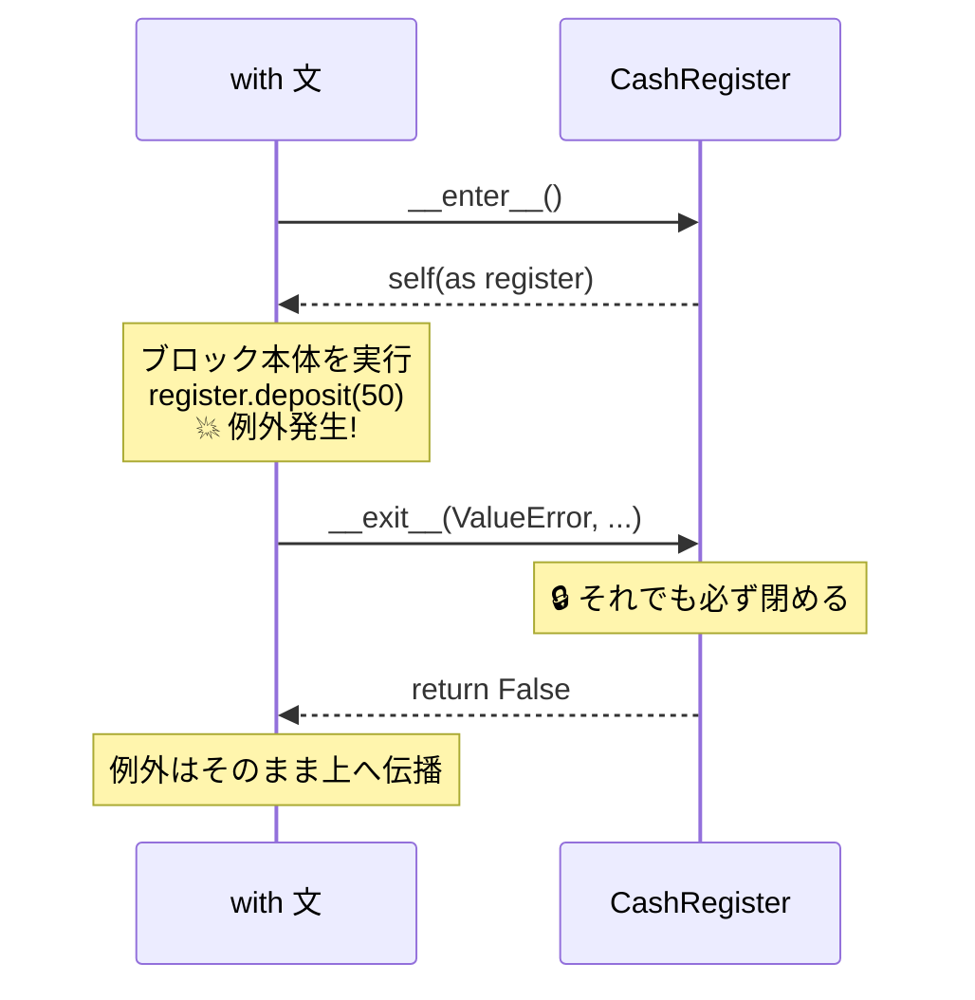

# 第12章 レジの開け閉め — コンテキストマネージャ

## 🏪 今日のお話

事件が起きました。会計中に例外が発生し、プログラムが **レジを開けたまま** 停止したのです。
翌朝、日計が合わずに大騒ぎ。

「**開けたものは、何があっても必ず閉める**」——
ファイル、データベース接続、ロック、そしてレジ。プログラミングの世界はこの約束だらけです。
Python はこれを `with` 文と **コンテキストマネージャ** で言語レベルで保証します。

## まずは定番: ファイルの with

営業日誌をファイルに書きましょう。

```python
# ❌ 危険な書き方
f = open("diary.txt", "w")
f.write("今日は回復薬が 12 本売れた")   # ここで例外が起きたら…
f.close()                              # ← 永遠に実行されない!

# ✅ with を使えば、例外が起きてもブロックを出る瞬間に必ず close される
with open("diary.txt", "w", encoding="utf-8") as f:
    f.write("今日は回復薬が 12 本売れた")
```

第6章の `try / finally` を思い出してください。`with` はその **綺麗な省略形** なのです。

```python
# with が裏でやっていることは、ほぼこれ:
f = open("diary.txt", "w")
try:
    f.write("...")
finally:
    f.close()
```

## 自作コンテキストマネージャ — レジを作る

`with` に対応するには dunder メソッドを 2 つ書くだけです(第9章の続きですね)。

- `__enter__` : ブロックに入るとき呼ばれる(`as` の右に返り値が入る)
- `__exit__` : ブロックを **どんな形で出ても** 呼ばれる

```python
class CashRegister:
    """開けたら必ず閉まるレジ。"""

    def __init__(self, initial_gold):
        self.gold = initial_gold
        self.is_open = False

    def __enter__(self):
        self.is_open = True
        print("🔓 レジを開けました")
        return self                      # as register で受け取れるもの

    def __exit__(self, exc_type, exc_value, traceback):
        self.is_open = False
        print(f"🔒 レジを閉めました(残高 {self.gold}G)")
        if exc_type is not None:
            print(f"⚠️ 会計中にトラブル: {exc_value}")
        return False                     # False = 例外を握りつぶさず上へ流す

    def deposit(self, amount):
        if not self.is_open:
            raise RuntimeError("レジが閉まっています")
        self.gold += amount
```

```python
with CashRegister(100) as register:
    register.deposit(50)
    raise ValueError("お客さんが偽金を出した!")   # 例外発生!
# それでも __exit__ は実行され、レジは必ず閉まる
```

```
🔓 レジを開けました
🔒 レジを閉めました(残高 150G)
⚠️ 会計中にトラブル: お客さんが偽金を出した!
Traceback (most recent call last): ...
```



> 💡 `__exit__` が `True` を返すと例外は「処理済み」として揉み消されます。
> 意図がない限り `False`(または `None`)を返しましょう。

## @contextmanager — ジェネレータで手軽に作る

クラスを書くほどでもない小さな用途には、第10章のジェネレータを流用できます。

```python
from contextlib import contextmanager
import time

@contextmanager
def brewing_session(potion_name):
    print(f"🔥 {potion_name} の醸造開始")
    start = time.perf_counter()
    try:
        yield potion_name          # ← ここで with ブロック本体に制御が移る
    finally:
        elapsed = time.perf_counter() - start
        print(f"🧯 醸造終了({elapsed:.2f} 秒)")

with brewing_session("エリクサー") as name:
    print(f"  {name} をじっくり煮込む…")
```

`yield` の **手前が `__enter__`、後ろが `__exit__`** に対応します。
第10章(yield)+ 第11章(デコレータ)の合わせ技 — 学んだ魔法が連鎖し始めました。

## 複数リソースと ExitStack

```python
# 2 つ同時に(3.10+ は括弧で改行できる)
with (
    open("diary.txt", encoding="utf-8") as diary,
    open("summary.txt", "w", encoding="utf-8") as summary,
):
    summary.write(diary.read()[:100])
```

数が実行時に決まるなら `contextlib.ExitStack` が便利です:

```python
from contextlib import ExitStack

with ExitStack() as stack:
    files = [stack.enter_context(open(p, encoding="utf-8")) for p in paths]
    # ブロックを出るとき、開けたぶん全部まとめて閉じてくれる
```

## セーブ機能 — JSON でお店を永続化

コンテキストマネージャの練習を兼ねて、お店に **セーブ/ロード** を実装します。
プログラムを終了しても在庫が消えない、初の「記憶を持つお店」です。

```python
import json

def save_shop(inventory, gold, path="shop_save.json"):
    data = {
        "gold": gold,
        "potions": [
            {"name": p.name, "price": p.price, "stock": p.stock}
            for p in inventory
        ],
    }
    with open(path, "w", encoding="utf-8") as f:
        json.dump(data, f, ensure_ascii=False, indent=2)

def load_shop(path="shop_save.json"):
    with open(path, encoding="utf-8") as f:
        data = json.load(f)
    inventory = Inventory()
    for row in data["potions"]:
        inventory.add(Potion(row["name"], row["price"], row["stock"]))
    return inventory, data["gold"]
```

営業ループの `q` を `save_shop` 付きにし、起動時に `load_shop` を試せば、
昨日の続きから営業できます(ファイルがない初日は `FileNotFoundError` を捕まえて新規開店 —
第6章の EAFP スタイルです)。

## 🧪 完成コード: 閉店処理の完成形

```python
def business_day(inventory, gold):
    """1 営業日。何が起きても帳簿とセーブは保証される。"""
    with CashRegister(gold) as register:
        while True:
            match input("\n> ").split():
                case ["q"]:
                    return register.gold
                case ["buy", item, *rest]:
                    try:
                        count = int(rest[0]) if rest else 1
                        register.deposit(inventory.sell(item, count))
                        print("  ありがとうございました 🎉")
                    except ShopError as e:
                        print(f"  {e}")

if __name__ == "__main__":
    try:
        inventory, gold = load_shop()
        print("💾 昨日の続きから開店します")
    except FileNotFoundError:
        inventory, gold = create_default_shop(), 100
        print("🎉 新規開店です!")

    gold = business_day(inventory, gold)
    save_shop(inventory, gold)
```

## 📝 今日の開店準備(演習)

1. `@contextmanager` で `pause_sales(inventory)`(棚卸し中は販売停止、抜けたら再開)を書いてください。途中で例外が出ても必ず再開されることを確認しましょう。
2. `CashRegister.__exit__` で、閉店時に残高を `ledger.HISTORY` へ記録するようにしてください。
3. セーブファイルの書き込み中にわざと例外を起こし(`json.dump` の前に `raise`)、壊れたファイルが残る問題を観察してください。「一時ファイルに書いてから `os.replace` で置き換える」安全版に改良してみましょう。

---

**中級編、修了です!** 🎓 お店は調合・自動帳簿・セーブ機能を備えた立派なシステムになりました。
上級編は、このコードを **大規模開発に耐える品質** へ引き上げます。
まずは、増え続けるコードの「暗黙の約束」を明文化する型ヒントから
→ [第13章 商品仕様書](13_typing.md)
