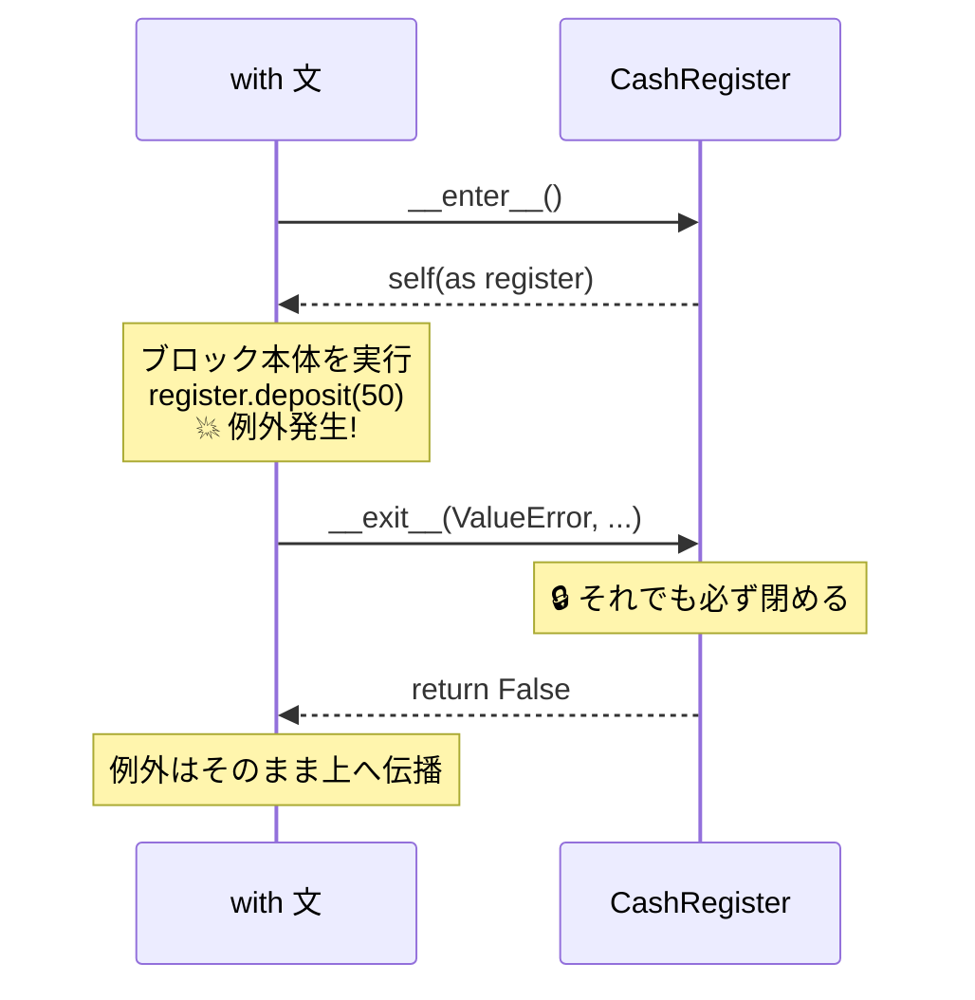

# 第12章 レジの開け閉め — コンテキストマネージャ

## 🏪 今日のお話

事件が起きました。会計中に例外が発生し、プログラムが **レジを開けたまま** 停止したのです。
翌朝、日計が合わずに大騒ぎ。

「**開けたものは、何があっても必ず閉める**」——
ファイル、データベース接続、ロック、そしてレジ。プログラミングの世界はこの約束だらけです。
Python はこれを `with` 文と **コンテキストマネージャ** で言語レベルで保証します。

### 閉め忘れると何が起きるか

「レジが開けっぱなし」は物語上の例ですが、現実のコードでも例外による閉め忘れは静かに悪さをします。

- **ファイル**: `write()` した内容は `close()`(内部で行われる `flush()`)まで OS のバッファに留まり、
  ディスクにはまだ書かれていないことがあります。閉じずに異常終了すると、**書いたはずの内容が消える/
  途中までしか反映されず壊れたファイルが残る**。さらに、開きっぱなしのファイルはプロセスごとの上限
  (Linux ではよくデフォルト 1024)を消費し続け、上限に達すると `OSError: Too many open files` で
  **無関係な別のファイル操作まで巻き添えで失敗**し始めます。
- **データベース接続**: Web アプリの接続プールはサイズが限られています(例: 10〜20)。閉じ忘れが
  積み重なるとプールが枯渇し、新しいリクエストが接続を取得できずタイムアウトする ―― **1 箇所のバグが
  サービス全体を止める**ことになります。トランザクション中のロックが解放されないままだと、他のクエリが
  そのロック解放を待ち続け、見かけ上の「フリーズ」も起こります。
- **共通の怖さ**: 単発の実行では気づかず、**サーバーのように長時間動き続けるプロセスでリソースが
  少しずつ漏れ、数時間〜数日後に突然クラッシュ/性能劣化**します。原因の例外はとっくに過ぎ去った後に
  症状が出るため、再現も調査も難しい典型的なバグです。

`with` はこの「閉め忘れ」を、書き手の注意力ではなく **言語仕様として** 防ぎます。

## まずは定番: ファイルの with

営業日誌をファイルに書きましょう。

```python
# ❌ 危険な書き方
f = open("diary.txt", "w")
f.write("今日は回復薬が 12 本売れた")   # ここで例外が起きたら…
f.close()                              # ← 永遠に実行されない!

# ✅ with を使えば、例外が起きてもブロックを出る瞬間に必ず close される
with open("diary.txt", "w", encoding="utf-8") as f:
    f.write("今日は回復薬が 12 本売れた")
```

第6章の `try / finally` を思い出してください。`with` はその **綺麗な省略形** なのです。

```python
# with が裏でやっていることは、ほぼこれ:
f = open("diary.txt", "w")
try:
    f.write("...")
finally:
    f.close()
```

## 自作コンテキストマネージャ — レジを作る

`with` に対応するには dunder メソッドを 2 つ書くだけです(第9章の続きですね)。

- `__enter__` : ブロックに入るとき呼ばれる(`as` の右に返り値が入る)
- `__exit__` : ブロックを **どんな形で出ても** 呼ばれる

```python
class CashRegister:
    """開けたら必ず閉まるレジ。"""

    def __init__(self, initial_gold):
        self.gold = initial_gold
        self.is_open = False

    def __enter__(self):
        self.is_open = True
        print("🔓 レジを開けました")
        return self                      # as register で受け取れるもの

    def __exit__(self, exc_type, exc_value, traceback):
        self.is_open = False
        print(f"🔒 レジを閉めました(残高 {self.gold}G)")
        if exc_type is not None:
            print(f"⚠️ 会計中にトラブル: {exc_value}")
        return False                     # False = 例外を握りつぶさず上へ流す

    def deposit(self, amount):
        if not self.is_open:
            raise RuntimeError("レジが閉まっています")
        self.gold += amount
```

```python
with CashRegister(100) as register:
    register.deposit(50)
    raise ValueError("お客さんが偽金を出した!")   # 例外発生!
# それでも __exit__ は実行され、レジは必ず閉まる
```

```
🔓 レジを開けました
🔒 レジを閉めました(残高 150G)
⚠️ 会計中にトラブル: お客さんが偽金を出した!
Traceback (most recent call last): ...
```



> 💡 `__exit__` が `True` を返すと例外は「処理済み」として揉み消されます。
> 意図がない限り `False`(または `None`)を返しましょう。

## @contextmanager — ジェネレータで手軽に作る

そもそも「コンテキストマネージャ」とは、`CashRegister` のように
**`__enter__` と `__exit__` を持つオブジェクト** のことでした。`with` はこの2つを呼び出しているだけです。
`@contextmanager` は、この2つのメソッドを持つクラスを **わざわざ書かずに済ませる近道** です。

まず、これから書くジェネレータが「本当は何と同じことをしているか」を、クラスで先に書いてみます。

```python
class BrewingSession:
    """brewing_session と同じ動きをするクラス版(比較用)"""
    def __init__(self, potion_name):
        self.potion_name = potion_name

    def __enter__(self):
        print(f"🔥 {self.potion_name} の醸造開始")
        self.start = time.perf_counter()
        return self.potion_name          # as name で受け取る値

    def __exit__(self, exc_type, exc_value, traceback):
        elapsed = time.perf_counter() - self.start
        print(f"🧯 醸造終了({elapsed:.2f} 秒)")
        return False                     # 例外は揉み消さず上へ流す
```

`__enter__` の中身と `__exit__` の中身、間に何もつながりがなく、`self.start` という
インスタンス変数を介してしか値を受け渡せていません。これを **ジェネレータ1本にまとめる** のが
`@contextmanager` です。

```python
from contextlib import contextmanager
import time

@contextmanager
def brewing_session(potion_name):
    print(f"🔥 {potion_name} の醸造開始")        # ← __enter__ の中身はここ
    start = time.perf_counter()
    try:
        yield potion_name          # ← ①ここで一時停止し、この値が __enter__ の返り値になる
    finally:
        elapsed = time.perf_counter() - start   # ← __exit__ の中身はここから下
        print(f"🧯 醸造終了({elapsed:.2f} 秒)")

with brewing_session("エリクサー") as name:
    print(f"  {name} をじっくり煮込む…")
```

`with` 文が実際にやっていることを時系列で追うと:

1. `with brewing_session("エリクサー")` → ジェネレータが作られる(まだ中身は動かない。第10章の通り)
2. `with` が **1回目の `next()`** を呼ぶ → `yield potion_name` の手前まで実行され、**そこで凍結**。
   `yield` された値 `potion_name` が `as name` に渡る ―― これが `__enter__` の返り値に相当
3. `with` ブロック本体(`print(f"  {name} …")`)が実行される
4. ブロックを抜けるとき、`with` が **2回目の `next()`(または例外時は `throw()`)** を呼ぶ →
   凍結地点(`yield` の場所)から再開し、`finally` 以降が実行される ―― ここが `__exit__` に相当

### わざわざ1本にまとめる理由 — 単に書きやすいから、だけではない

「短く書ける」のは結果であって本質ではありません。一番の理由は
**`__enter__` と `__exit__` の間で状態を受け渡す方法が根本的に変わる** ことです。

クラス版の `BrewingSession` をもう一度見てください。`__enter__` で計った `start` を
`__exit__` でも使うために、わざわざ `self.start` という **インスタンス変数** に保存していました。
これは「後で使うから、消えないところに置いておく」という余分な配線です。
`__enter__` と `__exit__` はメソッドとして独立しているので、`self` を介する以外に値を渡す手段がありません。

ジェネレータ版では `start` はただの **ローカル変数** です。第10章で学んだ通り、ジェネレータは
`yield` で止まっても関数内のローカル変数を凍結したまま覚えています。だから `start` は
`self.start` にする必要すらなく、**フリーズ→再開をまたいで普通に生き続けます**。
`__enter__` 相当と `__exit__` 相当が同じ関数の中の「前半」「後半」として書けるので、
状態受け渡し用の配線(`self.xxx`)がまるごと不要になるのです。

副次的な利点として、例外処理も普段慣れた `try/except/finally` でそのまま書けます。
クラス版では `__exit__(self, exc_type, exc_value, traceback)` という専用の引数で例外情報を
受け取り、`return True/False` で「揉み消すか流すか」を制御する独自ルールを覚える必要がありました。
ジェネレータ版は「例外が `yield` の行で発生した」ことにして通常の例外機構に乗せるだけなので、
新しいルールを覚えずに済みます。

つまり「1本にまとまる」のは見た目の話ではなく、**`__enter__`/`__exit__`をまたぐ状態管理と例外処理を、
インスタンス変数や専用引数を使わず、関数のローカル変数と普段通りの例外構文だけで完結させられる**、
という設計上の利点なのです。

つまり `yield` は単なる一時停止ではなく、**「`__enter__` はここまで、ここから先は `__exit__`」という境界線**
そのものです。ブロック内で例外が起きた場合は、その例外がまさに `yield potion_name` の行で発生したかのように
ジェネレータへ投げ込まれる(`throw()`)ため、`try/finally`(あるいは `except`)で確実に後片付けができます。

第10章(yield)+ 第11章(デコレータ)の合わせ技 — 学んだ魔法が連鎖し始めました。

## 複数リソースと ExitStack

```python
# 2 つ同時に(3.10+ は括弧で改行できる)
with (
    open("diary.txt", encoding="utf-8") as diary,
    open("summary.txt", "w", encoding="utf-8") as summary,
):
    summary.write(diary.read()[:100])
```

数が実行時に決まるなら `contextlib.ExitStack` が便利です:

```python
from contextlib import ExitStack

with ExitStack() as stack:
    files = [stack.enter_context(open(p, encoding="utf-8")) for p in paths]
    # ブロックを出るとき、開けたぶん全部まとめて閉じてくれる
```

## セーブ機能 — JSON でお店を永続化

コンテキストマネージャの練習を兼ねて、お店に **セーブ/ロード** を実装します。
プログラムを終了しても在庫が消えない、初の「記憶を持つお店」です。

```python
import json

def save_shop(inventory, gold, path="shop_save.json"):
    data = {
        "gold": gold,
        "potions": [
            {"name": p.name, "price": p.price, "stock": p.stock}
            for p in inventory
        ],
    }
    with open(path, "w", encoding="utf-8") as f:
        json.dump(data, f, ensure_ascii=False, indent=2)

def load_shop(path="shop_save.json"):
    with open(path, encoding="utf-8") as f:
        data = json.load(f)
    inventory = Inventory()
    for row in data["potions"]:
        inventory.add(Potion(row["name"], row["price"], row["stock"]))
    return inventory, data["gold"]
```

営業ループの `q` を `save_shop` 付きにし、起動時に `load_shop` を試せば、
昨日の続きから営業できます(ファイルがない初日は `FileNotFoundError` を捕まえて新規開店 —
第6章の EAFP スタイルです)。

## 🧪 完成コード: 閉店処理の完成形

```python
def business_day(inventory, gold):
    """1 営業日。何が起きても帳簿とセーブは保証される。"""
    with CashRegister(gold) as register:
        while True:
            match input("\n> ").split():
                case ["q"]:
                    return register.gold
                case ["buy", item, *rest]:
                    try:
                        count = int(rest[0]) if rest else 1
                        register.deposit(inventory.sell(item, count))
                        print("  ありがとうございました 🎉")
                    except ShopError as e:
                        print(f"  {e}")

if __name__ == "__main__":
    try:
        inventory, gold = load_shop()
        print("💾 昨日の続きから開店します")
    except FileNotFoundError:
        inventory, gold = create_default_shop(), 100
        print("🎉 新規開店です!")

    gold = business_day(inventory, gold)
    save_shop(inventory, gold)
```

## 📝 今日の開店準備(演習)

1. `@contextmanager` で `pause_sales(inventory)`(棚卸し中は販売停止、抜けたら再開)を書いてください。途中で例外が出ても必ず再開されることを確認しましょう。
2. `CashRegister.__exit__` で、閉店時に残高を `ledger.HISTORY` へ記録するようにしてください。
3. セーブファイルの書き込み中にわざと例外を起こし(`json.dump` の前に `raise`)、壊れたファイルが残る問題を観察してください。「一時ファイルに書いてから `os.replace` で置き換える」安全版に改良してみましょう。

---

**中級編、修了です!** 🎓 お店は調合・自動帳簿・セーブ機能を備えた立派なシステムになりました。
上級編は、このコードを **大規模開発に耐える品質** へ引き上げます。
まずは、増え続けるコードの「暗黙の約束」を明文化する型ヒントから
→ [第13章 商品仕様書](13_typing.md)
