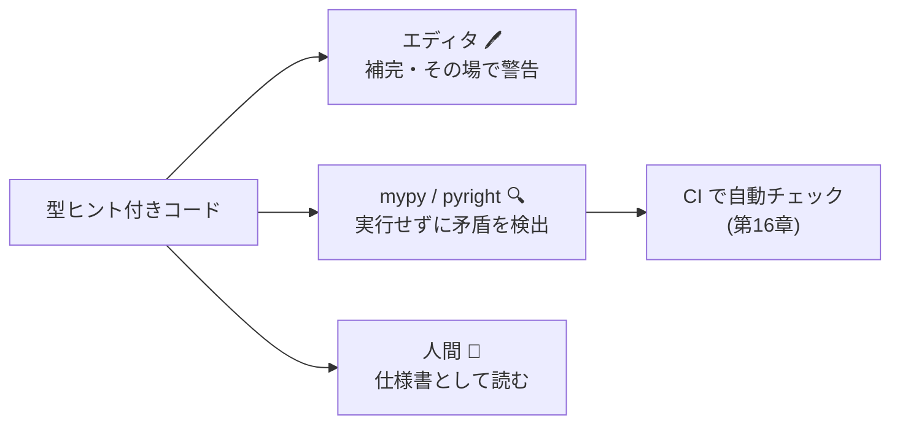
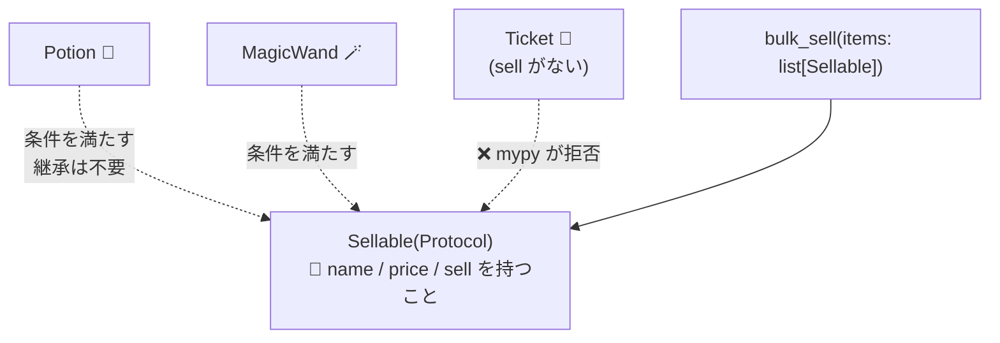

# 第13章 商品仕様書 — 型ヒントと静的型検査

## 🌳 上級編へようこそ

お店のコードは 500 行を超えました。ある日、手伝いに来た弟子が聞きます。

「師匠、`sell(item, count)` の `item` って、文字列ですか? `Potion` オブジェクトですか?」

…どっちだったか、あなたも一瞬迷いませんでしたか?
第1章で「変数に型はなく、値に型がある」と学びました。その自由さは、
コードが育つと「**暗黙の約束を全部暗記しておく**」負担に変わります。

**型ヒント** は、この約束を書面(仕様書)にする仕組みです。

## 基本の型ヒント

```python
def checkout(price: int, count: int = 1, tax_rate: float = 0.1) -> int:
    return int(price * count * (1 + tax_rate))

shop_name: str = "Pythonic Potions"
```

- `引数: 型` と `-> 返り値の型` を書くだけ
- **実行時には何のチェックもされません**(`checkout("a", "b")` は普通に実行されて落ちる)
- では誰が読むのか? → **エディタ、静的型検査ツール、そして人間**



### mypy — 実行せずにバグを見つける

```bash
pip install mypy
mypy shop/
```

```python
def sell(self, name: str, count: int = 1) -> int: ...

inventory.sell("回復薬", "3")   # mypy: error: Argument 2 has incompatible type "str"
```

**実行しなくても** 型の矛盾を全ファイル一斉に検査できます。
テストが通らないバグの一群を、書いた瞬間に潰せるのが静的型検査の価値です。

## コレクションと Optional

```python
def cheap_items(prices: dict[str, int], limit: int) -> list[str]:
    return [name for name, p in prices.items() if p < limit]

def find(self, name: str) -> Potion | None:
    """見つからなければ None。呼ぶ側に None 処理を強制できる!"""
    return self._potions.get(name)

potion = inventory.find("回復薬")
potion.sell()          # mypy: error! None かもしれないのに .sell した
if potion is not None:
    potion.sell()      # OK: この分岐の中では Potion だと mypy も理解する(型の絞り込み)
```

| 書き方(3.10+) | 意味 |
|---|---|
| `list[Potion]` | Potion のリスト |
| `dict[str, int]` | str → int の辞書 |
| `tuple[str, ...]` | str が何個でも並ぶタプル |
| `int \| None` | int または None(旧 `Optional[int]`) |
| `int \| str` | int または str(旧 `Union[int, str]`) |
| `Literal["gold", "card"]` | この 2 つの文字列だけ |
| `Callable[[int], str]` | int を受け取り str を返す関数 |

`Literal` は支払い方法のような「選択肢が決まっている文字列」に最適です:

```python
from typing import Literal

PayMethod = Literal["gold", "card", "barter"]   # 型に別名を付けられる

def pay(amount: int, method: PayMethod = "gold") -> None: ...

pay(100, "cash")   # mypy: error! "cash" は選択肢にない(タイポも一網打尽)
```

## TypedDict — dict に仕様書を付ける

第12章のセーブデータのような「形の決まった dict」には `TypedDict`:

```python
from typing import TypedDict

class PotionRow(TypedDict):
    name: str
    price: int
    stock: int

def load_row(row: PotionRow) -> Potion:
    return Potion(row["name"], row["price"], row["stock"])
    # row["prise"] とタイポすれば mypy が即座に指摘!
```

## Protocol — ダックタイピングに型を与える

第8章で「`use()` さえあれば動く」ダックタイピングを学びました。
**Protocol** はその「〜さえあれば」を型として表現します。**継承は不要** です。

```python
from typing import Protocol

class Sellable(Protocol):
    """「売り物」の条件: name と price があり、sell できること。"""
    name: str
    price: int
    def sell(self, count: int = 1) -> int: ...


def bulk_sell(items: list[Sellable], count: int = 1) -> int:
    return sum(item.sell(count) for item in items)
```

`Potion` は `Sellable` を継承していませんが、条件を満たしているので
`bulk_sell` に渡せます(**構造的部分型**)。将来「魔法の杖」クラスを追加しても、
`name` / `price` / `sell` さえ持てば無改造で受け入れられます。



- **ABC(第8章)**: 「この一族であること」を要求(名目的)。実行時にも強制できる
- **Protocol**: 「この形であること」を要求(構造的)。ライブラリ間の疎結合に強い

## ジェネリクス — 型を後から差し込む

### まず、ジェネリクスなしで同じものを作ろうとすると何に困るか

「棚」クラスを作りたいとします。何も工夫しないと、選択肢は2つしかありません。

```python
# 案A: 中身の型ごとにクラスを丸ごと複製する
class PotionShelf:
    def __init__(self) -> None:
        self._items: list[Potion] = []
    def put(self, item: Potion) -> None: ...
    def take(self) -> Potion: ...

class IngredientShelf:                       # ↑ とほぼ同じコードのコピペ
    def __init__(self) -> None:
        self._items: list[Ingredient] = []
    def put(self, item: Ingredient) -> None: ...
    def take(self) -> Ingredient: ...
# 棚がほしい型の数だけ、同じクラスを増やし続けることになる

# 案B: 型を Any にして1つのクラスで済ませる
class Shelf:
    def __init__(self) -> None:
        self._items: list = []                # 何でも入る
    def put(self, item) -> None:
        self._items.append(item)
    def take(self):
        return self._items.pop()

potion_shelf = Shelf()
potion_shelf.put(healing)
potion_shelf.put("ただの文字列")    # ← mypy は何も文句を言わない(型情報がないから)
taken = potion_shelf.take()
taken.use()                        # ← taken が Potion か str か mypy には分からず、補完も効かない
```

案Aはコード重複、案Bは型安全性(=第13章で得たかったもの)を丸ごと失います。
**「クラスは1つのまま、でも中身の型ごとにちゃんと区別したい」** ―― この板挟みを解決するのがジェネリクスです。

### T は「型のための引数」

`def greet(name):` の `name` が **値の入れ物**(呼ぶまで中身が決まらない)であるのと同じように、
`class Shelf[T]:` の `T` は **型の入れ物** です。呼ぶまで(=具体的な型を指定するまで)何の型かは決まりません。

```python
class Shelf[T]:
    """何でも載る棚。ただし 1 つの棚には 1 種類だけ。"""
    def __init__(self) -> None:
        self._items: list[T] = []

    def put(self, item: T) -> None:
        self._items.append(item)

    def take(self) -> T:
        return self._items.pop()
```

`Shelf[Potion]` と書いた瞬間、mypy は頭の中でクラス全体の `T` を `Potion` に **一括置換** します。

| コード上の宣言 | `Shelf[Potion]` として使うとき | `Shelf[Ingredient]` として使うとき |
|---|---|---|
| `self._items: list[T]` | `list[Potion]` | `list[Ingredient]` |
| `def put(self, item: T)` | `put(self, item: Potion)` | `put(self, item: Ingredient)` |
| `def take(self) -> T` | `take(self) -> Potion` | `take(self) -> Ingredient` |

つまり `Shelf` のコードは **1回だけ** 書けば済み(案Aの重複を解消)、それでいて
`Shelf[Potion]` に文字列を入れようとすれば mypy がちゃんと怒ってくれます(案Bの型安全性も維持)。
クラス定義は1つなのに、使うときだけ「今回は `T` = `Potion` で」と型を差し込める ―― これが「型を後から差し込む」の意味です。

```python
potion_shelf: Shelf[Potion] = Shelf()
potion_shelf.put(healing)          # OK
potion_shelf.put("ただの文字列")    # mypy: error!

taken = potion_shelf.take()        # taken は Potion 型だと mypy が知っている
taken.use()                        # 補完も効く!
```

関数にも使えます:

```python
def first_in_stock[T: Potion](potions: list[T]) -> T | None:
    """在庫のある最初の 1 本。渡した型がそのまま返り値の型になる。"""
    for p in potions:
        if p.stock > 0:
            return p
    return None

# list[HealingPotion] を渡せば返り値も HealingPotion | None になる
```

`[T: Potion]` は「T は Potion かその子孫」という **上限付き型引数** です。
(3.11 以前は `from typing import TypeVar; T = TypeVar("T", bound=Potion)` と書きます)

## 型ヒントとの付き合い方

- **公開 API(モジュール間で呼び合う関数・メソッド)には必ず書く**。仕様書だから
- 3 行のローカル変数にまで書かなくてよい。mypy は推論が得意
- 既存コードには少しずつ。`mypy --strict` は最終目標であってスタート地点ではない
- 型が複雑になりすぎたら **設計が複雑すぎるサイン** かもしれません

### TypedDict / Protocol / ジェネリクスの使い所

どれも「なるべく使う」道具ではなく、**特定の状況でだけ得をする** 道具です。
使いどころを外すと、恩恵のない手間(読みにくいだけの型)になります。

- **TypedDict**: JSON・設定ファイル・外部 API レスポンスなど「**dict のまま扱い続ける**」データに使う
  (第12章のセーブデータがまさにこれ)。逆に、メソッドや不変条件を持たせたい自前のドメインオブジェクトなら、
  TypedDict ではなく `dataclass` や普通のクラスにすべき。TypedDict は dict の形を文書化するだけで、
  実行時検証もメソッドも持てません。
- **Protocol**: 呼び出し側を自分で制御できない場合(ライブラリ利用者、テストの fake/mock)や、
  継承関係のない複数の型に同じ振る舞いを要求したい場合に使う。逆に、自分が全クラスを管理する
  1 つの継承階層なら、Protocol より素直なクラス/ABC の方が明示的で、`isinstance` による実行時強制も効く
  (ABC との違いは前節の通り: 名目的 vs 構造的)。
- **ジェネリクス(`Shelf[T]` のような型引数)**: 「実際に複数の型で使い回される」再利用可能なコンテナや
  アルゴリズムに使う。逆に、実質いつも同じ 1 種類の型でしか使わないクラスに `[T]` を付けても、
  複雑さが増えるだけで恩恵がありません。まず具体的な型(例: `Shelf` を `list[Potion]` の薄いラッパー)
  で書き始め、**2 つ目の使い道が出てきた時点で** ジェネリクスに昇格させれば十分です。

三つに共通する判断基準は1つです ―― **境界(外部データ、他モジュール、他人が書くコード)では厳密に、
自分だけが使う内部コードでは緩く**。1 箇所でしか使わない引数のために TypedDict / Protocol / ジェネリクスを
わざわざ定義するのは「型のための型」で、上の「設計が複雑すぎるサイン」に当てはまります。
同じ形・同じ振る舞いが 2 箇所以上で必要になって、はじめて名前を付ける価値が出ると考えましょう。

## 🧪 完成コード: 型付き `models.py`(抜粋)

```python
from typing import Protocol
from errors import SoldOutError


class Sellable(Protocol):
    name: str
    price: int
    def sell(self, count: int = 1) -> int: ...


class Inventory:
    def __init__(self) -> None:
        self._potions: dict[str, Potion] = {}

    def add(self, potion: Potion) -> None:
        self._potions[potion.name] = potion

    def find(self, name: str) -> Potion | None:
        return self._potions.get(name)

    def sell(self, name: str, count: int = 1) -> int:
        potion = self.find(name)
        if potion is None:
            raise KeyError(name)
        return potion.sell(count)

    def __iter__(self):
        yield from self._potions.values()
```

## 📝 今日の開店準備(演習)

1. これまでの `shop/` 全ファイルに型ヒントを付け、`mypy shop/` がエラーゼロになるまで直してください(1 つはタイポが見つかるはず…?)。
2. `Usable` Protocol(`use() -> str` を持つ)を定義し、`try` コマンドの処理関数の引数型にしてください。
3. `Shelf[T]` に `__iter__` と `__len__` を型付きで実装してください(第9章の復習)。

---

仕様書は完璧。しかしお店の前には行列が…。配達妖精の帰りを **待っている間**、
レジは完全に止まっています。「待ち時間に別の仕事をする」技術へ
→ [第14章 行列をさばく](14_async.md)
