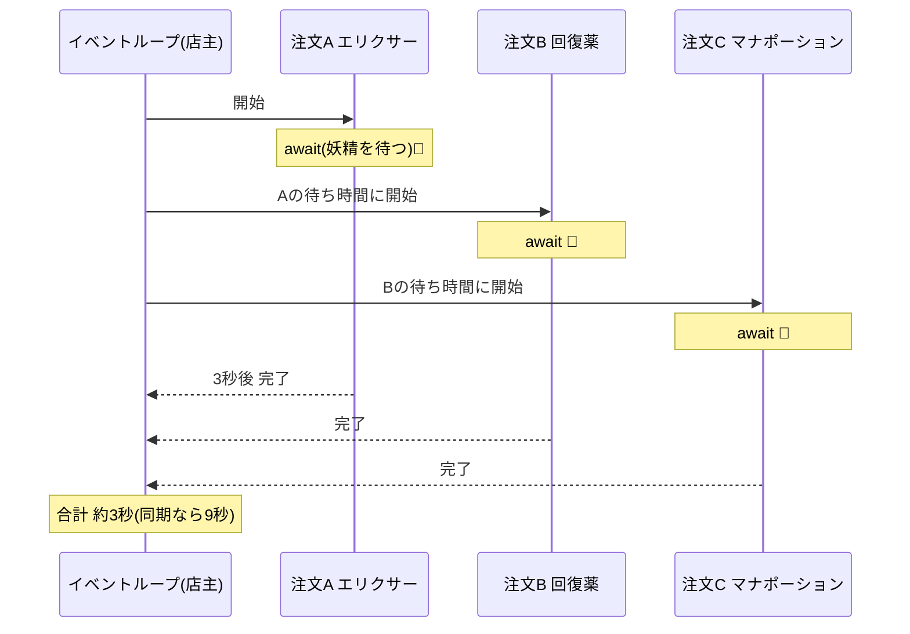
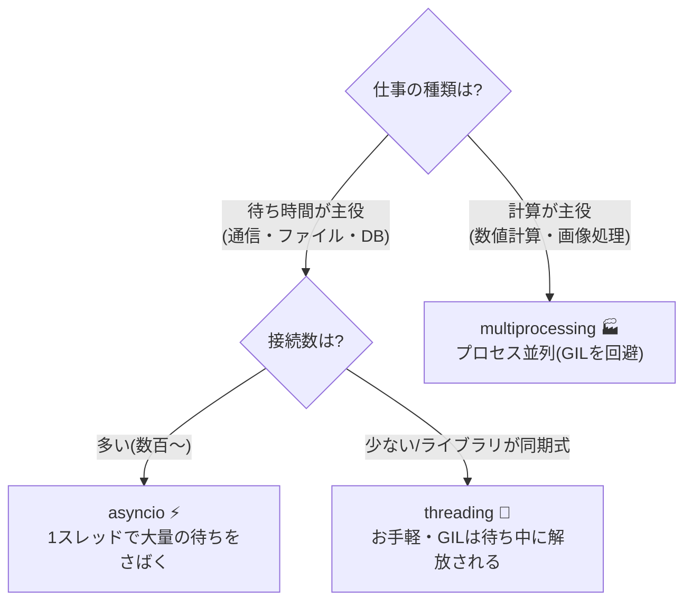

# 第14章 行列をさばく — 非同期処理と並行性

## 🏪 今日のお話

お店は大繁盛。しかし問題が発生しました。

エリクサーの注文が入ると、店主は **配達妖精が材料を取ってくるまでの 3 秒間、
何もせずに待ちます**。その間、後ろの行列はイライラ…。

よく観察すると、店主は「働いている」のではなく「**待っている**」だけ。
待ち時間に次のお客さんの注文を受ければいいのです。
これが **非同期処理(async)** の発想です。

## 同期の世界 — 1 人ずつ順番に

```python
import time

def fetch_ingredient(name: str) -> str:
    print(f"  🧚 {name} を取りに行きます…")
    time.sleep(3)                      # 妖精の往復(この間、店は完全停止)
    return f"{name} の材料"

def serve_three() -> None:
    start = time.perf_counter()
    for name in ["エリクサー", "回復薬", "マナポーション"]:
        fetch_ingredient(name)
    print(f"合計 {time.perf_counter() - start:.1f} 秒")   # → 約 9 秒
```

## 非同期の世界 — 待ち時間に次の仕事

```python
import asyncio
import time

async def fetch_ingredient(name: str) -> str:      # ① async def = コルーチン
    print(f"  🧚 {name} を取りに行きます…")
    await asyncio.sleep(3)                          # ② await = 「待つ間、他をどうぞ」
    print(f"  ✅ {name} の材料が届きました")
    return f"{name} の材料"

async def serve_three() -> None:
    start = time.perf_counter()
    results = await asyncio.gather(                 # ③ 3 件を同時進行
        fetch_ingredient("エリクサー"),
        fetch_ingredient("回復薬"),
        fetch_ingredient("マナポーション"),
    )
    print(f"合計 {time.perf_counter() - start:.1f} 秒")   # → 約 3 秒!

asyncio.run(serve_three())                          # ④ イベントループを起動
```

妖精は 3 人いたのです。9 秒が 3 秒になりました。



### 文法の要点

| 構文 | 意味 |
|---|---|
| `async def f():` | コルーチン関数を定義。呼んでも **すぐには実行されない**(第10章のジェネレータと同じ!) |
| `await x` | x の完了を待つ。**待っている間、イベントループは他のコルーチンを進める** |
| `asyncio.run(main())` | イベントループを起動する入口。プログラムに 1 回だけ |
| `asyncio.gather(a, b, c)` | 複数を同時進行させ、全部の結果を待つ |
| `asyncio.create_task(f())` | 「あとで結果を受け取る」タスクとして即座に走らせ始める |

> 💡 実はコルーチンは **ジェネレータの子孫** です。`await` で「一時停止して制御を返す」
> 仕組みは、第10章の `yield` の凍結・再開とまったく同じ原理で動いています。

### ⚠️ 非同期の掟

1. `await` できるのは `async def` の中だけ
2. コルーチンの中で `time.sleep(3)` を呼ぶと **イベントループごと全員停止** します。
   非同期対応版(`asyncio.sleep`、HTTP なら `aiohttp` / `httpx`)を使うこと
3. 「呼び忘れ」に注意: `fetch_ingredient("x")` と書いて `await` を忘れると、
   コルーチンオブジェクトが作られるだけで実行されません(警告が出ます)

## async はいつ効くのか — I/O バウンド vs CPU バウンド

非同期が速くしたのは「**待ち時間**」であって「計算」ではありません。仕事は 2 種類あります。

- **I/O バウンド**: 通信・ファイル・DB の応答待ちが大半(妖精待ち)→ **async が効く**
- **CPU バウンド**: 計算そのものが重い(巨大な釜をかき混ぜ続ける)→ async では速くならない

### GIL — Python 界の有名な門番

「じゃあ CPU バウンドはスレッドで並列に?」— ここで **GIL(グローバルインタプリタロック)**
の話をせねばなりません。CPython では **同時に Python バイトコードを実行できるスレッドは
常に 1 つだけ** です。つまりスレッドを 8 本立てても、CPU 計算は速くなりません。

CPU バウンドを本当に並列にするには **プロセス** を分けます(`multiprocessing` /
`concurrent.futures.ProcessPoolExecutor`)。プロセスごとに独立した Python が立つので
GIL の制約を受けません。



| 方式 | 並行の単位 | 得意分野 | ひとこと |
|---|---|---|---|
| `asyncio` | コルーチン(超軽量) | 大量の I/O 待ち | 協調的。`await` で自主的に譲り合う |
| `threading` | OS スレッド | 少数の I/O 待ち、同期ライブラリ | I/O 待ち中は GIL が解放されるので有効 |
| `multiprocessing` | OS プロセス | CPU 計算 | 起動もデータ受け渡しも重いが真の並列 |

```python
# CPU バウンドをプロセス並列にする例(釜 4 つで同時に煮込む)
from concurrent.futures import ProcessPoolExecutor

def heavy_brew(potion_id: int) -> str:
    total = sum(i * i for i in range(10_000_000))   # 重い計算
    return f"potion-{potion_id} 完成"

if __name__ == "__main__":
    with ProcessPoolExecutor(max_workers=4) as pool:      # 第12章の with!
        for result in pool.map(heavy_brew, range(8)):
            print(result)
```

## 🧪 完成コード: `shop/async_shop.py` — 行列を同時にさばく

```python
"""Pythonic Potions — 14 日目: 非同期店舗"""

import asyncio
import random

async def serve(customer: str, item: str) -> int:
    print(f"🙋 {customer} さん: {item} をください")
    brewing_time = random.uniform(0.5, 3.0)
    await asyncio.sleep(brewing_time)                # 醸造待ち(他の接客に譲る)
    print(f"🧪 {customer} さんへ {item} をお渡し({brewing_time:.1f}秒)")
    return 50

async def open_shop() -> None:
    queue: asyncio.Queue[tuple[str, str]] = asyncio.Queue()

    # 3 人の店員(ワーカー)が同じ行列(キュー)からお客さんを取る
    async def clerk(clerk_id: int) -> None:
        while True:
            customer, item = await queue.get()
            await serve(customer, item)
            queue.task_done()

    clerks = [asyncio.create_task(clerk(i)) for i in range(3)]

    for i, (customer, item) in enumerate([
        ("アリス", "回復薬"), ("ボブ", "エリクサー"), ("キャロル", "マナポーション"),
        ("デイブ", "回復薬"), ("イブ", "解毒薬"),
    ]):
        await queue.put((customer, item))

    await queue.join()               # 行列がはけるまで待つ
    for c in clerks:
        c.cancel()                   # 店員さん、お疲れさまでした

if __name__ == "__main__":
    asyncio.run(open_shop())
```

実行すると、5 人のお客さんが 3 人の店員に **同時並行で** さばかれていく様子が見えます。
`asyncio.Queue` + ワーカーは、実世界の非同期アプリ(クローラー、チャットボット、
API サーバー)の最頻出パターンです。

## 📝 今日の開店準備(演習)

1. `serve` に「エリクサーは醸造に必ず 5 秒かかる」を追加し、店員数を 1 / 3 / 5 人に変えて合計時間を比べてください。
2. `asyncio.wait_for(serve(...), timeout=2.0)` で「2 秒以上待たせたら謝ってキャンセル」を実装してください(`TimeoutError` を捕まえる — 第6章!)。
3. `heavy_brew` を `ThreadPoolExecutor` と `ProcessPoolExecutor` の両方で走らせ、実行時間を計測して GIL の効果を体感してください。

---

お店は行列もさばける大繁盛店に。最終開発章では、Python が **クラスを作る仕組みそのもの** に
手を入れて、「新作ポーションを書くだけで自動的に店に並ぶ」プラグイン機構を作ります
→ [第15章 プラグインで無限拡張](15_metaprogramming.md)
