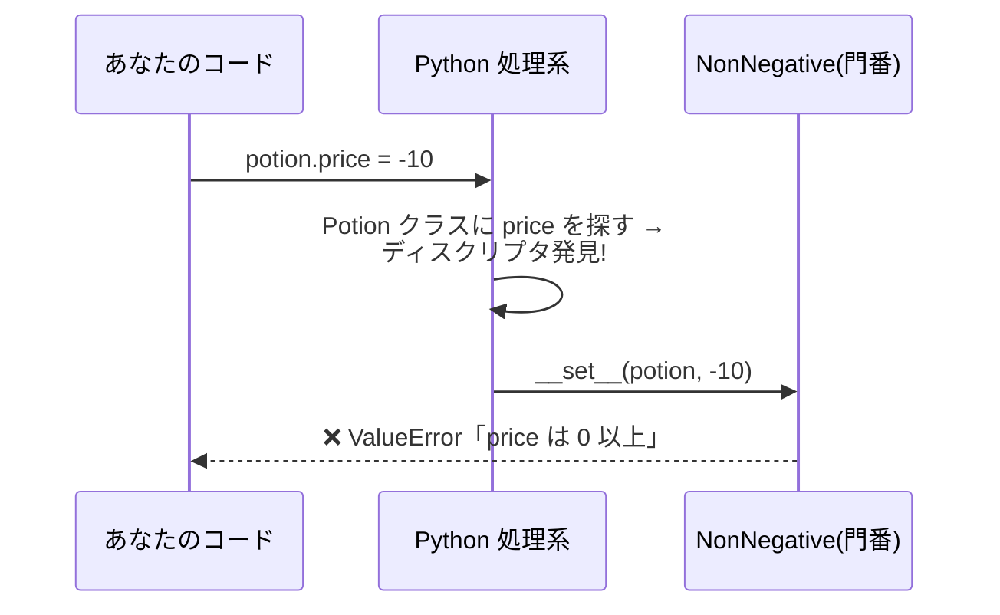
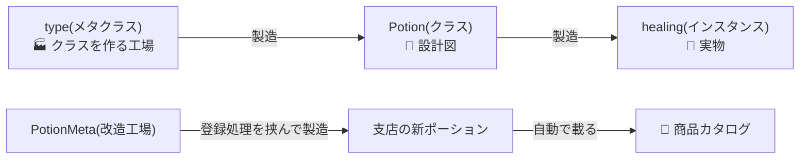

# 第15章 プラグインで無限拡張 — メタプログラミング

## 🏪 今日のお話

フランチャイズ展開が決まりました。各支店の魔法使いが独自ポーションを開発します。
本部の要望はこう:

> 「支店は **ポーションのクラスを書くだけ** にしたい。
> 商品目録への登録作業を手作業でやらせると、絶対に登録漏れが起きる」

つまり「**クラスを定義した瞬間、自動でカタログに載る**」仕組みが必要です。
これには、Python が **クラスや属性を作る仕組みそのもの** に介入します。
最深部の魔法、**メタプログラミング** の世界へようこそ。

## 前提知識: そもそも何を操作する話なのか

この章がわかりにくく感じる一番の原因は、**「何に対して」何をしているのかが見えにくい** ことです。
コードを読む前に、土台を2つだけ揃えておきます。

### ① 普通のプログラミングとの違い

普段書くコードは「**値**」を操作します。`potion.price = 60` は、`healing` というインスタンスが持つ
`price` という値を書き換えているだけで、操作対象はあくまで「データ」です。

メタプログラミングは、その1段上 ―― **「クラス」「属性」「関数」そのものをデータとして操作する**
プログラミングです。「メタ (meta)」は「〜についての」という意味で、
「プログラムの中身についてのプログラム」を書く、というのが直訳に近いイメージです。

これができる理由は、Python では「クラス」も「関数」も、`int` や `str` と全く同じ **ただのオブジェクト**
だからです(第8章・第9章の内容)。オブジェクトである以上、変数に代入したり、引数として渡したり、
**実行時に組み立てたり書き換えたりできます**。

```python
print(type(healing))    # <class 'Potion'>    ← healing というインスタンスの型は Potion
print(type(Potion))     # <class 'type'>      ← Potion というクラス自身にも型がある!
```

`healing` が `Potion` の**インスタンス**であるのと同じ意味で、`Potion` もまた `type` という
何かの**インスタンス**です。普段は意識しませんが、`class Potion: ...` という文を実行した瞬間、
Python の内部では「`Potion` という名前のオブジェクトを1個組み立てて、その名前に結びつける」
という処理が走っています。これは `x = 10` で `x` という名前に `10` を結びつけるのと、
実は **同じ種類の出来事** です。違いは「作られるものが値ではなくクラスである」というだけ。
この章は、この「クラスを組み立てる過程」「属性を読み書きする過程」に **途中から割り込む方法** を扱います。

### ② 属性アクセスは「決め打ちの一発検索」ではなく「手続き」

`potion.price` と書いたとき、Python はどこか固定の場所から値を一発で取ってきているわけではありません。
実際には「`price` という名前をどこで見つけるか」という **探索の手続き** を毎回実行しています
(だいたい、インスタンスの `__dict__` → クラスの属性 → 親クラスの属性 → … の順に探す、という手順です)。

この章で出てくる3つの魔法は、いずれも **この探索手続きのどこかに割り込むテクニック** です。
先に対応表を見ておくと、個々の説明が「バラバラの小技の寄せ集め」ではなく
「同じ1本の探索プロセスに、違う地点で仕掛けたフック」だと分かり、迷いにくくなります。

| 魔法 | 割り込む場所 |
|---|---|
| `__getattr__` | 通常の探索が **すべて失敗した後**、諦める直前の「最後の砦」 |
| ディスクリプタ | クラス属性が **見つかった時点** で、値をそのまま返す代わりに処理を挟む |
| メタクラス | そもそも探索対象になる **クラス自体を組み立てる瞬間** に割り込む |

## 第一の魔法: 属性アクセスに介入する

### getattr / setattr — 名前の文字列で属性を触る

```python
potion = Potion("回復薬", 50)

# potion.price と同じことを「文字列で」できる
print(getattr(potion, "price"))          # 50
setattr(potion, "price", 60)
print(getattr(potion, "quality", "並"))  # 存在しない属性は既定値(第2章 dict.get と同じ発想)
```

「ユーザー入力のフィールド名で属性を読む」など、**実行時に名前が決まる** 場面の道具です。

### `__getattr__` — 存在しない属性への最後の砦

`potion.xyz` が見つからなかったとき、Python は諦める直前に `__getattr__` を呼びます。

```python
class TranslatedPotion:
    """英語名でもアクセスできるポーション(委譲パターン)。"""
    _alias = {"price": "価格", "stock": "在庫"}

    def __init__(self, potion):
        self._potion = potion

    def __getattr__(self, name):           # 通常の探索で見つからない時だけ呼ばれる
        return getattr(self._potion, name)  # 中身のポーションに委譲
```

ラッパー(委譲)クラスの定番技です。全メソッドを手書きで転送する必要がなくなります。

> 🏭 **実運用では**: `unittest.mock.Mock` はまさにこの仕組みで、
> 「アクセスされた属性を、その場でその都度作る」ことでどんな属性・メソッド呼び出しにも応答する
> 万能テスト用オブジェクトを実現しています。また、REST API のラッパーライブラリで
> `client.users.list()` のように「実在しないメソッドチェーン」をそのまま HTTP リクエストに
> 変換するタイプの SDK も、この `__getattr__` 委譲がベースになっています。

## 第二の魔法: ディスクリプタ — property の正体

第7章の `@property` で価格に門番を置きました。しかし `price` にも `stock` にも `heal` にも
門番が要るとしたら、property を 3 回書くのは重複です。
**「再利用できる property」** がディスクリプタです。

```python
class NonNegative:
    """0 以上しか受け付けない属性(再利用可能な門番)。"""

    def __set_name__(self, owner, name):     # クラス定義時に属性名を教えてもらえる
        self.name = name

    def __get__(self, instance, owner):
        if instance is None:
            return self
        return instance.__dict__[self.name]

    def __set__(self, instance, value):
        if value < 0:
            raise ValueError(f"{self.name} は 0 以上: {value}")
        instance.__dict__[self.name] = value


class Potion:
    price = NonNegative()     # ← クラス属性としてディスクリプタを置く
    stock = NonNegative()     # 門番を何個でも使い回せる!

    def __init__(self, name, price, stock=0):
        self.name = name
        self.price = price    # ← この代入が NonNegative.__set__ を通る
        self.stock = stock
```



`__get__` / `__set__` を持つオブジェクトがクラス属性に置かれると、
インスタンスの属性アクセスがそこを **必ず経由** するようになります。
実は `@property` も、メソッドが `self` を受け取れる仕組み(束縛)も、
すべてディスクリプタで実装されています。**Python のオブジェクトモデルの心臓部** です。

> 🏭 **実運用では**: Django の `models.CharField()` / `models.IntegerField()`、SQLAlchemy の
> `Column(...)` は、どちらも「代入されると DB のバリデーション・型変換を行う」ディスクリプタです。
> `models.CharField(max_length=100)` と書くだけで、値を書き込むたびに文字数チェックが走るのは
> `NonNegative` と全く同じ仕掛けによるものです。標準ライブラリの `functools.cached_property`
> (初回アクセス時だけ計算し、以降はキャッシュを返す)もディスクリプタの応用例です。

## 第三の魔法: クラスも「作られる」— type とメタクラス

衝撃の事実から。**クラス自身もオブジェクト** であり、それを作る工場が `type` です。

```python
Potion = type(
    "Potion",                              # クラス名
    (object,),                             # 親クラス
    {"tax_rate": 0.1, "use": lambda self: "ゴクリ…"},   # 属性の dict
)
# ↑ これは class Potion: ... と(ほぼ)同じ!
```

`class` 文は `type(...)` 呼び出しの糖衣構文だったのです。
ならば、**`type` を継承して工場の製造工程を改造** すれば、
「クラスが定義された瞬間に何かをする」ことができます。それが **メタクラス** です。



### プラグイン自動登録システム

```python
class PotionMeta(type):
    """クラス定義と同時にカタログへ自動登録するメタクラス。"""
    catalog: dict[str, type] = {}

    def __new__(mcls, name, bases, namespace):
        cls = super().__new__(mcls, name, bases, namespace)
        if bases:                                  # 基底クラス自身は登録しない
            key = namespace.get("display_name", name)
            PotionMeta.catalog[key] = cls
            print(f"📖 カタログに登録: {key}")
        return cls


class PotionBase(metaclass=PotionMeta):
    display_name = ""
    price = NonNegative()          # 第二の魔法と合体!

    def __init__(self, stock=0):
        self.stock = stock
```

これで支店の仕事は **クラスを書くだけ** です:

```python
# 支店ファイル: plugins/tokyo.py — 書くだけで登録される!
class CherryPotion(PotionBase):
    display_name = "桜吹雪の秘薬"
    price = 300
    def use(self):
        return "🌸 目の前に桜が舞った!"
```

```
📖 カタログに登録: 桜吹雪の秘薬
```

本部の営業ループはカタログから全商品を知ることができます:

```python
for name, cls in PotionMeta.catalog.items():
    inventory.add(cls(stock=3))
```

**import するだけで登録が終わる** — Django のモデルや ORM、テストフレームワークが
「クラスを書くだけで動く」のは、この仕組みが裏にあるからです。

> 🏭 **実運用では**: Django の `class MyModel(models.Model): ...` は、内部の `ModelBase` という
> メタクラスが「このクラスにはどんなフィールドがあるか」を集計して DB テーブルの定義に変換しています。
> `class Meta:` の設定を読み取るのもこのメタクラスの仕事です。第8章で登場した `abc.ABCMeta`
> (抽象メソッドが実装されていないとインスタンス化できないようにする仕組み)や、`Enum` の裏側にある
> `enum.EnumMeta` も、同じ「クラスを作る瞬間に割り込む」パターンの実例です。

### `__init_subclass__` — 十分なことが多い軽量版

実は、単純な登録だけならメタクラスは大げさです。親クラスに
`__init_subclass__` を書けば、**子クラスが定義されるたびに** 呼んでもらえます。

```python
class PotionBase:
    catalog: dict[str, type] = {}

    def __init_subclass__(cls, **kwargs):
        super().__init_subclass__(**kwargs)
        PotionBase.catalog[cls.__name__] = cls    # これだけで自動登録完成
```

### デコレータ・__init_subclass__・メタクラスの使い分け

3つとも「クラスに何かを仕込む」道具ですが、**「いつ」介入できるか** と
**「書き忘れが起きうるか」** の2軸で性格が全く違います。ここを混同すると
使い分けが掴めません。

**軸1: いつ介入するか**

- **デコレータ**: クラス本体の実行が終わり、**クラスが完成した後** に受け取って手を加える
  (`class Foo: ...` が実行し終わってから `Foo = deco(Foo)` が走る)
- **`__init_subclass__`**: これも **クラスが完成した後** に呼ばれる。タイミングはデコレータとほぼ同じ
- **メタクラス**: クラスが完成する **前**、まだ「属性の集まり(namespace)」でしかない設計図の段階で介入できる。
  `__prepare__` を使えば、クラス本体を実行する前段階からも割り込める

**軸2: 自動で効くか、書き忘れうるか — ここが本質的な違い**

- **デコレータ**: 効かせたいクラス **それぞれに** `@decorator` と書く必要がある。**1つでも書き忘れると効きません**
- **`__init_subclass__` / メタクラス**: 親クラスに1回書いておけば、**その後生まれる全ての子クラス
  (孫クラス以降も含む)に自動的に効く**。サブクラス側は何も書かなくていい ―― 書き忘れが原理的に起こらない

この2軸を踏まえると、冒頭のストーリー「支店の魔法使いがクラスを書くだけで自動登録されてほしい。
手作業の登録をさせると絶対に登録漏れが起きる」という要件に、なぜデコレータでは答えられないかが分かります。
デコレータ方式にすると、支店の全ファイルで `@register` を書き忘れないという **運用に頼る** ことになり、
それこそが本部が避けたかった「登録漏れ」そのものです。だからこの章では
**`__init_subclass__`(またはメタクラス)がどうしても必要** になります。

### 「元のクラスを直接修正すればいい」ではダメな理由

もっともな疑問です。「わざわざ `PotionMeta` を挟まず、`PotionBase` の中に
登録処理を直接書けばいいのでは?」と思うかもしれません。実際にそれをやるとどうなるか見てみます。

```python
class PotionBase:
    catalog: dict[str, type] = {}
    # ここに「登録処理」を直接書いてみる…としても、これは PotionBase 自身が
    # 定義される「その1回」しか実行されない。CherryPotion が生まれる瞬間には
    # このコードは既に実行し終わっていて、二度と動かない

class CherryPotion(PotionBase):
    display_name = "桜吹雪の秘薬"
    price = 300
    def use(self): ...

PotionBase.catalog["桜吹雪の秘薬"] = CherryPotion   # ← 結局これを毎回手で書くしかない
```

ここで壁にぶつかります。**クラス本体(`class Foo: ...` の中身)は、そのクラスが定義される瞬間に
「上から下へ1回だけ」実行される、ただの手続きです。** `PotionBase` の中にどれだけコードを書いても、
それは `PotionBase` が定義された瞬間にしか走りません。**半年後に別の支店の人が新しいファイルで
`CherryPotion` を書く瞬間に、もう一度自動で発火してくれるコード** は、`PotionBase` の本体には
原理的に書けないのです ―― まだ存在しない未来のクラスのために、今コードを実行しておくことはできません。

つまり「元のクラスを直接修正する」という選択肢は、**支店の人が新しいクラスを書くたびに、
毎回追加の1行(`catalog[...] = CherryPotion`)を手で書く** ことと同義であり、これはまさに
物語の最初に「絶対に登録漏れが起きる」と言われていたやり方そのものに逆戻りしています。

`__init_subclass__` とメタクラスが特別なのは、**「新しいサブクラスが定義される、その瞬間」に
Python 自身が自動で呼び出してくれるコールバック** だという点です。これは通常のクラス本体の
コードでは絶対に実現できない、**「まだ書かれていない未来のクラスに対しても効く」フック**です。
`PotionBase` を書いた時点では `CherryPotion` はまだ存在しませんが、`__init_subclass__` を
1回登録しておけば、Python が「新しい子クラスができたよ」と気づくたびに勝手に呼んでくれます。

### `__init_subclass__` と メタクラス、どちらが必要か

両方とも「サブクラスに自動で効く」点は同じなので、ここからは軸1(いつ介入するか)で選びます。

- **完成した後のクラスに対して「登録する」「検証する」だけで済むなら** → `__init_subclass__` で十分。
  この章のカタログ登録がまさにこのケースです
- **完成する前の設計図そのものをいじる必要があるなら** → メタクラスでなければ実現できません。具体的には:
  1. **基底クラスの組み合わせ自体を拒否したい**(例: 特定の2つの Mixin を同時に継承したら
     クラス定義の時点でエラーにする)
  2. **namespace(属性の辞書)そのものを書き換えたい**(例: クラス本体に定義された全メソッドへ
     自動でログ出力を注入する、同名の属性が2回定義されていたら弾く)―― `__init_subclass__` の時点では
     もうクラスが出来上がっているので、これは原理的に手遅れです
  3. `__prepare__` で **クラス本体を実行するときの名前空間の種類自体を変えたい**
     (例: 属性の定義順を記録する、連番を自動採番する ―― `Enum` の裏側の仕組みです)
  4. 実例: `abc.ABCMeta` は「抽象メソッドが未実装ならインスタンス化できない」を
     型システムのレベルで強制しており、Django の `ModelBase` はクラス本体のフィールド定義を
     まるごと読み替えて SQL 用の情報に変換しています。どちらも「完成後に手を加える」のでは間に合わず、
     クラスを組み立てる過程そのものに介入しています

**まとめの判断フロー**

| やりたいこと | 選ぶべき道具 |
|---|---|
| 単発のクラス/関数 1 つにだけ機能を足したい(横展開しなくていい) | **デコレータ** |
| 継承階層全体に、サブクラス作者に何も書かせず自動で効かせたい(登録・検証) | **`__init_subclass__`** |
| クラスが完成する前に設計図(namespace・bases)そのものをいじる必要がある | **メタクラス** |
| 再利用可能な「属性1個への門番」が欲しい(ORM のカラム定義など) | **`__set_name__` 付きディスクリプタ** |

> ⚠️ **メタクラスの掟**: 「メタクラスが必要かどうか迷うなら、必要ない」(Tim Peters)。
> 強力すぎる魔法は読む人を苦しめます。上の表で **③に該当する具体的な理由がない限り**、
> デコレータや `__init_subclass__` で足りるはずです。それがプロの判断です。

> 🏭 **実運用では**: `pytest` はテストクラス・フィクスチャ・プラグインの登録に
> `__init_subclass__` に近い軽量な仕組みを使っています。「独自のクラスを1つ書けば、
> 特別な登録コードなしでフレームワークに自動的に組み込まれる」タイプの拡張機構は、
> ほぼ確実にこの章の①メタクラス or ②`__init_subclass__` のどちらかで実装されています。

## おまけの魔法: 実行時内省(イントロスペクション)

Python は実行中に自分自身を調べられます。デバッグや自動化の友です。

```python
import inspect

print(type(healing))                  # <class 'Potion'>
print(isinstance(healing, Potion))    # True
print(vars(healing))                  # インスタンスの属性 dict
print(dir(healing))                   # 使える属性・メソッド一覧
print(inspect.signature(Potion.sell)) # (self, count=1) — 引数仕様まで取れる
```

第11章のデコレータが `*args, **kwargs` でどんな関数も包めたのも、
`functools.wraps` が元の情報を写せたのも、この内省能力のおかげです。

> 🏭 **実運用では**: Web フレームワーク FastAPI は、あなたが書いたエンドポイント関数の
> **引数の型ヒントを `inspect` で読み取り**、リクエストボディの検証コードや API ドキュメント
> (Swagger UI)を自動生成しています。CLI ツールを作る `click` / `typer` も同様に、
> 関数の引数定義からコマンドラインオプションを自動生成します。あなたが「関数を1つ定義しただけ」
> なのに周辺機能が勝手に揃うライブラリを見たら、大抵はこのイントロスペクションが働いています。

## 🧪 完成コード: `shop/plugins.py`

```python
"""Pythonic Potions — 15 日目: フランチャイズ・プラグイン機構"""

class NonNegative:
    def __set_name__(self, owner, name):
        self.name = name
    def __get__(self, instance, owner):
        return self if instance is None else instance.__dict__[self.name]
    def __set__(self, instance, value):
        if value < 0:
            raise ValueError(f"{self.name} は 0 以上: {value}")
        instance.__dict__[self.name] = value


class PotionBase:
    catalog: dict[str, type["PotionBase"]] = {}
    display_name: str = ""
    stock = NonNegative()

    def __init_subclass__(cls, **kwargs):
        super().__init_subclass__(**kwargs)
        PotionBase.catalog[cls.display_name or cls.__name__] = cls

    def __init__(self, stock: int = 0):
        self.stock = stock

    def use(self) -> str:
        raise NotImplementedError


def load_franchise_menu():
    """カタログの全ポーションを 1 つずつ仕入れて開店メニューを作る。"""
    return {name: cls(stock=3) for name, cls in PotionBase.catalog.items()}
```

## 📝 今日の開店準備(演習)

1. `__init_subclass__` に「`display_name` を定義していないサブクラスは `TypeError`」という検証を追加してください(登録漏れならぬ命名漏れを防ぐ)。
2. `MaxLength(n)` ディスクリプタ(n 文字を超える名前を拒否)を作り、`display_name` に適用してください。
3. `plugins/` ディレクトリの `.py` を `importlib.import_module` で全部 import する `discover_plugins()` を書いてください。ファイルを置くだけで新商品が並ぶ、本物のプラグインシステムの完成です。

---

すべての魔法が揃いました。最終章では、この店を **テストで守り、パッケージとして出荷** します。
卒業制作です → [第16章 卒業制作](16_final.md)
