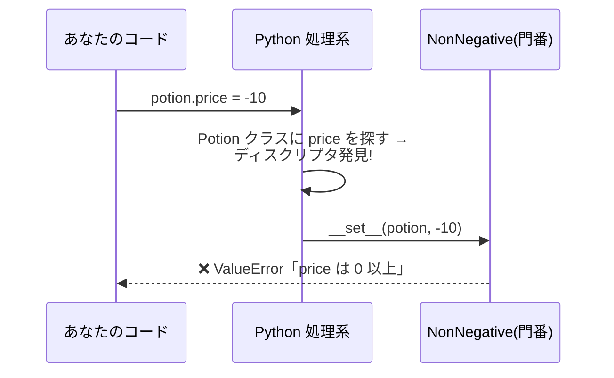
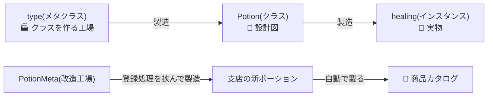

# 第15章 プラグインで無限拡張 — メタプログラミング

## 🏪 今日のお話

フランチャイズ展開が決まりました。各支店の魔法使いが独自ポーションを開発します。
本部の要望はこう:

> 「支店は **ポーションのクラスを書くだけ** にしたい。
> 商品目録への登録作業を手作業でやらせると、絶対に登録漏れが起きる」

つまり「**クラスを定義した瞬間、自動でカタログに載る**」仕組みが必要です。
これには、Python が **クラスや属性を作る仕組みそのもの** に介入します。
最深部の魔法、**メタプログラミング** の世界へようこそ。

## 第一の魔法: 属性アクセスに介入する

### getattr / setattr — 名前の文字列で属性を触る

```python
potion = Potion("回復薬", 50)

# potion.price と同じことを「文字列で」できる
print(getattr(potion, "price"))          # 50
setattr(potion, "price", 60)
print(getattr(potion, "quality", "並"))  # 存在しない属性は既定値(第2章 dict.get と同じ発想)
```

「ユーザー入力のフィールド名で属性を読む」など、**実行時に名前が決まる** 場面の道具です。

### `__getattr__` — 存在しない属性への最後の砦

`potion.xyz` が見つからなかったとき、Python は諦める直前に `__getattr__` を呼びます。

```python
class TranslatedPotion:
    """英語名でもアクセスできるポーション(委譲パターン)。"""
    _alias = {"price": "価格", "stock": "在庫"}

    def __init__(self, potion):
        self._potion = potion

    def __getattr__(self, name):           # 通常の探索で見つからない時だけ呼ばれる
        return getattr(self._potion, name)  # 中身のポーションに委譲
```

ラッパー(委譲)クラスの定番技です。全メソッドを手書きで転送する必要がなくなります。

## 第二の魔法: ディスクリプタ — property の正体

第7章の `@property` で価格に門番を置きました。しかし `price` にも `stock` にも `heal` にも
門番が要るとしたら、property を 3 回書くのは重複です。
**「再利用できる property」** がディスクリプタです。

```python
class NonNegative:
    """0 以上しか受け付けない属性(再利用可能な門番)。"""

    def __set_name__(self, owner, name):     # クラス定義時に属性名を教えてもらえる
        self.name = name

    def __get__(self, instance, owner):
        if instance is None:
            return self
        return instance.__dict__[self.name]

    def __set__(self, instance, value):
        if value < 0:
            raise ValueError(f"{self.name} は 0 以上: {value}")
        instance.__dict__[self.name] = value


class Potion:
    price = NonNegative()     # ← クラス属性としてディスクリプタを置く
    stock = NonNegative()     # 門番を何個でも使い回せる!

    def __init__(self, name, price, stock=0):
        self.name = name
        self.price = price    # ← この代入が NonNegative.__set__ を通る
        self.stock = stock
```



`__get__` / `__set__` を持つオブジェクトがクラス属性に置かれると、
インスタンスの属性アクセスがそこを **必ず経由** するようになります。
実は `@property` も、メソッドが `self` を受け取れる仕組み(束縛)も、
すべてディスクリプタで実装されています。**Python のオブジェクトモデルの心臓部** です。

## 第三の魔法: クラスも「作られる」— type とメタクラス

衝撃の事実から。**クラス自身もオブジェクト** であり、それを作る工場が `type` です。

```python
Potion = type(
    "Potion",                              # クラス名
    (object,),                             # 親クラス
    {"tax_rate": 0.1, "use": lambda self: "ゴクリ…"},   # 属性の dict
)
# ↑ これは class Potion: ... と(ほぼ)同じ!
```

`class` 文は `type(...)` 呼び出しの糖衣構文だったのです。
ならば、**`type` を継承して工場の製造工程を改造** すれば、
「クラスが定義された瞬間に何かをする」ことができます。それが **メタクラス** です。



### プラグイン自動登録システム

```python
class PotionMeta(type):
    """クラス定義と同時にカタログへ自動登録するメタクラス。"""
    catalog: dict[str, type] = {}

    def __new__(mcls, name, bases, namespace):
        cls = super().__new__(mcls, name, bases, namespace)
        if bases:                                  # 基底クラス自身は登録しない
            key = namespace.get("display_name", name)
            PotionMeta.catalog[key] = cls
            print(f"📖 カタログに登録: {key}")
        return cls


class PotionBase(metaclass=PotionMeta):
    display_name = ""
    price = NonNegative()          # 第二の魔法と合体!

    def __init__(self, stock=0):
        self.stock = stock
```

これで支店の仕事は **クラスを書くだけ** です:

```python
# 支店ファイル: plugins/tokyo.py — 書くだけで登録される!
class CherryPotion(PotionBase):
    display_name = "桜吹雪の秘薬"
    price = 300
    def use(self):
        return "🌸 目の前に桜が舞った!"
```

```
📖 カタログに登録: 桜吹雪の秘薬
```

本部の営業ループはカタログから全商品を知ることができます:

```python
for name, cls in PotionMeta.catalog.items():
    inventory.add(cls(stock=3))
```

**import するだけで登録が終わる** — Django のモデルや ORM、テストフレームワークが
「クラスを書くだけで動く」のは、この仕組みが裏にあるからです。

### `__init_subclass__` — 十分なことが多い軽量版

実は、単純な登録だけならメタクラスは大げさです。親クラスに
`__init_subclass__` を書けば、**子クラスが定義されるたびに** 呼んでもらえます。

```python
class PotionBase:
    catalog: dict[str, type] = {}

    def __init_subclass__(cls, **kwargs):
        super().__init_subclass__(**kwargs)
        PotionBase.catalog[cls.__name__] = cls    # これだけで自動登録完成
```

| 道具 | 使いどころ |
|---|---|
| `__init_subclass__` | サブクラスの登録・検証。**まずはこれで足りないか考える** |
| `__set_name__` 付きディスクリプタ | 再利用可能な属性の門番・ORM のカラム定義 |
| メタクラス | クラス作成過程そのものの改造(属性の書き換え、ABC の実装など) |

> ⚠️ **メタクラスの掟**: 「メタクラスが必要かどうか迷うなら、必要ない」(Tim Peters)。
> 強力すぎる魔法は読む人を苦しめます。デコレータや `__init_subclass__` で
> 足りるなら、そちらを選ぶのがプロの判断です。

## おまけの魔法: 実行時内省(イントロスペクション)

Python は実行中に自分自身を調べられます。デバッグや自動化の友です。

```python
import inspect

print(type(healing))                  # <class 'Potion'>
print(isinstance(healing, Potion))    # True
print(vars(healing))                  # インスタンスの属性 dict
print(dir(healing))                   # 使える属性・メソッド一覧
print(inspect.signature(Potion.sell)) # (self, count=1) — 引数仕様まで取れる
```

第11章のデコレータが `*args, **kwargs` でどんな関数も包めたのも、
`functools.wraps` が元の情報を写せたのも、この内省能力のおかげです。

## 🧪 完成コード: `shop/plugins.py`

```python
"""Pythonic Potions — 15 日目: フランチャイズ・プラグイン機構"""

class NonNegative:
    def __set_name__(self, owner, name):
        self.name = name
    def __get__(self, instance, owner):
        return self if instance is None else instance.__dict__[self.name]
    def __set__(self, instance, value):
        if value < 0:
            raise ValueError(f"{self.name} は 0 以上: {value}")
        instance.__dict__[self.name] = value


class PotionBase:
    catalog: dict[str, type["PotionBase"]] = {}
    display_name: str = ""
    stock = NonNegative()

    def __init_subclass__(cls, **kwargs):
        super().__init_subclass__(**kwargs)
        PotionBase.catalog[cls.display_name or cls.__name__] = cls

    def __init__(self, stock: int = 0):
        self.stock = stock

    def use(self) -> str:
        raise NotImplementedError


def load_franchise_menu():
    """カタログの全ポーションを 1 つずつ仕入れて開店メニューを作る。"""
    return {name: cls(stock=3) for name, cls in PotionBase.catalog.items()}
```

## 📝 今日の開店準備(演習)

1. `__init_subclass__` に「`display_name` を定義していないサブクラスは `TypeError`」という検証を追加してください(登録漏れならぬ命名漏れを防ぐ)。
2. `MaxLength(n)` ディスクリプタ(n 文字を超える名前を拒否)を作り、`display_name` に適用してください。
3. `plugins/` ディレクトリの `.py` を `importlib.import_module` で全部 import する `discover_plugins()` を書いてください。ファイルを置くだけで新商品が並ぶ、本物のプラグインシステムの完成です。

---

すべての魔法が揃いました。最終章では、この店を **テストで守り、パッケージとして出荷** します。
卒業制作です → [第16章 卒業制作](16_final.md)
