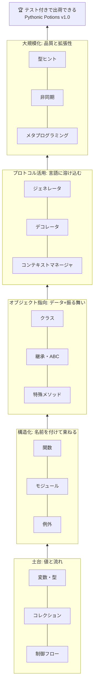

# 第16章 卒業制作 — テスト、プロジェクト構成、そして出荷

## 🏪 最後のお話

Pythonic Potions は、看板 1 枚から始まって、調合・自動帳簿・セーブ・非同期接客・
プラグイン機構を備えた大繁盛店になりました。

最終章のテーマは「**壊さずに育て続けるための仕組み**」です。
どんな名店も、改装のたびに壁が崩れるようでは長続きしません。

## pytest — お店の品質検査官

**テスト** とは「コードが約束どおり動くことを、コードで確認する」ことです。
デファクトスタンダードの `pytest` を使います。

```bash
pip install pytest
```

**`tests/test_potion.py`**

```python
import pytest
from potions.models import Potion, Inventory
from potions.errors import SoldOutError


def test_sell_reduces_stock():
    potion = Potion("回復薬", 50, stock=10)
    potion.sell(3)
    assert potion.stock == 7                 # assert 文だけ。特別な作法は不要!


def test_sell_returns_price_with_tax():
    potion = Potion("回復薬", 100, stock=1)
    assert potion.sell(1) == 110


def test_sell_more_than_stock_raises():
    potion = Potion("回復薬", 50, stock=1)
    with pytest.raises(SoldOutError):        # 「例外が出ること」もテストできる
        potion.sell(2)


def test_negative_price_rejected():
    with pytest.raises(ValueError):
        Potion("怪しい薬", -10)
```

```bash
$ pytest
==== 4 passed in 0.02s ====
```

これで **リファクタリングが怖くなくなります**。どこを改装しても、
`pytest` 一発で全室を点検できるからです。

### fixture — 毎テスト共通の開店準備

**fixture が解決する問題** から見ていきます。`Inventory` を使うテストが増えるほど、
どのテストにも「在庫を用意する」という同じ準備コードが並びます。

```python
# ❌ fixture なし: どのテストにも同じ準備コードが重複する
def test_inventory_sell():
    inv = Inventory()
    inv.add(Potion("回復薬", 50, 10))
    inv.add(Potion("エリクサー", 500, 1))
    inv.sell("回復薬", 2)
    assert inv.find("回復薬").stock == 8

def test_inventory_contains():
    inv = Inventory()                      # ← また同じ3行
    inv.add(Potion("回復薬", 50, 10))
    inv.add(Potion("エリクサー", 500, 1))
    assert "回復薬" in inv
```

準備コードが 10 個のテストに散らばると、在庫の初期値を1つ変えるだけで 10 箇所を
書き換える羽目になります。**「テストごとに必要な準備」を1箇所にまとめて使い回す** のが fixture です。

```python
@pytest.fixture
def stocked_inventory():
    """テスト用の在庫一式。各テストの前に新品が用意される。"""
    inv = Inventory()
    inv.add(Potion("回復薬", 50, 10))
    inv.add(Potion("エリクサー", 500, 1))
    return inv


def test_inventory_sell(stocked_inventory):        # 引数名で fixture を受け取る
    stocked_inventory.sell("回復薬", 2)
    assert stocked_inventory.find("回復薬").stock == 8


def test_inventory_contains(stocked_inventory):    # ここには新品が届く(前のテストの影響なし)
    assert "回復薬" in stocked_inventory           # 第9章の __contains__ もテスト!
```

### 裏側の仕組み — なぜ import も呼び出しもしていないのに動くのか

`test_inventory_sell(stocked_inventory)` を見て、「`stocked_inventory` ってどこから来たの?
呼び出してもいないのに」と思ったかもしれません。種を明かすと、これは **引数の名前を
文字列としてマッチングしている** だけです。

1. `pytest` はテスト関数を実行する前に、`inspect`(第15章のイントロスペクション!)で
   その関数の **引数名一覧** を調べます
2. `stocked_inventory` という引数名を見つけたら、「同じ名前で `@pytest.fixture` が
   付いた関数はないか」を探します
3. 見つかった fixture 関数を **呼び出し**、その **返り値** を、同じ名前の引数に渡します

つまり `stocked_inventory` という **名前そのもの** が、fixture 関数とテスト関数をつなぐ
唯一の手がかりです。魔法のように見えますが、正体は「文字列が一致するものを実行時に探して
呼び出す」という、第15章で見た `getattr` 系のテクニックの応用にすぎません。

そしてこの fixture 関数は **リクエストしたテストごとに毎回新しく実行される** のがデフォルトです。
`test_inventory_sell` が在庫を2個売っても、次の `test_inventory_contains` には
まっさらな `stocked_inventory` が届く ―― だから **テストの実行順序を変えても結果が変わらない**
という、テストにとって非常に重要な性質(独立性)が保証されます。

### yield で後片付けもできる — 第10章・第12章の再登場

fixture は `return` の代わりに `yield` を使うと、**テスト終了後の後片付け** まで書けます。
これは第12章の `@contextmanager` と全く同じ仕組みです。

```python
@pytest.fixture
def temp_save_file(tmp_path):              # tmp_path は pytest 標準の組み込み fixture
    path = tmp_path / "shop_save.json"
    yield path                              # ← ここまでが「準備」、テスト本体に path を渡す
    if path.exists():                       # ← テストが終わったら(成功でも失敗でも)ここが走る
        path.unlink()                       #    後片付け: 一時ファイルを消す

def test_save_and_load(temp_save_file):
    save_shop([], 100, path=temp_save_file)
    inventory, gold = load_shop(path=temp_save_file)
    assert gold == 100
```

`yield` の手前が「開店準備」、後ろが「閉店処理」に対応するのは第12章の `brewing_session` と
同じ発想です。DB接続を張って `yield conn` し、テスト後に `conn.close()` する、といった
「後片付けが必要なリソース」を扱うテストで頻出のパターンです。

### スコープ — 毎回作り直すか、使い回すか

fixture はデフォルトで **テスト関数1つにつき1回** 新しく作られますが(`scope="function"`)、
DB接続のように準備コストが高いものは、複数のテストで使い回したくなります。

```python
@pytest.fixture(scope="module")     # このテストファイル内では1回だけ作られる
def db_connection():
    conn = connect_to_test_db()
    yield conn
    conn.close()
```

| スコープ | 作られる頻度 | 向いている用途 |
|---|---|---|
| `function`(既定) | テスト関数ごとに毎回 | 通常のオブジェクト。テスト同士を独立させたいとき |
| `class` | テストクラスごとに1回 | クラス内のテストで前提を共有したいとき |
| `module` | ファイルごとに1回 | 同じファイル内の全テストで、重いセットアップを使い回す |
| `session` | テスト全体で1回 | DB接続・Dockerコンテナなど、起動が重いリソース |

**トレードオフ注意**: スコープを広げるほど速くなりますが、fixture が返すオブジェクトが
**ミュータブル(変更可能)** だと、あるテストの変更が別のテストに漏れて
「実行順序で結果が変わる」というテストの独立性が壊れる バグの温床になります。
まずは `function` スコープで書き、実測して遅いと分かってから広げるのが安全です。

### fixture は fixture に依存できる、共有は conftest.py で

fixture 関数自身も、別の fixture を引数として受け取れます(小さな部品を組み合わせて
複雑な準備を組み立てられる、ということです)。

```python
@pytest.fixture
def cheap_potion():
    return Potion("回復薬", 50, stock=10)

@pytest.fixture
def inventory_with_cheap_potion(cheap_potion):   # fixture が fixture を使う
    inv = Inventory()
    inv.add(cheap_potion)
    return inv
```

複数のテストファイルで同じ fixture を使いたい場合は、`tests/conftest.py` という
特別な名前のファイルに置いておくと、**import なしで** 同じディレクトリの全テストファイルから
自動的に見えるようになります(これも②の「名前で探す」仕組みの延長です)。

### parametrize — 表でまとめて検査

```python
@pytest.mark.parametrize("price, count, expected", [
    (100, 1, 110),
    (100, 3, 330),
    (50, 2, 110),
    (0, 5, 0),          # 境界値もきちんと
])
def test_checkout(price, count, expected):
    assert Potion("薬", price, stock=99).sell(count) == expected
```

> 💡 **良いテストの心得**
> - 1 テスト 1 関心事。名前は「何を保証するか」が読める文に
> - 境界値(0、1、満杯、空)と異常系(例外)を必ず含める
> - テストしにくいコードは設計が悪いサイン。第4章の「受け取って返す」関数はテストが楽だったはず

### 全部のクラス・関数にテストが要る?

**要りません。** 「カバレッジ 100%」を目標にするのは、多くの場合コストに見合いません。
判断基準は **「そのコードに壊れうる判断(分岐・条件)があるかどうか」** です。

- **書くべき**: `if` / `for` / 例外送出など **分岐や条件がある** コード。第6・7章で見た
  `sell()` の「在庫が足りなければ `SoldOutError`」「価格が負なら `ValueError`」のような
  ロジックは、書き手の想定と実際の動きがズレやすい ―― テストが真価を発揮するのはここです
- **書くべき**: 一度バグを出した箇所。同じバグの再発を機械的に防げます
- **書くべき**: 他のモジュールから使われる公開 API(`Inventory.sell` のような、壊れると
  影響範囲が広い関数)
- **書かなくてよい**: 分岐が一切ない一直線のコード(単純な代入・委譲だけの1行メソッドなど)。
  読めば正しいと分かるコードにテストを足しても、労力に見合う安心は増えません
- **書かなくてよい**: プライベートなヘルパー関数を **個別に** テストすること。多くの場合、
  それを呼び出す公開関数のテストを通せば間接的に検証できています

`pytest --cov` のようなツールでカバレッジ率は見られますが、これは**「テストが薄い場所を探す
レーダー」**として使うものであり、数字そのものを目標にしないでください。100% 達成のために
分岐のない自明なコードまで無理にテストを書くのは、それこそ「テストのためのテスト」で
時間の無駄です。**「ここが壊れたらどれだけ困るか」で優先順位を付ける** のが実務的な感覚です。

## 最終形 — プロジェクト構成

```
pythonic-potions/
├── pyproject.toml           # プロジェクトの説明書 兼 設定
├── README.md
├── .venv/                   # 仮想環境(第5章)
├── src/
│   └── potions/
│       ├── __init__.py
│       ├── models.py        # Potion, Inventory(第7〜9章)
│       ├── errors.py        # 独自例外(第6章)
│       ├── brewery.py       # 醸造パイプライン(第10章)
│       ├── ledger.py        # 帳簿デコレータ(第11章)
│       ├── persistence.py   # セーブ/ロード(第12章)
│       ├── async_shop.py    # 非同期接客(第14章)
│       ├── plugins.py       # プラグイン基盤(第15章)
│       └── main.py          # 営業ループ(第3〜5章)
└── tests/
    ├── test_potion.py
    ├── test_inventory.py
    └── test_brewery.py
```

**`pyproject.toml`** — 現代 Python プロジェクトの中心ファイルです:

```toml
[project]
name = "pythonic-potions"
version = "1.0.0"
description = "魔法薬店経営シミュレータ(Python 学習の卒業制作)"
requires-python = ">=3.10"
dependencies = ["rich"]

[project.optional-dependencies]
dev = ["pytest", "mypy", "ruff"]

[project.scripts]
potions = "potions.main:main"      # pip install 後 `potions` コマンドで開店!

[build-system]
requires = ["hatchling"]
build-backend = "hatchling.build"
```

```bash
pip install -e ".[dev]"    # 開発モードでインストール(編集が即反映される)
potions                    # どこからでも開店できる!
pytest && mypy src/        # 品質検査
ruff check src/            # リンター(コードの作法チェック)も定番
```

## 全体を振り返る — 概念の地図

16 章で学んだ概念は、バラバラの知識ではなく **積み重なる階層** です。



伏線も回収しておきましょう:

| 章 | 撒かれた伏線 | 回収された章 |
|---|---|---|
| 1 | 「変数はラベル」 | 2(リストの共有)、4(引数の受け渡し) |
| 4 | 「関数も値」「Enclosing スコープ」 | 11(クロージャ → デコレータ) |
| 6 | try/finally | 12(with はその省略形) |
| 7 | `@property` という謎の記号 | 11(デコレータ)、15(ディスクリプタが正体) |
| 9 | 「演算子は dunder の化粧」 | 10(for の正体)、12(with の正体) |
| 10 | yield の凍結・再開 | 12(@contextmanager)、14(コルーチン) |
| 8 | ダックタイピング | 13(Protocol で型を与える) |

## 卒業試験(最終演習)

1. **テスト網羅**: `tests/` を作り、第9章の調合(`__add__`)・第10章のパイプライン・第15章のプラグイン登録にテストを書いてください。目標 15 テスト以上。
2. **CI ごっこ**: `pytest && mypy src/ && ruff check src/` を 1 コマンドで回すシェルスクリプト(または `Makefile`)を書いてください。
3. **自由増築**: 好きな機能を 1 つ設計から実装まで通しでやってください。おすすめ:
   - 客足シミュレーション(`random` + 非同期で自動のお客さんが来店)
   - 価格変動市場(需要に応じて価格が動く。property の門番が活躍)
   - Web API 化(`FastAPI` を調べて `GET /potions` を作る — 型ヒントがそのまま API 仕様になる感動を味わえます)

## 🎓 卒業、おめでとうございます!

看板 1 枚(`shop_name = "Pythonic Potions"`)から始まった旅は、
メタクラスがクラスを製造する深淵まで到達しました。

### この先の冒険地図

- **Web 開発**: FastAPI(型ヒント直結)、Django(第15章の魔法が満載)
- **データ分析・機械学習**: pandas、polars、scikit-learn
- **自動化・CLI**: click / typer、rich
- **さらに深く**: 『Fluent Python』(本教材の上級概念を極める定番書)、CPython のソースコードリーディング
- **写経より実戦**: 自分の困りごとを 1 つ、Python で解決してみてください。それが最高の第17章です

店主としてのあなたの Python は、もう **読める・書ける・設計できる** 段階にあります。
よい魔法薬ライフを!🧪✨

---

[← 目次に戻る](../README.md)
