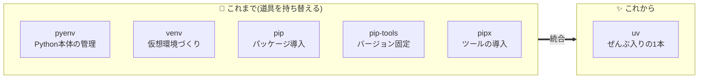
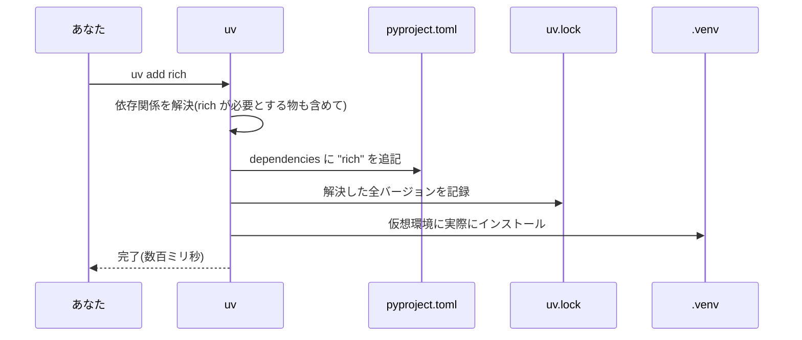
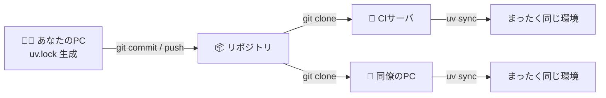
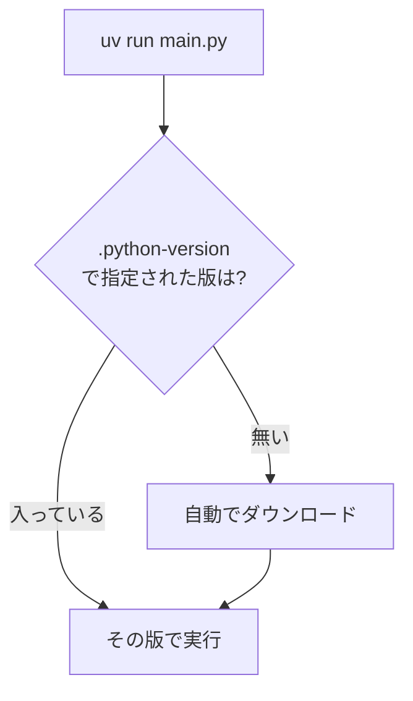

# 番外編 うちの店を最新設備に — uv によるパッケージ管理

## 🏪 番外編のお話

Pythonic Potions は無事に卒業制作(第16章)まで到達しました。
ところが最近、隣町に開いた新しい魔法薬店がうわさになっています。

> 「あの店、道具の仕入れも仮想環境の準備も、**一瞬** で終わるらしいぞ」

正体は **uv** という新しい道具でした。第5章で学んだ `venv` と `pip`、
第16章で書いた `pyproject.toml`、そしてバラバラだった Python 本体の管理――
これらを **1つのコマンド** にまとめ、しかも桁違いに速い、現代の店舗インフラです。

この番外編では、いままで手作業でやってきた「道具箱(仮想環境)づくり」と
「仕入れ(パッケージ管理)」を、uv で一気に自動化します。

> 📌 この章は **第5章(モジュール・venv・pip)** と **第16章(pyproject.toml)** を
> 読んでいる前提で進みます。まだなら先にそちらを覗いてから戻ってきてください。

## uv とは何か — 何を置き換える道具なのか

uv は Rust 製の、**Python プロジェクトのための統合管理ツール** です。
これまで複数の道具を使い分けていた作業を、まるごと引き受けてくれます。



| これまでの道具 | 役割 | uv での対応 |
|---|---|---|
| `pyenv` | Python 本体のバージョン管理 | `uv python install` |
| `python -m venv` | 仮想環境をつくる | 自動(`uv add` で勝手に用意) |
| `pip install` | パッケージを入れる | `uv add` |
| `pip freeze` / `requirements.txt` | バージョンを固定する | `uv.lock`(自動生成) |
| `pipx` | CLIツールを入れて実行 | `uv tool` / `uvx` |

ポイントは **「速さ」と「一貫性」** の2つです。

- **速さ**: 依存解決とダウンロードが Rust 実装で、`pip` の数倍〜数十倍速いことが多い
- **一貫性**: `uv.lock` により「誰の環境でも、CI でも、まったく同じバージョン」を再現できる

## インストール — まずは道具そのものを手に入れる

uv 自身は Python に依存しないので、Python が入っていないマシンにも導入できます。

```bash
# macOS / Linux(公式インストーラ)
curl -LsSf https://astral.sh/uv/install.sh | sh

# Homebrew を使っているなら
brew install uv

# Windows(PowerShell)
# powershell -c "irm https://astral.sh/uv/install.ps1 | iex"
```

入ったか確認します。

```bash
uv --version        # uv 0.x.x のように表示されれば成功
```

> 💡 uv 自体の更新は `uv self update` の一発でできます(インストーラ経由で入れた場合)。

## `uv init` — 新しいお店の区画を用意する

第16章では `pyproject.toml` を手で書きましたが、uv なら雛形ごと生成できます。
新しい店舗「Pythonic Potions(uv 版)」の土台を作ってみましょう。

```bash
uv init pythonic-potions
cd pythonic-potions
```

すると、こんな一式が自動で用意されます。

```
pythonic-potions/
├── .git/                # git 初期化済み
├── .gitignore           # .venv などを無視する設定つき
├── .python-version      # 使う Python のバージョンを固定(例: 3.12)
├── pyproject.toml       # プロジェクトの説明書(第16章のあれ)
├── README.md
└── main.py              # 動作確認用のサンプル
```

生成された `pyproject.toml` は第16章で手書きしたものとほぼ同じ形です。

```toml
[project]
name = "pythonic-potions"
version = "0.1.0"
description = "Add your description here"
readme = "README.md"
requires-python = ">=3.12"
dependencies = []          # ← これから uv add で増えていく
```

まだ何も仕入れていませんが、もう実行できます。

```bash
uv run main.py
# Hello from pythonic-potions!
```

`uv run` は「**必要なら仮想環境を作り、同期し、その中で実行する**」を全部やってくれる
魔法のコマンドです。`source .venv/bin/activate` を打つ必要はもうありません。

## `uv add` — 道具を仕入れる(pip install の後継)

第5章では在庫台帳を彩るために `pip install rich` をしました。uv 版はこうです。

```bash
uv add rich
```

この 1 コマンドで、裏側では次のことがまとめて起きています。



`pyproject.toml` はこう書き換わります。

```toml
dependencies = [
    "rich>=13.0.0",
]
```

第5章の「豪華なメニュー表」を、そのまま uv 環境で動かせます。

```python
# main.py
from rich.table import Table
from rich.console import Console

table = Table(title="🧪 Pythonic Potions 本日のメニュー")
table.add_column("商品名")
table.add_column("価格", justify="right")
table.add_row("回復薬", "50G")
table.add_row("エリクサー", "500G")
Console().print(table)
```

```bash
uv run main.py       # rich が入った環境で実行される
```

道具を返品(削除)したくなったら:

```bash
uv remove rich
```

`pyproject.toml`・`uv.lock`・`.venv` の3つが自動的に、かつ一貫した状態のまま更新されます。
第5章で `pip uninstall` の後に `requirements.txt` を手で直していた手間は、もう不要です。

## `uv.lock` — 「どの店でも同じ味」を保証する仕入れ台帳

第5章では再現用に `pip freeze > requirements.txt` を書き出しました。
uv では **`uv.lock`** がその役割を、より厳密に担います。

`requirements.txt` と `uv.lock` の違いを押さえておきましょう。

| | requirements.txt | uv.lock |
|---|---|---|
| 生成 | 手動(`pip freeze`) | 自動(`uv add` のたびに更新) |
| 記録範囲 | 今の環境に入っている物 | 全依存を解決した完全なグラフ |
| ハッシュ検証 | 基本なし | あり(改ざん・破損を検知) |
| 複数OS対応 | 環境ごとに別物になりがち | 1ファイルで各プラットフォーム分を記録 |
| 手で編集する? | することもある | **しない**(uv が管理) |

`uv.lock` は **git にコミットする** のが鉄則です。これがあれば、同僚も CI サーバも、
半年後のあなた自身も、まったく同じバージョンの魔法薬棚を再現できます。



## `uv sync` — 台帳どおりに道具箱を復元する

他の人のプロジェクトを `git clone` してきたとき、あるいは自分の環境を作り直したいとき。
`uv.lock` に書かれたとおりに `.venv` を再現するのが `uv sync` です。

```bash
git clone <このお店のリポジトリ>
cd pythonic-potions
uv sync            # uv.lock を読んで .venv を寸分違わず再現
uv run main.py     # すぐ動く
```

第5章での「`python -m venv` して `source` して `pip install -r requirements.txt`」という
3ステップが、`uv sync` の 1 コマンドに畳まれました。しかも `.venv` が無ければ自動で作ります。

> 💡 実は `uv run` は毎回こっそり `uv sync` 相当のチェックをしてから実行します。
> つまり `pyproject.toml` を書き換えた直後に `uv run` すれば、環境は自動で追いつきます。

## 開発用の道具 — `--dev` で仕分ける

第16章で `[project.optional-dependencies]` の `dev` に `pytest` や `ruff` を入れました。
uv では **開発用依存(dependency group)** として、より自然に仕分けられます。

```bash
uv add --dev pytest ruff mypy
```

`pyproject.toml` にはこう記録されます。

```toml
[dependency-groups]
dev = [
    "pytest>=8.0.0",
    "ruff>=0.5.0",
    "mypy>=1.10.0",
]
```

**なぜ分けるのか**: `pytest` や `ruff` は開発中にだけ必要で、実際に薬を売る本番環境には
要りません。分けておけば、本番デプロイ時に `uv sync --no-dev` で開発用を除いた
最小構成を作れます。「店を動かす道具」と「店を整備する道具」を仕分けるイメージです。

第16章のテストを、そのまま uv で回せます。

```bash
uv run pytest              # dev グループの pytest が使われる
uv run ruff check .        # リンター
uv run mypy .              # 型チェック(第13章の型ヒントが効いてくる)
```

## `uvx` — 入れずに、その場で道具を使う

「ちょっと `ruff` でコードを整えたいだけ。プロジェクトの依存には加えたくない」
そんなときは `uvx`(= `uv tool run`)を使うと、**インストールせずに一度きり実行** できます。
第16章のコラムで触れた `pipx` の後継にあたります。

```bash
uvx ruff check .           # ruff を一時的に取ってきて実行、終わったら片付ける
uvx ruff format .          # コード整形もその場で
```

逆に「毎日使うから常駐させたい」道具は、プロジェクトとは独立に**グローバル導入**できます。

```bash
uv tool install ruff       # どのディレクトリからでも `ruff` が使える
uv tool list               # 入れたツール一覧
```

`uvx` と `uv tool install` の使い分けはこうです。

| コマンド | いつ使う | 例え |
|---|---|---|
| `uvx <tool>` | たまに1回だけ使う | レンタル工具 |
| `uv tool install <tool>` | 毎日使う定番 | 自前の工具箱に常備 |
| `uv add --dev <tool>` | このプロジェクトの開発に必須 | この店の備品として登録 |

## Python 本体のバージョンも uv が面倒を見る

第5章では「Python 3.10 以上を確認」と書きました。uv は **Python 処理系そのもの** の
ダウンロードと切り替えまで引き受けます(`pyenv` の置き換え)。

```bash
uv python list             # 使える/入っている Python を一覧
uv python install 3.12     # 3.12 を入れる(なければ取ってくる)
```

プロジェクト直下の **`.python-version`** ファイルが「この店で使う Python」を固定します。

```bash
uv python pin 3.12         # .python-version に 3.12 と書き込む
```

以降 `uv run` すると、uv は `.python-version` を読んで、無ければ自動でその版を取ってきて
使ってくれます。「私の PC には 3.10 しか無いから動かない」というトラブルが起きにくくなります。



## 第5章からの引っ越し — requirements.txt を持ち込む

すでに第5章方式(`requirements.txt`)で動いているお店を、uv に移すのも簡単です。

```bash
uv init                        # 既存ディレクトリに pyproject.toml を用意
uv add -r requirements.txt     # requirements の中身を dependencies に取り込む
```

これで `pyproject.toml` + `uv.lock` の現代的な管理に移行できます。
古い `requirements.txt` はもう更新しなくて構いません(必要なら
`uv export --format requirements-txt > requirements.txt` でいつでも書き出せます)。

## よく使うコマンド早見表

これまで学んだ「道具箱」と「仕入れ」の操作を、旧方式と並べてまとめます。

| やりたいこと | 第5章まで(venv + pip) | uv |
|---|---|---|
| プロジェクト開始 | `mkdir` して手で `pyproject.toml` を書く | `uv init` |
| 仮想環境を作る | `python -m venv .venv` | 自動(不要) |
| 仮想環境に入る | `source .venv/bin/activate` | 不要(`uv run`) |
| パッケージ追加 | `pip install rich` | `uv add rich` |
| 開発用に追加 | `pip install pytest` | `uv add --dev pytest` |
| パッケージ削除 | `pip uninstall rich` | `uv remove rich` |
| バージョン固定 | `pip freeze > requirements.txt` | 自動(`uv.lock`) |
| 環境を再現 | `pip install -r requirements.txt` | `uv sync` |
| スクリプト実行 | `python main.py` | `uv run main.py` |
| ツールを1回だけ実行 | (pipx など) | `uvx ruff check .` |
| Python 本体を入れる | pyenv 等 | `uv python install 3.12` |

## 📝 今日の開店準備(演習)

1. **お店を uv 化する**: `uv init pythonic-potions-uv` で新しい区画を作り、
   `uv add rich` を実行してから、第5章の「豪華なメニュー表」コードを `uv run` で動かしてください。
2. **開発道具をそろえる**: `uv add --dev pytest` を実行し、第16章の `test_potion.py` を
   `tests/` に置いて `uv run pytest` が通ることを確認してください。
3. **一貫性を体験する**: 生成された `uv.lock` を眺めて、`rich` が依存している別の
   パッケージ(例: `markdown-it-py` や `pygments`)まで記録されていることを確認しましょう。
   その後 `.venv` フォルダを丸ごと削除 → `uv sync` で一瞬で復元されることを試してください。
4. **その場実行を試す**: `uvx ruff check .` を走らせ、自分のコードに指摘が出るか見てみましょう
   (プロジェクトの依存には `ruff` を加えずに実行できている点がポイントです)。

---

これで Pythonic Potions は、看板 1 枚(第1章)から始まり、
テスト付きの完成品(第16章)を経て、**最新設備で運営される現代のお店** になりました。

道具の進化はこれからも続きます。大事なのは「なぜその道具が要るのか」――
第5章で **仮想環境がなぜ必要か**(バージョン衝突を防ぐため)を理解していれば、
uv のような新しい道具が出てきても、その価値をすぐに見抜けます。
仕組みを理解した店主は、道具が変わっても強いのです。🧪✨

[← 目次に戻る](../README.md)
