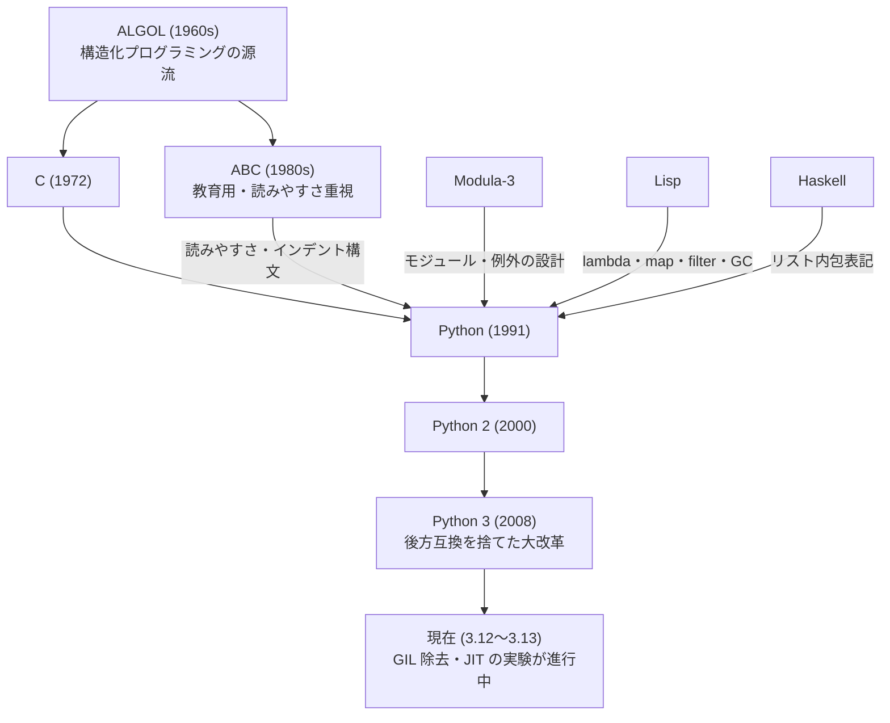
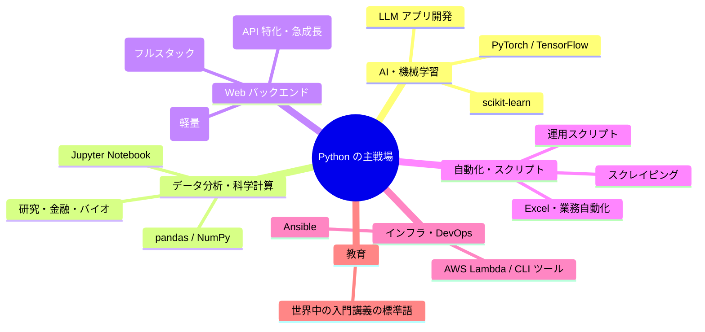

# 🐍 Python という言語 — 系譜・思想・強み・弱みの全体像

この章は文法の解説ではなく、**「Python とはどういう言語で、なぜ世界中で使われ、どこで嫌われているのか」** を俯瞰するための読み物です。教材本編(chapters)に入る前でも、一通り学び終えた後でも読めます。

---

## 1. 生い立ちと系譜

Python は 1991 年、オランダの **グイド・ヴァンロッサム(Guido van Rossum)** が公開しました。名前の由来はヘビではなく、英国のコメディ番組「空飛ぶモンティ・パイソン」です。

グイドは当時、教育用言語 **ABC** の開発に関わっていました。ABC は「初心者に優しい」ことを徹底した言語でしたが、拡張性がなく実用に耐えませんでした。Python は「**ABC の読みやすさ + 実用言語の拡張性**」を狙って生まれた言語です。



### 歴史の転換点

| 年 | 出来事 | 意味 |
|---|---|---|
| 1991 | Python 0.9 公開 | 誕生 |
| 2000 | Python 2.0 | GC・Unicode 対応、普及期へ |
| 2008 | Python 3.0 | **後方互換性を捨てる**という異例の決断 |
| 2008〜2020 | Python 2/3 分裂時代 | コミュニティが約 12 年苦しんだ移行期 |
| 2012〜 | データサイエンスブーム | NumPy / pandas / Jupyter で科学計算の標準に |
| 2015〜 | 機械学習ブーム | TensorFlow / PyTorch が Python を選んだ |
| 2018 | グイドが BDFL を引退 | 「終身の優しい独裁者」から Steering Council 体制へ |
| 2022〜 | AI ブーム | LLM 時代のデファクト言語に |
| 2023〜 | 高速化の時代 | Faster CPython 計画、GIL 除去(PEP 703)が承認 |

---

## 2. 設計思想 — 「The Zen of Python」

Python には言語に組み込まれた思想文書があります。`python -c "import this"` で表示される **The Zen of Python** です。抜粋:

> - Beautiful is better than ugly.(醜いより美しい方がいい)
> - Explicit is better than implicit.(暗黙より明示的な方がいい)
> - Simple is better than complex.(複雑より単純な方がいい)
> - Readability counts.(**読みやすさは重要だ**)
> - There should be one—and preferably only one—obvious way to do it.(やり方は一つ、明白な一つだけがあるべきだ)

最後の一文は Perl の標語「やり方は一つじゃない(TMTOWTDI)」への意図的なカウンターです。Python は **「書く時間より読む時間の方が長い」** という現実に最適化された言語だと言えます。

---

## 3. 言語としての特徴

### 3.1 インデントが構文である

Python 最大の見た目上の特徴です。`{}` や `end` の代わりに、**字下げそのものがブロック構造**を表します。

```python
if stock > 0:
    sell_potion()      # インデントされた部分がブロック
    stock -= 1
print("done")          # インデントが戻る = ブロック終了
```

賛否両論ありますが、「誰が書いても同じ見た目になる」効果は絶大で、後発の多くの言語がフォーマッタ(gofmt, prettier)で同じ結果を追いかけています。

### 3.2 動的型付け + 漸進的型付け

変数に型宣言は不要で、実行時に型が決まります(動的型付け)。一方 2015 年以降は **型ヒント**(教材第 13 章)が導入され、「書きたい人・書くべき場所だけ型を書く」**漸進的型付け(gradual typing)** の道を選びました。

```python
def price(name):              # 昔ながらの Python
def price(name: str) -> int:  # 型ヒント付き — 実行時には無視され、mypy 等の外部ツールが検査する
```

型ヒントは**実行時に強制されない**のがポイントです。あくまで静的解析ツールと人間のためのドキュメントです。

### 3.3 すべてがオブジェクト

整数も関数もクラスもモジュールも、すべてがオブジェクトです。だから関数を変数に代入したり、引数に渡したり(デコレータ、教材第 11 章)、クラスを実行時に生成したり(メタクラス、第 15 章)できます。この一貫性が Python の柔軟さの源泉です。

### 3.4 「電池同梱(Batteries Included)」

標準ライブラリが非常に充実しています。JSON、HTTP、正規表現、SQLite、圧縮、メール、テスト(unittest)まで、インストール直後から使えます。

### 3.5 グルー言語としての性格

Python 本体(CPython)は C で書かれており、**C/C++/Rust/Fortran のコードを簡単に呼び出せます**。NumPy や PyTorch が速いのは、重い計算を C/CUDA 側で行い、Python は「接着剤(グルー)」として指揮を執っているからです。「Python は遅いのに機械学習で使われる」というパラドックスの答えがこれです。

---

## 4. Python の特異な点(他言語経験者が驚くところ)

| 特異な点 | 説明 |
|---|---|
| **GIL(グローバルインタプリタロック)** | 1 プロセス内で同時に Python バイトコードを実行できるスレッドは 1 つだけ。マルチコアを活かすには `multiprocessing` や C 拡張が必要。※ PEP 703 で除去が進行中 |
| **ダンダーメソッド** | `__init__` `__len__` `__enter__` など、`+` や `len()` や `with` の挙動を「約束された名前のメソッド」で定義するプロトコル文化(教材第 9 章) |
| **デフォルト引数は 1 回だけ評価される** | `def f(x, items=[])` と書くと、リストが全呼び出しで共有される有名な罠 |
| **ホワイトスペースに意味がある** | タブとスペースの混在はエラー。エディタ設定が事実上の言語仕様の一部 |
| **リスト内包表記** | `[x * 2 for x in items if x > 0]` — ループより宣言的な変換構文が慣用 |
| **duck typing** | 「アヒルのように鳴けばアヒル」— 型ではなく振る舞いでオブジェクトを扱う文化 |
| **REPL・Jupyter 文化** | 対話環境で試しながら書くワークフローが第一級市民 |
| **`self` を明示的に書く** | メソッドの第 1 引数に必ず `self` を書く。「Explicit is better than implicit」の現れ |

---

## 5. どういうシステムでよく使われるか



### 得意な領域

- **AI・機械学習・データサイエンス** — 事実上の独占状態。研究論文のコードはほぼ Python です。
- **Web API バックエンド** — Instagram(Django)、多くのスタートアップ(FastAPI)。開発速度が武器。
- **自動化・スクリプティング** — 「ちょっとしたツール」を書く速さは随一。シェルスクリプトの上位互換として。
- **教育** — 構文ノイズが少なく、初学者が「プログラミングの概念」に集中できる。

### 不得意な領域

- **モバイルアプリ、フロントエンド** — ほぼ出番なし。
- **OS・組み込み・リアルタイム処理** — 速度とメモリの制約で不向き(MicroPython という例外はある)。
- **単一バイナリで配布する CLI ツール** — 配布が苦手(後述)。この領域は Go や Rust に流れた。

---

## 6. 課題と「嫌われている点」

言語を選ぶには、賞賛より批判を知る方が役に立ちます。よく聞く批判を正直に並べます。

### 6.1 遅い

CPython はインタプリタ実行で、数値計算のループを素の Python で書くと C の 50〜100 倍遅いことも珍しくありません。**反論**: 実務では NumPy 等の C 実装に処理を逃がすため問題にならない場面が多く、また Faster CPython 計画で 3.11 以降は着実に高速化しています。それでも「言語自体は遅い」のは事実です。

### 6.2 GIL — マルチコア時代の足かせ

CPU バウンドな処理をスレッドで並列化しても速くなりません。回避策(`multiprocessing`)はプロセス間通信のコストを伴います。PEP 703(free-threaded Python)で除去が進んでいますが、エコシステム全体の対応には年単位の時間がかかる見込みです。

### 6.3 パッケージ管理・環境構築の混沌

**おそらく最も恨まれているポイント**です。`pip` / `venv` / `virtualenv` / `pyenv` / `conda` / `poetry` / `pipenv` / `uv` … と、ツールが乱立してきました。「Python 環境構築 わからない」は初心者離脱の定番です。有名な風刺画(xkcd #1987「Python 環境は破滅的な混沌」)があるほどです。

> **現在の潮流**: Rust 製の **uv** が高速さと一貫性で急速に支持を集めており、混沌が収束に向かう兆しはあります。

### 6.4 動的型付けの負債

小さなスクリプトでは快適ですが、数十万行の規模になると「この関数、何を渡せば何が返るのか」が分からず、リファクタリングが怖くなります。実行するまで型エラーに気づけません。型ヒント + mypy で緩和できますが、後付けであるがゆえに型システムの表現力や一貫性には限界があります。

### 6.5 デプロイ・配布のつらさ

Go のような単一バイナリを作れず、実行環境に「正しいバージョンの Python + 依存ライブラリ一式」が必要です。Docker で解決するのが定番ですが、「スクリプトを渡すだけ」ができないのは明確な弱点です。

### 6.6 Python 2 → 3 移行の傷跡

後方互換性を壊した移行に約 12 年かかり、コミュニティは深く疲弊しました。この経験から Python は互換性破壊に極めて慎重になり、逆に「古い設計を捨てられない」制約にもなっています。

### 6.7 その他よく聞く不満

- **ラムダが 1 行しか書けない** — 関数型スタイル好きには物足りない
- **インデント構文が嫌い** — コピペや深いネストで事故る、という派閥は常に存在する
- **実行時まで typo に気づけない** — `respose` と書いてもエラーにならず実行時に `NameError`
- **モバイル・ブラウザで動かない** — 学んだ言語がスマホアプリに使えない失望

---

## 7. まとめ — Python はどういう言語か

一言でいえば、**「人間の時間を最適化する言語」** です。

- 読み書きが速く、思考を邪魔しない → プロトタイピング・研究・自動化で最強
- 実行速度・並列性・配布は弱点 → 重い処理は C/Rust に任せる「指揮者」として使う
- AI 時代の共通語になったため、**今後 10 年、需要が消える心配がほぼない**言語でもあります

隣のフォルダの Go(`03-go-fable-101/language-overview/`)は、Python の弱点(速度・並列・配布)をちょうど裏返したような言語です。読み比べると、それぞれの設計判断がより立体的に見えてきます。
