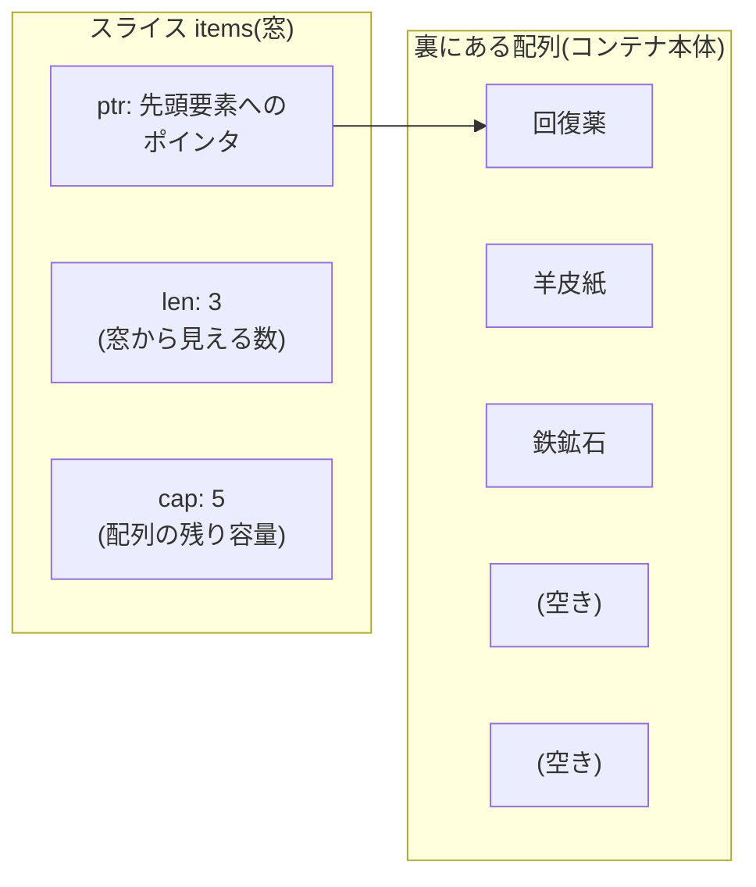

# 第4章 荷物コンテナ — 配列とスライス

## 🚇 今日のお話

荷物をまとめて運ぶコンテナを導入します。Go でそれに当たるのが **スライス** です。
見た目は Python のリストそっくりですが、**中身の仕組みはまったく違います**。

この章は本教材で最初の「本気の落とし穴」章です。スライスの事故は Go 入門者が
ほぼ全員踏むので、**なぜそう動くのか** を仕組みから理解しましょう。

## まず配列 — サイズ固定の棚

```go
var shelf [4]string // 4 マスの棚。サイズは型の一部!
shelf[0] = "回復薬"
fmt.Println(len(shelf)) // 4
```

`[4]string` と `[5]string` は **別の型** です。配列は代入や関数渡しで **全要素がコピー** されます。
サイズ固定で融通が利かないため、日常で直接使うことはまれです。
しかし配列は次のスライスの土台なので、存在だけ覚えてください。

## スライス — コンテナの「窓」

```go
items := []string{"回復薬", "羊皮紙", "鉄鉱石"} // サイズを書かなければスライス

items = append(items, "ドラゴンの鱗") // 要素の追加は append(再代入が必要!)
fmt.Println(items[0], len(items))     // 回復薬 4
fmt.Println(items[1:3])               // [羊皮紙 鉄鉱石](Python 同様、末尾は含まない)
```

ここまでは Python のリストと同じ感覚で使えます。違いが出るのはここからです。

### スライスの正体 — 3 つの値の小さなセット

スライスの実体は **「配列のどこかを指す窓」** で、中身はたった 3 つです。



- `len`: 今見えている要素数
- `cap`: 窓の先頭から配列の端までの容量(`cap(items)` で確認できる)

**スライスをコピーしても、窓が 2 枚になるだけで、裏の配列は 1 つのまま** です。
ここからすべての落とし穴が生まれます。

> 🐍 **Python との違い①: スライス操作はコピーではない**
> Python の `items[1:3]` は **新しいリスト**(浅いコピー)を作りました。
> Go の `items[1:3]` は **同じ配列を指す別の窓** を作るだけです。
> コピーのつもりで切り出して書き換えると、元のデータも変わります。

## ⚠️ 落とし穴①: 切り出した窓は本体とつながっている

```go
all := []int{10, 20, 30, 40}
firstHalf := all[:2] // 窓を切り出しただけ

firstHalf[0] = 999
fmt.Println(all) // [999 20 30 40] ← 元も変わった!
```

独立したコピーが欲しいときは `copy` か、Go 1.21 以降なら `slices.Clone` を使います。

```go
import "slices"
mine := slices.Clone(all[:2]) // 独立したコピー
```

## append の仕組み — 落とし穴②の理由

`append` は容量に空きがあれば **裏の配列にそのまま書き**、
空きがなければ **より大きい配列を新調して全部引っ越し** ます。

```go
a := []int{1, 2, 3, 4}
b := a[:2]         // len=2, cap=4(裏の配列は共有)

b = append(b, 99)  // cap に空きがある → a[2] の場所に 99 を書く!
fmt.Println(a)     // [1 2 99 4] ← a が壊れた

b = append(b, 5, 6, 7) // cap を超えた → b は新しい配列に引っ越し
b[0] = 777
fmt.Println(a)     // [1 2 99 4] ← 今度は a に影響しない
```

**「共有されるかどうかが容量次第で変わる」** のが最悪の点で、
テストでは動くのに本番データで壊れる、という事故を起こします。

> 🔍 **なぜそうなっているの? — なぜこんな危険な設計に?**
> Go はシステムプログラミング言語として **「暗黙の重い処理をしない」** ことを
> 重視します。切り出しのたびにコピーすれば安全ですが、巨大データの一部を
> 参照するだけで毎回メモリ確保が走ることになります。Go は
> 「デフォルトは高速な窓、コピーが欲しければ明示的に `copy`」を選びました。
> Python が「デフォルトは安全なコピー、性能が欲しければ `memoryview`」と
> 逆の選択をしたのと対照的です。どちらが正しいというより、**言語が誰の何を
> 優先しているか** の違いです。
>
> なお `append` が伸長時に容量を約 2 倍(大きくなると約 1.25 倍)ずつ増やすのは
> Python のリストと同じ「ならし O(1)」戦略です。ここは両者共通の教養です。

### 防衛術: 三値スライス式

どうしても切り出しを渡したいが、相手の `append` で自分の後続要素を壊されたくない——
そんなときは第 3 の添字で **容量を切り詰め** ます。

```go
b := a[:2:2] // len=2, cap=2。append すると必ず引っ越しになる
```

## ⚠️ 落とし穴③: `append` の戻り値を受け取り忘れる

```go
append(items, "新しい荷物")         // ← コンパイルエラー(戻り値未使用)
items = append(items, "新しい荷物") // ✅ 正しい形
```

引っ越しが起きるとスライスの窓(ptr/len/cap)自体が変わるため、
`append` は **新しい窓を返す** 設計です。必ず再代入します。
Python の `list.append` が本体を直接変更した(そして `None` を返した)のと逆です。

## nil スライスは「空」として使える

```go
var queue []string          // ゼロ値は nil
fmt.Println(len(queue))     // 0 (nil でも len は安全)
queue = append(queue, "荷") // nil への append も OK
for range queue {}          // nil への range も OK
```

> 🐍 Python なら `None` に対する `len()` や `append` は即エラーでした。
> Go では **nil スライスは要素ゼロの正常なスライス** として振る舞うよう
> 各操作が定義されています。第1章の「ゼロ値のまま使える設計」の実例です。
> `queue == nil` と「空だが nil ではないスライス `[]string{}`」の区別が問題になるのは
> ほぼ JSON 出力(`null` vs `[]`)のときだけです(第14章)。

## make — 容量を先に確保する

要素数の見当がつくなら、先に容量を確保すると引っ越しが起きず高速です。

```go
manifest := make([]string, 0, 100) // len=0, cap=100
for i := 0; i < 100; i++ {
	manifest = append(manifest, fmt.Sprintf("荷物%d", i)) // 引っ越しゼロ
}
```

`make([]string, 100)` (len=100)との違いに注意してください。こちらは
「ゼロ値が 100 個詰まったスライス」で、append すると 101 個目に追加されます。

## よく使う操作対応表

| やりたいこと | Python | Go |
|---|---|---|
| 追加 | `xs.append(x)` | `xs = append(xs, x)` |
| 連結 | `xs + ys` | `xs = append(xs, ys...)` |
| コピー | `xs[:]` / `list(xs)` | `slices.Clone(xs)` |
| 含むか | `x in xs` | `slices.Contains(xs, x)` |
| ソート | `xs.sort()` | `slices.Sort(xs)` |
| 逆順 | `xs.reverse()` | `slices.Reverse(xs)` |
| 内包表記 | `[f(x) for x in xs]` | for ループで書く |

Go 1.21 で入った `slices` パッケージが Python の list メソッドの穴をかなり埋めました。
古い記事では手書きループで実装されていることが多いです。

## 🚇 完成コード: `express/day4/main.go`

```go
// Gopher Express — コンテナ管理
package main

import (
	"fmt"
	"slices"
)

func main() {
	// 今日の積み荷(容量を見込んで確保)
	container := make([]string, 0, 8)
	container = append(container, "回復薬", "羊皮紙", "鉄鉱石", "ドラゴンの鱗")

	// 前半 2 個を速達便に載せ替える —— 独立コピーで安全に
	express := slices.Clone(container[:2])
	express[0] = "回復薬(速達)"

	fmt.Println("通常便:", container) // 元は無傷
	fmt.Println("速達便:", express)
	fmt.Printf("コンテナ使用率: %d/%d\n", len(container), cap(container))

	if slices.Contains(container, "ドラゴンの鱗") {
		fmt.Println("⚠️ 危険物あり: 貨物トンネル指定")
	}
}
```

## 📝 今日の配達訓練(演習)

1. `a := []int{1, 2, 3, 4, 5}` から `b := a[1:3]` を切り出し、`len(b)` と `cap(b)` を
   予想してから印字してください(cap は窓の先頭から数えることに注意)。
2. 落とし穴②を自分で再現してください: `b` に append して `a` が壊れる状態と、
   壊れない状態(引っ越し後)の両方を作り、`&b[0]` のアドレス表示で引っ越しを観察しましょう。
3. Python の内包表記 `[w * 2 for w in weights if w > 5]` に相当する処理を
   Go の for ループ + `make` で書いてください。

---

コンテナはできましたが、「伝票番号 GX-0042 の荷物はどれ?」と聞かれるたびに
コンテナを頭から探すのは非効率です。**検索できる台帳** と **荷物カルテ** を
作りましょう。 → [第5章 宛先台帳と荷物カルテ](05_maps_structs.md)
