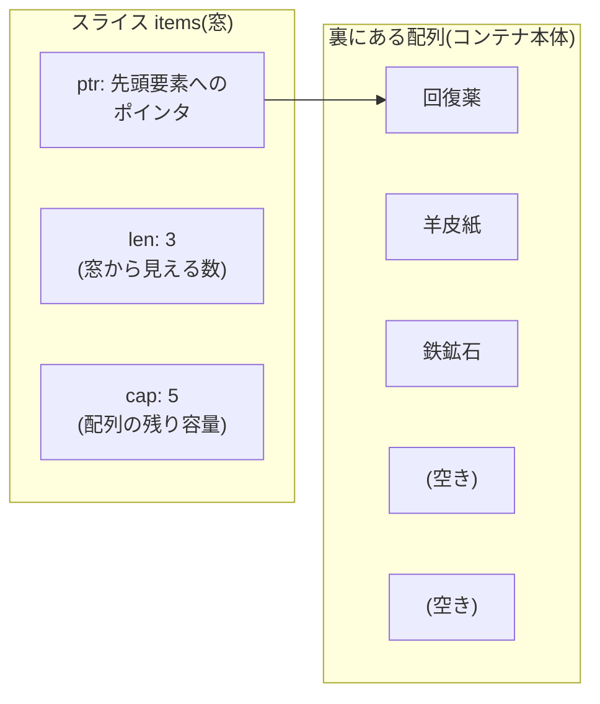
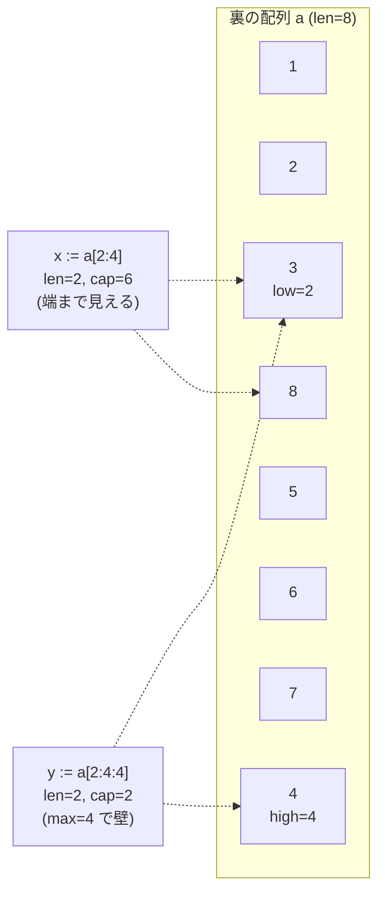

# 第4章 荷物コンテナ — 配列とスライス

## 🚇 今日のお話

荷物をまとめて運ぶコンテナを導入します。Go でそれに当たるのが **スライス** です。
見た目は Python のリストそっくりですが、**中身の仕組みはまったく違います**。

この章は本教材で最初の「本気の落とし穴」章です。スライスの事故は Go 入門者が
ほぼ全員踏むので、**なぜそう動くのか** を仕組みから理解しましょう。

> 🐍 **Python との違い⓪: そもそも「配列」と「リスト」は別物**
> これから Go の **配列** と **スライス** という 2 つの型が出てきますが、
> Python の `list` に近いのはこのうち **スライスの方** です。
> Python の list は中身が増えるたびに裏で自動的に大きい領域を確保し直す
> 「可変長の動的配列」で、これは Go の `slice`(と `append` の仕組み、後述)と
> ほぼ同じ発想です。一方 Go の配列は **サイズが型の一部として固定** され、
> 代入すると全要素がコピーされるという、Python の list には無い挙動をします。
> 日常のコードではほぼ使いません。迷ったら
> 「**Python の list 感覚で書きたいなら Go では slice を使う**」と覚えてください。

## まず配列 — サイズ固定の棚

```go
var shelf [4]string // 4 マスの棚。サイズは型の一部!
shelf[0] = "回復薬"
fmt.Println(len(shelf)) // 4
```

`[4]string` と `[5]string` は **別の型** です。配列は代入や関数渡しで **全要素がコピー** されます。
サイズ固定で融通が利かないため、日常で直接使うことはまれです。
しかし配列は次のスライスの土台なので、存在だけ覚えてください。

## スライス — コンテナの「窓」

```go
items := []string{"回復薬", "羊皮紙", "鉄鉱石"} // サイズを書かなければスライス

items = append(items, "ドラゴンの鱗") // 要素の追加は append(再代入が必要!)
fmt.Println(items[0], len(items))     // 回復薬 4
fmt.Println(items[1:3])               // [羊皮紙 鉄鉱石](Python 同様、末尾は含まない)
```

ここまでは Python のリストと同じ感覚で使えます。違いが出るのはここからです。

### スライスの正体 — 3 つの値の小さなセット

スライスの実体は **「配列のどこかを指す窓」** で、中身はたった 3 つです。


```mermaid
flowchart LR
    subgraph スライス["スライス items(窓)"]
        P["ptr: 先頭要素への<br/>ポインタ"]
        L["len: 3<br/>(窓から見える数)"]
        C["cap: 5<br/>(配列の残り容量)"]
    end
    subgraph 配列["裏にある配列(コンテナ本体)"]
        A0["回復薬"]
        A1["羊皮紙"]
        A2["鉄鉱石"]
        A3["(空き)"]
        A4["(空き)"]
    end
    P --> A0
```

- `len`: 今見えている要素数
- `cap`: 窓の先頭から配列の端までの容量(`cap(items)` で確認できる)

**スライスをコピーしても、窓が 2 枚になるだけで、裏の配列は 1 つのまま** です。
ここからすべての落とし穴が生まれます。

> 🐍 **Python との違い①: スライス操作はコピーではない**
> Python の `items[1:3]` は **新しいリスト**(浅いコピー)を作りました。
> Go の `items[1:3]` は **同じ配列を指す別の窓** を作るだけです。
> コピーのつもりで切り出して書き換えると、元のデータも変わります。

## ⚠️ 落とし穴①: 切り出した窓は本体とつながっている

```go
all := []int{10, 20, 30, 40}
firstHalf := all[:2] // 窓を切り出しただけ

firstHalf[0] = 999
fmt.Println(all) // [999 20 30 40] ← 元も変わった!
```

独立したコピーが欲しいときは `copy` か、Go 1.21 以降なら `slices.Clone` を使います。

```go
import "slices"
mine := slices.Clone(all[:2]) // 独立したコピー
```

## append の仕組み — 落とし穴②の理由

`append` は容量に空きがあれば **裏の配列にそのまま書き**、
空きがなければ **より大きい配列を新調して全部引っ越し** ます。

```go
a := []int{1, 2, 3, 4}
b := a[:2]         // len=2, cap=4(裏の配列は共有)

b = append(b, 99)  // cap に空きがある → a[2] の場所に 99 を書く!
fmt.Println(a)     // [1 2 99 4] ← a が壊れた

b = append(b, 5, 6, 7) // cap を超えた → b は新しい配列に引っ越し
b[0] = 777
fmt.Println(a)     // [1 2 99 4] ← 今度は a に影響しない
```

**「共有されるかどうかが容量次第で変わる」** のが最悪の点で、
テストでは動くのに本番データで壊れる、という事故を起こします。

> 🔍 **なぜそうなっているの? — なぜこんな危険な設計に?**
> Go はシステムプログラミング言語として **「暗黙の重い処理をしない」** ことを
> 重視します。切り出しのたびにコピーすれば安全ですが、巨大データの一部を
> 参照するだけで毎回メモリ確保が走ることになります。Go は
> 「デフォルトは高速な窓、コピーが欲しければ明示的に `copy`」を選びました。
> Python が「デフォルトは安全なコピー、性能が欲しければ `memoryview`」と
> 逆の選択をしたのと対照的です。どちらが正しいというより、**言語が誰の何を
> 優先しているか** の違いです。
>
> なお `append` が伸長時に容量を約 2 倍(大きくなると約 1.25 倍)ずつ増やすのは
> Python のリストと同じ「ならし O(1)」戦略です。ここは両者共通の教養です。

### 防衛術: 三値スライス式

どうしても切り出しを渡したいが、相手の `append` で自分の後続要素を壊されたくない——
そんなときは第 3 の添字で **容量を切り詰め** ます。

```go
b := a[:2:2] // len=2, cap=2。append すると必ず引っ越しになる
```

#### 構文: `a[low:high:max]`

まず土台になる配列を用意します。添字(インデックス)を数字で振っておきます。

```go
//        0  1  2  3  4  5  6  7   ← 添字
a := []int{1, 2, 3, 4, 5, 6, 7, 8} // len=8, cap=8
```

**いつもの `a[low:high]`(2 値)** から始めましょう。`a[2:4]` は
「添字 2 から 4 の手前まで」なので中身は `3, 4` の 2 個です。

```go
x := a[2:4]
fmt.Println(x)          // [3 4]
fmt.Println(len(x))     // 2  → high(4) - low(2) = 2
fmt.Println(cap(x))     // 6  → len(a)(8) - low(2) = 6
```

`cap` が 6 になるのは、**「配列の端(添字 7)まで、まだ触れる余地がある」**
からです。実際 `x` を `append` すれば添字 4,5,6,7 まで書き込めてしまいます
(=元の `a` の 5〜8 番目を壊せてしまう、という落とし穴②の状態)。

**ここに `max` を追加したのが 3 値スライス式** `a[low:high:max]` です。
`low` と `high` の意味はそのまま、`max` は「`cap` の計算に使う上限」を
別の値に差し替える役目だけを持ちます。

```go
y := a[2:4:4] // low=2, high=4, max=4
fmt.Println(y)          // [3 4]  ← 中身は x と同じ
fmt.Println(len(y))     // 2  → high(4) - low(2) = 2 (変化なし)
fmt.Println(cap(y))     // 2  → max(4) - low(2) = 2 (6 から絞られた!)
```

つまり `x := a[2:4]` と `y := a[2:4:4]` は **見えている中身は同じ `[3 4]`**
なのに、`cap` だけが 6 と 2 で違います。`max` の値を変えると `cap` も
連動して変わることを確認してください。

```go
z := a[2:4:5] // max=5 → cap = 5-2 = 3(添字4だけ余分に確保)
fmt.Println(cap(z)) // 3
```


```mermaid
flowchart LR
    subgraph 配列["裏の配列 a (len=8)"]
        A0["1"]
        A1["2"]
        A2["3<br/>low=2"]
        A3["4<br/>high=4"]
        A4["5"]
        A5["6"]
        A6["7"]
        A7["8"]
    end
    x["x := a[2:4]<br/>len=2, cap=6<br/>(端まで見える)"] -.-> A2
    x -.-> A7
    y["y := a[2:4:4]<br/>len=2, cap=2<br/>(max=4 で壁)"] -.-> A2
    y -.-> A3
```

#### なぜこれで安全になるのか

`append` は「`cap` に空きがあるか」だけを見て、空きがなければ新しい配列に
引っ越すのでした(落とし穴②)。`max` で `cap` を `len` と同じ値まで
切り詰めておけば、**空きが 0 になる** ので `append` は必ず引っ越しを選び、
裏の配列(の続き)を書き換える余地がなくなります。

```go
a := []int{1, 2, 3, 4, 5, 6, 7, 8}
y := a[2:4:4]        // len=2, cap=2 → 空きゼロ

y = append(y, 999)   // cap 超過 → 新しい配列へ強制引っ越し
fmt.Println(a)       // [1 2 3 4 5 6 7 8] ← a はノータッチ
fmt.Println(y)       // [3 4 999]
```

`max` には「ここから先は他人に触らせない」という **境界線** の意味があると
考えると理解しやすいです。関数の引数として一部だけ渡すときによく使う形です。

```go
func processHead(items []string) {
    items = append(items, "追加") // 呼び出し元は関係ないはず
}

// 呼び出し側: 後続要素(cap の余り)を守りたい
processHead(container[:2:2]) // これなら container[2] 以降は絶対に汚されない
```

> 🐍 Python にこれに相当する構文はありません。`items[1:3]` は常に新しい
> リストを作るので、そもそも裏の配列を共有する心配自体が存在しないからです。
> 三値スライス式は「窓によるコピー回避」という Go 特有の設計が生む、
> Go 特有の防御策です。

普段のコードで多用するものではありませんが、**共有ライブラリの API に
スライスを渡す**、**並行処理で複数 goroutine に同じ配列の別領域を渡す**
といった「信頼できない相手に窓を渡す」場面では、この一手が事故を防ぎます。

## ⚠️ 落とし穴③: `append` の戻り値を受け取り忘れる

```go
append(items, "新しい荷物")         // ← コンパイルエラー(戻り値未使用)
items = append(items, "新しい荷物") // ✅ 正しい形
```

引っ越しが起きるとスライスの窓(ptr/len/cap)自体が変わるため、
`append` は **新しい窓を返す** 設計です。必ず再代入します。
Python の `list.append` が本体を直接変更した(そして `None` を返した)のと逆です。

## nil スライスは「空」として使える

```go
var queue []string          // ゼロ値は nil
fmt.Println(len(queue))     // 0 (nil でも len は安全)
queue = append(queue, "荷") // nil への append も OK
for range queue {}          // nil への range も OK
```

> 🐍 Python なら `None` に対する `len()` や `append` は即エラーでした。
> Go では **nil スライスは要素ゼロの正常なスライス** として振る舞うよう
> 各操作が定義されています。第1章の「ゼロ値のまま使える設計」の実例です。
> `queue == nil` と「空だが nil ではないスライス `[]string{}`」の区別が問題になるのは
> ほぼ JSON 出力(`null` vs `[]`)のときだけです(第14章)。

## make — 容量を先に確保する

要素数の見当がつくなら、先に容量を確保すると引っ越しが起きず高速です。

```go
manifest := make([]string, 0, 100) // len=0, cap=100
for i := 0; i < 100; i++ {
	manifest = append(manifest, fmt.Sprintf("荷物%d", i)) // 引っ越しゼロ
}
```

`make([]string, 100)` (len=100)との違いに注意してください。こちらは
「ゼロ値が 100 個詰まったスライス」で、append すると 101 個目に追加されます。

### 引っ越しはどれくらい遅いのか

`append` は容量が足りなくなると **約2倍**(大きくなると約1.25倍)ずつ拡張します。
この「倍々ゲーム」のおかげで、N回 append したときの引っ越し回数は `log₂(N)` 回
程度で済み、コピー総量を全部足しても `1+2+4+8+...+N ≈ 2N` 程度に収まります。
つまり全体では O(N) ――1回あたりに均せば O(1) の「ならし(amortized)O(1)」です。

とはいえ Big-O 上は問題なくても、実務のホットパスでは以下の定数倍コストが
効いてきます。

1. **メモリコピー(memmove)のコスト**: 引っ越しのたびに既存要素を
   全部新しい配列へコピーします。要素数が多い・要素サイズが大きい
   (構造体のスライスなど)ほど無視できません。
2. **GC 負荷**: 古い裏配列はゴミになり、GC の回収対象が増えます。
3. **メモリの瞬間的な2倍化**: 引っ越しの瞬間だけ、旧配列と新配列が
   両方メモリ上に存在します。巨大なスライスだと一時的にメモリ使用量が跳ねます。

件数が事前に分かっているなら `make([]T, 0, N)` で最初から確保しておけば、
引っ越し回数がゼロになり、これらのコストを丸ごと避けられます。

```go
// 引っ越しが起きるケース: 10万件で十数回の再確保とコピーが発生
var withoutPrealloc []int
for i := 0; i < 100000; i++ {
	withoutPrealloc = append(withoutPrealloc, i)
}

// 引っ越しゼロ: 確保は1回だけ
withPrealloc := make([]int, 0, 100000)
for i := 0; i < 100000; i++ {
	withPrealloc = append(withPrealloc, i)
}
```

実測では後者の方が数倍〜十倍程度速くなることも珍しくありません
(要素数やベンチマーク環境次第)。「Big-O は変わらないが定数倍で
確実に得をする」という理解が正確です。

### 実務での使いどころ

一番よく使うのは、**入力と同じ件数になることが確実な変換・フィルタ処理**です。
DB から取ってきた行を API 用の DTO に詰め替える、というのが典型例です。

```go
type User struct {
	ID   int
	Name string
}

type UserDTO struct {
	ID   int    `json:"id"`
	Name string `json:"name"`
}

func toDTOs(users []User) []UserDTO {
	dtos := make([]UserDTO, 0, len(users)) // 件数が分かっているので引っ越しゼロ
	for _, u := range users {
		dtos = append(dtos, UserDTO{ID: u.ID, Name: u.Name})
	}
	return dtos
}
```

他にも、並列処理(goroutine)の結果を集約するとき(ジョブ数 = 結果の件数)や、
ページネーションで1ページ分の件数が固定のときなどが同じパターンです。

```go
func fetchAll(urls []string) []Result {
	results := make([]Result, 0, len(urls))
	ch := make(chan Result, len(urls))

	for _, u := range urls {
		go func(u string) { ch <- fetch(u) }(u)
	}
	for range urls {
		results = append(results, <-ch)
	}
	return results
}
```

**判断基準はシンプル** です。件数が `len(input)` や定数として事前に分かるなら
迷わず `make(..., 0, N)`。フィルタで絞り込むなど件数が読めない場合は、
無理に見積もらず素直に `append` すれば十分です(Go の倍々拡張は十分速い)。

## よく使う操作対応表

| やりたいこと | Python | Go |
|---|---|---|
| 追加 | `xs.append(x)` | `xs = append(xs, x)` |
| 連結 | `xs + ys` | `xs = append(xs, ys...)` |
| コピー | `xs[:]` / `list(xs)` | `slices.Clone(xs)` |
| 含むか | `x in xs` | `slices.Contains(xs, x)` |
| ソート | `xs.sort()` | `slices.Sort(xs)` |
| 逆順 | `xs.reverse()` | `slices.Reverse(xs)` |
| 内包表記 | `[f(x) for x in xs]` | for ループで書く |

Go 1.21 で入った `slices` パッケージが Python の list メソッドの穴をかなり埋めました。
古い記事では手書きループで実装されていることが多いです。

## 🚇 完成コード: `express/day4/main.go`

```go
// Gopher Express — コンテナ管理
package main

import (
	"fmt"
	"slices"
)

func main() {
	// 今日の積み荷(容量を見込んで確保)
	container := make([]string, 0, 8)
	container = append(container, "回復薬", "羊皮紙", "鉄鉱石", "ドラゴンの鱗")

	// 前半 2 個を速達便に載せ替える —— 独立コピーで安全に
	express := slices.Clone(container[:2])
	express[0] = "回復薬(速達)"

	fmt.Println("通常便:", container) // 元は無傷
	fmt.Println("速達便:", express)
	fmt.Printf("コンテナ使用率: %d/%d\n", len(container), cap(container))

	if slices.Contains(container, "ドラゴンの鱗") {
		fmt.Println("⚠️ 危険物あり: 貨物トンネル指定")
	}
}
```

## 📝 今日の配達訓練(演習)

1. `a := []int{1, 2, 3, 4, 5}` から `b := a[1:3]` を切り出し、`len(b)` と `cap(b)` を
   予想してから印字してください(cap は窓の先頭から数えることに注意)。
2. 落とし穴②を自分で再現してください: `b` に append して `a` が壊れる状態と、
   壊れない状態(引っ越し後)の両方を作り、`&b[0]` のアドレス表示で引っ越しを観察しましょう。
3. Python の内包表記 `[w * 2 for w in weights if w > 5]` に相当する処理を
   Go の for ループ + `make` で書いてください。

---

コンテナはできましたが、「伝票番号 GX-0042 の荷物はどれ?」と聞かれるたびに
コンテナを頭から探すのは非効率です。**検索できる台帳** と **荷物カルテ** を
作りましょう。 → [第5章 宛先台帳と荷物カルテ](05_maps_structs.md)
