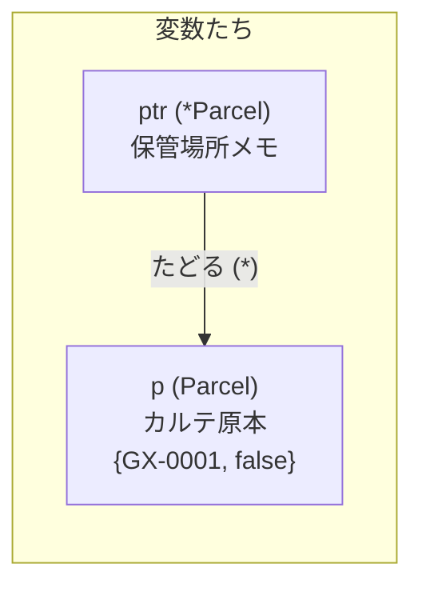

# 第7章 現物とコピー — ポインタ

## 🚇 今日のお話

事件が起きました。配達員が荷物カルテの「配達済み」欄にチェックを入れたのに、
台帳を見ると未配達のまま。原因を調べると、配達員が持っていたのは
**カルテの複写(コピー)** で、原本には何も書いていなかったのです。

Go は **値渡しの言語** です。関数に渡すもの、代入するもの、すべてコピー。
「原本を渡したい」ときに使うのが **ポインタ** です。

## まず事故を再現する

```go
type Parcel struct {
	ID        string
	Delivered bool
}

func markDelivered(p Parcel) { // p は複写
	p.Delivered = true // 複写にチェックを入れただけ
}

func main() {
	original := Parcel{ID: "GX-0001"}
	markDelivered(original)
	fmt.Println(original.Delivered) // false !!
}
```

Python なら `p.delivered = True` は呼び出し元のオブジェクトを書き換えました。
Go では struct がまるごとコピーされるので、原本は無傷です。

## ポインタ = 原本の保管場所メモ

**ポインタ** は「値そのもの」ではなく「値がメモリのどこにあるか」を持つ値です。

```go
p := Parcel{ID: "GX-0001"}

ptr := &p            // & : p の保管場所を取る(*Parcel 型)
fmt.Println(ptr)     // &{GX-0001 false} (アドレスの中身を表示してくれる)

(*ptr).Delivered = true // * : 保管場所から原本を取り出す
ptr.Delivered = true    // ↑と同じ。struct のフィールドアクセスは * を省略できる
fmt.Println(p.Delivered) // true — 原本が変わった
```

- `&x` — x の保管場所(アドレス)を得る。「原本はここ」というメモを書く
- `*T` — 「T の保管場所メモ」という型(例: `*Parcel`)
- `*ptr` — メモをたどって原本にアクセスする(デリファレンス)



事故はこう直します:

```go
func markDelivered(p *Parcel) { // 原本の場所を受け取る
	p.Delivered = true          // 原本に書く
}

markDelivered(&original) // 「原本はここ」と渡す
```

> 🐍 **Python との違い①: Python は「全部ポインタ」だった**
> 実は Python の変数はすべて「オブジェクトへの参照」——つまり暗黙のポインタです。
> だから関数に渡したリストを変更すると呼び出し元にも見えたし、逆に
> 「コピーしたつもりが同じ実体だった」事故(`copy.deepcopy` のお世話になるやつ)も
> 起きました。
> Go は逆で、**デフォルトが安全なコピー、共有したいときだけ `&` で明示** します。
> `&` の付いた呼び出しは「この関数は原本を書き換えるかも」という読み手への合図になり、
> シグネチャの `*Parcel` は「原本を預かります」という宣言になります。
> Python で全部暗黙だった区別が、Go では全部コードに見えている——それだけです。

## Go のポインタは C より大幅に安全

C のポインタで悪名高い操作は、Go ではほぼ封じられています。

- **ポインタ演算はできない**(`ptr++` で隣のメモリを覗く、が不可能)
- **ダングリングポインタがない**: ローカル変数のアドレスを返しても安全です

```go
func newParcel(id string) *Parcel {
	p := Parcel{ID: id}
	return &p // C なら未定義動作。Go では完全に合法!
}
```

> 🔍 **なぜローカル変数のアドレスを返せるの? — エスケープ解析**
> コンパイラが「この変数は関数の外に逃げる(escape する)」と判定すると、
> その変数はスタックではなく **ヒープに確保され、GC が管理** します。
> つまり Go のポインタは「メモリ番地を直接いじる道具」ではなく
> 「GC に守られた共有参照」です。C の危険性はほぼなく、残る事故は
> **nil ポインタのデリファレンス**(`var p *Parcel` のまま `p.ID` を触ると panic)
> くらいです。これは Python の `AttributeError: 'NoneType'` と同種の事故です。

## 値とポインタ、どっちで渡す?

| 状況 | 選択 |
|---|---|
| 関数内で相手を変更したい | ポインタ `*T` |
| struct が大きい(目安: 数百バイト超) | ポインタ(コピーコスト回避) |
| 小さくて読むだけ | 値(`time.Time` などは値で渡すのが標準) |
| map・スライス・channel | そのまま値渡しで OK(下記) |

### map とスライスは「最初から窓」

第4章を思い出してください。スライスの実体は「ptr + len + cap」の小さな窓でした。
map も同様に、実体は内部データへの参照です。つまり **map やスライスを関数に
値渡ししても、中身の変更は呼び出し元に見えます**(窓のコピーは同じ景色を見ている)。

```go
func addParcel(book map[string]Parcel) {
	book["GX-9999"] = Parcel{ID: "GX-9999"} // 呼び出し元にも見える
}
```

ただしスライスの `append` だけは要注意です。引っ越し(第4章)が起きると
呼び出し元の窓は古い配列を見たままなので、**append する関数はスライスを
返して受け取り直す** のが定石です(`append` 自身がそういう API なのはこのためです)。

## new と & — どっちでもいい

```go
p1 := new(Parcel)       // ゼロ値の Parcel を確保して *Parcel を返す
p2 := &Parcel{}         // 同じ意味。フィールドも初期化できるのでこちらが主流
p3 := &Parcel{ID: "GX-0001"}
```

第6章の `NewBook` が `&Book{...}` を返していた謎がここで解けます:
**台帳の原本は 1 つで、みんなが同じ原本を共有する** ために `*Book` を配っていたのです。

## 🚇 完成コード: `express/day7/main.go`

```go
// Gopher Express — カルテ原本主義への移行
package main

import "fmt"

type Parcel struct {
	ID        string
	Dest      string
	Delivered bool
}

// 原本にチェックを入れる(*Parcel を受け取る)
func markDelivered(p *Parcel) {
	p.Delivered = true
}

// 統計を取るだけ(読むだけなので値渡しで十分)
func report(parcels []Parcel) (done, pending int) {
	for _, p := range parcels {
		if p.Delivered {
			done++
		} else {
			pending++
		}
	}
	return
}

func main() {
	parcels := []Parcel{
		{ID: "GX-0001", Dest: "north"},
		{ID: "GX-0002", Dest: "south"},
		{ID: "GX-0003", Dest: "north"},
	}

	// スライス要素の原本に触るにはインデックス経由(第2章の教訓!)
	markDelivered(&parcels[0])
	markDelivered(&parcels[2])

	done, pending := report(parcels)
	fmt.Printf("配達済み %d / 未配達 %d\n", done, pending)
}
```

## 📝 今日の配達訓練(演習)

1. 冒頭の「複写に書いてしまう事故」を自分で再現し、ポインタ版に直してください。
2. `var p *Parcel` のまま `p.ID` にアクセスして panic メッセージを観察してください。
   その後 `if p != nil` ガードを付けて防いでください。
3. `swap(a, b *int)` を書いて 2 つの変数の中身を入れ替えてください。
   Python の `a, b = b, a` が Go でも `a, b = b, a` と書けることも確認し、
   「ではポインタ版 swap はいつ要るのか」を考えてみましょう
   (ヒント: 呼び出しをまたいで入れ替えたいとき)。

---

原本とコピーを区別できるようになりました。次は、カルテに **振る舞い** を持たせます。
`(b *Book)` の正体、値レシーバとポインタレシーバの使い分け、そして
「Go に継承はないが、埋め込みがある」話へ。 → [第8章 荷物に振る舞いを](08_methods.md)
