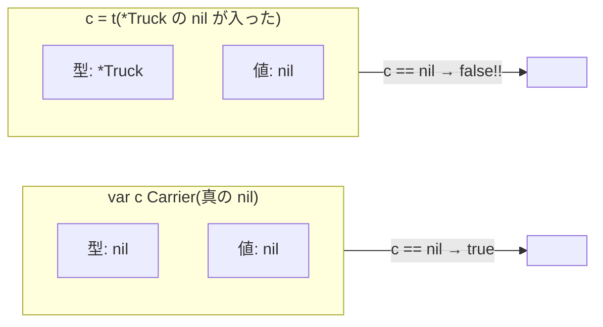

# 第9章 どんな車両でも走れる免許 — インターフェース

## 🚇 今日のお話

配達手段が増えました。トラック、運河ボート、そして新型ドローン。
配車係が欲しいのは「荷物を運べる何か」であって、車種はどうでもいい。

この「何ができるかだけで相手を選ぶ」仕組みが **インターフェース** です。
Go 設計の白眉であり、標準ライブラリ全体を貫く背骨です。

## インターフェース = メソッドの要件リスト

```go
// Carrier は「荷物を運べるもの」の免許要件
type Carrier interface {
	Deliver(dest string) error
	Capacity() float64
}
```

そして——ここが Go の独創です——**「私は Carrier を実装します」という宣言は書きません**。
要件のメソッドをすべて持っていれば、その瞬間から自動的に Carrier です。

```go
type Truck struct{ Name string }

func (t *Truck) Deliver(dest string) error {
	fmt.Println(t.Name, "が陸路で", dest, "へ配達")
	return nil
}
func (t *Truck) Capacity() float64 { return 500 }

type Drone struct{ Battery int }

func (d *Drone) Deliver(dest string) error {
	if d.Battery < 20 {
		return errors.New("バッテリー不足")
	}
	fmt.Println("ドローンが空路で", dest, "へ配達")
	return nil
}
func (d *Drone) Capacity() float64 { return 2.5 }
```

```go
// 配車係: 車種を一切知らずに仕事ができる
func dispatch(c Carrier, dest string, weight float64) {
	if weight > c.Capacity() {
		fmt.Println("積載オーバー")
		return
	}
	if err := c.Deliver(dest); err != nil {
		fmt.Println("配達失敗:", err)
	}
}

dispatch(&Truck{Name: "1号車"}, "north", 320)
dispatch(&Drone{Battery: 80}, "south", 1.2)
```

> 🐍 **Python との違い①: ダックタイピングの型チェック版**
> Python では「`deliver` メソッドを持ってるなら渡しちゃえ」という暗黙の了解
> (ダックタイピング)で同じことをし、持っていなければ **実行時に**
> `AttributeError` で落ちました。Go のインターフェースは
> **コンパイル時に検査されるダックタイピング** です。
> Python 3.8 の `typing.Protocol`(Python 教材第13章)は、まさにこの
> Go 方式を Python に輸入したものです。あちらで Protocol を理解していれば、
> Go のインターフェースは「それが言語の中核に据わっている」だけです。

> 🔍 **なぜ implements 宣言がないの? — 事後的な抽象化**
> Java では `class Truck implements Carrier` と宣言が必要なため、
> インターフェースを **先に** 設計し、実装クラスがそれに従います。
> Go は逆で、**実装が先、抽象は後から** 定義できます。他人のパッケージの型でも、
> メソッドが揃ってさえいれば自分のインターフェースに適合させられる——
> 元の作者に修正を頼む必要がありません。
> このため Go では「使う側がインターフェースを定義する」のが慣習で、
> 要件も自然と小さくなります(1〜2 メソッドが理想)。標準ライブラリの
> `io.Reader`(Read の 1 メソッドだけ)がファイル・ネットワーク・圧縮・暗号を
> 全部つないでいるのが、その威力の実例です。

## 小さなインターフェースの王様たち

```go
type Stringer interface { String() string }  // fmt パッケージ
type error interface { Error() string }      // 組み込み!
type Reader interface { Read(p []byte) (n int, err error) } // io
type Writer interface { Write(p []byte) (n int, err error) } // io
```

前章で `String()` を書いたら `fmt.Println` の表示が変わったのは、
`fmt` が「値が `Stringer` を満たすか」を確認していたからです(`__str__` と同じ発想)。
そして **`error` すらただのインターフェース** です。第10章への伏線です。

## any と型アサーション — 中身を取り出す

要件ゼロのインターフェース `interface{}`(別名 `any`)は、すべての型が満たします。
Python の「なんでも入る変数」に相当しますが、**取り出すときに型を明かす** 必要があります。

```go
var x any = "GX-0001"

s := x.(string)        // 型アサーション。違ったら panic
s, ok := x.(string)    // カンマ ok 版なら panic しない(こちらを使う)

switch v := x.(type) { // 型 switch: 型で分岐(Python の match/isinstance に相当)
case string:
	fmt.Println("伝票番号:", v)
case int:
	fmt.Println("個数:", v)
default:
	fmt.Printf("未対応の型: %T\n", v)
}
```

`any` の乱用は型検査の放棄です。ジェネリクス(第11章)が入った現代の Go では、
`any` の出番は JSON のような本当に型が不定な場面に限られます。

## ⚠️ 最大の落とし穴: 「nil の入ったインターフェース」は nil ではない

Go 屈指の有名トラップです。まず仕組みから。

**インターフェース値の実体は「(型, 値)のペア」** です。



```go
var t *Truck = nil
var c Carrier = t   // ペアは (型=*Truck, 値=nil)

fmt.Println(t == nil) // true
fmt.Println(c == nil) // false !! 型情報が入っているから
```

インターフェースの `== nil` は **「型も値も両方 nil」のときだけ** true です。
実害が出る典型例がこれです:

```go
func check(d *Drone) error {
	var err *MyError // 何も起きなかったので nil のまま
	// ...
	return err // ❌ (型=*MyError, 値=nil) が error に包まれて返る
}

if err := check(d); err != nil {
	// 何も起きていないのに、ここに必ず入る!!
}
```

**対策: エラーがないときは、型付きの nil 変数ではなく、リテラルの `nil` を返す。**

> 🔍 **なぜこんな仕様なの?**
> インターフェースが (型, 値) のペアなのは、`c.Deliver()` と呼ばれたとき
> 「どの型の Deliver を呼ぶか」を実行時に引くためで、動的ディスパッチの
> 実装としては素直な構造です。「値が nil でも型が付いていれば、
> その型のメソッドを呼べる可能性がある」(Go では nil レシーバのメソッド呼び出しは
> 合法です!)ため、型付き nil を一律 nil 扱いにはできないのです。
> 理屈は通っているのですが、直感には反する——Go チーム自身が FAQ で
> 釈明している、言語最大の「知らないと死ぬ」ポイントです。

## インターフェースの実装を保証したいとき

暗黙実装の副作用で、「メソッド名を typo して実は実装できていなかった」ことに
使う場面まで気づけないことがあります。慣習的なコンパイル時チェックがこれです:

```go
var _ Carrier = (*Truck)(nil) // Truck が Carrier を満たさなければここでエラー
```

## 🚇 完成コード: `express/day9/main.go`

```go
// Gopher Express — 混成配達部隊
package main

import (
	"errors"
	"fmt"
)

type Carrier interface {
	Deliver(dest string) error
	Capacity() float64
}

type Truck struct{ Name string }

func (t *Truck) Deliver(dest string) error {
	fmt.Printf("🚚 %s が陸路で %s へ\n", t.Name, dest)
	return nil
}
func (t *Truck) Capacity() float64 { return 500 }

type Boat struct{ Name string }

func (b *Boat) Deliver(dest string) error {
	fmt.Printf("🚢 %s が運河で %s へ\n", b.Name, dest)
	return nil
}
func (b *Boat) Capacity() float64 { return 2000 }

type Drone struct{ Battery int }

func (d *Drone) Deliver(dest string) error {
	if d.Battery < 20 {
		return errors.New("バッテリー不足")
	}
	d.Battery -= 20
	fmt.Printf("🛸 ドローンが空路で %s へ(残り %d%%)\n", dest, d.Battery)
	return nil
}
func (d *Drone) Capacity() float64 { return 2.5 }

// 実装保証(typo の早期検出)
var (
	_ Carrier = (*Truck)(nil)
	_ Carrier = (*Boat)(nil)
	_ Carrier = (*Drone)(nil)
)

func main() {
	fleet := []Carrier{
		&Truck{Name: "1号車"},
		&Boat{Name: "ゴーファー丸"},
		&Drone{Battery: 30},
	}

	weights := []float64{320, 1500, 1.2, 2.0}
	for i, w := range weights {
		c := fleet[i%len(fleet)] // 順番に配車
		if w > c.Capacity() {
			fmt.Printf("❌ %.1fkg は積載オーバー(%T)\n", w, c)
			continue
		}
		if err := c.Deliver("north"); err != nil {
			fmt.Println("❌ 配達失敗:", err)
		}
	}
}
```

## 📝 今日の配達訓練(演習)

1. `Train`(容量 10000)を追加して部隊に加えてください。`dispatch` 側のコードを
   一切変えずに済むことを確認しましょう。
2. 「nil の入ったインターフェース」の罠を自分で再現してください:
   `*Truck` 型の nil を `Carrier` 変数に入れ、`== nil` が false になることを確認し、
   `%T` と `%v` でペアの中身を観察しましょう。
3. 型 switch を使い、`[]any{“GX-1”, 42, 3.14, true}` の各要素を型ごとに
   違うメッセージで印字してください。

---

ドローンの「バッテリー不足」のような失敗を、これまで `errors.New` で
雑に作ってきました。エラーに種類を持たせ、原因を包んで運び、上流で判別する——
**Go のエラー処理の全体設計** を学びます。 → [第10章 事故報告書の書き方](10_errors.md)
