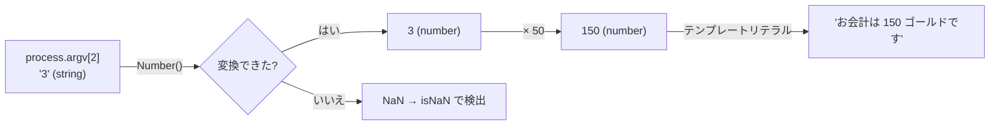

# 第2章 報酬の計算 — 数値・文字列と JS の落とし穴

## 🍺 今日のお話

開業 2 日目。最初の依頼主が「報酬は 0.1 ゴールド硬貨と 0.2 ゴールド硬貨で払う」と
言い出しました。ところが台帳に合計を書こうとすると——

```typescript
console.log(0.1 + 0.2);          // 0.30000000000000004 ?!
console.log(0.1 + 0.2 === 0.3);  // false ?!?!
```

慌てないでください。これはバグではなく、**JavaScript の数値の仕組み**を知れば必然の結果です。
今日は数値と文字列、そして JavaScript 名物「落とし穴地帯」を通り抜けます。

## number の正体 — 整数型は存在しない

多くの言語には整数型と小数型が別々にあります(Go の `int` と `float64`、Python の `int` と
`float`)。しかし JavaScript の数値型は **`number` ただ 1 つ**で、その正体は
**64bit 浮動小数点数**(Go の `float64` と同じもの)です。

```typescript
const stock = 3;        // 整数に見えるが、中身は浮動小数点数
const rate = 0.1;       // これも同じ number
console.log(typeof stock, typeof rate);  // number number
```

> 📜 **歴史の背景 — なぜ整数型がないのか**
>
> 1995 年の 10 日間の設計で「初心者向けの言語に型の区別は難しすぎる。数は全部 1 種類に
> しよう」と割り切られたためです。おかげで `10 / 3` が `3.333...` になる素直さを得た代わりに、
> **0.1 のような小数を正確に表現できない** という浮動小数点数の宿命を全数値が背負いました。
> 0.1 は 2 進数では無限小数になるため、わずかな誤差が生まれます。これは JavaScript 固有では
> なく、Python でも Go でも `float` を使えば同じ現象が起きます
> ([python-fable-101 第1章の演習 3](../../02-python-fable-101/chapters/01_variables.md) と同じ話です)。

実務での対処法:

```typescript
// お金の計算は「最小単位の整数」で持つのが定石(0.1 ゴールド → 1 カッパー)
const rewardInCopper = 1 + 2;             // 3 カッパー。誤差ゼロ
console.log(rewardInCopper / 10);         // 表示するときだけ 0.3 に

// 表示の丸めには toFixed(文字列が返ることに注意)
console.log((0.1 + 0.2).toFixed(2));      // "0.30"

// 整数として安全に扱える範囲は約 ±900 兆(2^53 - 1)まで
console.log(Number.MAX_SAFE_INTEGER);     // 9007199254740991
// それを超える金額を扱う大商人には BigInt という別の型がある(末尾に n を付ける)
const dragonTreasure = 9007199254740993n;
```

## 落とし穴その 1 — `==` は使わない。常に `===`

JavaScript には等値比較が 2 種類あります。

```typescript
// == (緩い比較): 型が違ったら「変換してから」比べる
"1" == 1     // true  (文字列 "1" を数値に変換して比較)
0 == ""      // true  (どちらも数値 0 に変換される)
null == undefined  // true

// === (厳密な比較): 型が違ったらその時点で false
"1" === 1    // false
0 === ""     // false
```

> 📜 **歴史の背景 — なぜ `==` はこんなに緩いのか**
>
> 1995 年当時の想定ユーザーは「Web フォームをちょっと処理したい非プログラマ」でした。
> フォーム入力は常に文字列で届くので、`"5" == 5` がエラーになったら初心者が困る——
> という **親切心** で自動型変換が入りました。しかしその変換ルールは複雑で予測しづらく、
> 30 年経った今では「JavaScript 最大の設計ミス」の一つに数えられています。
> 設計者のアイク自身が後悔を公言しています。例によって削除はできないので、
> 厳密版の `===` が **後から追加** されました(`var` → `let` と同じパターンです)。

**ルールは単純です: `==` と `!=` は存在しないものとして、常に `===` と `!==` を使う。**
うれしいことに TypeScript では、型が重ならない値同士の比較
(例: `gold === "100"`)はそもそもコンパイルエラーになります。型が守れる範囲では
`==` の罠自体が発動しなくなるのです。

## 落とし穴その 2 — truthy と falsy

`if` の条件には、boolean 以外の値も書けます。そのとき値は自動的に真偽に解釈されます。

**falsy(偽とみなされる値)は次の 6 つだけ。それ以外はすべて truthy です。**

| falsy な値 | 意味 |
|---|---|
| `false` | そのまま偽 |
| `0`(と `-0`, `0n`) | 数値のゼロ |
| `""` | 空文字列 |
| `null` | 意図的な無 |
| `undefined` | 未定義 |
| `NaN` | 数値でない数値(後述) |

```typescript
const visitorName = "";

if (visitorName) {
  console.log(`ようこそ、${visitorName} さん`);
} else {
  console.log("名前が空欄です");   // ← こちらが実行される
}
```

💡 **ポイント**: `if (name)` は「名前がある(空でない)なら」という便利な慣用句ですが、
**`0` も falsy** であることに注意。「所持金が入力されていたら」のつもりで
`if (gold)` と書くと、所持金 0 の冒険者が「未入力」扱いされるバグになります。
数値やオブジェクトの存在確認は `if (gold !== undefined)` のように明示的に書くのが安全です。

## 落とし穴その 3 — NaN

`NaN`(Not-a-Number)は「数値計算が失敗した」ことを表す特殊な値です。

```typescript
const n = Number("三十ゴールド");  // 数値に変換できない → NaN
console.log(typeof NaN);           // "number" (数値でないのに型は number!)
console.log(NaN === NaN);          // false   (NaN は自分自身とすら等しくない!)
console.log(Number.isNaN(n));      // true    (判定はこれを使う)
```

`NaN === NaN` が `false` なのは JavaScript の意地悪ではなく、浮動小数点数の国際規格
(IEEE 754)がそう定めているためです。**NaN の判定は必ず `Number.isNaN()`** を使います。

## 文字列の操作 — 依頼書を整える

```typescript
const raw = "  Dragon Hunt  ";

console.log(raw.trim());                  // "Dragon Hunt"(前後の空白除去)
console.log(raw.trim().toUpperCase());    // "DRAGON HUNT"
console.log(raw.includes("Dragon"));      // true(部分文字列の検索)
console.log(raw.trim().length);           // 11(文字数)
console.log("gold".repeat(3));            // "goldgoldgold"
console.log("Dragon Hunt".split(" "));    // ["Dragon", "Hunt"](配列は次章!)
```

## 型変換 — 依頼主の言葉を数値にする

コマンドラインからプログラムに渡された引数は `process.argv` に **必ず文字列で** 入っています
(Web フォームの入力が文字列なのと同じです)。数値として使うには明示的に変換します。

```typescript
const input = process.argv[2];   // 実行時: npx tsx guild/day2.ts 3 → "3" (string)
const count = Number(input);     // 3 (number) に変換。失敗すると NaN

if (Number.isNaN(count)) {
  console.log("数字で入力してください!");
} else {
  console.log(`依頼 ${count} 件を受け付けました`);
}
```



## ⚔️ 完成コード: `guild/day2.ts`

```typescript
// Typed Tavern — 2 日目: 報酬計算システム

const questReward = 50;      // 依頼 1 件の基本報酬
const guildTaxRate = 0.1;    // ギルド税率

// コマンドライン引数から依頼件数を受け取る
const input = process.argv[2];
const count = Number(input);

if (Number.isNaN(count) || count <= 0) {
  console.log("使い方: npx tsx guild/day2.ts <依頼件数>");
} else {
  // お金は最小単位(カッパー: 1/100 ゴールド)の整数で計算し、誤差を防ぐ
  const rewardInCopper = questReward * 100 * count;
  const taxInCopper = Math.round(rewardInCopper * guildTaxRate);
  const totalInCopper = rewardInCopper + taxInCopper;

  console.log(`依頼件数: ${count} 件`);
  console.log(`報酬合計: ${rewardInCopper / 100} ゴールド`);
  console.log(`ギルド税: ${taxInCopper / 100} ゴールド`);
  console.log(`請求金額: ${(totalInCopper / 100).toFixed(2)} ゴールド`);
}
```

```bash
npx tsx guild/day2.ts 3
```

## 📝 今日の受付業務(演習)

1. `console.log(0.1 + 0.2 === 0.3)` と `console.log(1 + 2 === 3)` の結果を確認し、なぜ整数なら安全なのかを一言で説明してみてください。
2. `"5" + 3` と `"5" - 3` を実行して結果を観察してください(TypeScript がどちらかをエラーにするかも確認)。`+` だけが文字列連結を兼ねているのが原因です。
3. falsy の 6 つの値をそれぞれ `if` に入れて、本当に else 側に落ちることを確認してください。
4. 上の完成コードに「引数が省略されたとき(`process.argv[2]` が `undefined` のとき)」の親切なメッセージを追加してください。`Number(undefined)` が何になるかも観察を。

---

次章、掲示板に依頼が貼り出されます。1 件の依頼には「タイトル・報酬・危険度」など複数の
情報がありますが、変数 1 つでは 1 つの値しか持てません。どうする?
→ [第3章 クエスト掲示板](03_objects_arrays.md)
