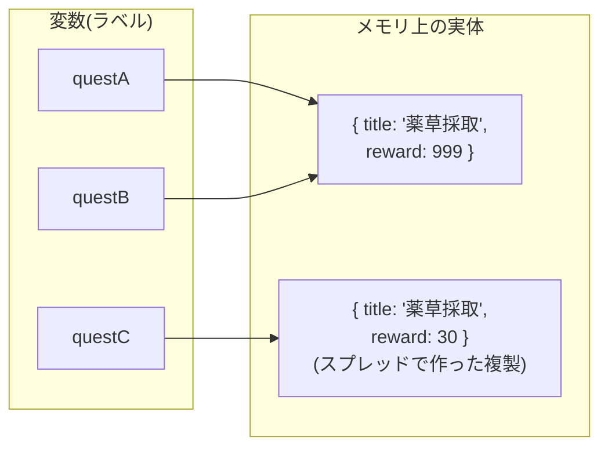

# 第3章 クエスト掲示板 — オブジェクトと配列

## 🍺 今日のお話

Typed Tavern に依頼が舞い込み始めました。「薬草採取、報酬 30G」「ゴブリン退治、報酬 80G、
危険度高」…。1 件の依頼には複数の情報がまとまっています。そして依頼は何件も来ます。

今日は「情報のまとまり」を表す **オブジェクト** と、「同じ形のものの並び」を表す **配列** で、
ギルドの心臓部・クエスト掲示板を作ります。

## オブジェクト — 1 件の依頼を表す

```typescript
const quest = {
  id: 1,
  title: "薬草採取",
  reward: 30,
  done: false,
};

console.log(quest.title);          // "薬草採取"(ドットでプロパティにアクセス)
quest.reward = 35;                 // プロパティの変更は OK
console.log(quest["reward"]);      // 35(ブラケット記法でもアクセスできる)
```

`{ キー: 値, ... }` の形を **オブジェクトリテラル** と呼びます。Python の dict に似ていますが、
JavaScript ではこれが「軽量なデータのまとまり」として言語の中心にいます。

💡 `const quest` なのに中身を変更できた点に注目してください。`const` が禁止するのは
**変数への再代入** だけで、**指している先のオブジェクトの中身の変更は自由** です。
第 1 章の比喩でいえば「ラベルの貼り替えは禁止、貼った先の箱の中身は触れる」です。

## interface — 依頼書の「様式」を定める

オブジェクトの「形」に名前を付けるのが **`interface`** です。

```typescript
interface Quest {
  id: number;
  title: string;
  reward: number;
  danger?: string;        // ?付き = あってもなくてもよい(optional)
  readonly createdBy: string;  // readonly = 後から変更できない
  done: boolean;
}

const herbQuest: Quest = {
  id: 1,
  title: "薬草採取",
  reward: 30,
  createdBy: "薬師ミラ",
  done: false,
  // danger は省略可能
};

herbQuest.reward = 35;            // ✅ OK
herbQuest.createdBy = "誰か";     // ❌ エラー: readonly だから
herbQuest.rewrd = 40;             // ❌ エラー: typo を即座に検出!(これが型の日常的な恩恵)
```

`danger?` のようなオプショナルプロパティの型は自動的に `string | undefined` になります
(`|` の意味は第 5 章で)。

> 💡 **`interface` と `type`、どっちを使う?**
>
> ほぼ同じことができる書き方が 2 つあります。
>
> ```typescript
> interface Quest { id: number }     // interface 宣言
> type Quest = { id: number };       // type エイリアス
> ```
>
> 歴史的経緯で両方が存在し、コミュニティでも好みが分かれます。この教材では
> **「オブジェクトの形には `interface`、それ以外(union など)には `type`」** という
> よくある使い分けを採用します。どちらかに統一されていれば実務ではどちらでも構いません。

> 📜 **歴史の背景 — 構造的型付け: 「名前」ではなく「形」**
>
> TypeScript の型の合否は **「その interface を名乗っているか」ではなく「形が合っているか」**
> で決まります。`id, title, reward, createdBy, done` を持つオブジェクトなら、どこで作られた
> ものでも `Quest` として通用します。これを **構造的型付け(structural typing)** と呼びます。
>
> なぜこの方式なのか? TypeScript は「既存の JavaScript コードに後から型を付ける」使命を
> 持って生まれました。JS の世界には宣言なしに作られたオブジェクトが無数にあるため、
> 「形が合えば OK」にしないと型を付けられなかったのです。
>
> 実はこれ、[Go の interface](../../03-go-fable-101/chapters/09_interfaces.md)(`implements` 不要で
> メソッドがあれば満たす)と同じ思想で、[Python の duck typing](../../02-python-fable-101/chapters/09_dunder.md)
> の静的検査版とも言えます。「アヒルの形をしていればアヒル」を、実行前に検査するのです。

## 配列 — 依頼を掲示板に並べる

```typescript
const quests: Quest[] = [];       // Quest の配列(空で開始)

quests.push(herbQuest);           // 末尾に追加
quests.push({
  id: 2,
  title: "ゴブリン退治",
  reward: 80,
  danger: "高",
  createdBy: "村長",
  done: false,
});

console.log(quests.length);       // 2
console.log(quests[0].title);     // "薬草採取"(先頭は 0 番)

// for...of で全件を巡回(要素そのものが欲しいときの基本形)
for (const q of quests) {
  const mark = q.done ? "✅" : "🆕";
  console.log(`${mark} [${q.id}] ${q.title} — ${q.reward}G`);
}
```

- `Quest[]` は「Quest 型の要素が並んだ配列」。`string[]`、`number[]` も同様です
- 配列に `Quest` でないものを `push` しようとするとコンパイルエラーになります
- `q.done ? "✅" : "🆕"` は **三項演算子**(条件 ? 真のとき : 偽のとき)です

💡 順番と個数が固定の組には **タプル** も使えます: `type Pair = [string, number]`。
「名前と報酬のペア」のような一時的な組に便利ですが、多用するより interface で
名前を付けた方が読みやすいことが多いです。

## 参照 — オブジェクトはコピーされない

第 1 章で「変数は値に貼るラベル」と言いました。オブジェクトと配列では、この理解が
決定的に重要になります。

```typescript
const questA = { title: "薬草採取", reward: 30 };
const questB = questA;      // 「コピー」ではなく「同じものに 2 枚目のラベル」

questB.reward = 999;
console.log(questA.reward); // 999 ?! questA まで変わった(同じものだから当然)
```



本当に複製が欲しいときは **スプレッド構文 `...`** を使います。

```typescript
const questC = { ...questA };            // 中身を展開して新しいオブジェクトを作る
questC.reward = 30;                      // questA には影響しない

const moreQuests = [...quests];          // 配列の複製も同じ書き方
const updated = { ...questA, done: true };  // 「複製しつつ一部だけ変更」の頻出イディオム
```

💡 最後の「複製しつつ一部だけ変更」は、この先 React を学ぶときに**毎日書く**ことになる
最重要イディオムです。React は「元のオブジェクトを書き換える」のではなく「変更済みの
新しいオブジェクトを作る」文化(イミュータビリティ)で動いているためです(第 9 章で再訪)。

## JSON — 依頼書を紙に写す

オブジェクトを文字列にしたり、文字列から戻したりできます。

```typescript
const text = JSON.stringify(herbQuest, null, 2);  // オブジェクト → 整形された文字列
console.log(text);
// {
//   "id": 1,
//   "title": "薬草採取",
//   ...

const restored = JSON.parse(text);                 // 文字列 → オブジェクト
```

> 📜 **歴史の背景 — JSON は JavaScript の「方言」が世界標準になったもの**
>
> JSON(JavaScript Object Notation)はその名の通り、JavaScript のオブジェクトリテラル
> 記法から生まれました。2000 年代初頭、ダグラス・クロックフォードが「XML は重すぎる。
> JS のオブジェクト記法をそのままデータ形式にすればいい」と提唱し、いまや Python も Go も
> あらゆる言語・あらゆる API が使う世界共通のデータ形式になりました。
> JavaScript を学ぶと JSON が「外国語」ではなく「母国語」になります。
>
> ⚠️ ただし `JSON.parse` が返す値の型を TypeScript は保証できません(`any` になります)。
> 「外から来たデータをどう信用するか」は第 14 章の主役です。

## ⚔️ 完成コード: `guild/day3.ts`

```typescript
// Typed Tavern — 3 日目: クエスト掲示板

interface Quest {
  id: number;
  title: string;
  reward: number;
  danger?: string;
  readonly createdBy: string;
  done: boolean;
}

const quests: Quest[] = [
  { id: 1, title: "薬草採取", reward: 30, createdBy: "薬師ミラ", done: false },
  { id: 2, title: "ゴブリン退治", reward: 80, danger: "高", createdBy: "村長", done: false },
  { id: 3, title: "酒場の看板修理", reward: 15, createdBy: "店主", done: true },
];

console.log("📌 ===== クエスト掲示板 =====");
for (const q of quests) {
  const mark = q.done ? "✅" : "🆕";
  const dangerLabel = q.danger ? ` ⚠️危険度: ${q.danger}` : "";
  console.log(`${mark} [${q.id}] ${q.title} — ${q.reward}G${dangerLabel}(依頼主: ${q.createdBy})`);
}

const openCount = quests.filter((q) => !q.done).length;  // filter は第 9 章で本格登場
console.log(`\n受付中の依頼: ${openCount} 件`);
```

```bash
npx tsx guild/day3.ts
```

## 📝 今日の受付業務(演習)

1. `Quest` に `partySize?: number`(推奨人数)を追加し、指定がある依頼だけ「推奨 ○ 人」と表示してください。
2. `const q2 = quests[1]; q2.done = true;` としてから掲示板を表示し、`quests` の中身も変わっていることを確認してください(参照の理解チェック)。
3. スプレッド構文で「`id: 4` の新依頼を追加した **新しい配列** `tomorrowQuests`」を作ってください。元の `quests` の件数が変わっていないことも確認を。
4. `JSON.stringify(quests, null, 2)` の出力を眺めて、`undefined` のプロパティ(`danger` 未指定の依頼)が JSON でどう扱われるか観察してください。

---

次章、依頼が増えて受付業務がパンク寸前。「掲示板に貼る」「報酬を計算する」といった
定型業務を **関数** にして、受付係を増やしましょう。
→ [第4章 受付係を増やす](04_functions.md)
