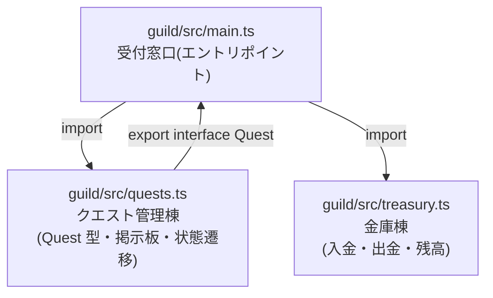

# 第6章 ギルドの増築 — モジュールと npm と tsconfig

## 🍺 今日のお話

ギルドの業務が増え、1 枚の羊皮紙(1 ファイル)に全部書くのは限界です。「クエスト管理」
「金庫管理」「受付窓口」を別々の棟に分け、必要なときだけ行き来できるようにしましょう。

今日はコードを書く手を少し止めて、**プロジェクトの土台**を理解する日です。README で
「おまじない」と言った `npm init` や `tsconfig.json` の正体を明かします。

## 📜 歴史の背景 — JavaScript に「ファイル分割」がなかった時代

信じがたいことに、JavaScript には **2015 年まで公式のモジュール機能がありませんでした**。

- **1995〜2000 年代**: ブラウザで `<script src="a.js">` を並べるだけ。すべてのファイルの
  変数が **1 つのグローバル空間に混ざる** ため、ファイル A とファイル B が同じ変数名を
  使うと黙って上書き事故。大規模開発は地獄でした。
- **2009 年**: ブラウザの外で JS を動かす **Node.js** が登場(詳細は第 11 章)。サーバー開発には
  モジュールが必須なので、Node は独自方式 **CommonJS**(`require()` / `module.exports`)を
  採用しました。言語仕様ではなく「民間の発明」です。
- **2015 年**: ES2015 でようやく言語公式の **ES Modules(ESM)**(`import` / `export`)が
  誕生。しかし CommonJS で書かれた膨大な資産が既にあり、**現在も 2 方式が共存**しています。

古い記事で `require()` を見たら CommonJS、`import` を見たら ESM です。
**新規プロジェクトは ESM 一択**。この教材も ESM で進めます。
2 方式の共存は現在の JS エコシステムの混乱の源の一つで、`package.json` に
`"type": "module"` と書くのは「このプロジェクトは ESM 側です」という宣言です。

## export と import — 棟の間の廊下

**ファイル 1 つ = モジュール 1 つ** です。モジュール内の名前は外から見えず、
`export` を付けたものだけが公開されます。

```typescript
// guild/src/treasury.ts — 金庫棟
let gold = 100;                          // export なし = この棟の外からは触れない

export function deposit(amount: number): void {
  gold += amount;
}

export function withdraw(amount: number): boolean {
  if (amount > gold) return false;       // 残高不足は拒否
  gold -= amount;
  return true;
}

export function balance(): number {
  return gold;
}
```

```typescript
// guild/src/main.ts — 受付窓口
import { deposit, withdraw, balance } from "./treasury.js";

deposit(50);
console.log(`金庫: ${balance()}G`);      // 150G
```

- `import { 名前 } from "場所"` で取り込みます。名前はエディタが補完してくれます
- `gold` 変数そのものは import できません。**「データは隠し、操作だけ公開する」** ——
  金庫の中身に直接手を突っ込ませず、必ず窓口(関数)を通させる。これがカプセル化です

💡 **`.js` 拡張子の謎**: TypeScript ファイルなのに `from "./treasury.js"` と書くのは
初見殺しナンバーワンです。理由は第 1 章の原則から導けます——このコードは型を剥がされて
JS になってから実行されるので、**実行時に実際に存在するファイル名**(`.js`)を書くのです
(ツール設定によっては `.ts` と書く流儀もありますが、本教材は標準に忠実にいきます)。

> 💡 **default export について**: `export default function ...` という「1 ファイル 1 推し」の
> 公開方法もありますが、名前の付け替えが自由なせいで typo に弱く、補完も効きにくいため、
> この教材では **named export(上記の書き方)に統一** します。実務でも named 派が優勢です。

## package.json — ギルドの登記簿

`npm init -y` が作った `package.json` は、プロジェクトの身分証明書です。

```json
{
  "name": "ts-guild",
  "version": "1.0.0",
  "type": "module",
  "scripts": {
    "start": "tsx guild/src/main.ts",
    "check": "tsc --noEmit"
  },
  "devDependencies": {
    "typescript": "^5.5.0",
    "tsx": "^4.16.0"
  }
}
```

| 項目 | 意味 |
|---|---|
| `"type": "module"` | ESM 方式の宣言(**必ず書きましょう**) |
| `scripts` | コマンドの短縮登録。`npm run check` で `tsc --noEmit` が走る |
| `dependencies` | 実行に必要なライブラリ(まだ空) |
| `devDependencies` | 開発中だけ必要な道具(`typescript` や `tsx` はこちら) |

`npm install` したものは `node_modules/` フォルダに実体が入り、`package-lock.json` に
「実際に入れた正確なバージョン」が記録されます。

💡 **`node_modules` と lock ファイルの扱い**: `node_modules/` は巨大なので Git に入れません
(`.gitignore` に追加)。逆に `package-lock.json` は **必ず Git に入れます**。
`package.json` + lock ファイルさえあれば、誰のマシンでも `npm install` 一発で
同じ環境が復元できるからです。[Python の venv + requirements](../../02-python-fable-101/chapters/05_modules.md) に相当する仕組みが、JS では最初から一本化されています。

## tsconfig.json — 型検査の厳しさを決める

プロジェクト直下に `tsconfig.json` を作ります。これは TypeScript コンパイラへの指示書です。

```json
{
  "compilerOptions": {
    "target": "es2022",
    "module": "nodenext",
    "moduleResolution": "nodenext",
    "strict": true,
    "noEmit": true,
    "skipLibCheck": true
  },
  "include": ["guild"]
}
```

| オプション | 意味 |
|---|---|
| `target` | 出力する JS の世代。es2022 なら現代の Node/ブラウザ向け |
| `module` / `moduleResolution` | モジュール方式。Node の ESM に従う設定 |
| **`strict`** | **全ての厳格チェックを有効化。絶対に true**(null 安全もここに含まれる) |
| `noEmit` | tsc は型検査だけ行い JS を出力しない(実行は tsx に任せる) |
| `include` | 検査対象のフォルダ |

> 💡 **なぜ `strict: true` が絶対なのか**: TypeScript は「ゆるく始めて後から締められる」
> 段階的な言語ですが、締める作業は大量のエラーとの戦いになります。新規プロジェクトで
> strict にしない理由はゼロです。第 5 章の null 安全も strict あってこそ。
> 「strict でない TypeScript は、シートベルトを座席の下に収納した車」と覚えてください。

これで `npx tsc --noEmit`(または `npm run check`)がプロジェクト全体を検査するようになります。

## ⚔️ 完成コード: ギルドを 3 棟に増築



```typescript
// guild/src/quests.ts — クエスト管理棟(第 5 章の成果を移設)

export type QuestStatus =
  | { state: "open" }
  | { state: "taken"; by: string }
  | { state: "done"; by: string; completedOn: string };

export interface Quest {
  id: number;
  title: string;
  reward: number;
  status: QuestStatus;
}

const quests: Quest[] = [];   // 台帳そのものは非公開
let nextId = 1;

export function postQuest(title: string, reward: number): Quest {
  const quest: Quest = { id: nextId, title, reward, status: { state: "open" } };
  nextId += 1;
  quests.push(quest);
  return quest;
}

export function listQuests(): readonly Quest[] {
  return quests;   // readonly で「見るのは自由、書き換えは窓口経由で」
}

export function takeQuest(q: Quest, adventurer: string): boolean {
  if (q.status.state !== "open") return false;
  q.status = { state: "taken", by: adventurer };
  return true;
}

export function completeQuest(q: Quest, completedOn: string): boolean {
  if (q.status.state !== "taken") return false;
  q.status = { state: "done", by: q.status.by, completedOn };
  return true;
}
```

```typescript
// guild/src/main.ts — 受付窓口

import { postQuest, listQuests, takeQuest, completeQuest } from "./quests.js";
import { deposit, balance } from "./treasury.js";

const herb = postQuest("薬草採取", 30);
postQuest("ゴブリン退治", 80);

takeQuest(herb, "剣士カイ");
if (completeQuest(herb, "6月2日")) {
  deposit(Math.round(herb.reward * 0.1));   // 完了手数料 10% がギルドの収入
}

console.log("📌 ===== クエスト掲示板 =====");
for (const q of listQuests()) {
  console.log(`[${q.id}] ${q.title} — ${q.status.state}`);
}
console.log(`💰 ギルド金庫: ${balance()}G`);
```

```bash
npm run check   # プロジェクト全体を型検査
npm run start   # 実行
```

## 📝 今日の受付業務(演習)

1. `treasury.ts` の中身を上の説明を見ずに書いてください(`deposit` / `withdraw` / `balance`)。
2. `main.ts` から `treasury.ts` の `gold` 変数を直接 import しようとするとどうなるか試してください。
3. 第 5 章の `describeStatus` を `quests.ts` に移して export し、`main.ts` の掲示板表示で使ってください。
4. `package.json` の `scripts` に `"dev": "tsx watch guild/src/main.ts"` を追加して `npm run dev` を実行してみてください。ファイルを保存するたびに自動で再実行されます(以後の開発が快適になります)。

---

これで基礎編は修了です。🌿 中級編は「もの」の設計から始まります。冒険者一人ひとりを
オブジェクトとして扱う `class`——そしてその足元に潜む、JavaScript 最古の魔法
「プロトタイプ」の正体を暴きます。 → [第7章 冒険者名簿](07_classes.md)
