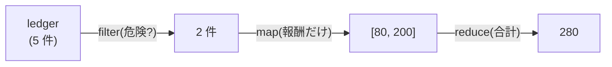

# 第9章 帳簿の集計 — 配列メソッドとクロージャ

## 🍺 今日のお話

月末です。ギルド長から矢の催促が届きました。「完了した依頼の報酬総額は?危険な依頼の
一覧は?冒険者の稼ぎ頭は誰だ?」

for ループでも書けますが、今日は **「ループを書かずに、データの変換として考える」**
という JavaScript の中心的な流儀を学びます。第 4 章で撒いた種——「関数は値である」——が
今日、一斉に花開きます。

## 3 大メソッド — map / filter / reduce

素材はこの帳簿です。

```typescript
interface Record_ {
  title: string;
  reward: number;
  by: string;
  danger: boolean;
}

const ledger: Record_[] = [
  { title: "薬草採取", reward: 30, by: "カイ", danger: false },
  { title: "ゴブリン退治", reward: 80, by: "リタ", danger: true },
  { title: "看板修理", reward: 15, by: "カイ", danger: false },
  { title: "ドラゴン調査", reward: 200, by: "リタ", danger: true },
  { title: "迷子の猫さがし", reward: 20, by: "カイ", danger: false },
];
```

### map — 全要素を変換する

```typescript
// for 版
const lines: string[] = [];
for (const r of ledger) {
  lines.push(`${r.title}: ${r.reward}G`);
}

// map 版: 「各要素をこの関数に通した新しい配列をくれ」
const lines2 = ledger.map((r) => `${r.title}: ${r.reward}G`);
//    lines2 の型は string[] — 変換結果の型も自動で追跡される
```

### filter — 条件に合う要素だけ残す

```typescript
const dangerous = ledger.filter((r) => r.danger);         // 危険な依頼だけ
const cheap = ledger.filter((r) => r.reward < 50);        // 50G 未満だけ
```

### reduce — 全要素を 1 つの値に畳み込む

```typescript
const total = ledger.reduce((sum, r) => sum + r.reward, 0);
//                           ~~~ 累積値   ~~~~~~~~~~~ 各要素で累積値を更新   ~ 初期値
console.log(total);   // 345
```

`reduce` は「合計」「最大値」「グループ分け」など、**配列を 1 個の何かにまとめる**
万能選手です。最初は読みにくく感じたら、無理せず for で書いても構いません
(合計くらいなら for の方が読みやすいという意見も普通にあります)。

### つなげる — 集計パイプライン

真価は **チェーン(連結)** にあります。「危険な依頼の報酬合計」は:

```typescript
const dangerPay = ledger
  .filter((r) => r.danger)          // ① 危険な依頼だけ残す
  .map((r) => r.reward)             // ② 報酬の数値だけ取り出す
  .reduce((sum, x) => sum + x, 0);  // ③ 合計する
console.log(dangerPay);             // 280
```



上から下へ「絞る → 変える → まとめる」と **データの流れとして読める** のが強みです。
各段階で型も変わっていきます(`Record_[]` → `Record_[]` → `number[]` → `number`)。
エディタで各行にマウスを乗せて確かめてみてください。

### そのほかの常連たち

```typescript
ledger.find((r) => r.by === "リタ");        // 条件に合う最初の 1 件(なければ undefined)
ledger.some((r) => r.reward > 100);         // 1 件でもあれば true
ledger.every((r) => r.reward > 0);          // 全件が満たせば true
ledger.forEach((r) => console.log(r.title)); // 戻り値なしで全件に処理(for...of でも可)
```

## sort の罠と、破壊しない流儀

```typescript
const sorted = ledger.sort((a, b) => b.reward - a.reward);
console.log(ledger[0].title);   // "ドラゴン調査" ?! 元の帳簿の順番まで変わった!
```

`sort` は **元の配列を書き換えます**(破壊的メソッド)。`reverse` や `splice` も同類です。
一方 `map` / `filter` は **新しい配列を返し、元を触りません**(非破壊)。この区別は
1995 年の設計に一貫性がなかった名残で、暗記するしかない部分です。

現代の書き方は 2 つ:

```typescript
const ranking = [...ledger].sort((a, b) => b.reward - a.reward);  // 複製してから並べ替え
const ranking2 = ledger.toSorted((a, b) => b.reward - a.reward);  // ES2023 の非破壊版 sort
```

> 💡 **なぜ「元を変えない」ことにこだわるのか(イミュータビリティ)**
>
> 第 3 章で見たとおり、配列やオブジェクトは参照で共有されます。どこかの関数が共有物を
> 書き換えると、**離れた場所のコードが突然おかしくなる**(そして原因を探すのが大変)。
> 「変更するのではなく、変更済みの新しいものを作る」流儀なら、渡したデータは渡した
> ときのまま——という安心が手に入ります。
>
> この流儀は React では作法ではなく **前提** です。React は「前のデータと今のデータが
> 別のオブジェクトかどうか」で画面の更新を検知するため、その場で書き換えると変更に
> 気づいてもらえません。`map` / `filter` / スプレッドが「React の日常語」なのはこのためです。

## クロージャ — 関数が環境を記憶する

集計の途中、連番の受付番号が必要になりました。カウンタ変数をグローバルに置くと誰でも
書き換えられて危険です。そこで:

```typescript
function makeTicketCounter(): () => number {
  let count = 0;                 // この変数は makeTicketCounter の中だけの存在
  return () => {
    count += 1;
    return count;
  };
}

const nextTicket = makeTicketCounter();
console.log(nextTicket());   // 1
console.log(nextTicket());   // 2 — count が生きている?!
```

`makeTicketCounter` の実行はとっくに終わったのに、`count` は消えていません。

> ⚙️ **ランタイムの真実 — なぜ count は生き残るのか**
>
> JavaScript の関数は、**自分が生まれた場所のスコープ(環境)を丸ごと抱えて持ち歩きます**。
> 返されたアロー関数は「count のいる環境」への参照を持っているので、環境はガベージ
> コレクタに回収されず生き続けます。この「関数+生まれた環境」のセットを
> **クロージャ(closure)** と呼びます。
>
> 種明かしすると、あなたは既にクロージャを使っています。`filter((r) => r.reward < max)`
> のようにコールバックが外側の変数を参照できたのはクロージャのおかげですし、第 6 章の
> `treasury.ts` がモジュール変数 `gold` を関数越しにだけ触らせたのも、実はモジュール規模の
> クロージャです。[Python のデコレータ](../../02-python-fable-101/chapters/11_decorators.md)を
> 支えているのも同じ仕組みです。「関数を値として渡す」言語では、クロージャは空気のように
> あらゆる場所にあります。

クロージャの直接の使いどころ——「設定を焼き込んだ関数を作る」:

```typescript
function makeTaxCalc(rate: number): (amount: number) => number {
  return (amount) => Math.round(amount * (1 + rate));
}

const withGuildTax = makeTaxCalc(0.1);
const withRushTax = makeTaxCalc(0.3);
console.log(withGuildTax(100));   // 110
console.log(withRushTax(100));    // 130
```

## ⚔️ 完成コード: `guild/src/report.ts`

```typescript
// Typed Tavern — 9 日目: 月次報告書

import { type Quest, listQuests } from "./quests.js";

export function monthlyReport(): string {
  const all = listQuests();
  const done = all.filter((q) => q.status.state === "done");
  const totalPaid = done.reduce((sum, q) => sum + q.reward, 0);

  // 冒険者ごとの稼ぎを Map に集計(reduce のグループ分けパターン)
  const earnings = done.reduce((acc, q) => {
    if (q.status.state !== "done") return acc;        // narrowing のため
    const prev = acc.get(q.status.by) ?? 0;
    acc.set(q.status.by, prev + q.reward);
    return acc;
  }, new Map<string, number>());

  const ranking = [...earnings.entries()]
    .sort(([, a], [, b]) => b - a)                    // 分割代入で金額だけ比較
    .map(([name, gold], i) => `  ${i + 1} 位: ${name}(${gold}G)`)
    .join("\n");

  return [
    "📜 ===== 月次報告書 =====",
    `完了依頼: ${done.length} / ${all.length} 件`,
    `支払報酬総額: ${totalPaid}G`,
    "稼ぎ頭ランキング:",
    ranking || "  (完了依頼なし)",
  ].join("\n");
}
```

`main.ts` で依頼をいくつか完了させてから `console.log(monthlyReport())` を呼んでみてください。

## 📝 今日の受付業務(演習)

1. 「報酬 50G 以上の未完了依頼のタイトル一覧(`string[]`)」を filter + map のチェーンで書いてください。
2. `ledger.reduce(...)` で **最高報酬の 1 件**(合計ではなく `Record_` そのもの)を求めてください。
3. `makeIdGenerator(prefix: string)` を書いてください。`const nextQ = makeIdGenerator("Q"); nextQ() // "Q1", nextQ() // "Q2"` のように動くクロージャです。第 6 章 `quests.ts` の `nextId` をこれで置き換えられるか考えてみてください。
4. `ledger.sort(...)` と `ledger.toSorted(...)` の実行後にそれぞれ `ledger[0]` を確認し、破壊/非破壊の違いを自分の目で確かめてください。

---

次章、事件が起きます。掲示板の呼び鈴をタイマーに繋いだら、鳴るたびに
`undefined のプロパティは読めません` と叫ぶようになりました。
犯人の名は **this**。JavaScript 最大の難所を、腰を据えて攻略します。
→ [第10章 受付係の混乱](10_this.md)
