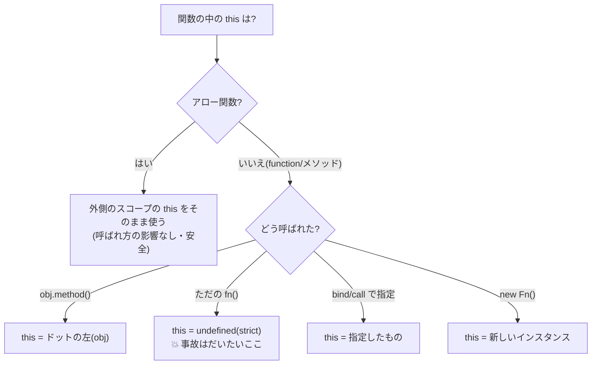

# 第10章 受付係の混乱 — this の謎を解く

## 🍺 今日のお話

営業終了を知らせる呼び鈴を自動化しようとした受付係が、頭を抱えています。

```typescript
class TavernBell {
  guildName = "Typed Tavern";

  ring() {
    console.log(`🔔 ${this.guildName} は間もなく閉店です`);
  }
}

const bell = new TavernBell();
bell.ring();                       // 🔔 Typed Tavern は間もなく閉店です ← 正常

setTimeout(bell.ring, 1000);       // 1 秒後に自動で鳴らす……はずが
// 💥 TypeError: Cannot read properties of undefined (reading 'guildName')
```

**同じメソッドなのに、渡し方を変えただけで壊れた。** 犯人は `this` です。
JavaScript 学習の最大の難所ですが、ルールは 1 つ知れば全部解けます。今日で片を付けましょう。

## 大原則 — this は「定義した場所」ではなく「呼ばれ方」で決まる

多くの言語(Java, Python)では、メソッドの `this`(`self`)は「そのインスタンス」で
固定です。しかし JavaScript の `function` / メソッドの `this` は、
**関数を「どう呼んだか」によって毎回決まります**。

| 呼ばれ方 | this の中身 | 例 |
|---|---|---|
| ① `obj.method()` — オブジェクト経由 | **ドットの左側**(`obj`) | `bell.ring()` → `this` は `bell` |
| ② `fn()` — ただの関数として | `undefined`(strict モード時) | `const f = bell.ring; f()` → 💥 |
| ③ `fn.call(x)` / `fn.bind(x)` — 明示指定 | 指定した `x` | `bell.ring.call(bell)` |
| ④ `new Fn()` | 生成中の新しいインスタンス | `new TavernBell()` の constructor 内 |

事故の正体はこうです:

```typescript
bell.ring();                 // ① ドットの左は bell → this = bell ✅

const f = bell.ring;         // メソッドを「取り外して」ただの関数として変数に入れた
f();                         // ② ドットがない呼び出し → this = undefined 💥

setTimeout(bell.ring, 1000); // setTimeout に渡した時点で「取り外し」が起きている。
                             // 1 秒後、タイマーは f() の形(②)で呼ぶ → 💥
```

> 📜 **歴史の背景 — なぜこんな仕様なのか**
>
> 第 4 章で見たとおり、JavaScript の関数は **オブジェクトから独立した「値」** です
> (Scheme の血)。関数はどのオブジェクトにも所属しておらず、`bell.ring` は
> 「bell のプロパティに、たまたま関数という値が入っている」だけです。
>
> では取り外し可能な関数の中で `this` は何を指すべきか? 10 日間の設計では
> 「呼び出しの瞬間に、ドットの左側を this にする」という動的な解決が選ばれました。
> 1 つの関数を複数のオブジェクトで使い回せる柔軟さと引き換えに、
> 「関数を渡した瞬間に this が迷子になる」という 30 年分の混乱が生まれたのです。
> Java 風の見た目(class、this)と Scheme の中身(関数は独立した値)の **文化衝突** が、
> この仕様のほんとうの正体です。

## 解決策 1 — bind で this を縫い付ける

```typescript
setTimeout(bell.ring.bind(bell), 1000);   // 「this は bell で固定」した新しい関数を作る
```

`bind(x)` は「this を x に固定した新しい関数」を返します(③ のルール)。確実ですが、
渡すたびに書くのは忘れやすい——そこで現代の主流は次の方法です。

## 解決策 2 — アロー関数は this を「持たない」

第 4 章で「アロー関数は `this` の混乱を避けるために追加された」と予告しました。
その意味がこれです:

**アロー関数は自分の `this` を持ちません。`this` と書くと、ただの変数と同じように
「外側のスコープの this」をそのまま使います**(前章のクロージャと同じ仕組みです)。
呼ばれ方の影響を受けないので、迷子になりようがありません。

```typescript
setTimeout(() => bell.ring(), 1000);   // ✅ アロー関数の中で ①の形で呼ぶ。最も読みやすい定番
```

クラス側で根治する書き方もあります。**クラスフィールド + アロー関数**:

```typescript
class TavernBell {
  guildName = "Typed Tavern";

  // メソッド構文ではなく「アロー関数が入ったプロパティ」として定義する
  ring = () => {
    console.log(`🔔 ${this.guildName} は間もなく閉店です`);
  };
}

const bell = new TavernBell();
setTimeout(bell.ring, 1000);   // ✅ 取り外しても壊れない
```

このアロー関数は constructor 実行時(= インスタンス生成時)に生まれるので、外側の
`this` = そのインスタンスを永久に覚えています(クロージャ!)。取り外しても安全です。

💡 **使い分けの指針**: 通常のメソッドで書き、「コールバックとして渡す予定のもの」だけ
アロー関数フィールドにする、が現代のバランスです。全部フィールドにするとインスタンス
ごとに関数が複製され、第 7 章で学んだプロトタイプ共有の利点を失います。

## TypeScript は this の事故をどう防ぐか

実は TypeScript は、この章の事故をコンパイル時に検出できます。

```typescript
class TavernBell {
  guildName = "Typed Tavern";
  ring(this: TavernBell) {        // 「ただの引数に見える this」= this の型宣言(実行時には消える)
    console.log(this.guildName);
  }
}

setTimeout(bell.ring, 1000);      // ❌ コンパイルエラー: this が void になる文脈には渡せない
```

`this: TavernBell` は第 1 引数の位置に書きますが、**実行時には存在しない型専用の宣言**
です(型消去!)。また `tsconfig` の `strict` に含まれる `noImplicitThis` は、
`this` が何か分からない場所での使用をエラーにしてくれます。
「JS の 30 年の混乱を、型で少しずつ手当てする」という TypeScript の役回りがよく出ている
機能です。

## まとめの地図



**実践の結論は 2 行で済みます:**
1. コールバックには **アロー関数を渡す**(または `() => obj.method()` で包む)
2. メソッドを「取り外して」渡さない。渡したくなったらアロー関数フィールドにする

> 📜 **歴史の背景 — this 疲れが変えたエコシステム**
>
> 2015〜2018 年頃の React では、クラスコンポーネントの `this.handleClick = this.handleClick.bind(this)`
> という呪文が全員のコードに並んでいました。この this 疲れは、React が 2019 年に
> **クラスをやめて関数コンポーネント + Hooks に舵を切った** 理由の一つと言われます。
> あなたがこの後学ぶ React に class がほぼ登場しないのは、この章の混乱の歴史の帰結です。
> 現代の TS/JS 全体でも「class は道具の一つ、主役は関数」という空気が定着しています。

## ⚔️ 完成コード: `guild/src/bell.ts`

```typescript
// Typed Tavern — 10 日目: 閉店の鐘の自動化

export class TavernBell {
  #guildName: string;
  #ringCount = 0;

  constructor(guildName: string) {
    this.#guildName = guildName;
  }

  // コールバックとして渡す前提なので、アロー関数フィールドで this を焼き込む
  ring = (): void => {
    this.#ringCount += 1;
    console.log(`🔔 (${this.#ringCount} 回目) ${this.#guildName} は間もなく閉店です`);
  };

  get count(): number {
    return this.#ringCount;
  }
}
```

```typescript
// guild/src/main.ts に追記

import { TavernBell } from "./bell.js";

const bell = new TavernBell("Typed Tavern");

console.log("閉店 3 秒前…");
setTimeout(bell.ring, 1000);   // 取り外して渡しても安全
setTimeout(bell.ring, 2000);
setTimeout(() => {
  bell.ring();
  console.log(`本日の鐘: ${bell.count} 回。閉店です!`);
}, 3000);
```

実行すると 1 秒おきに鐘が鳴り、3 秒後に閉店します。……ところで、`setTimeout` で
「待っている」あいだ、プログラムは一体 **何をしている** のでしょう?実は誰も待って
いません。その種明かしが次章です。

## 📝 今日の受付業務(演習)

1. 冒頭の壊れる例(メソッド構文 + `setTimeout(bell.ring, ...)`)を実際に書いて、エラーを自分の目で確認してください。それを (a) bind、(b) アロー関数で包む、(c) アロー関数フィールド、の 3 通りで直してください。
2. `const detached = bell.ring; detached();` はアロー関数フィールド版だとなぜ動くのか、「クロージャ」という言葉を使って説明してみてください。
3. オブジェクトリテラルでも試しましょう: `const counter = { n: 0, up() { this.n++ } }` を作り、`[1,2,3].forEach(counter.up)` が期待どおり動くか、なぜかを考えてください。
4. `ring(this: TavernBell)` 方式に書き換えて、`setTimeout(bell.ring, 1000)` がコンパイル時に弾かれることを確認してください。

---

次章、ギルドに伝書フクロウがやってきます。手紙の返事を「待たない」で他の仕事を進める
——シングルスレッドの JavaScript が高速に働けるからくり、**イベントループ** の解剖です。
→ [第11章 伝書フクロウ](11_event_loop.md)
