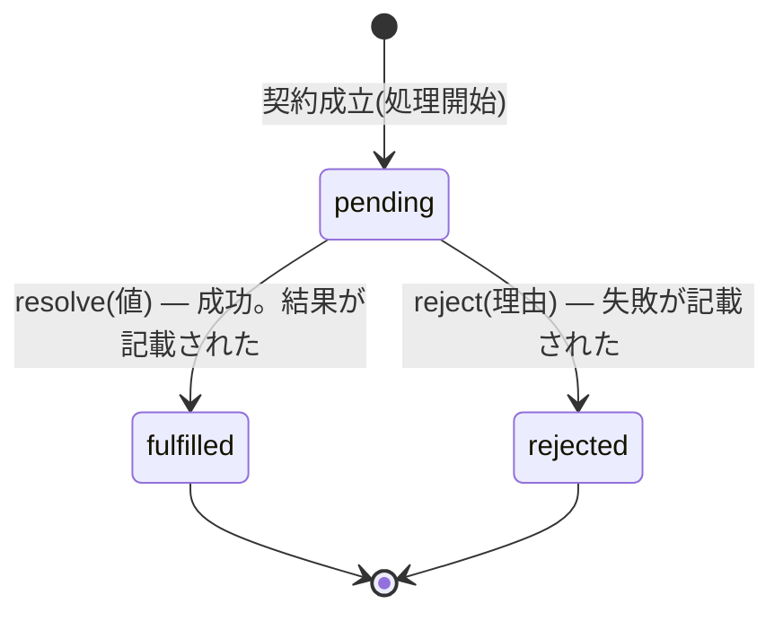

# 第12章 請負契約 — Promise と async/await

## 🍺 今日のお話

コールバック地獄に懲りたギルドは、依頼の受け渡しを **契約書方式** に改めました。
フクロウを送ると、その場で「**結果は後で必ずこの契約書に記載します**」という証書を
受け取ります。受付係は証書に「記載されたら行う処理」を書き添えておけばいい——。

この契約書こそ **Promise** です。そして Promise を同期コードのように読み書きできる
魔法の構文が **async/await** です。今日で非同期処理は怖くなくなります。

## Promise — 「後で結果を渡す」という契約書

Promise は 3 つの状態を持つオブジェクトです。



- **pending(保留)** … まだ結果待ち
- **fulfilled(成功)** … 値とともに完了。一度決まったら二度と変わらない
- **rejected(失敗)** … 理由(エラー)とともに完了。こちらも不可逆

前章の `sendOwl` を Promise 版に書き直します。**コールバックを引数で受け取る**代わりに、
**契約書を返す**形になります:

```typescript
export function sendOwl(to: string, message: string): Promise<string> {
  //                                                  ~~~~~~~~~~~~~~~ 「後で string が届く契約」
  return new Promise((resolve) => {
    const flightTime = 500 + Math.random() * 1000;
    console.log(`🦉 ${to} へ発送: 「${message}」`);
    setTimeout(() => {
      resolve(`${to} より: 「${message}」の件、承知した`);   // 契約履行!
    }, flightTime);
  });
}
```

`Promise<string>` は第 8 章のジェネリクスです——「T が後で届く」の T が `string`。
届いた後の処理は `.then()` で書き添えます:

```typescript
sendOwl("薬師ミラ", "納期確認")
  .then((reply) => {
    console.log(`📨 ${reply}`);
    return sendOwl("剣士カイ", "護衛依頼");   // then の中で次の契約を返すと…
  })
  .then((reply2) => {                          // …チェーンが「順番に」つながる
    console.log(`📨 ${reply2}`);
  })
  .catch((err) => console.log(`⚠️ フクロウ遭難: ${err}`));
```

ネストが**チェーン(直列の連鎖)**に変わり、エラー処理も `.catch` 一箇所に集約されました。
これが 2015 年(ES2015)に標準化された Promise の改善です。しかし話はここで終わりません。

## async/await — 契約書を「普通の文章」として読む

2017 年、さらに強力な構文が入りました。`.then` の連鎖すら書かず、
**同期コードと同じ見た目**で非同期処理を書けます。

```typescript
async function morningMail(): Promise<void> {
  try {
    const reply1 = await sendOwl("薬師ミラ", "納期確認");
    console.log(`📨 ${reply1}`);

    const reply2 = await sendOwl("剣士カイ", "護衛依頼");
    console.log(`📨 ${reply2}`);

    console.log("両者の合意が取れました(読みやすい!)");
  } catch (err) {
    console.log(`⚠️ フクロウ遭難: ${err}`);
  }
}

morningMail();
console.log("--- 店内業務に戻る ---");   // 相変わらずこちらが先に出る!
```

ルールは 3 つだけです。

1. **`await 契約書`** と書くと、契約が履行されるまで **その関数の続きを保留** し、
   履行されたら中身(`string`)を取り出して再開する
2. `await` は **`async` を付けた関数の中でだけ** 使える(モジュール直下でも可)
3. `async` 関数の戻り値は **自動的に Promise に包まれる**(`return "x"` すると
   `Promise<string>` になる)。エラーは普通の `try/catch` で受けられる

> ⚙️ **ランタイムの真実 — await は「実行係を止めない」**
>
> `await` で「保留」と言いましたが、前章の鉄の掟(実行係を占拠するな)は破っていません。
> `await` に到達すると、その関数は **今の状態をしおりのように保存して、実行係を明け渡します**。
> 実行係はその間ほかの仕事(店内業務や別のフクロウの返事)を進め、契約が履行されたら
> イベントループ経由でしおりの位置から再開します。
>
> つまり async/await は **見た目だけ同期、中身は前章のイベントループそのもの** です。
> 新しい実行モデルではなく、コールバックの書き味を改善した「構文の衣」なのです。
> だからこそ `morningMail()` を呼んだ直後に「店内業務に戻る」が先に表示されます——
> async 関数の呼び出しは「契約書を受け取るだけ」で、待ちたければそこでも `await` が要ります。

> 📜 **歴史の背景 — 地獄からの脱出 20 年史**
>
> - **1995〜**: コールバックのみ。地獄の時代へ
> - **2010 年代前半**: 民間で Promise ライブラリが乱立(jQuery Deferred, Q, Bluebird…)。
>   良いパターンが実戦で淘汰され、**2015 年に言語標準へ**(民間の発明→標準化、という
>   JavaScript らしい進化。CommonJS→ESM と同じ道筋です)
> - **2017 年**: C# の async/await 構文を輸入(ここにも第 8 章のヘルスバーグの影響が)
>
> [Python の asyncio](../../02-python-fable-101/chapters/14_async.md) も同じ構文を採用しましたが、
> Python では「同期の世界と async の世界」の分断(いわゆる**色付き関数問題**)が悩みに
> なっています。JavaScript は **そもそも全部が非同期前提**(ブロッキングする選択肢が最初から
> ほぼない)ため、この分断が比較的浅いのが特徴です。ちなみに [Go](../../03-go-fable-101/chapters/12_goroutines.md) は
> goroutine によって「async と書かなくても全部非同期」という第三の道を選びました。

## 直列と並列 — await の落とし穴

`await` を素朴に並べると **直列**(前が終わるまで次を送らない)になります。
互いに依存しない仕事なら、**先に全部の契約を発行してからまとめて待つ**方が速い:

```typescript
// 🐢 直列: 合計 = ミラ便 + 村長便(片方ずつ飛ぶ)
const r1 = await sendOwl("薬師ミラ", "納期確認");
const r2 = await sendOwl("村長", "完了報告");

// 🚀 並列: 合計 = 遅い方だけ(2 羽同時に飛ぶ)
const p1 = sendOwl("薬師ミラ", "納期確認");   // await しない = 発送だけして契約書を持つ
const p2 = sendOwl("村長", "完了報告");
const [reply1, reply2] = await Promise.all([p1, p2]);   // 全契約の履行をまとめて待つ
```

| 道具 | 意味 |
|---|---|
| `Promise.all([...])` | **全部**成功したら結果の配列。1 つでも失敗したら即失敗 |
| `Promise.allSettled([...])` | 成否にかかわらず全部の結末を待つ(一斉送信の集計に) |
| `Promise.race([...])` | **最初に決着した 1 件** を採用(タイムアウト実装の定番) |

## ⚔️ 完成コード: `guild/src/owl.ts`(Promise 版に全面改装)

```typescript
// Typed Tavern — 12 日目: フクロウ便・契約書方式

export function sleep(ms: number): Promise<void> {
  return new Promise((resolve) => setTimeout(resolve, ms));   // 頻出の便利関数
}

export async function sendOwl(to: string, message: string): Promise<string> {
  const flightTime = 500 + Math.random() * 1000;
  console.log(`🦉 ${to} へ発送: 「${message}」`);
  await sleep(flightTime);
  if (Math.random() < 0.1) {
    throw new Error(`${to} 行きのフクロウが嵐で引き返した`);   // 10% で配達失敗
  }
  return `${to} より: 「${message}」の件、承知した`;
}
```

```typescript
// guild/src/main.ts — 朝の一斉送信

import { sendOwl } from "./owl.js";

async function morningDispatch(): Promise<void> {
  console.log("--- 朝の一斉送信 ---");

  const results = await Promise.allSettled([
    sendOwl("薬師ミラ", "薬草の納期確認"),
    sendOwl("村長", "ゴブリン退治の完了報告"),
    sendOwl("剣士カイ", "新依頼の紹介"),
  ]);

  for (const r of results) {
    if (r.status === "fulfilled") {
      console.log(`📨 ${r.value}`);
    } else {
      console.log(`⚠️ ${r.reason}`);        // 失敗も握りつぶさず報告
    }
  }
  console.log("--- 全フクロウの結果が出そろいました ---");
}

await morningDispatch();   // モジュール直下では await をそのまま書ける(top-level await)
```

💡 `results` に対する `r.status === "fulfilled"` の分岐は、第 5 章の判別可能 union
そのものです。標準ライブラリの型も、あなたが学んだ道具でできています。

## 📝 今日の受付業務(演習)

1. 前章の演習 4 で書いた「3 段のコールバック地獄」を async/await で書き直し、行数と読みやすさを比べてください。
2. `sendOwl` を 3 回、直列(await を並べる)と並列(`Promise.all`)で送り、`console.time("dispatch")` / `console.timeEnd("dispatch")` で所要時間を計測・比較してください。
3. `Promise.race` と `sleep` を使って「2 秒以内に返事が来なければ『時間切れ』と表示する」`sendOwlWithTimeout` を作ってください。
4. `await` を付け忘れて `const reply = sendOwl(...)` と書くと、`reply` の型は何になりますか?`console.log(reply)` の表示と合わせて確認してください(TypeScript がこのミスをどう警告するかも観察を。`Promise<string>` のまま使おうとするとエラーになります)。

---

これで中級編は修了です。🌳 上級編の最初は、TypeScript の型システムの奥の間へ。
`Partial` や `keyof` など、**型から型を作り出す** 魔導書の扉を開きます。
→ [第13章 型の魔導書](13_advanced_types.md)
