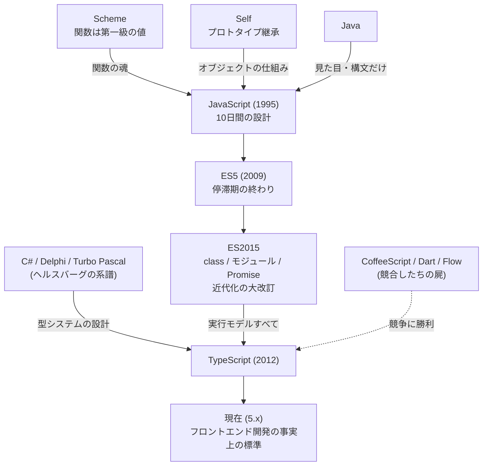
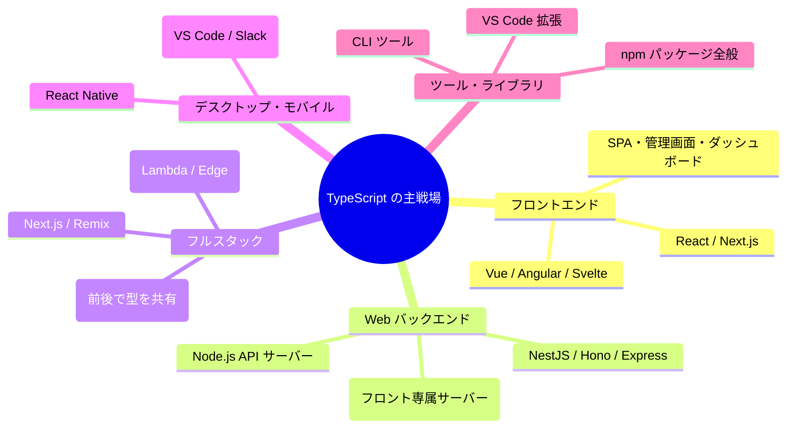

# 🟦 TypeScript という言語 — 系譜・思想・強み・弱みの全体像

この章は文法の解説ではなく、**「TypeScript とはどういう言語で、なぜフロントエンドの標準になり、どこで嫌われているのか」** を俯瞰するための読み物です。教材本編(chapters)に入る前でも、一通り学び終えた後でも読めます。

TypeScript を語ることは、その土台である **JavaScript を語ること** と不可分です。この文書も 2 つの言語を行き来しながら進みます。

---

## 1. 生い立ちと系譜

物語は 2 段階です。まず JavaScript が生まれ、17 年後にその上へ TypeScript が被さりました。

### 第 1 幕: JavaScript(1995)— 10 日間で生まれた言語

1995 年、ブラウザ戦争のさなかの Netscape 社で、**ブレンダン・アイク**が **わずか 10 日間で** 設計しました。「Java が流行っているから名前を似せろ」という営業判断で JavaScript と命名されましたが、Java との血縁はありません。中身はむしろ、**Scheme(関数が第一級の値)** と **Self(プロトタイプベースのオブジェクト)** という 2 つの研究言語の思想に、Java 風の見た目を被せたものです。

### 第 2 幕: TypeScript(2012)— 巨大化した JS への「あとから型」

2000 年代後半、Gmail や Google Maps の登場で「Web ページ」は「Web アプリ」になり、JavaScript のコードベースは数十万行に膨張しました。動的型付けの JS では大規模開発が破綻しかける中、2012 年に Microsoft が TypeScript を公開します。設計者は **アンダース・ヘルスバーグ** — Turbo Pascal、Delphi、C# を作った静的型付け言語の巨匠です。

系譜のポイントは、TypeScript が **「JavaScript を置き換えない」と誓った** ことです。競合の CoffeeScript(別構文)や Dart(当初は別 VM 構想)が「JS を乗り越える」道を選んで敗れたのに対し、TypeScript は「JS のコードはそのまま有効な TS。型を足すだけ。実行時には消える」という **徹底した共存戦略** で勝ちました。

### 歴史の転換点

| 年 | 出来事 | 意味 |
|---|---|---|
| 1995 | JavaScript 誕生 | 10 日間の設計。栄光と呪いの始まり |
| 1997〜 | ECMAScript として標準化 | 以後、言語仕様は委員会(TC39)が管理 |
| 2000 年代 | ES4 の失敗 | **型を入れる大改訂が頓挫**。言語は 10 年停滞し、この空白が後の TS の市場を作った |
| 2008〜09 | V8 エンジンと Node.js | JS が高速化し、ブラウザの外(サーバー)へ進出 |
| 2012 | TypeScript 公開 | 「あとから型」の挑戦。当初は懐疑的に迎えられた |
| 2015 | ES2015 + Angular 2 が TS 採用 | JS 本体の近代化と、大手フレームワークのお墨付き |
| 2016 | TypeScript 2.0 | `strictNullChecks` 導入 — null 安全という決定打 |
| 2010 年代後半 | VS Code・React の普及 | TS 製エディタ TS で書く文化が定着。Flow など競合が脱落 |
| 2020 年代 | デフォルト化 | 新規プロジェクトは TS が当然に。Deno / Bun は TS をネイティブ実行 |
| 2023〜 | ランタイムへの浸透 | Node.js 本体が型注釈の除去をサポート。TC39 に「JS 本体に型注釈の構文だけ入れる」提案も |

---

## 2. 設計思想 — 「JavaScript を裁かず、支える」

TypeScript の設計目標には、他の言語には見られない奇妙な一文があります。

> **「健全で証明可能に正しい型システムを適用しない」**(公式 Design Non-Goals より)

普通の静的型付け言語は「型が通れば実行時型エラーはない」という **健全性(soundness)** を目指します。TypeScript は最初からそれを **捨てました**。目指したのは「実世界の JavaScript の書き方を、できる限り表現し、間違いの大半を捕まえる」こと。学術的な正しさより、**現場の生産性** を選んだ型システムです。

もう 1 つの柱が **段階的型付け(gradual typing)** です。`.js` を `.ts` に変えるだけで始められ、`any` で型付けを一時停止でき、厳しさ(`strict`)は設定で選べる。「全部書き直せ」と言わない移行戦略こそが、TypeScript 普及の最大の武器でした。

- **型は実行時に消える(型消去)** — ランタイムに一切手を加えない。JS と 100% 共存
- **構造的型付け** — 宣言ではなく「形」で型が合う。野生の JS オブジェクトに型を付けるための必然
- **推論を最大化** — 書かなくても分かる型は書かせない

一言でいえば TypeScript は「JavaScript の**書き直しを要求しない**型システム」であり、その代償として理論的な完全性を意図的に手放した、**極めて実用主義的な言語** です。

---

## 3. 言語としての特徴

### 3.1 上位互換(スーパーセット)という立ち位置

有効な JavaScript はすべて有効な TypeScript です。だから「JS を学ぶ」と「TS を学ぶ」は別のことではなく、TS の学習は実質 **「JS + 型の層」** の学習になります。逆に言えば、`this` やイベントループなど **実行時の挙動の難しさは JS のまま残っています**。型はそれを消してくれません(だからこの教材は「TS で書き、JS で理解する」方針なのです)。

### 3.2 世界最強クラスの型推論と narrowing

`if (typeof x === "string")` と **普通の JS の条件分岐を書くだけ** で、そのブロック内の型が絞り込まれます(制御フロー解析)。union 型・リテラル型・判別可能 union と組み合わせると、「ありえない状態をコンパイルエラーにする」設計が日常の道具になります。

### 3.3 型から型を計算できる

`keyof`、mapped types、conditional types により、既存の型から新しい型を **導出** できます。`Partial<Quest>`(全部任意版)のような派生型を手書きせずに済み、元が変われば派生も自動で追従します。この表現力は主要言語で群を抜いており、**型システムはチューリング完全** です(型だけでチェスが書けるほど — 実用性はさておき)。

### 3.4 エディタ体験こそが本体

TypeScript の実体は「コンパイラ」であると同時に **「言語サービス」** です。VS Code の補完・リネーム・定義ジャンプ・赤線は、すべて TS のエンジンが提供しています。**JavaScript しか書かない人でさえ、エディタの裏で TS の恩恵を受けています**。「型はドキュメントであり、補完データベースである」— 実務で TS が手放せなくなる最大の理由はこれです。

### 3.5 シングルスレッド + イベントループ(JS 由来)

実行モデルは JavaScript そのもの: 実行スレッドは 1 本、待ち仕事(I/O)はランタイムに手放し、完了したらコールバックで戻る。`async/await` はその上の糖衣です。[Go の goroutine](../../03-go-fable-101/language-overview/README.md) とは対照的な並行モデルですが、「I/O 待ちが大半」という Web の仕事にはよく適合します。

---

## 4. TypeScript(と JS)の特異な点(他言語経験者が驚くところ)

| 特異な点 | 説明 |
|---|---|
| **型が実行時に存在しない** | `as Quest` は検査ではなく「そういうことにする」宣言。外部データは型注釈では守れず、実行時検証(zod 等)が必須 |
| **構造的型付け** | interface を名乗らなくても形が合えば通る。Java/C# の名前的型付けの真逆 |
| **`any` という緊急脱出口** | 1 つの `any` が触れた先の型検査を連鎖的に無効化する。「便利で危険な麻薬」 |
| **健全性の意図的放棄** | 型が通っても実行時型エラーはあり得る(設計思想)。「型は保証ではなく強力な補助」 |
| **this が呼ばれ方で変わる** | メソッドを変数に取り出すと壊れる、JS 最大の初見殺し。アロー関数が対策 |
| **「無」が 2 つある** | `undefined` と `null`。歴史的事故で、30 年直せていない |
| **`==` が使い物にならない** | 暗黙型変換だらけの比較。全員が `===` だけを使う |
| **number に整数型がない** | すべて 64bit 浮動小数点。`0.1 + 0.2 !== 0.3` |
| **配列 API の破壊/非破壊混在** | `sort` は元を書き換え、`map` は書き換えない。歴史の地層 |
| **モジュール方式が 2 つ** | CommonJS と ESM の共存。設定ミスによるエラーは全員が一度は踏む |
| **言語に公式ツールがない** | フォーマッタもテストも民間ツールの競争(Go の gofmt と対極) |

---

## 5. どういうシステムでよく使われるか

### 得意な領域

- **フロントエンド全般** — 事実上の独占。React も Vue も Angular も、現代の開発は TS が前提です。ブラウザで動く言語は実質 JS だけなので、競合が存在しません
- **フルスタック Web 開発** — **サーバーとブラウザを 1 言語で書ける** のは JS/TS だけの特権。API の型定義をフロントとバックで共有できる(tRPC、Next.js の Server Actions)のは他言語構成では真似できない強みです
- **I/O 中心の API サーバー** — イベントループが大量同時接続に強く、開発者人口も多い
- **デスクトップアプリ** — VS Code、Slack、Discord は Electron(中身はブラウザ + Node)製

### 不得意な領域

- **CPU を使い倒す処理** — 数値計算・機械学習・動画処理はシングルスレッドの弱点が直撃。この領域は [Python(実体は C/CUDA)](../../02-python-fable-101/language-overview/README.md) や Go・Rust の縄張り
- **システム・組み込み・OS** — GC とランタイムが必須なので不向き
- **正確な数値計算が要る金融の中核** — number の浮動小数点問題。回避策(整数化、decimal ライブラリ)はあるが本質的に不得手
- **単一バイナリ配布の CLI** — [Go](../../03-go-fable-101/language-overview/README.md) のような手軽さはない(Bun や Deno が挑戦中)

---

## 6. 課題と「嫌われている点」

言語を選ぶには、賞賛より批判を知る方が役に立ちます。よく聞く批判を正直に並べます。TS への批判は「JS 由来の呪い」と「TS 自身の業」の 2 層に分かれます。

### 6.1 【JS 由来】土台の言語の歴史的負債

`==`、`this`、2 つの「無」、`typeof null === "object"`、破壊/非破壊の混在——第 4 節の表に並べた奇妙さはすべて実行時に健在です。TypeScript は多くを型で緩和しますが、**治療ではなく鎮痛** です。「きれいな言語を学びたかったのに、歴史の地層の暗記を強いられる」という不満は正当です。

### 6.2 【JS 由来】ツールチェーンとモジュール地獄

**おそらく最も恨まれているポイント**です。`package.json` の `"type"`、CommonJS と ESM、`tsconfig.json` の数十のオプション、バンドラ・トランスパイラ・リンタの選定……。「Hello World の前に設定ファイルと 1 時間格闘する」体験は初心者を確実に削ります。言語に公式ツールがなく民間の競争で進む文化は、革新が速い反面、**「正解が毎年変わる」疲労**(いわゆる JavaScript fatigue)を生みました。近年は Vite や Biome、ランタイムの TS ネイティブ対応で収束傾向にありますが、歴史的悪名は根深いです。

### 6.3 【TS の業】型が実行時に守ってくれない

`as` で嘘をつける、`any` が伝染する、API レスポンスは型注釈と無関係に壊れている——「型が通ったのに実行時に落ちた」体験は、健全な型システムの言語(Rust、Haskell、[Go](../../03-go-fable-101/language-overview/README.md) ですら)から来た人を失望させます。「TypeScript の型は**契約ではなく紳士協定**」と揶揄される所以です。境界での実行時検証(zod 等)を自分で規律立てて行う必要があり、それは言語が強制してくれません。

### 6.4 【TS の業】型パズルの複雑化

型システムが強力すぎるゆえに、ライブラリの型定義は魔境化しがちです。エラーメッセージが数百行の型式で埋まる、`Type instantiation is excessively deep` に遭遇する、同僚の書いた conditional type が読めない——「**素の JS より、凝った型の方が難しい**」という本末転倒への不満は増え続けています。「型体操(type gymnastics)」は半ば揶揄の言葉です。

### 6.5 【TS の業】ビルド工程の存在そのもの

JS はファイルを置けば動く言語だったのに、TS はコンパイルという一手間を常に要求します。大規模プロジェクトでは `tsc` の遅さも問題になり、2023 年頃から「ライブラリは素の JS + JSDoc コメントで十分では?」という揺り戻し(Svelte などが一部採用)も起きました。Microsoft 自身がコンパイラの Go 言語による移植(約 10 倍高速化)を進めているのは、この不満への回答です。

### 6.6 標準化の外にいる不安

TypeScript は ECMAScript のような公的標準ではなく、**Microsoft が単独で開発する言語** です。バージョン間で型検査の挙動が変わり(semver に従わないことは公式に明言されています)、アップデートで既存コードに新しいエラーが出ることもあります。「一企業の方針に Web 開発全体が依存してよいのか」という構造的な批判は残り続けています(TC39 への型注釈構文の提案は、この不安への長期的な布石です)。

### 6.7 その他よく聞く不満

- **エコシステムの型定義の質がまちまち** — `@types/*` が古い・間違っているライブラリを踏むと型が嘘をつく
- **enum・namespace など「消えない構文」の負の遺産** — 型消去の原則に反する初期機能で、現在は非推奨傾向。初学者を混乱させる
- **コンパイルエラーの日本語感覚との乖離** — エラー文が長く、最後の 1 行しか役に立たないことが多い
- **ランタイムの分裂** — Node / Deno / Bun の三つ巴で、また選択肢が増えた

---

## 7. まとめ — TypeScript はどういう言語か

一言でいえば、**「歴史的事故で世界標準になった言語(JavaScript)を、書き直さずに救済するための言語」** です。

- ブラウザで動く唯一の言語という **代替不可能な立地** の上に立ち、フロントエンドでは事実上の独占
- 型システムは学術的な正しさより **現場の移行可能性と生産性** に全振り。その割り切りが勝因であり、批判の的でもある
- 「型は実行時に消える」「健全性は保証しない」という 2 つの割り切りを理解しているかどうかが、TS 使いの分水嶺
- サーバーとブラウザを 1 言語で貫けるフルスタック性は、[Python](../../02-python-fable-101/language-overview/README.md) にも [Go](../../03-go-fable-101/language-overview/README.md) にもない固有の武器

3 言語を並べると、それぞれの最適化対象がきれいに分かれます: **Python は「人間の時間」、Go は「チームと機械の時間」、そして TypeScript は「JavaScript と共存するしかない現実」** に最適化された言語です。読み比べると、言語設計とはトレードオフの芸術だということが立体的に見えてきます。
