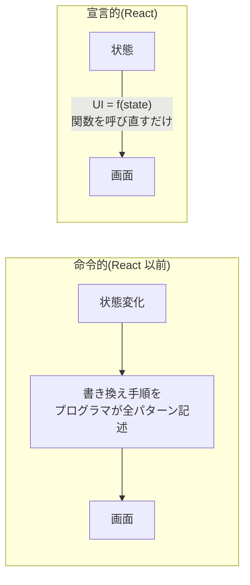

# 第1章 幕を上げる — JSX とコンポーネントと宣言的 UI

## 🎭 今日のお話

あなたは今日から劇場「Reactive Theater」の舞台監督です。初仕事は **劇場の看板を出す** こと。
……ただの看板と侮ってはいけません。この一枚に、React という道具の思想が全部詰まっています。

まず `src/App.tsx` を開き、中身をすべて消して、こう書き換えてください:

```tsx
function App() {
  return (
    <main>
      <h1>🎭 Reactive Theater</h1>
      <p>本日の演目: ハムレット</p>
    </main>
  );
}

export default App;
```

保存するとブラウザが自動更新され、看板が表示されます。開幕です。

## コンポーネント — 画面の部品は「関数」

`App` は **ただの TypeScript の関数** です。特別な登録も継承もありません。
**「画面の一部分(JSX)を返す関数」を、React ではコンポーネントと呼びます。**

```tsx
// 役者(コンポーネント)をもう一人作る
function StageSign() {
  return <p>開演 19:00 / 開場 18:30</p>;
}

function App() {
  return (
    <main>
      <h1>🎭 Reactive Theater</h1>
      <StageSign />
      <StageSign />   {/* 同じ役者を何度でも舞台に上げられる */}
    </main>
  );
}
```

- コンポーネント名は **必ず大文字で始めます**。`<StageSign />` のように大文字なら
  「自作コンポーネント」、`<p>` のように小文字なら「HTML のタグ」と React が区別するためです
- 一度作った部品は **何度でも・どこでも** 使い回せます。「画面を部品の組み合わせで作る」——
  これが React の第一の発想です

## JSX — JavaScript の中に書く「画面の設計図」

HTML にそっくりなこの記法は **JSX** と呼ばれます。HTML との重要な違いは、
**`{}` の中に TypeScript の式を埋め込める** ことです。

```tsx
function App() {
  const theater = "Reactive Theater";
  const now = new Date().getHours();
  const isOpen = now >= 18;

  return (
    <main>
      <h1>🎭 {theater}</h1>
      <p>ただいま {now} 時 — {isOpen ? "開場中です" : "準備中です"}</p>
      <p>木戸銭: {1500 * 1.1} 円(税込)</p>
    </main>
  );
}
```

[テンプレートリテラルの `${}`](../../04-typescript-fable-101/chapters/01_variables.md) の
JSX 版だと思えばほぼ正解です。変数・計算・三項演算子・関数呼び出し——**式なら何でも**
入ります(`if` 文や `for` 文は「式」ではないので入りません。その代わりの書き方を
第 3 章で学びます)。

HTML と微妙に違う点も先に押さえておきましょう:

| HTML | JSX | 理由 |
|---|---|---|
| `class="sign"` | `className="sign"` | `class` は JS の予約語だから |
| `<br>` | `<br />` | タグは必ず閉じる |
| `onclick="..."` | `onClick={...}`(第 4 章) | 文字列ではなく関数を渡す |
| 複数の要素を並べて返す | 1 つの親要素(または `<>...</>`)で包む | 関数の戻り値は 1 つだから |

> ⚙️ **舞台裏の真実 — JSX は「ただの関数呼び出し」に変換される**
>
> ブラウザは JSX を知りません。[TypeScript の型が実行前に消される](../../04-typescript-fable-101/chapters/01_variables.md)
> のと同じように、JSX もビルド時に **素の関数呼び出しへ変換** されます:
>
> ```tsx
> <h1 className="sign">🎭 {theater}</h1>
> // ↓ 変換後(イメージ)
> jsx("h1", { className: "sign", children: ["🎭 ", theater] })
> ```
>
> つまり JSX は「HTML もどき」ではなく、**「画面の設計図オブジェクトを作る TypeScript の式」**
> です。`{}` に式が書けるのも、JSX を変数に入れたり関数から返したりできるのも、
> 正体がただの式だから。Vite(開発サーバー)がこの変換を裏でやってくれています。

## 宣言的 UI — React 最大の発想転換

ここからが今日の本題です。看板に「残席数」を出すことを考えます。

React 以前の世界(命令的スタイル)では、こう書いていました:

```typescript
// jQuery 時代の書き方(雰囲気)— 「画面をどう書き換えるか」の手順書
const el = document.querySelector("#seats");
el.textContent = `残席 ${seats} 席`;
if (seats === 0) {
  el.classList.add("soldout");
  document.querySelector("#buy-button").setAttribute("disabled", "true");
}
```

「席が減ったら文字を書き換え、0 になったらクラスを足し、ボタンを無効化し……」。
状態が 3 つ 4 つと絡み合うと、**「今画面がどうなっているか」は誰にも分からなくなります**。
書き換え手順の網羅漏れが、そのまま画面のバグになるからです。

React では発想を逆転させます。**手順を書くのをやめて、「状態がこうなら、画面はこうである」
という対応だけを宣言します**:

```tsx
function SeatSign({ seats }: { seats: number }) {   // 引数の書き方は第 2 章で
  if (seats === 0) {
    return <p className="soldout">本日完売御礼!</p>;
  }
  return <p>残席 {seats} 席</p>;
}
```

- 席数がどう変わろうと、**画面の書き換え手順はどこにも書きません**
- 状態(seats)が変わったら、React が **もう一度この関数を呼び直して**、画面を作り直します



この関係は **`UI = f(state)`**(画面は状態の関数)という一行に要約されます。
画面の正しさは「関数 f が正しいか」だけで決まり、遷移の経路(どの順で状態が変わったか)に
依存しません。この教材の残り全部は、この一行の応用です。

> 📜 **歴史の背景 — 「毎回全部作り直す」という暴論が勝った日**
>
> React は 2013 年、Facebook の **ジョーダン・ウォルキー** が公開しました。ニュースフィードの
> ような「あちこちが連動して更新される画面」で、命令的な DOM 書き換えの管理が限界に
> 達していたのです。
>
> 「状態が変わるたびに画面を全部作り直せば、書き換え手順は不要になる」という発想は、
> 当時は暴論でした。DOM の再構築は遅いからです。React の答えが **仮想 DOM** ——
> 本番の舞台(実 DOM)をいきなり作り直すのではなく、**稽古場で安く全部作り直し、
> 本番との差分だけを反映する**仕組みでした(詳細は第 10 章)。
>
> もう一つの当時の非常識が JSX です。「HTML と JS を混ぜるな(関心の分離)」という
> 常識に真っ向から反し、公開直後は大バッシングを受けました。React 側の反論は
> 「**見た目とロジックは元々一体だ。技術の種類(HTML/JS)で分けるのではなく、
> 機能(部品)で分けるべきだ**」。10 年後、この考え方(コンポーネント指向)は
> Vue も他のフレームワークも含めた業界全体の標準になりました。

## ⚔️ 完成コード: `src/App.tsx`

```tsx
// Reactive Theater — 開場 1 日目

function StageSign() {
  return <p>開演 19:00 / 開場 18:30 / 木戸銭 {(1500 * 1.1).toFixed(0)} 円</p>;
}

function SeatSign({ seats }: { seats: number }) {
  if (seats === 0) {
    return <p>🈵 本日完売御礼!</p>;
  }
  return <p>残席 {seats} 席</p>;
}

function App() {
  const title = "ハムレット";
  const seats = 12;

  return (
    <main>
      <h1>🎭 Reactive Theater</h1>
      <h2>本日の演目: {title}</h2>
      <StageSign />
      <SeatSign seats={seats} />
    </main>
  );
}

export default App;
```

`seats` を `0` に書き換えて保存してみてください。**書き換え手順を 1 行も書いていないのに**、
看板が完売表示に変わります。`UI = f(state)` を最初に体感する瞬間です。

## 📝 今日の舞台稽古(演習)

1. `TheaterFooter` コンポーネント(住所と「© Reactive Theater」を表示)を作り、`App` に追加してください。
2. `const price = 1500` を定義し、「学生割引(2 割引)」の価格を `{}` 内の計算で表示してください。
3. JSX の中で `{new Date().toLocaleDateString("ja-JP")}` を表示してみてください。「式なら何でも書ける」の確認です。
4. `return` の直後に 2 つの `<p>` を親要素なしで並べるとどんなエラーが出るか観察し、`<>...</>`(フラグメント)で包んで直してください。

---

次章、役者たちに **台本** を配ります。同じ役者が台本しだいで別の演目を演じられるように、
コンポーネントを「引数で動きが変わる部品」に進化させます。 → [第2章 台本を渡す](02_props.md)
