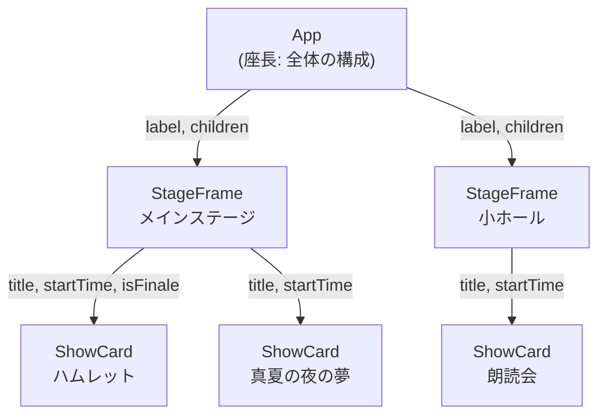

# 第2章 台本を渡す — props と合成

## 🎭 今日のお話

Reactive Theater には演目カードの看板が 3 枚必要になりました。「ハムレット 19:00」
「真夏の夜の夢 14:00」「マクベス 千秋楽」。前章の調子で `HamletCard`、`DreamCard`、
`MacbethCard` と 3 つのコンポーネントを作りますか? ——それは台本を役者に
丸暗記させるようなものです。

役者は一人でいい。**台本(データ)を外から渡せば、同じ役者が何役でも演じられる**。
この台本が **props** です。

## props — コンポーネントの引数

コンポーネントは関数なので、引数を受け取れます。React では慣習として、
すべての引数を **1 つのオブジェクト**(props)にまとめて渡します。

```tsx
interface ShowCardProps {
  title: string;
  startTime: string;
  isFinale?: boolean;     // ? 付き = 省略可能(TS 第3章と同じ)
}

function ShowCard({ title, startTime, isFinale = false }: ShowCardProps) {
  //               ~~~~~~~~~~~~~~~~~~ props オブジェクトをその場で分割代入するのが定番
  return (
    <section className="card">
      <h3>{title} {isFinale && "🌸 千秋楽"}</h3>
      <p>開演 {startTime}</p>
    </section>
  );
}

function App() {
  return (
    <main>
      <h1>🎭 Reactive Theater — 本日の演目</h1>
      <ShowCard title="ハムレット" startTime="19:00" />
      <ShowCard title="真夏の夜の夢" startTime="14:00" />
      <ShowCard title="マクベス" startTime="18:00" isFinale />
    </main>
  );
}
```

- JSX の属性のような書き方 `title="ハムレット"` が、そのまま props になります
- 文字列以外の値は `{}` で渡します: `seats={12}`、`isFinale={true}`(値なしの `isFinale` は
  `true` の省略記法)
- props の型は [interface](../../04-typescript-fable-101/chapters/03_objects_arrays.md) で定義します。
  **渡し忘れ・typo・型違いはすべてコンパイルエラー** になります。TypeScript で React を
  書く最大の御利益は、この props の検査です

> 💡 `{title} {isFinale && "🌸 千秋楽"}` の `&&` は「左が truthy なら右を表示」という
> JSX の定番イディオムです(第 3 章で正式に扱います)。

## 掟 — props は読み取り専用

React には破ってはならない掟があります: **コンポーネントは受け取った props を
書き換えてはならない。**

```tsx
function ShowCard({ title, startTime }: ShowCardProps) {
  title = title + "(改)";   // ❌ 動いてしまうが、React の world では御法度
  ...
}
```

なぜか。前章の `UI = f(state)` を思い出してください。React の世界では、
**同じ props を渡したら、必ず同じ画面が返ってくる** ことが大前提です(数学の関数と
同じ意味で「関数」であること)。役者が台本を勝手に書き換えたら、監督は舞台の
仕上がりを予測できません。

- 表示を変えたければ、**親が別の props を渡し直す**(台本の改訂は監督の仕事)
- この一方通行の流れ(親 → 子)を **単方向データフロー** と呼び、React の秩序の源です

💡 TypeScript がこの掟を守らせてくれます: props の interface のプロパティに
[readonly](../../04-typescript-fable-101/chapters/03_objects_arrays.md) を付ける流儀もありますが、
実は分割代入で受けている限り書き換えても親には影響しません
([オブジェクトの参照](../../04-typescript-fable-101/chapters/03_objects_arrays.md)のコピーを
受け取っているため)。それでも「書き換えない」を習慣にするのは、第 7 章で学ぶ
不変性の文化に直結するからです。

## children — 「中身」を差し込める枠

タグで挟んだ中身は、特別な props **`children`** として渡ります。

```tsx
interface StageFrameProps {
  label: string;
  children: React.ReactNode;   // 「JSX として描画できるものなら何でも」の型
}

function StageFrame({ label, children }: StageFrameProps) {
  return (
    <section style={{ border: "2px solid gold", padding: "1rem" }}>
      <h2>🎪 {label}</h2>
      {children}                {/* 挟まれた中身がここに差し込まれる */}
    </section>
  );
}

function App() {
  return (
    <StageFrame label="メインステージ">
      <ShowCard title="ハムレット" startTime="19:00" />
      <p>※ 本日は満員が予想されます</p>
    </StageFrame>
  );
}
```

`StageFrame` は「額縁」だけを提供し、**中に何を入れるかは使う側が決めます**。
モーダル、カード、レイアウト枠……「枠と中身の分離」は React 設計の最頻出パターンです。

> ⚙️ **舞台裏の真実 — JSX を値として渡している**
>
> 前章で「JSX の正体は設計図オブジェクトを作る式」と学びました。つまり `children` とは、
> **子の設計図オブジェクトが props として渡ってきたもの** です。JSX は値なので、
> 変数に入れることも、props で渡すことも、配列に並べることも自由自在です:
>
> ```tsx
> const notice = <p>※ 未就学児はご遠慮ください</p>;   // JSX を変数に保存
> <StageFrame label="ご案内">{notice}</StageFrame>     // 値として差し込む
> ```
>
> [「関数もオブジェクトもすべて値」という JS の性質](../../04-typescript-fable-101/chapters/04_functions.md)の上に、
> 「画面の設計図も値」が乗っている——React が「ライブラリ」であって特別な言語でないことが
> ここに表れています。

## 合成 — 小さな役者を組み合わせて大きな舞台を作る

props と children が揃うと、**部品を入れ子にして画面を組み立てる** ことができます。
これを **合成(composition)** と呼び、React では継承よりも常に合成を選びます
([Go が継承を持たず合成で設計する](../../03-go-fable-101/language-overview/README.md)のと同じ時代精神です)。



データ(props)は **この木を上から下へ** しか流れません。下の階層で「表示に必要な情報が
足りない」場合、その情報は必ず上から渡ってきます。アプリが大きくなっても、
「この表示はどこから来た?」を **木を遡るだけで必ず追跡できる** ——単方向データフローの
ありがたみは、画面が複雑になるほど効いてきます。

## ⚔️ 完成コード: `src/App.tsx`

```tsx
// Reactive Theater — 2 日目: 演目カードと舞台枠

interface ShowCardProps {
  title: string;
  startTime: string;
  price: number;
  isFinale?: boolean;
}

function ShowCard({ title, startTime, price, isFinale = false }: ShowCardProps) {
  return (
    <section style={{ border: "1px solid #ccc", padding: "0.5rem", margin: "0.5rem 0" }}>
      <h3>
        {title} {isFinale && "🌸 千秋楽"}
      </h3>
      <p>
        開演 {startTime} / {price.toLocaleString()} 円
      </p>
    </section>
  );
}

interface StageFrameProps {
  label: string;
  children: React.ReactNode;
}

function StageFrame({ label, children }: StageFrameProps) {
  return (
    <section style={{ border: "2px solid gold", padding: "1rem", marginBottom: "1rem" }}>
      <h2>🎪 {label}</h2>
      {children}
    </section>
  );
}

function App() {
  return (
    <main>
      <h1>🎭 Reactive Theater</h1>
      <StageFrame label="メインステージ">
        <ShowCard title="ハムレット" startTime="19:00" price={5500} />
        <ShowCard title="マクベス" startTime="18:00" price={5500} isFinale />
      </StageFrame>
      <StageFrame label="小ホール">
        <ShowCard title="朗読会 — 星の王子さま" startTime="14:00" price={2000} />
      </StageFrame>
    </main>
  );
}

export default App;
```

💡 `style={{ ... }}` の二重括弧は「外側 = JSX の式の `{}`、内側 = スタイルのオブジェクト
リテラル」です。本格的なスタイリングは CSS ファイルや Tailwind に任せるのが実務ですが、
この教材では見た目は最小限にとどめ、React 本体に集中します。

## 📝 今日の舞台稽古(演習)

1. `ShowCard` に `soldOut?: boolean` を追加し、完売のとき「🈵 完売」を表示してください。
2. `price` を渡し忘れるとどこにどんなエラーが出るか確認してください(実行前に分かる、が答えです)。
3. `TicketNote` コンポーネント(children を受け取り「📮 ご案内: 」の後ろに表示する)を作り、`StageFrame` の中で使ってください。
4. JSX を変数に入れて渡す練習: `const finaleNotice = <strong>千秋楽は握手会があります</strong>;` を作り、`TicketNote` の children として渡してください。

---

次章、演目が 10 本に増えます。`<ShowCard />` を 10 回コピペ……はもうしません。
**配列データから舞台を自動生成する** `map` と、React が要求する謎の `key` の正体に迫ります。
→ [第3章 出演者名簿](03_lists.md)
