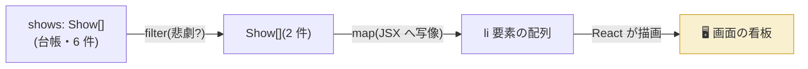

# 第3章 出演者名簿 — リスト表示と条件付き表示

## 🎭 今日のお話

春の演劇祭が決まり、演目は一気に 6 本へ。演目データは台帳(配列)で管理し、
看板は台帳から **自動生成** したい。台帳に 1 行足せば看板にも 1 枚増える——
データと画面が常に一致する世界を作ります。

これは `UI = f(state)` の「f」を配列に適用する話です。道具はすでに
[TypeScript 第 9 章で習得済み](../../04-typescript-fable-101/chapters/09_array_methods.md)の
`map` と `filter`。今日はそれを JSX と組み合わせます。

## map — 配列を JSX の配列に変換する

```tsx
interface Show {
  id: number;
  title: string;
  startTime: string;
  genre: "tragedy" | "comedy" | "reading";
  soldOut: boolean;
}

const shows: Show[] = [
  { id: 1, title: "ハムレット", startTime: "19:00", genre: "tragedy", soldOut: false },
  { id: 2, title: "真夏の夜の夢", startTime: "14:00", genre: "comedy", soldOut: true },
  { id: 3, title: "マクベス", startTime: "18:00", genre: "tragedy", soldOut: false },
  { id: 4, title: "星の王子さま", startTime: "11:00", genre: "reading", soldOut: false },
];

function ShowBoard() {
  return (
    <ul>
      {shows.map((show) => (
        <li key={show.id}>
          {show.title} — 開演 {show.startTime}
        </li>
      ))}
    </ul>
  );
}
```

仕組みを分解します:

1. `shows.map(...)` が **`Show` の配列を JSX(`<li>`)の配列に変換** します
2. JSX の `{}` に配列を置くと、React は要素を順に描画します
3. 前章の「JSX は値」を思い出してください。**JSX の配列も、ただの値の配列** です

第 1 章で「JSX に `for` 文は書けない(文だから)」と言いました。その代わりが
`map`(式)です。**「ループで画面に足していく」のではなく「データを画面に写像する」**
——宣言的 UI の考え方は、リストでも一貫しています。

## key — 名簿の背番号

`map` で作る要素には **`key`** という特別な属性が必須です。付け忘れると
コンソールに警告が出ます。なぜ React はこれを要求するのでしょう?

> ⚙️ **舞台裏の真実 — key は「再上演のときの本人確認」**
>
> 状態が変わると React は関数を呼び直し、新しい設計図と古い設計図を **見比べます**
> (詳細は第 10 章)。このときリストで問題が起きます。
>
> 演目リストの先頭に 1 件挿入されたとします。key がないと、React は位置でしか
> 比較できません:「1 番目が『ハムレット』→『新作』に変わった、2 番目が~に変わった…」と
> **全行を書き換え** てしまいます。実際に起きたことは「先頭に 1 行増えた」だけなのに。
>
> `key` という **不変の背番号** があれば、「id: 5 が新顔で、id: 1〜4 は同一人物(移動しただけ)」
> と認識でき、最小の変更で済みます。さらに重要なのは、各行が **状態**(第 5 章)を持つ場合
> です。本人確認を間違えると、**A の行の入力内容が B の行に付け替えられる** という
> 実害のあるバグになります。
>
> だから key には **「並び順が変わっても変わらない、各項目固有の ID」** を使います。
> `map((show, i) => <li key={i}>` のように **配列の添字を key にするのは危険** です——
> 並び替えや挿入で「背番号の付け替え」が起き、本人確認の意味がなくなるからです
> (追加・削除・並び替えが一切ないリストなら添字でも実害はありません)。

```tsx
{shows.map((show) => (
  <ShowCard key={show.id} title={show.title} startTime={show.startTime} />
  //        ~~~~~~~~~~~~~ key は「React への伝言」。props としては渡らない特別枠
))}
```

## 条件付き表示 — 三項演算子と &&

「完売なら完売マーク」「該当なしなら案内文」。JSX の条件表示は 3 パターンで
ほぼ全てを賄えます。

```tsx
function ShowRow({ show }: { show: Show }) {
  return (
    <li>
      {/* ① 三項演算子: A か B かの二択 */}
      {show.soldOut ? <s>{show.title}(完売)</s> : <strong>{show.title}</strong>}

      {/* ② && : 条件を満たすときだけ表示(満たさなければ何も出ない) */}
      {show.genre === "reading" && <em> 📖 朗読会</em>}
    </li>
  );
}

function ShowBoard({ shows }: { shows: Show[] }) {
  // ③ 早期 return: 大きな分岐は JSX に入る前に済ませる
  if (shows.length === 0) {
    return <p>本日の公演はありません 🌙</p>;
  }
  return (
    <ul>
      {shows.map((show) => (
        <ShowRow key={show.id} show={show} />
      ))}
    </ul>
  );
}
```

> 💡 **`&&` の罠 — 0 が表示される事件**
>
> ```tsx
> {show.reservedCount && <p>予約 {show.reservedCount} 件</p>}   // ❌
> ```
>
> `reservedCount` が `0` のとき、[0 は falsy](../../04-typescript-fable-101/chapters/02_numbers_strings.md)
> なので右側は評価されません——が、`&&` 式全体の値は `0` になり、**画面に「0」という
> 文字が表示されます**(React は `false`/`null`/`undefined` は無視しますが、`0` は
> 立派な表示対象なのです)。数値を条件にするときは明示的に比較します:
>
> ```tsx
> {show.reservedCount > 0 && <p>予約 {show.reservedCount} 件</p>}   // ✅
> ```
>
> JS の truthy/falsy の癖が React の画面バグとして現れる、代表的な合流地点です。

## filter との合流 — 「悲劇だけの看板」

`map` の前に `filter` を挟めば、絞り込み付きの看板になります。
[TS 第 9 章の集計パイプライン](../../04-typescript-fable-101/chapters/09_array_methods.md)が、
そのまま画面になる感覚を味わってください。

```tsx
function TragedyBoard({ shows }: { shows: Show[] }) {
  const tragedies = shows.filter((s) => s.genre === "tragedy");

  return (
    <section>
      <h2>🌑 悲劇の部({tragedies.length} 演目)</h2>
      {tragedies.length === 0 ? (
        <p>本日、悲劇の上演はありません</p>
      ) : (
        <ul>
          {tragedies.map((s) => (
            <li key={s.id}>{s.title} — {s.startTime}</li>
          ))}
        </ul>
      )}
    </section>
  );
}
```



## ⚔️ 完成コード: `src/App.tsx`

```tsx
// Reactive Theater — 3 日目: 演劇祭の演目一覧

interface Show {
  id: number;
  title: string;
  startTime: string;
  genre: "tragedy" | "comedy" | "reading";
  soldOut: boolean;
}

const GENRE_LABEL: Record<Show["genre"], string> = {
  tragedy: "🌑 悲劇",
  comedy: "🌞 喜劇",
  reading: "📖 朗読",
};

const shows: Show[] = [
  { id: 1, title: "ハムレット", startTime: "19:00", genre: "tragedy", soldOut: false },
  { id: 2, title: "真夏の夜の夢", startTime: "14:00", genre: "comedy", soldOut: true },
  { id: 3, title: "マクベス", startTime: "18:00", genre: "tragedy", soldOut: false },
  { id: 4, title: "星の王子さま", startTime: "11:00", genre: "reading", soldOut: false },
  { id: 5, title: "十二夜", startTime: "16:00", genre: "comedy", soldOut: false },
];

function ShowRow({ show }: { show: Show }) {
  return (
    <li>
      {GENRE_LABEL[show.genre]}{" "}
      {show.soldOut ? <s>{show.title}(完売)</s> : <strong>{show.title}</strong>}
      {" — "}開演 {show.startTime}
    </li>
  );
}

function ShowBoard({ title, shows }: { title: string; shows: Show[] }) {
  if (shows.length === 0) {
    return <p>該当する公演はありません 🌙</p>;
  }
  return (
    <section>
      <h2>{title}</h2>
      <ul>
        {shows.map((show) => (
          <ShowRow key={show.id} show={show} />
        ))}
      </ul>
    </section>
  );
}

function App() {
  const available = shows.filter((s) => !s.soldOut);

  return (
    <main>
      <h1>🎭 Reactive Theater — 春の演劇祭</h1>
      <ShowBoard title="全演目" shows={shows} />
      <ShowBoard title="チケット販売中" shows={available} />
    </main>
  );
}

export default App;
```

台帳(`shows`)に 1 件追加して保存してみてください。**両方の看板が同時に、正しく**
更新されます。命令的な世界なら 2 箇所の書き換え処理を書くところでした。

## 📝 今日の舞台稽古(演習)

1. `key={show.id}` を消して保存し、開発者ツールのコンソールに出る警告文を読んでください(エラー文を読む練習も稽古のうちです)。
2. 「開演時間順(昇順)の看板」を追加してください。[`toSorted`](../../04-typescript-fable-101/chapters/09_array_methods.md) を使い、元の配列を壊さないこと。
3. `GENRE_LABEL` の仕組みを説明してください。`Record<Show["genre"], string>` の `Show["genre"]` は何型でしょう?([TS 第 13 章の indexed access](../../04-typescript-fable-101/chapters/13_advanced_types.md) の復習)
4. `{shows.length && <p>...</p>}` を書いて「0 事件」を再現し、正しい書き方に直してください。

---

次章、ついに劇場に **観客の反応** がやってきます。ボタンを押したら何かが起きる——
イベント処理です。「関数を呼ばずに、関数を渡す」という、TS 第 4 章の伏線を回収します。
→ [第4章 客席からの拍手](04_events.md)
