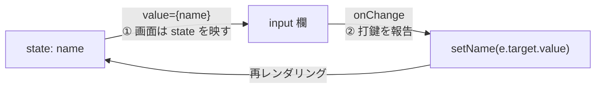

# 第6章 チケット窓口 — フォームと制御されたコンポーネント

## 🎭 今日のお話

Reactive Theater にチケット窓口を開設します。お客さまの名前、枚数、演目の選択を
受け付けて、予約内容をその場で確認表示する——Web アプリの最頻出業務、フォームです。

HTML のフォーム部品(`<input>` など)は、実は **自分の中に状態を持っています**
(入力欄は打たれた文字を自分で覚えています)。一方 React は「状態は state に、
画面は `UI = f(state)`」の世界。**2 つの世界のどちらが状態の主導権を握るのか?**
——今日のテーマはこの縄張り争いの決着です。

## 制御されたコンポーネント — 主導権を state に渡す

React の答えは「**state が主、入力欄は従**」。これを **制御されたコンポーネント
(controlled component)** と呼びます。書き方は決まりきった 2 点セットです:

```tsx
import { useState } from "react";

function GuestNameInput() {
  const [name, setName] = useState("");

  return (
    <label>
      お名前:
      <input
        value={name}                                  // ① 表示は常に state から
        onChange={(e) => setName(e.target.value)}     // ② 入力は state の更新として受ける
      />
      <p>ようこそ、{name || "名無し"} さま</p>
    </label>
  );
}
```



1 文字打つたびにこのループが一周します: 打鍵 → `onChange` → `setName` → 再上演 →
新しい `name` が `value` に映る。一見遠回りですが、これで **「入力欄の中身」と
「プログラムが知っている値」が 1 ミリもズレなくなります**。真実は常に state に 1 つ
(single source of truth)。

主導権を握ると、こんなことが 1 行でできます:

```tsx
onChange={(e) => setName(e.target.value.toUpperCase())}   // 強制大文字化
<button onClick={() => setName("")}>クリア</button>         // 外部からのリセット
<p>{20 - name.length} 文字入力できます</p>                   // リアルタイム文字数
```

入力値の変換・検証・リセット・連動表示——命令的な世界なら DOM をつつき回す処理が、
**すべて「state をどう更新するか」の問題に一本化** されます。

> ⚙️ **舞台裏の真実 — 非制御という選択肢**
>
> `value` を渡さなければ、入力欄は昔ながらの「自分で覚える」動作をします
> (**非制御コンポーネント**)。送信時にだけ値を回収する簡易フォームならこれでも
> 成立し、React 19 では form の Action 機能と組み合わせる場面も増えています。
> ただし入力中の検証や連動が必要になった瞬間に制御版へ書き直すことになるため、
> **本教材は制御されたコンポーネントを標準** とします。まず王道を身につけましょう。

## select と数値入力 — 型の関門

チケット窓口には演目の選択と枚数も要ります。

```tsx
const [showId, setShowId] = useState(1);
const [tickets, setTickets] = useState(1);

<select value={showId} onChange={(e) => setShowId(Number(e.target.value))}>
  {shows.map((s) => (
    <option key={s.id} value={s.id}>{s.title}</option>
  ))}
</select>

<input
  type="number"
  min={1}
  max={8}
  value={tickets}
  onChange={(e) => setTickets(Number(e.target.value))}
/>
```

💡 **`e.target.value` は常に string です**。`type="number"` の入力欄でも、
`<option value={1}>` と数値を渡していても、DOM の世界から返ってくる値は文字列——
[「フォーム入力は必ず文字列」は 1995 年からの Web の掟](../../04-typescript-fable-101/chapters/02_numbers_strings.md)
でした。`Number(...)` での変換を忘れると、`tickets + 1` が `"11"` になる
[あの `+` の罠](../../04-typescript-fable-101/chapters/02_numbers_strings.md)を React の中で
踏むことになります。TypeScript を使っていると `useState(1)` の推論
(`number`)のおかげで、変換忘れは代入の時点でコンパイルエラーになります——
型が DOM との国境で効く好例です。

## 送信 — フォーム全体をまとめる

```tsx
function BoxOffice({ shows }: { shows: Show[] }) {
  const [name, setName] = useState("");
  const [showId, setShowId] = useState(shows[0]?.id ?? 0);
  const [tickets, setTickets] = useState(1);
  const [receipt, setReceipt] = useState<string | null>(null);   // 予約完了メッセージ

  const selected = shows.find((s) => s.id === showId);
  const total = (selected?.price ?? 0) * tickets;                // 導出値は計算で(前章の鉄則)
  const canSubmit = name.trim() !== "" && selected !== undefined;

  function handleSubmit(e: React.FormEvent<HTMLFormElement>) {
    e.preventDefault();                                          // ページ再読み込みを阻止
    setReceipt(`${name} さま / ${selected!.title} × ${tickets} 枚 / 計 ${total} 円`);
    setName("");
    setTickets(1);
  }

  return (
    <form onSubmit={handleSubmit}>
      {/* …上で見た input / select / number … */}
      <p>お会計: {total.toLocaleString()} 円</p>
      <button type="submit" disabled={!canSubmit}>予約する</button>
      {receipt && <p>🎫 予約を承りました — {receipt}</p>}
    </form>
  );
}
```

見どころは `disabled={!canSubmit}` です。「名前が空なら押せない」を、
**ボタンを無効化する手続き** ではなく **「この状態のときボタンは無効である」という宣言**
で書いています。検証・合計・完了表示——フォームのあらゆる挙動が
`UI = f(state)` の一本の原理で貫かれていることを確認してください。

## state の型で「画面の段階」を表す

`receipt` の型を `string | null` にしました。これは小さな設計判断です——
「予約完了メッセージがまだ無い」状態を、[null を含む union](../../04-typescript-fable-101/chapters/05_unions.md)
で明示しています。画面の段階(未送信/送信済み)が増えてきたら、
literal union で堂々と状態を名乗らせる手もあります:

```tsx
const [phase, setPhase] = useState<"filling" | "confirming" | "done">("filling");
```

「ありえない画面の組み合わせを型で消す」——[TS 第 5 章の判別可能 union](../../04-typescript-fable-101/chapters/05_unions.md)
の発想は、React では **画面遷移の設計** としてそのまま生きます(第 13 章で全面展開します)。

## ⚔️ 完成コード: `src/App.tsx`

```tsx
// Reactive Theater — 6 日目: チケット窓口

import { useState } from "react";

interface Show {
  id: number;
  title: string;
  price: number;
}

const shows: Show[] = [
  { id: 1, title: "ハムレット", price: 5500 },
  { id: 2, title: "真夏の夜の夢", price: 4500 },
  { id: 3, title: "星の王子さま(朗読)", price: 2000 },
];

function BoxOffice() {
  const [name, setName] = useState("");
  const [showId, setShowId] = useState(shows[0].id);
  const [tickets, setTickets] = useState(1);
  const [receipt, setReceipt] = useState<string | null>(null);

  const selected = shows.find((s) => s.id === showId);
  const total = (selected?.price ?? 0) * tickets;
  const canSubmit = name.trim() !== "" && selected !== undefined;

  function handleSubmit(e: React.FormEvent<HTMLFormElement>) {
    e.preventDefault();
    if (!selected) return;
    setReceipt(`${name} さま / ${selected.title} × ${tickets} 枚 / 計 ${total.toLocaleString()} 円`);
    setName("");
    setTickets(1);
  }

  return (
    <form onSubmit={handleSubmit}>
      <h2>🎫 チケット窓口</h2>
      <p>
        <label>
          お名前:{" "}
          <input value={name} onChange={(e) => setName(e.target.value)} placeholder="劇場 花子" />
        </label>
      </p>
      <p>
        <label>
          演目:{" "}
          <select value={showId} onChange={(e) => setShowId(Number(e.target.value))}>
            {shows.map((s) => (
              <option key={s.id} value={s.id}>
                {s.title}({s.price.toLocaleString()} 円)
              </option>
            ))}
          </select>
        </label>
      </p>
      <p>
        <label>
          枚数:{" "}
          <input
            type="number"
            min={1}
            max={8}
            value={tickets}
            onChange={(e) => setTickets(Number(e.target.value))}
          />
        </label>
      </p>
      <p>お会計: <strong>{total.toLocaleString()} 円</strong></p>
      <button type="submit" disabled={!canSubmit}>
        予約する
      </button>
      {receipt && <p>✅ 予約を承りました — {receipt}</p>}
    </form>
  );
}

function App() {
  return (
    <main>
      <h1>🎭 Reactive Theater</h1>
      <BoxOffice />
    </main>
  );
}

export default App;
```

## 📝 今日の舞台稽古(演習)

1. お名前欄に「あと何文字入力できるか(上限 20 文字)」のカウンタを付けてください。20 文字を超えたら送信ボタンも無効に。
2. `Number(e.target.value)` を外して枚数を文字列のまま state に入れると、どこで(コンパイル時?実行時?)何が起きるか観察してください。
3. 「特別席(+2,000 円/枚)」のチェックボックスを追加してください。checkbox の制御は `checked={vip}` + `onChange={(e) => setVip(e.target.checked)}` です(value ではなく checked、報告書の中身も `.checked`)。
4. `receipt` を `phase: "filling" | "done"` 方式に書き換え、done のときはフォームの代わりに完了画面と「続けて予約する」ボタンを表示してください。

---

次章、予約を **一覧** として溜めていきます。配列やオブジェクトを state に持つとき、
`push` してはいけない——[TS 第 9 章で予告した「React では複製が前提」](../../04-typescript-fable-101/chapters/09_array_methods.md)
の伏線を、ついに回収します。 → [第7章 小道具は複製して替える](07_immutability.md)
