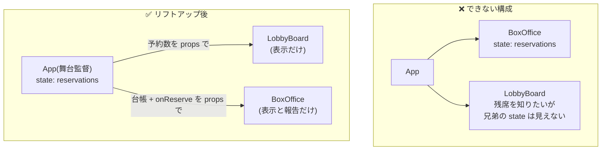

# 第8章 舞台監督に預ける — state を持ち上げる

## 🎭 今日のお話

劇場のロビーに **残席掲示板** を設置することになりました。要件はこうです:
「チケット窓口(BoxOffice)で予約が入ったら、ロビーの掲示板(LobbyBoard)の残席も
即座に減ること」。

さて困りました。予約台帳は窓口コンポーネントの state です。掲示板は **別のコンポーネント**。
[state はコンポーネントごとに独立](05_state.md)しているので、窓口の記憶を掲示板は
覗けません。兄弟の楽屋は覗けないのです。

React でのたった 1 つの正解: **共有したい state を、共通の親に引っ越しさせる。**
これを **state のリフトアップ(lifting state up)** と呼びます。

## 問題の形 — 兄弟間でデータを共有したい



データは親から子へしか流れません(第 2 章の単方向データフロー)。ならば、
**両方の子から見上げられる位置——共通の親——に台帳を置けばいい**。
台帳を預かった親が「舞台監督」になり、子はそれぞれ:

- **LobbyBoard**: 残席数を props でもらって表示するだけ
- **BoxOffice**: 台帳を props でもらって表示し、「予約が入りました」と
  **コールバックで親に報告するだけ**(第 4 章の「events up」)

## 実装 — 監督が state を持ち、子は props で働く

```tsx
// 親: 台帳と操作関数を一手に握る
function App() {
  const [reservations, setReservations] = useState<Reservation[]>([]);

  const totalTickets = reservations.reduce((sum, r) => sum + r.tickets, 0);
  const remaining = CAPACITY - totalTickets;

  function handleReserve(name: string) {                    // 台帳の更新は監督だけが行う
    setReservations((prev) => [...prev, { id: Date.now(), name, tickets: 1 }]);
  }

  return (
    <main>
      <LobbyBoard remaining={remaining} />
      <BoxOffice remaining={remaining} onReserve={handleReserve} />
    </main>
  );
}

// 子 1: 表示専門。state なし
function LobbyBoard({ remaining }: { remaining: number }) {
  return (
    <section>
      <h2>🪧 ロビー掲示板</h2>
      {remaining > 0 ? <p>残席 {remaining} 席</p> : <p>🈵 本日完売</p>}
    </section>
  );
}

// 子 2: 入力は自分の state、台帳は親に報告
function BoxOffice({ remaining, onReserve }: { remaining: number; onReserve: (name: string) => void }) {
  const [name, setName] = useState("");   // 入力中の文字は「窓口だけの関心事」なので残す

  function handleSubmit(e: React.FormEvent<HTMLFormElement>) {
    e.preventDefault();
    onReserve(name);                       // 「予約が入りました!」と監督へ報告
    setName("");
  }

  return (
    <form onSubmit={handleSubmit}>
      <h2>🎫 チケット窓口</h2>
      <input value={name} onChange={(e) => setName(e.target.value)} />
      <button type="submit" disabled={name.trim() === "" || remaining <= 0}>予約</button>
    </form>
  );
}
```

窓口で予約すると、**掲示板が勝手に更新されます**。仕組みはもう全部知っているものです:
`onReserve` → 親の `setReservations` → 親が再上演 → **新しい props が両方の子に流れる** →
子も再上演。部品間の「連動」は、React では **同じ state を見上げているだけ** なのです。

> 💡 **「state はどこに置くべきか」の判定法**
>
> 1. その state を使う(読む・変える)コンポーネントを全部挙げる
> 2. それら全部の **共通の親のうち、いちばん近いもの** を探す
> 3. そこに置く。それより上には上げない
>
> `name`(入力中の文字)を App に上げなかったのはこのためです。使うのは窓口だけ
> なので、窓口に置くのが正解。**なんでも上に上げると、無関係な部品まで頻繁に
> 再上演される**(1 文字打つたびに劇場全体が再レンダリング!)うえ、props のバケツリレーも
> 増えます。「必要な範囲で、いちばん低く」が置き場所の原則です。

## 制御の反転 — 子が「操作された部品」になる

リフトアップした後の `BoxOffice` を見直すと、面白いことに気づきます。
残席(`remaining`)も、予約の結果も、すべて **外から与えられ、外へ報告する** 部品に
なりました。台帳がどう管理されているか、窓口は何も知りません。

これは第 6 章の「制御されたコンポーネント」と同じ構図です。input が
`value` + `onChange` で親に操縦されたように、**自作コンポーネントも
`値の props` + `on○○ の props` で親に操縦させる** 形にできる——
部品の再利用性はこの形のときに最大になります。タブ、アコーディオン、モーダル……
UI ライブラリの部品がほぼ全部この形なのは偶然ではありません。

> 📜 **歴史の背景 — 「Thinking in React」**
>
> 「state を最小にし、置き場所を決め、データを一方向に流す」という今日の設計手順は、
> React 公式が初期(2013 年)から掲げる **Thinking in React** という文書に
> まとめられています。曰く——①画面をコンポーネントに分割せよ、②まず state なしの
> 静的版を作れ、③state の最小構成を特定せよ、④置き場所を決めよ、⑤逆方向の
> データフロー(コールバック)を足せ。
>
> 10 年以上経った現在も、この手順は React 設計の背骨のままです。あなたがこの教材で
> 歩んできた章の順序(表示 → props → イベント → state → リフトアップ)は、
> まさにこの手順をなぞっています。迷子になったら「Thinking in React」に帰るのが
> React 界の合言葉です。

## ⚔️ 完成コード: `src/App.tsx`

```tsx
// Reactive Theater — 8 日目: 窓口と掲示板の連動

import { useState } from "react";

interface Reservation {
  id: number;
  name: string;
  tickets: number;
}

const CAPACITY = 12;

function LobbyBoard({ remaining, reserved }: { remaining: number; reserved: number }) {
  return (
    <section style={{ border: "2px solid gold", padding: "0.5rem" }}>
      <h2>🪧 ロビー掲示板</h2>
      {remaining > 0 ? (
        <p>
          残席 <strong>{remaining}</strong> 席(予約済 {reserved} 席)
        </p>
      ) : (
        <p>🈵 本日完売御礼</p>
      )}
    </section>
  );
}

function BoxOffice({
  remaining,
  onReserve,
}: {
  remaining: number;
  onReserve: (name: string, tickets: number) => void;
}) {
  const [name, setName] = useState("");
  const [tickets, setTickets] = useState(1);

  function handleSubmit(e: React.FormEvent<HTMLFormElement>) {
    e.preventDefault();
    onReserve(name, tickets);
    setName("");
    setTickets(1);
  }

  const canSubmit = name.trim() !== "" && tickets <= remaining;

  return (
    <form onSubmit={handleSubmit}>
      <h2>🎫 チケット窓口</h2>
      <input value={name} onChange={(e) => setName(e.target.value)} placeholder="お名前" />
      <input
        type="number"
        min={1}
        max={Math.max(remaining, 1)}
        value={tickets}
        onChange={(e) => setTickets(Number(e.target.value))}
      />
      <button type="submit" disabled={!canSubmit}>予約する</button>
    </form>
  );
}

function ReservationList({ reservations }: { reservations: Reservation[] }) {
  if (reservations.length === 0) return <p>まだ予約はありません</p>;
  return (
    <ul>
      {reservations.map((r) => (
        <li key={r.id}>{r.name} さま — {r.tickets} 枚</li>
      ))}
    </ul>
  );
}

function App() {
  const [reservations, setReservations] = useState<Reservation[]>([]);
  const [nextId, setNextId] = useState(1);

  const reserved = reservations.reduce((sum, r) => sum + r.tickets, 0);
  const remaining = CAPACITY - reserved;

  function handleReserve(name: string, tickets: number) {
    setReservations((prev) => [...prev, { id: nextId, name, tickets }]);
    setNextId((id) => id + 1);
  }

  return (
    <main>
      <h1>🎭 Reactive Theater</h1>
      <LobbyBoard remaining={remaining} reserved={reserved} />
      <BoxOffice remaining={remaining} onReserve={handleReserve} />
      <ReservationList reservations={reservations} />
    </main>
  );
}

export default App;
```

**state は App の 2 つだけ**。掲示板・窓口・一覧の 3 部品は、props を受けて描くだけの
「軽い役者」になりました。state が少ないアプリは、追うのも試すのも壊れにくさも段違いです。

## 📝 今日の舞台稽古(演習)

1. `ReservationList` に「キャンセル」ボタンを付けてください。削除処理はどこに書き、どう伝えるべきでしょう?(答え: 監督に `onCancel(id)` で報告)
2. 掲示板に「混雑度メーター」(予約率 50% 未満=🟢、80% 未満=🟡、以上=🔴)を追加してください。この値は state にすべきでしょうか?
3. `BoxOffice` の `name` を App にリフトアップした版を作り、窓口で 1 文字打つたびに **すべての** コンポーネントが再実行されることを `console.log("render: LobbyBoard")` などで確認してください。「必要以上に上げない」理由の体感です(確認後は元に戻すこと)。
4. `<BoxOffice />` をもう 1 つ並べてください(窓口 2 番)。両方の窓口の予約が 1 つの台帳・1 つの掲示板に正しく合流することを確認してください。リフトアップの威力です。

---

次章、劇場に **時計仕掛け** が入ります。開演 5 分前になったらベルを鳴らす、
ページタイトルを演目名にする——「レンダリングの外側の世界」と関わるための道具、
`useEffect` と、その厄介な相棒クリーンアップの登場です。
→ [第9章 開演ベルと後片付け](09_effects.md)
