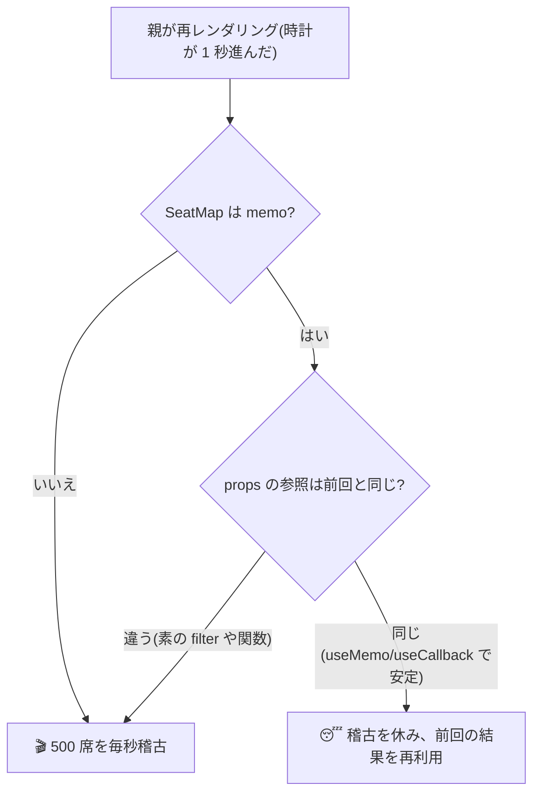

# 第15章 無駄な再上演を減らす — memo・useMemo・useCallback

## 🎭 今日のお話

Reactive Theater は大所帯になりました。座席表は 500 席、予約一覧は数百件。
ロビーの時計が 1 秒進むたびに **劇場全体が通し稽古**(第 10 章:親が再上演されると
子も全員稽古)をしていては、さすがに息切れします。

今日は「稽古を省く」道具を 3 つ学びます。ただし先に結論を言います——
**この章の道具は、必要になるまで使わないでください**。React は素で十分速く、
早すぎる最適化はコードを重く読みにくくするだけです。まず仕組みを理解し、
「遅い」と測定できたときに取り出す。それがこの章の正しい持ち帰り方です。

## memo — 「props が同じなら稽古を休む」

[第 10 章の誤解 2](10_rendering.md) で見たとおり、親が再レンダリングされると子は
**props が同じでも** 再実行されます。`memo` で包むと、React は稽古の前に
**前回と props を比較し、全部同じなら前回の結果を使い回します**:

```tsx
import { memo } from "react";

interface SeatMapProps {
  seats: Seat[];
  onSelect: (id: number) => void;
}

const SeatMap = memo(function SeatMap({ seats, onSelect }: SeatMapProps) {
  console.log("🎬 稽古: SeatMap(500 席の描画)");
  return ( /* 500 席ぶんの重い JSX */ );
});
```

これでロビーの時計が進んでも、`seats` と `onSelect` が変わらない限り
`SeatMap` は休めます。……と言いたいところですが、**このままではまず休めません**。
罠が 2 つあるからです。

## 罠 — 比較は参照で行われる

`memo` の比較は [`Object.is`、つまり参照比較](07_immutability.md)です。
ここで [TS 第 3 章の「参照」](../../04-typescript-fable-101/chapters/03_objects_arrays.md)が
最後の伏線として回収されます:

```tsx
function App() {
  const [now, setNow] = useState(Date.now());   // 1 秒ごとに更新される時計

  // ❌ 罠 1: レンダリングのたびに「新しい配列」が作られる
  const premiumSeats = seats.filter((s) => s.grade === "premium");

  // ❌ 罠 2: レンダリングのたびに「新しい関数」が作られる
  const handleSelect = (id: number) => reserve(id);

  return <SeatMap seats={premiumSeats} onSelect={handleSelect} />;
  // → memo は「前回と違う参照だ」と判定し、毎秒フルで稽古してしまう
}
```

関数コンポーネントは毎回呼び直される——つまり **その中で作られるオブジェクト・配列・
関数(!)は毎回新品** です。中身が同じでも参照は毎回違う。memo の目には
「毎回違う props」に見えます。

この 2 つの罠に対応する道具が `useMemo` と `useCallback` です。

## useMemo / useCallback — 「前回のを使い回す」

```tsx
import { useMemo, useCallback } from "react";

function App() {
  const [now, setNow] = useState(Date.now());

  // ✅ useMemo: 「計算結果」を記憶する。依存(seats)が変わるまで同じ参照を返す
  const premiumSeats = useMemo(
    () => seats.filter((s) => s.grade === "premium"),
    [seats]
  );

  // ✅ useCallback: 「関数そのもの」を記憶する。useMemo(() => fn, deps) の略記
  const handleSelect = useCallback((id: number) => reserve(id), []);

  return <SeatMap seats={premiumSeats} onSelect={handleSelect} />;
  // → now が変わっても props の参照は同一 → memo が効いて SeatMap は休める
}
```

- `useMemo(fn, deps)` … `fn()` の **戻り値** をキャッシュ。依存が変わったときだけ再計算
- `useCallback(fn, deps)` … `fn` **そのもの** をキャッシュ。子に渡すハンドラの参照を安定させる
- 依存配列の意味論は [useEffect と同じ](09_effects.md)(参照比較・正直に列挙)です



**3 点セットで初めて効く** ことに注意してください。memo だけ付けても props が毎回
新品なら無意味、useMemo だけしても子が memo でなければ稽古は省けません。

## ではいつ使うのか — 「まず測る」が鉄則

ここまで説明しておいて言うのもなんですが、**上の時計の例程度なら、素の React で
何の問題もありません**。稽古(関数実行と仮想 DOM 生成)は元々安く、
[差分がなければ DOM には触れない](10_rendering.md)からです。

使うべき場面の目安:

| 状況 | 判断 |
|---|---|
| 何となく全部 memo で包みたい | ❌ やめる。コードが重くなるだけ |
| 体感で遅い・カクつく | ✅ まず **React DevTools の Profiler で測る** |
| 測って「大きな子が高頻度の親に巻き込まれている」と判明 | ✅ memo + 参照の安定化 |
| 測って「レンダリング中の計算そのものが重い」(数万件のソートなど) | ✅ useMemo(memo なしでも意味がある唯一のケース) |
| Context の value に毎回新品オブジェクトを渡している | ✅ useMemo で安定化([第 12 章の全受信者再上演](12_context.md)対策) |

> 💡 **最適化の第一手はフックではなく「構成」**: そもそも時計(高頻度 state)と
> 座席表(重い表示)を **同じコンポーネントに同居させない** のが最善です。
> 時計を子コンポーネントに切り出せば、毎秒の再上演は時計の中だけで完結し、
> memo は 1 つも要りません。[state は必要な範囲でいちばん低く](08_lifting_state.md)——
> 第 8 章の原則は、実は最強のパフォーマンス戦略でもあったのです。

> 📜 **歴史の背景 — React Compiler: この章が「歴史」になる日**
>
> 「参照の安定化を人間が手で管理する」のは React の長年の弱点で、
> 「useCallback だらけのコード」は嫌われポイントの定番でした。他フレームワーク
> (Svelte、Solid など)が「そもそも再実行しない」設計を選んで React を批判したのも
> この部分です。
>
> React チームの回答が **React Compiler**(2024〜)です。ビルド時にコードを解析し、
> memo / useMemo / useCallback 相当の最適化を **自動で挿入** します。React 19 世代では
> 実戦投入が進み、新規プロジェクトでは手書きの useCallback が不要になりつつあります。
>
> ではこの章は無駄だったのでしょうか?——逆です。コンパイラが「何を」自動化して
> いるのか(参照比較・稽古の省略)を知らなければ、コンパイラが効かないコードを
> 書いたときに原因を推論できません。[ライブラリの下で起きていることを知る](14_data_fetching.md)
> ——本教材の一貫した立場です。

## ⚔️ 完成コード: `src/App.tsx`(測定つきデモ)

```tsx
// Reactive Theater — 15 日目: 座席表と時計の共存

import { useState, useEffect, useMemo, useCallback, memo } from "react";

interface Seat {
  id: number;
  row: string;
  reserved: boolean;
}

const ALL_SEATS: Seat[] = Array.from({ length: 500 }, (_, i) => ({
  id: i + 1,
  row: String.fromCharCode(65 + Math.floor(i / 25)),
  reserved: false,
}));

const SeatMap = memo(function SeatMap({
  seats,
  onSelect,
}: {
  seats: Seat[];
  onSelect: (id: number) => void;
}) {
  console.log("🎬 稽古: SeatMap(500 席)");
  return (
    <div style={{ display: "grid", gridTemplateColumns: "repeat(25, 1fr)", gap: 2 }}>
      {seats.map((s) => (
        <button
          key={s.id}
          onClick={() => onSelect(s.id)}
          style={{ background: s.reserved ? "crimson" : "seagreen", height: 14 }}
          title={`${s.row}-${s.id}`}
        />
      ))}
    </div>
  );
});

function LobbyClock() {
  const [now, setNow] = useState(() => new Date());
  useEffect(() => {
    const t = setInterval(() => setNow(new Date()), 1000);
    return () => clearInterval(t);
  }, []);
  return <p>🕰️ {now.toLocaleTimeString("ja-JP")}</p>;
}

function App() {
  const [seats, setSeats] = useState(ALL_SEATS);

  const reservedCount = useMemo(
    () => seats.filter((s) => s.reserved).length,
    [seats]
  );

  const handleSelect = useCallback((id: number) => {
    setSeats((prev) =>
      prev.map((s) => (s.id === id ? { ...s, reserved: !s.reserved } : s))
    );
  }, []);

  return (
    <main>
      <h1>🎭 Reactive Theater — 座席表</h1>
      <LobbyClock />                       {/* 高頻度 state は子に隔離(最善の一手) */}
      <p>予約済み {reservedCount} / 500 席</p>
      <SeatMap seats={seats} onSelect={handleSelect} />
    </main>
  );
}

export default App;
```

コンソールを開いて確認してください: 時計は毎秒動きますが、`🎬 稽古: SeatMap` は
**席をクリックしたときしか** 出ません(時計を App 直下の state にした版と
比べてみると差が分かります——演習 1)。

## 📝 今日の舞台稽古(演習)

1. `LobbyClock` の中身(useState + useEffect)を App 直下に引っ越し、`SeatMap` の稽古ログが毎秒出るようになることを確認してください。その状態で (a) memo 3 点セットで止める、(b) 時計を子に戻して止める、の両方を試し、どちらが好みか考えてください。
2. `handleSelect` の `useCallback` を外すと稽古ログはどうなりますか?理由を「参照」の言葉で説明してください。
3. React DevTools(ブラウザ拡張)の Profiler タブで、席クリック時の各コンポーネントの描画時間を記録してみてください。「測ってから最適化」の練習です。
4. `useMemo(() => seats.filter(...), [seats])` の依存を `[]` にすると、どんなバグになりますか?(予約しても数字が動かない=「古い値を見続ける」— [effect の stale closure](09_effects.md) と同根です)

---

いよいよ最終章。劇場システムの品質を **テスト** で保証し、16 章の旅を締めくくります。
「ユーザーの目線でテストする」という React 界の哲学、そして Next.js への出発口まで。
→ [第16章 テストと千秋楽](16_final.md)
