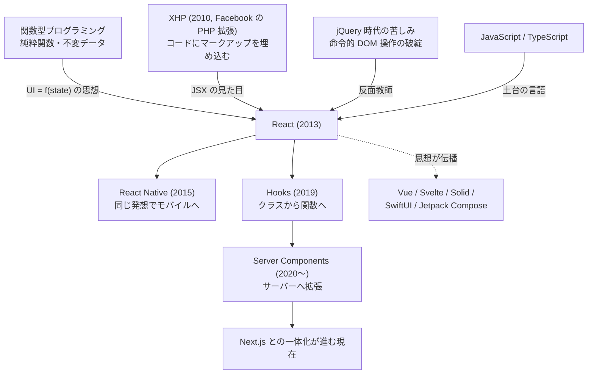
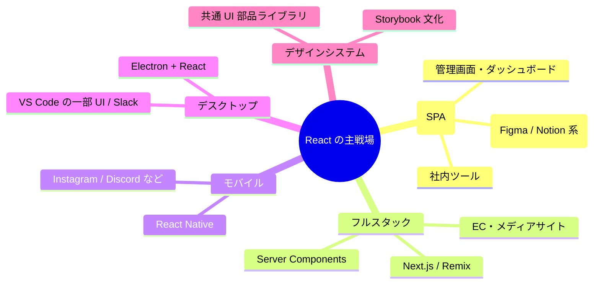

# ⚛️ React というライブラリ — 系譜・思想・強み・弱みの全体像

この章は使い方の解説ではなく、**「React とは何で、なぜフロントエンドの覇者になり、どこで嫌われているのか」** を俯瞰するための読み物です。教材本編(chapters)に入る前でも、一通り学び終えた後でも読めます。

最初に一つ断っておくと、React は Python や Go のような **言語ではありません**。[TypeScript/JavaScript](../../04-typescript-fable-101/language-overview/README.md) の上で動く **UI 構築ライブラリ** です。それでもこのシリーズに「language-overview」として並べるのは、React が単なる道具を超えて、**設計思想・エコシステム・雇用市場・考え方の流儀** を持つ一つの「世界」だからです。フロントエンド開発者の履歴書で React は言語と同格に扱われます。

---

## 1. 生い立ちと系譜

### 前史 — jQuery 時代の苦しみ

2000 年代後半の Web フロントエンドは **jQuery** の天下でした。jQuery は「DOM を選んで書き換える」道具としては完璧でしたが、アプリが大きくなると破綻します。画面のあちこちが連動する UI では、「どの操作のとき、どこを、どう書き換えるか」の組み合わせが爆発し、**画面の現在の状態を誰も把握できなくなる** のです([第 1 章](../chapters/01_jsx.md)で体験した命令的 UI の限界です)。

Backbone.js や AngularJS(初代)がこの混沌に秩序を与えようとしましたが、決定打にはなりませんでした。

### 誕生 — Facebook の社内事情から

React の直接の祖先は、Facebook が PHP 用に作った **XHP**(2010)——「PHP の中に HTML 風のタグを書く」拡張です。JSX の見た目はここから来ています。これを JavaScript に持ち込む実験(FaxJS)を経て、**ジョーダン・ウォルキー** が原型を作り、Facebook のニュースフィードや Instagram で実戦投入されたのち、2013 年にオープンソース化されました。

系譜のポイントは、React の中身が **関数型プログラミングの応用** だということです。「UI は状態の純粋な関数である」「データは書き換えず複製する」——Lisp や Haskell の世界の規律を、UI という最も泥臭い領域に持ち込んだのが React の本質です。そしてこの思想は React の外にも伝播しました。iOS の SwiftUI、Android の Jetpack Compose、Flutter——**現代の UI フレームワークはほぼすべて「宣言的 UI」という React の発明の子孫** です。

### 歴史の転換点

| 年 | 出来事 | 意味 |
|---|---|---|
| 2013 | オープンソース化 | 「HTML を JS に混ぜるな」と **大バッシング** を受けた |
| 2014〜15 | 世論の逆転、React Native 公開 | 「Learn once, write anywhere」— モバイルへ進出 |
| 2015 | Redux 登場 | 状態管理のパターンが確立(のち [useReducer](../chapters/13_reducer.md) として本体へ) |
| 2016〜17 | ライセンス騒動 → MIT 化 | 特許条項への反発で一時大炎上。MIT ライセンスに変更して収束 |
| 2017 | Fiber(内部全面書き換え) | レンダリングを中断可能に([第 10 章](../chapters/10_rendering.md)) |
| 2019 | **Hooks 導入** | クラスを捨て関数へ。React 史上最大の転換([第 5 章](../chapters/05_state.md)) |
| 2020 | Server Components 発表 | 「稽古場をサーバーへ」構想の始動 |
| 2022 | React 18 | 並行レンダリング。同時に Vue/Svelte など競合の成熟も進む |
| 2024〜25 | React 19 + React Compiler | 手動最適化([第 15 章](../chapters/15_performance.md))の自動化。Next.js との一体化が加速 |

---

## 2. 設計思想 — 「UI = f(state)」とその代償

React の思想は一行に要約できます:

> **画面とは、状態を引数に取る関数の戻り値である。**

この一行から、React のすべての特徴が演繹されます:

- **宣言的 UI** — 「どう書き換えるか」ではなく「この状態ならこう見える」だけを書く。書き換え手順の管理という、jQuery 時代最大の苦しみを丸ごと消した
- **再レンダリングモデル** — 状態が変われば関数を呼び直す。「差分を人間が管理しない」ために、計算(仮想 DOM)を機械に肩代わりさせる
- **単方向データフロー** — データは親から子へ一方通行。画面の任意の表示について「その値はどこから来たか」が必ず追跡できる
- **合成 > 継承** — 部品は入れ子(composition)で組み立てる。[Go が継承を捨てたの](../../03-go-fable-101/language-overview/README.md)と同じ時代精神
- **ライブラリであってフレームワークではない** — React が決めるのは「UI の作り方」だけ。ルーティングもデータ取得も状態管理も決めない(この設計判断が、後述する「嫌われポイント」の源泉にもなる)

代償も一行で言えます: **この関数モデルを成立させる規律(不変性・純粋性・フックのルール)を、プログラマが守り続けなければならない。** JavaScript は書き換え自由の言語なので、規律は言語ではなく開発者の肩に載ります。React の学習とは、API の暗記ではなく **この規律の内面化** です(本編 16 章はそのために書かれています)。

---

## 3. 技術としての特徴

### 3.1 JSX — マークアップを「値」にした

`<ShowCard title="ハムレット" />` は関数呼び出しに変換される **ただの式** です([第 1 章](../chapters/01_jsx.md))。画面の設計図が言語の第一級の値になったことで、「JSX を返す関数」「JSX を受け取る props」「JSX の配列を map で作る」——**UI の組み立てに、言語の全機能(変数・関数・型)がそのまま使えます**。専用テンプレート言語(`v-if` や `` のような独自構文)を覚える必要がない、とも言えます。

### 3.2 仮想 DOM と差分検出

「全部作り直す」と宣言的に書かせておいて、実際には**差分だけを実 DOM に適用**する([第 10 章](../chapters/10_rendering.md))。速度のためというより、**「宣言的に書いても実用上十分速い」を保証するための仕組み** です。

### 3.3 Hooks — ロジックの共有単位

`useState`・`useEffect` と、それらを組み合わせた自作の `use○○`([第 11 章](../chapters/11_custom_hooks.md))。状態を持つロジックが「ただの関数」として切り出せ、npm で配れる——コミュニティの知恵が **巻物(カスタムフック)** として流通する生態系を作りました。

### 3.4 「1 つの発想で全プラットフォーム」

同じコンポーネントモデルで、Web(react-dom)、モバイル(React Native)、さらにはサーバー(Server Components)まで書けます。「Write once, run anywhere(一度書けばどこでも動く)」ではなく **「Learn once, write anywhere(一度学べばどこでも書ける)」** が公式の標語です。

### 3.5 圧倒的なエコシステムと雇用市場

UI ライブラリとして npm ダウンロード数・求人数・ライブラリ対応数のすべてで他を引き離しています。「困ったら誰かがもう解いている」「チームの採用がしやすい」という **ネットワーク効果そのものが React 最大の機能** だ、という冷静な評価もあります。

---

## 4. React の特異な点(他の世界から来た人が驚くところ)

| 特異な点 | 説明 |
|---|---|
| **コンポーネント関数は何度でも呼び直される** | 「1 回実行されて終わり」ではない。ローカル変数は毎回消える。この実行モデルの理解がすべての出発点([第 5 章](../chapters/05_state.md)) |
| **state の変更は「再上演の予約」** | `setX` は変数代入ではない。しかも今の関数内では古い値のまま(スナップショット) |
| **書き換え禁止の文化** | 配列に push したら画面が動かない。[参照比較](../chapters/07_immutability.md)という高速化の代償 |
| **フックは呼び出し順がすべて** | if の中で使えないのは、記憶箱を順番で照合しているから([第 11 章](../chapters/11_custom_hooks.md)) |
| **双方向バインディングがない** | フォームは value + onChange を毎回手書き([第 6 章](../chapters/06_forms.md))。Vue の `v-model` に慣れた人は冗長に感じる |
| **HTML/CSS/JS を「分離しない」** | 技術別ではなく部品別に分ける。2013 年に炎上し、2020 年代に常識になった |
| **開発モードでわざと 2 回実行される** | StrictMode は純粋性違反を炙り出すための抜き打ち検査([第 9 章](../chapters/09_effects.md)) |
| **「React を学ぶ」だけでは画面が作れない** | ルーティング・データ取得・スタイリングは別途選定が必要(ライブラリであってフレームワークではないため) |

---

## 5. どういうシステムでよく使われるか

### 得意な領域

- **状態が複雑に連動する画面** — ダッシュボード、エディタ、チャット、予約システム。React が生まれた理由そのもの
- **大規模・長期運用のフロントエンド** — 部品分割・型(TS)・テストの文化が揃っており、人の入れ替わりに強い。求人・情報・ライブラリの多さは事実上の保険
- **Web とモバイルの共通化** — React Native で知識(と一部コード)をモバイルに展開できる
- **フルスタック開発** — Next.js と組めば、[TS の「1 言語でサーバーとブラウザを貫ける」強み](../../04-typescript-fable-101/language-overview/README.md)を最大化できる

### 不得意な領域

- **ほぼ静的なページ** — ブログや LP に React(と JS バンドル)は過剰装備。Astro や素の HTML が適切なことも多い
- **極限の初期表示速度・軽量さ** — ランタイムを持たない Svelte や、細粒度更新の Solid にベンチマークでは譲る
- **JS 抜きの世界** — React は JS が動く前提。JS 無効環境や極端な低スペック端末には弱い(Server Components はこの弱点への回答でもある)

---

## 6. 課題と「嫌われている点」

React は覇者であるがゆえに、批判も最も多く浴びています。よく聞くものを正直に並べます。

### 6.1 パラダイムの引っ越しが多すぎる(学習の再投資)

**最も広く共有されている疲労感**です。クラスコンポーネント(〜2019)→ Hooks(2019)→ Server Components(2023〜)と、React は約 5 年ごとに「正しい書き方」を塗り替えてきました。どの転換にも技術的必然はあるのですが、現場には「数年前に苦労して覚えた作法がレガシー化する」「ネット上の記事・AI の回答・チームの知識が世代混在する」というコストが積み上がります。古い記事を踏んだ初心者が `componentDidMount` と `useEffect` と RSC の情報を同時に浴びる状況は、公平に見て健全ではありません。

### 6.2 useEffect という足鉄砲

依存配列の書き漏らし、stale closure、無限ループ、クリーンアップ忘れ([第 9 章](../chapters/09_effects.md)・[第 14 章](../chapters/14_data_fetching.md))——`useEffect` は React バグの最大の発生源で、公式自身が「あなたに effect は要らないかもしれない」という文書を書く事態になっています。「関数モデルの規律をプログラマに課す」という React の設計思想の、いちばん痛い請求書がここに来ます。

### 6.3 手動最適化の煩わしさ

`memo`・`useMemo`・`useCallback` で参照を安定させて回る作業([第 15 章](../chapters/15_performance.md))は「人間がガベージコレクタの真似事をしている」と揶揄されてきました。Svelte や Solid は「そもそも再実行しない」設計でこれを不要にしており、React 批判の定番論点です。React Compiler(2024〜)による自動化はまさにこの批判への回答ですが、「10 年かかった」という声もあります。

### 6.4 「ライブラリ」ゆえの選定疲れ

ルーティングは? データ取得は? 状態管理は? フォームは? スタイリングは?——React 本体は何も決めてくれないので、プロジェクト開始のたびに **5〜6 個の技術選定** が発生します。[JS エコシステムの選定疲れ](../../04-typescript-fable-101/language-overview/README.md)が React 層でもう一周する構図です。自由の代償であり、フルスタックフレームワーク(Vue に対する Nuxt のような「公式の正解」)を持つ陣営からは一貫して批判されています。

### 6.5 Next.js / Vercel への傾斜

Server Components 時代の React は、素の React 単体では活用しにくく、事実上 Next.js(を作る営利企業 Vercel)経由で使うことが「公式推奨」に近くなっています。React コアチームの主要メンバーが Vercel や Meta に所属していることもあり、「**中立なライブラリだったはずが、特定企業のフレームワークの部品になりつつある**」という統治面の不信は、2023 年以降のコミュニティの大きな論点です。

### 6.6 重さとパフォーマンスの相対的劣位

ランタイム込みのバンドルサイズ、仮想 DOM のオーバーヘッド——「十分速い」は真実ですが、「最速」ではありません。ベンチマーク勝負では Solid / Svelte / Vue (Vapor) に負けるのが常で、「React は惰性と雇用市場で選ばれているだけ」という辛辣な批判は消えません(そしてネットワーク効果で選ぶのは、実務では往々にして正しい判断でもあります)。

### 6.7 その他よく聞く不満

- **JSX の好き嫌い** — 「結局 HTML と JS が混ざって読みにくい」派は今もいる(テンプレート派 vs JSX 派は宗教論争)
- **フックのルールの不自然さ** — 「if で囲めない関数」は言語の直感に反する。Lint 頼みの規律への違和感
- **公式ドキュメント以外の情報の劣化が速い** — バージョン間の変化が大きく、2〜3 年前の記事・書籍・チュートリアルが平気で罠になる
- **アニメーションや DOM 直接操作との相性** — 「React が DOM を管理する」前提と、外部ライブラリの DOM 操作が衝突しがち(ref による脱出口はあるが)

---

## 7. まとめ — React はどういう技術か

一言でいえば、**「関数型プログラミングの規律を UI に持ち込み、『画面の状態管理』という Web 最大の泥沼を舗装した発明」** です。

- `UI = f(state)` という一つの数式から全機能が演繹される、思想的に一貫した設計
- その規律(不変性・純粋性・フックのルール)はプログラマの肩に載る。**React の難しさの 9 割は「JS の自由さと関数モデルの規律のギャップ」** にある
- 宣言的 UI という発明自体はすでに業界の共有財産となり、競合(Svelte/Solid)はより洗練された実装で追い上げている。React の現在の優位は思想の独自性よりも **エコシステムと雇用市場のネットワーク効果** に移った
- パラダイムの引っ越しの多さと Next.js への傾斜が、現在進行形の火種

学習の位置づけとしては: [TypeScript](../../04-typescript-fable-101/language-overview/README.md) が土台の言語、React がその上の UI 層、Next.js がさらに上のフルスタック層——という 3 階建てです。そして [Python](../../02-python-fable-101/language-overview/README.md)・[Go](../../03-go-fable-101/language-overview/README.md) と並べたとき、React が教えてくれるのは「**思想は言語を超えて伝播する**」ということです。宣言的 UI・不変データ・合成という React の中核は、もはや特定ライブラリの機能ではなく、現代ソフトウェア設計の共通語になっています。
