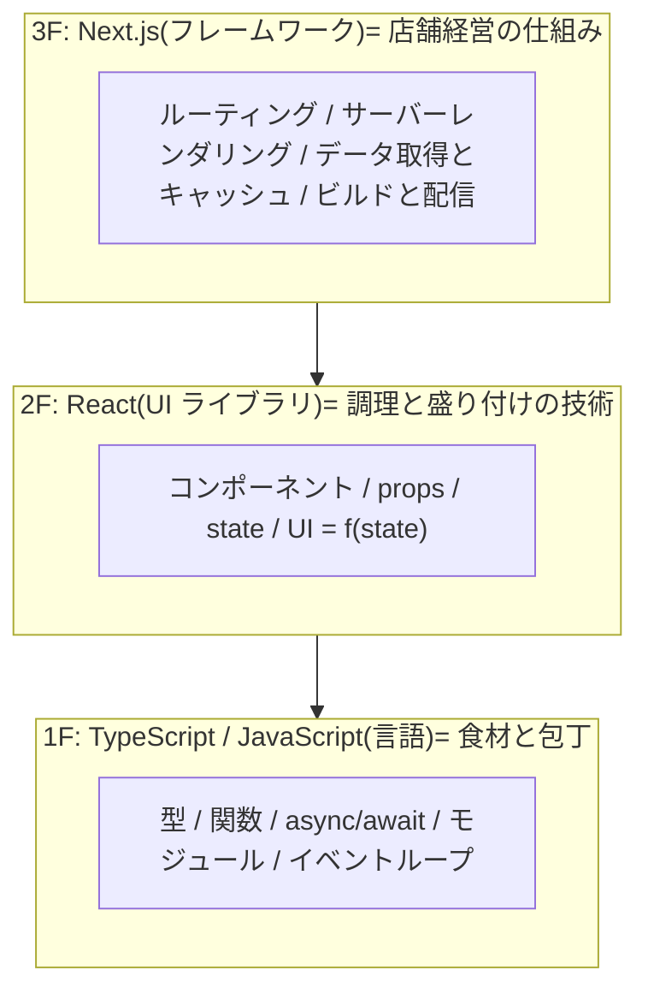
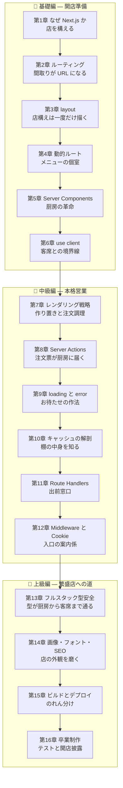

# 🍽️ Next.js Fable 101 — 食堂「Bistro Next」で学ぶフルスタック Web 開発

ようこそ!この教材では、あなたは小さな食堂 **「Bistro Next」** の新米オーナーシェフになります。

最初は店の看板ページを出すことしかできませんが、章を進めるごとに Next.js の新しい概念を
学び、メニュー表・日替わり定食・注文システム・レビュー欄を備えた本格的なレストラン
Web サイトを築いていきます。

## 🧭 この教材の方針 — 「3 階建て」の最上階として学ぶ

**Next.js は単独の技術ではありません。** TypeScript と React の上に建つ 3 階部分です。
この教材の最大の目標は、「どこまでが TS/React の知識で、どこからが Next.js の魔法なのか」を
**常に見分けられる** ようになることです。



- Next.js のコンポーネントは **[react-fable-101](../05-react-fable-101/README.md) で学んだ React
  コンポーネントそのもの** です。書き方は 1 行も変わりません。変わるのは「**どこで**(サーバーか
  ブラウザか)**いつ**(ビルド時かリクエスト時か)実行されるか」だけです
- サーバー側の話はすべて **[typescript-fable-101](../04-typescript-fable-101/README.md) で学んだ
  Node.js の世界**([イベントループ](../04-typescript-fable-101/chapters/11_event_loop.md)、
  [async/await](../04-typescript-fable-101/chapters/12_async_await.md)、
  [門番の検問](../04-typescript-fable-101/chapters/14_runtime_validation.md))の続きです
- 本文では「これは 2F(React)の知識」「ここからが 3F(Next)の新機能」と **階数を明示** しながら
  進みます

劇場(React 教材)との対比で、この教材の舞台は **食堂** です。中心メタファーはこれです:

| 食堂 | Next.js |
|---|---|
| 厨房(客からは見えない) | サーバー(Server Components が動く場所) |
| 客席(客が自分で操作できる) | ブラウザ(Client Components が動く場所) |
| 作り置きの棚 | ビルド時に生成した静的ページ(SSG)とキャッシュ |
| 注文ごとに調理 | リクエストごとのレンダリング(動的) |
| 注文票を厨房に渡す | Server Actions |

コラムは 3 種類です: 💡 **ポイント**(実践的補足)/ 📜 **歴史の背景**(なぜこうなったか)/
⚙️ **厨房の真実**(その書き方の下で Next.js が実際にやっていること)。

## 📖 この教材の読み方

- **前提**: [typescript-fable-101](../04-typescript-fable-101/README.md) と
  [react-fable-101](../05-react-fable-101/README.md) の修了相当。この 2 つを飛ばして Next.js から
  入ると「全部が魔法に見える」状態になります(それがこのシリーズを 3 部作にした理由です)
- 各章は前の章のコードを土台に進みます。順番に読むのがおすすめです
- 各章の最後に「今日の仕込み(演習)」があります
- 図は [Mermaid](https://mermaid.js.org/) 記法です

## 🗺️ 学習マップ



## 📚 目次

| 章 | タイトル | 学ぶ Next.js の概念 | 食堂に起きること |
|---|---|---|---|
| [第1章](chapters/01_why_nextjs.md) | 店を構える | フレームワークの意義、CSR の限界、セットアップ | 看板ページが出る |
| [第2章](chapters/02_routing.md) | 間取りが URL になる | ファイルベースルーティング、Link | メニュー・店舗案内ページ |
| [第3章](chapters/03_layouts.md) | 店構えは一度だけ描く | layout、入れ子、metadata | 共通ヘッダーと内装 |
| [第4章](chapters/04_dynamic_routes.md) | メニューの個室 | 動的ルート、params、notFound | 料理の詳細ページ |
| [第5章](chapters/05_server_components.md) | 厨房の革命 | Server Components、async コンポーネント | 台帳から直接メニュー生成 |
| [第6章](chapters/06_use_client.md) | 客席との境界線 | "use client"、境界とシリアライズ | 注文カウンターが動く |
| [第7章](chapters/07_rendering.md) | 作り置きと注文調理 | 静的/動的レンダリング、ISR | 日替わり定食の自動更新 |
| [第8章](chapters/08_server_actions.md) | 注文票が厨房に届く | Server Actions、フォーム、検証 | 予約システムが動く |
| [第9章](chapters/09_loading_error.md) | お待たせの作法 | loading.tsx、Suspense、error.tsx | 配膳待ちとお詫びの作法 |
| [第10章](chapters/10_caching.md) | 棚の中身を知る | 4 層のキャッシュ、revalidate | 作り置きの管理術 |
| [第11章](chapters/11_route_handlers.md) | 出前窓口 | Route Handlers(API) | 外部向け API が開く |
| [第12章](chapters/12_middleware.md) | 入口の案内係 | Middleware、Cookie | 常連客の見分けと案内 |
| [第13章](chapters/13_type_safety.md) | 型が厨房から客席まで通る | フルスタック型共有、env 検証 | 全工程が型で繋がる |
| [第14章](chapters/14_optimization.md) | 店の外観を磨く | next/image、next/font、メタデータ | 写真と看板の最適化 |
| [第15章](chapters/15_build_deploy.md) | のれん分け | next build の解剖、デプロイ | 世界に公開する |
| [第16章](chapters/16_final.md) | テストと開店披露 | E2E テスト、総まとめ | テスト付き完成品 |

## 🎯 対象読者

- TypeScript と React の基礎を学び終え、「本物の Web サイト・Web サービス」を作りたい人
- Next.js のチュートリアルをなぞったことはあるが、「どこまでが React なのか」が曖昧な人
- SSR / SSG / RSC / キャッシュといった用語に苦手意識がある人

## 🛠️ 準備

```bash
# Node.js 22 以上を確認
node --version

# プロジェクト生成(質問にはすべて Enter で既定値のまま = TypeScript / App Router / Tailwind なし等はお好みで)
npx create-next-app@latest bistro-next --typescript --app --no-tailwind --eslint

cd bistro-next
npm run dev   # → http://localhost:3000 をブラウザで開く
```

Next.js の初期ページが表示されれば開店準備完了です。この教材では主に `app/` フォルダと
`data/` フォルダ(自作)を育てていきます。

それでは、[第1章](chapters/01_why_nextjs.md) — のれんを掲げましょう!🍽️
