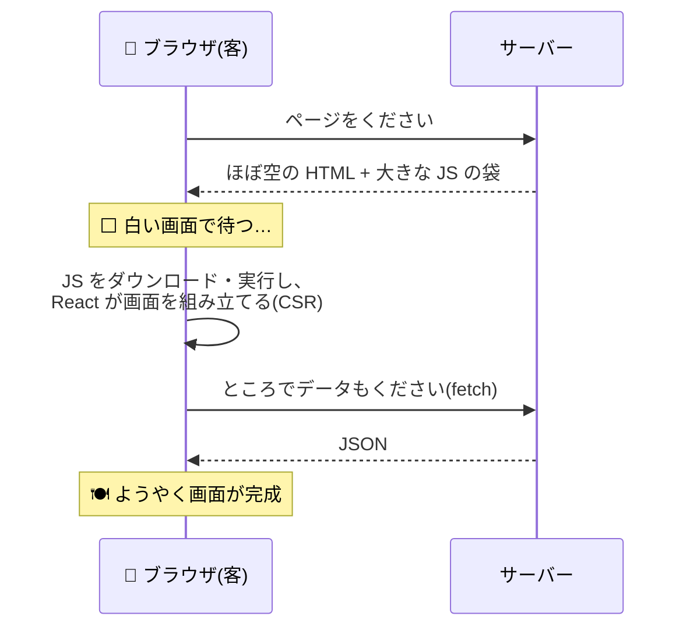

# 第1章 店を構える — なぜ Next.js が必要なのか

## 🍽️ 今日のお話

あなたは今日、食堂「Bistro Next」ののれんを掲げます。……その前に、大事な問いに
答えておきましょう。**React はもう学びました。なぜその上にさらに Next.js が要るのでしょう?**

この問いに自分の言葉で答えられることが、この教材のゴールの半分です。
初日はコードを少しだけにして、地図を頭に入れます。

## React だけで作った店の弱点 — CSR の限界

[react-fable-101](../../05-react-fable-101/README.md) で作った劇場アプリ(Vite + React)の
配信の仕組みを思い出してください。あの方式は **CSR(クライアントサイドレンダリング)**
と呼ばれます。客が来店したときに起きることはこうです:



例えるなら「**来店した客に食材と調理器具一式を渡して、席で自分で作ってもらう店**」です。
アプリとしては立派に動きますが、3 つの弱点があります:

1. **最初の白い画面** — JS が届いて実行されるまで、客は何も見えません。回線や端末が
   遅いほど、白い時間は伸びます
2. **検索エンジンと SNS に中身が見えにくい** — HTML がほぼ空なので、検索結果や
   シェア時のプレビューに内容が出にくい(= 店がグルメサイトに載らない)
3. **全部の JS を客に届ける** — メニューを表示するだけの客にも、調理器具一式
   (全コンポーネントの JS)を持たせることになる

社内の管理画面ならこれで十分です。しかし **一般公開する店** ——レストランのサイト、
EC、メディア——では致命傷になりえます。

## 解決の方向 — 厨房(サーバー)で調理してから出す

答えは単純で、Web の原点回帰です: **サーバー側で HTML を組み立ててから届ければいい**
(SSR: サーバーサイドレンダリング)。さらに、内容が変わらないページなら
**開店前に作り置きしておけばいい**(SSG: 静的サイト生成)。

ではなぜ、素の React でそれをやらないのか?——技術的には可能です([React の
レンダリング](../../05-react-fable-101/chapters/10_rendering.md)は「関数を呼んで設計図を得る」
だけなので、Node.js 上でも実行できます)。しかし自力でやろうとすると、
サーバーの構築、ルーティング、サーバーとブラウザでの二重実行の整合、ビルドの構成、
コード分割、キャッシュ……と、**アプリ本体より足場作りの方が大きくなります**。

**この足場一式を、決まった作法とともに提供するのがフレームワーク = Next.js です。**

> 📜 **歴史の背景 — Next.js の生い立ちと「フレームワーク推奨」への転換**
>
> Next.js は 2016 年、Vercel(当時 ZEIT)社が公開しました。名前は「React の **次**(Next)の
> 一歩」から。当初は「SSR を簡単にする道具」でしたが、SSG(2020, v9.3)、App Router と
> Server Components(2023, v13.4)と進化し、いまや **React 公式ドキュメントが
> 「新規プロジェクトはフレームワーク(Next.js 等)で始めることを推奨」と明言する** までに
> なりました。
>
> [react-fable-101 の overview](../../05-react-fable-101/language-overview/README.md) で触れた
> とおり、React 本体は「UI の作り方」しか決めないライブラリです。ルーティング・データ取得・
> 配信という残りの問題への「公式に近い答え」が Next.js だ、という位置づけです
> (競合として Remix / React Router、TanStack Start などもあります。作法は違えど
> 解いている問題は同じなので、Next.js を深く学べば移るのは難しくありません)。

## 3 階建ての再確認 — 何も捨てずに積み上がる

README の図をもう一度、今度は「何が変わらないか」に注目して見てください。

| 階 | 学んだ教材 | Next.js でどうなるか |
|---|---|---|
| 1F: TypeScript / JS | [typescript-fable-101](../../04-typescript-fable-101/README.md) | **そのまま全部使う**。interface も async/await も門番(zod)も、サーバー側コードは Node.js の世界そのもの |
| 2F: React | [react-fable-101](../../05-react-fable-101/README.md) | **そのまま全部使う**。コンポーネント・props・state・hooks の書き方は 1 行も変わらない |
| 3F: Next.js | 本教材 | 新しく増えるのは「**どこで・いつ実行するか**」の采配と、そのためのファイル規約 |

Next.js の学習で「難しい」と感じたら、それはほぼ確実に 3F 固有の概念(実行場所・
タイミング・キャッシュ)です。**書き方に迷ったら 2F(React)の知識を疑い、
動き方に迷ったら 3F(Next)の采配を疑う**——このシリーズを積み上げてきたあなたには、
切り分けの土台がすでにあります。

## 開店 — プロジェクトの間取り図

README の手順でプロジェクトを作ったら、中を覗きます:

```
bistro-next/
├── app/                  # 🏠 店舗の間取り(= ルーティング。第 2 章の主役)
│   ├── layout.tsx        #    店構え(全ページ共通の枠)
│   ├── page.tsx          #    トップページ(URL: /)
│   └── globals.css       #    全体のスタイル
├── public/               # 📦 画像などをそのまま配信する置き場
├── next.config.ts        # ⚙️ Next.js の設定
├── package.json          # 1F でおなじみの登記簿
└── tsconfig.json         # 1F でおなじみの型検査設定(最初から strict!)
```

`app/page.tsx` を開いて、中身を全部消してこう書き換えます:

```tsx
// app/page.tsx — Bistro Next 開店 1 日目

export default function HomePage() {
  const openingYear = 2026;

  return (
    <main>
      <h1>🍽️ Bistro Next</h1>
      <p>心を込めて、その場で調理してお届けします。</p>
      <p>創業 {openingYear} 年 / 定休日: 月曜</p>
    </main>
  );
}
```

`npm run dev` して http://localhost:3000 を開けば、のれんが掛かっています。

**確認してください**: これは [react-fable-101 第 1 章](../../05-react-fable-101/chapters/01_jsx.md)と
完全に同じ、JSX を返すただの React コンポーネントです。Next.js 固有なのは
「`app/page.tsx` というファイル名に置くと URL `/` になる」という **置き場所の規約** と、
`export default` が必要なことだけ。2F の知識がそのまま 3F の床になっています。

## ⚙️ 厨房の真実 — 最初のページはもう SSR されている

ブラウザで今のページを表示し、**右クリック → 「ページのソースを表示」** してください。

```html
<h1>🍽️ Bistro Next</h1><p>心を込めて、その場で調理してお届けします。</p>...
```

**HTML の中に、内容が最初から入っています。** Vite + React(CSR)の
`<div id="root"></div>` だけの空 HTML との違いが、これです。あなたのコンポーネントは
すでにサーバー(厨房)で実行され、完成した HTML として配膳されています——
1 行も設定を書いていないのに。この「既定でサーバー側」という采配の核心は
第 5 章で解剖します。

## 📝 今日の仕込み(演習)

1. Vite 版 React アプリ(react-fable-101 のもの)と今日の Next.js アプリで、それぞれ「ページのソースを表示」を実行し、HTML の中身を見比べてください。CSR と SSR の違いを自分の目で確認する、この教材で最重要の実験です。
2. 「なぜ React の上に Next.js が要るのか」を、食堂のメタファーを使って 3 行で説明してみてください(白い画面/グルメサイト/調理器具一式、が鍵です)。
3. `HomePage` に「本日のおすすめ: 気まぐれパスタ {980 * 1.1} 円(税込)」を JSX の式埋め込みで追加してください(2F の復習)。
4. `npm run build` を実行して、出力ログを **読める範囲で** 眺めてください(`○ (Static)` という記号が見えるはず)。意味は第 7 章で分かるので、今は「ビルドが何かを事前に作っている」ことだけ感じ取れれば OK です。

---

次章、店の間取りを作ります。「フォルダを掘れば URL になる」——Next.js のいちばん
気持ちいい機能、ファイルベースルーティングです。 → [第2章 間取りが URL になる](02_routing.md)
