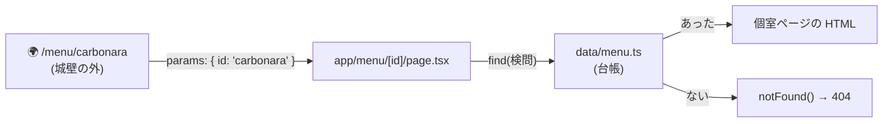

# 第4章 メニューの個室 — 動的ルートと params

## 🍽️ 今日のお話

常連さんから「カルボナーラの詳しい説明ページはないの?」と聞かれました。
料理ごとの紹介ページ——`/menu/carbonara`、`/menu/omurice`、`/menu/curry`——を作ります。

料理は今 3 品ですが、いずれ 100 品になります。フォルダを 100 個掘るわけには
いきません。**「この部分は変数です」というフォルダ** を 1 つ掘れば済む仕組み、
それが動的ルートです。

## [id] — 角括弧のフォルダは変数になる

データを共通の場所に移してから(後の章でも使います)、角括弧フォルダを作ります:

```ts
// data/menu.ts — 台帳を一箇所に(1F の知識: モジュールと export)
export interface MenuItem {
  id: string;
  name: string;
  price: number;
  description: string;
  spicy: boolean;
}

export const menuItems: MenuItem[] = [
  {
    id: "carbonara",
    name: "追いチーズカルボナーラ",
    price: 1200,
    description: "仕上げに客席でチーズを削る名物パスタ。",
    spicy: false,
  },
  {
    id: "omurice",
    name: "とろとろオムライス",
    price: 980,
    description: "スプーンを入れると卵がとろける、開店以来の看板メニュー。",
    spicy: false,
  },
  {
    id: "curry",
    name: "牛すじ欧風カレー",
    price: 1100,
    description: "3 日煮込んだ牛すじ。辛さは中辛のみ。",
    spicy: true,
  },
];
```

```
app/menu/
├── layout.tsx
├── page.tsx          → /menu
└── [id]/
    └── page.tsx      → /menu/carbonara, /menu/omurice, /menu/anything...
```

フォルダ名 `[id]` の角括弧が「ここは変数」の印です。URL のその部分に何が入っても
この page.tsx が担当し、**実際に何が入っていたか** は props の `params` で受け取ります:

```tsx
// app/menu/[id]/page.tsx
import { notFound } from "next/navigation";
import { menuItems } from "../../../data/menu";

export default async function MenuItemPage({
  params,
}: {
  params: Promise<{ id: string }>;   // フォルダ名 [id] がキー名になる
}) {
  const { id } = await params;       // Promise なので await で取り出す(理由は下記)
  const item = menuItems.find((m) => m.id === id);

  if (!item) {
    notFound();                      // 台帳にない料理 → 404 ページへ
  }

  return (
    <main>
      <h1>{item.name} {item.spicy && "🌶️"}</h1>
      <p>{item.description}</p>
      <p>
        <strong>{item.price.toLocaleString()} 円(税込)</strong>
      </p>
    </main>
  );
}
```

http://localhost:3000/menu/carbonara と /menu/omurice を開いてみてください。
**1 つのファイルが、台帳の全料理の個室を担っています。**

分解して確認します:

- `params` の型はフォルダ名と対応します(`[id]` → `{ id: string }`)。
  [interface で props を縛る](../../05-react-fable-101/chapters/02_props.md)のは 2F の知識、
  **URL の一部が props として届く** のが 3F の新機能です
- コンポーネントに **`async`** が付きました。サーバーで実行されるコンポーネントは
  [async 関数](../../04-typescript-fable-101/chapters/12_async_await.md)にできます——この衝撃の意味は
  次章でじっくり扱います。今日は「params は `await` で開ける包み
  ([`Promise<T>`](../../04-typescript-fable-101/chapters/12_async_await.md)!)」とだけ押さえてください
- `notFound()` を呼ぶと、その場でレンダリングを中断して 404(第 2 章で自作した
  `not-found.tsx`)を表示します。**「台帳にないものは早めに門前払い」**——
  [エラーは早く・境界で・明確に](../../04-typescript-fable-101/chapters/14_runtime_validation.md)の原則です

> ⚙️ **厨房の真実 — URL は「城壁の外」である**
>
> `id` の型は `string` ですが、その **中身** は客がアドレスバーに打った任意の文字列です。
> `/menu/carbonara` も `/menu/../../etc/passwd` も `/menu/💩` も届きます。
> [TS 第 14 章の城壁の図](../../04-typescript-fable-101/chapters/14_runtime_validation.md)で言えば、
> **URL・クエリ文字列・フォーム入力はすべて城壁の外** です。
>
> 今日のコードでは `find` が「台帳との突き合わせ」という検問になっています
> (見つからなければ `notFound()`)。数値 ID なら `Number()` + `Number.isInteger` の検査、
> 複雑な形なら zod([第 8 章](08_server_actions.md)で本格運用)——
> **「型注釈があるから安全」とは URL については決して言えない**。この感覚は
> フルスタック開発の基礎体力です。

## 一覧から個室へリンクを張る

```tsx
// app/menu/page.tsx — お品書きを台帳ベース + リンク付きに更新
import Link from "next/link";
import { menuItems } from "../../data/menu";

export default function MenuPage() {
  return (
    <main>
      <h1>📖 お品書き</h1>
      <ul>
        {menuItems.map((item) => (
          <li key={item.id}>
            <Link href={`/menu/${item.id}`}>{item.name}</Link>
            {" — "}{item.price.toLocaleString()} 円
          </li>
        ))}
      </ul>
    </main>
  );
}
```

[テンプレートリテラル](../../04-typescript-fable-101/chapters/01_variables.md)で URL を組み立て、
[map + key](../../05-react-fable-101/chapters/03_lists.md) で一覧を生成——1F と 2F の合わせ技です。

## 個室ごとの看板 — generateMetadata

動的ルートでは metadata も動的に作れます。前章の `export const metadata`(固定値)の
関数版です:

```tsx
// app/menu/[id]/page.tsx に追記
import type { Metadata } from "next";

export async function generateMetadata({
  params,
}: {
  params: Promise<{ id: string }>;
}): Promise<Metadata> {
  const { id } = await params;
  const item = menuItems.find((m) => m.id === id);
  return {
    title: item ? item.name : "メニューが見つかりません",
    description: item?.description,
  };
}
```

`/menu/carbonara` のタブ表示が料理名になりました。SNS でシェアされたときの
プレビューも、この情報から作られます。



## 📝 今日の仕込み(演習)

1. `/menu/ramen`(台帳にない料理)を開いて、自作の 404 が表示されることを確認してください。`notFound()` の行をコメントアウトすると何が起きるかも観察を(`item` が `undefined` のまま進む——[TS の null 安全](../../04-typescript-fable-101/chapters/05_unions.md)がコンパイル時にどう警告するかにも注目)。
2. 台帳に 4 品目を追加してください。一覧と個室が **コードの変更なしで** 増えることを確認してください。「データと画面の一致」([React 第 3 章](../../05-react-fable-101/chapters/03_lists.md))がルーティングまで貫通した形です。
3. `data/menu.ts` に `findMenuItem(id: string): MenuItem | undefined` を作って、page と generateMetadata の重複した find を一本化してください(1F: 関数への切り出し)。
4. お知らせの個室 `/news/[slug]` を自作してください(台帳は `data/news.ts`)。フォルダ名を `[slug]` にしたとき、params のキー名がどうなるかを確認すること。

---

次章、この教材の心臓部です。第 1 章から積んできた伏線——「なぜページのソースに
中身が入っているのか」「なぜコンポーネントに async が書けるのか」——を、
**Server Components** として一気に回収します。 → [第5章 厨房の革命](05_server_components.md)
