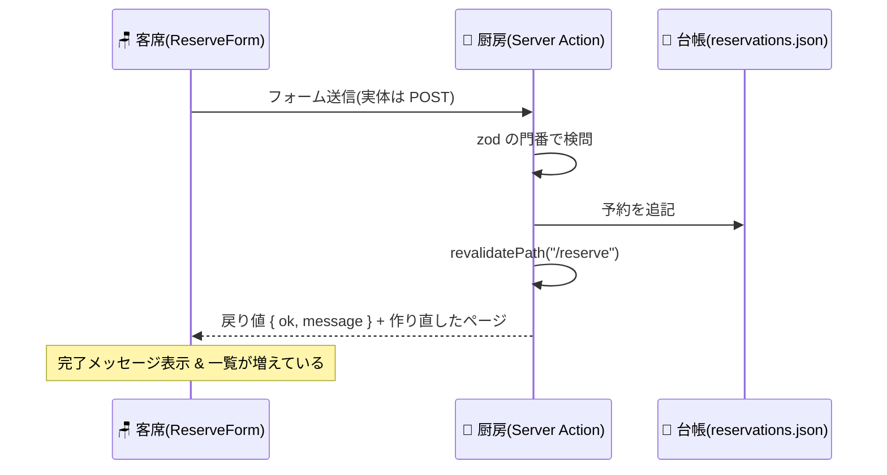

# 第8章 注文票が厨房に届く — Server Actions

## 🍽️ 今日のお話

Bistro Next に **予約フォーム** を作ります。お名前と人数を書いてもらい、
予約台帳(`data/reservations.json`)に記録する——初めての「書き込み」機能です。

これまでの常識なら、こうです: API エンドポイントを作り、クライアントから fetch で
POST し、リクエストボディを検証し、レスポンスを返し、クライアント側でエラーを処理する
([TS 第 14 章](../../04-typescript-fable-101/chapters/14_runtime_validation.md) +
[React 第 14 章](../../05-react-fable-101/chapters/14_data_fetching.md)の合わせ技)。
Next.js はこの往復を大胆に略記します——**「フォームの送信先に、サーバーの関数を
直接書く」**。それが Server Actions です。

## "use server" — 境界を越えられる特別な関数

第 6 章で「関数は厨房から客席へ渡せない」と学びました。Server Actions はその唯一の
公式な例外——正確には、**関数そのものではなく『厨房の関数の呼び出し券』を渡す** 仕組みです。

```ts
// app/reserve/actions.ts — 厨房側の処理(Server Action)
"use server";                       // この札のファイルの export は全部「呼び出し券」化される

import { readFile, writeFile } from "node:fs/promises";
import { revalidatePath } from "next/cache";
import { z } from "zod";

const ReservationSchema = z.object({
  name: z.string().min(1, "お名前をご記入ください"),
  partySize: z.coerce.number().int().min(1).max(8, "8 名様まで承れます"),
});

export async function reserveTable(formData: FormData) {
  // ① 城壁の外から来た FormData を門番に通す(値は全部 string で届く!)
  const parsed = ReservationSchema.safeParse({
    name: formData.get("name"),
    partySize: formData.get("partySize"),
  });
  if (!parsed.success) {
    return { ok: false as const, message: parsed.error.issues[0].message };
  }

  // ② ここは Node.js の世界 — ファイルにも DB にも書ける
  const raw = await readFile("data/reservations.json", "utf-8").catch(() => "[]");
  const reservations = JSON.parse(raw) as unknown[];
  reservations.push({ ...parsed.data, at: new Date().toISOString() });
  await writeFile("data/reservations.json", JSON.stringify(reservations, null, 2));

  // ③ 予約一覧ページの作り置きを「作り直し」に指定(前章の演習 4 の答え!)
  revalidatePath("/reserve");

  return { ok: true as const, message: `${parsed.data.name} さま、${parsed.data.partySize} 名で承りました` };
}
```

フォーム側は、この関数を `action` に **そのまま** 渡します:

```tsx
// app/reserve/page.tsx(Server Component)
import { reserveTable } from "./actions";

export default function ReservePage() {
  return (
    <main>
      <h1>📞 ご予約</h1>
      <form action={reserveTable}>
        <input name="name" placeholder="お名前" />
        <input name="partySize" type="number" defaultValue={2} min={1} max={8} />
        <button type="submit">予約する</button>
      </form>
    </main>
  );
}
```

これだけで動きます。API ルートなし、fetch なし、リクエストボディの手動パースなし。
送信すると `reserveTable` が **サーバーで** 実行され、JSON ファイルに予約が追記されます。

> ⚙️ **厨房の真実 — 裏で起きているのは、結局 HTTP POST**
>
> 魔法ではありません。ビルド時に Next.js は `"use server"` の関数ごとに **秘密の ID** を
> 発行し、`<form action={...}>` を「その ID 宛の POST リクエストを送るフォーム」に
> 変換します。つまりあなたが省略した「エンドポイント定義と fetch の往復」を、
> **フレームワークがコード生成で肩代わりしている** だけです。
>
> この理解から重要な帰結が 2 つ出ます:
> 1. **Server Action は公開エンドポイントである。** フォームからしか呼べないように
>    見えますが、HTTP を直接叩けば誰でも呼べます。だから **検証(門番)と権限確認を
>    Action の中に書く** のは省略不可です——上のコードで zod が最初に立っているのは
>    飾りではありません
> 2. **JS が無効でも動く**(プログレッシブエンハンスメント)。変換後の実体は素の
>    `<form method="POST">` なので、JS が届く前・切れている端末でも予約は通ります。
>    1995 年から動き続ける HTML フォームの底力を、モダンな書き味で使う——という設計です。

## useActionState — 結果をお客さまに伝える

今のままでは、成功メッセージ(`return` した値)が画面に出ません。結果の表示は
客席の仕事——**フォーム部分だけ** Client Component に切り出し、React 19 の
`useActionState` フックで Action と接続します:

```tsx
// app/reserve/ReserveForm.tsx
"use client";

import { useActionState } from "react";
import { reserveTable } from "./actions";

type ActionResult = { ok: boolean; message: string } | null;

export function ReserveForm() {
  const [result, formAction, isPending] = useActionState(
    async (_prev: ActionResult, formData: FormData) => reserveTable(formData),
    null
  );

  return (
    <form action={formAction}>
      <input name="name" placeholder="お名前" />
      <input name="partySize" type="number" defaultValue={2} min={1} max={8} />
      <button type="submit" disabled={isPending}>
        {isPending ? "確認中…" : "予約する"}
      </button>
      {result && <p>{result.ok ? "✅" : "⚠️"} {result.message}</p>}
    </form>
  );
}
```

- `result` — Action の戻り値(初期値 null)。**サーバーの関数の戻り値が、型付きのまま
  客席の state に入ります**([判別可能 union で成功/失敗を返す](../../04-typescript-fable-101/chapters/05_unions.md)設計が
  ここでも活きます)
- `isPending` — 送信中フラグ。[「導出できる状態は作らない」](../../05-react-fable-101/chapters/05_state.md)の
  精神どおり、自前の `useState(false)` は不要です
- 「客席の出来事を厨房に伝えるには?」(第 6 章の宿題)の答えがこれです:
  **コールバックを渡す代わりに、呼び出し券(Server Action)を客席に渡す**

## revalidatePath — 「イベントで作り直す」

前章の演習 4 の答え合わせです。予約一覧を同じページに表示してみます:

```tsx
// app/reserve/page.tsx(Server Component)
import { readFile } from "node:fs/promises";
import { ReserveForm } from "./ReserveForm";

export default async function ReservePage() {
  const raw = await readFile("data/reservations.json", "utf-8").catch(() => "[]");
  const reservations = JSON.parse(raw) as { name: string; partySize: number }[];

  return (
    <main>
      <h1>📞 ご予約</h1>
      <ReserveForm />
      <h2>本日のご予約({reservations.length} 組)</h2>
      <ul>
        {reservations.map((r, i) => (
          <li key={i}>{r.name} さま — {r.partySize} 名</li>
        ))}
      </ul>
    </main>
  );
}
```

Action の中の `revalidatePath("/reserve")` が効いて、**予約した瞬間に一覧も増えます**。
流れを追うと: 送信 → 厨房で Action 実行(台帳更新)→ このパスの作り置きを無効化 →
ページを厨房で作り直して届ける → 画面更新。**「時間で作り直す」(ISR)に対する
「イベントで作り直す」**(on-demand revalidation)です。

[React 教材では「送信後に一覧 state を更新する」ロジックを自分で書きました](../../05-react-fable-101/chapters/07_immutability.md)が、
ここでは **一覧の state そのものが存在しません**。真実は常にサーバーの台帳 1 つで、
画面は毎回そこから作り直される——`UI = f(state)` の `state` がサーバー側に引っ越した、
と捉えると RSC 時代の設計観が掴めます。



## 📝 今日の仕込み(演習)

1. 名前を空にして送信し、zod の門番のメッセージが画面に出ることを確認してください。`partySize` に 20 を入れた場合も。
2. ブラウザの JavaScript を無効化して(開発者ツールの設定から)予約を送信してください。それでも台帳に書き込まれることを確認——プログレッシブエンハンスメントの体感です(結果メッセージの表示だけは JS が要ります)。
3. `revalidatePath` の行をコメントアウトすると、送信後の画面はどうなりますか?一覧が増えない理由を「作り置きの棚」の言葉で説明してください。
4. 予約の「取り消し」Action を追加してください。一覧の各行に取り消しボタン(`<form action={...}>` を行ごとに置き、`<input type="hidden" name="index" ...>` で対象を渡す)を付け、Action で台帳から削除 → revalidatePath、まで。

---

次章、調理に時間がかかるときの「お待たせの作法」です。loading.tsx と Suspense で
**ページの一部だけ後から配膳する**(ストリーミング)——React 第 14 章の 3 局面管理が、
Next.js ではファイルと境界の配置に変わります。 → [第9章 お待たせの作法](09_loading_error.md)
