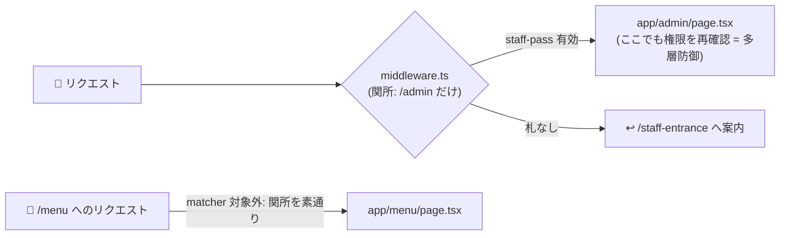

# 第12章 入口の案内係 — Middleware と Cookie

## 🍽️ 今日のお話

Bistro Next に 2 つの要望が届きました。
「**常連です。来店のたびに名前を打つのは面倒**」——客を覚える仕組み(Cookie)。
「**厨房の裏口(管理ページ)に、誰でも入れてしまうのは困る**」——入口での検問
(Middleware)。

どちらも「リクエストが誰から来たか」を扱う話です。今日は店の **入口** を整備します。

## Cookie — 客の懐に入れる「会員札」

HTTP は本来 **記憶を持たない** プロトコルです(毎回が一見さん)。それを補うのが
Cookie——**サーバーが客のブラウザに持たせる小さな札** で、以後そのブラウザは同じ店への
全リクエストに札を自動添付します。

Next.js では `cookies()` で読み書きします。まず、名前を覚える Server Action:

```ts
// app/regulars/actions.ts — 常連登録
"use server";

import { cookies } from "next/headers";
import { revalidatePath } from "next/cache";
import { z } from "zod";

export async function registerRegular(formData: FormData) {
  const parsed = z.string().min(1).max(20).safeParse(formData.get("name"));
  if (!parsed.success) return;

  const cookieStore = await cookies();
  cookieStore.set("regular-name", parsed.data, {
    httpOnly: true,                      // JS から読めない札にする(盗み見対策の基本)
    maxAge: 60 * 60 * 24 * 30,           // 30 日間有効
    path: "/",
  });
  revalidatePath("/");
}
```

読む側は Server Component から:

```tsx
// app/page.tsx — トップページで常連さんに挨拶
import { cookies } from "next/headers";

export default async function HomePage() {
  const cookieStore = await cookies();
  const regularName = cookieStore.get("regular-name")?.value;

  return (
    <main>
      <h1>🍽️ Bistro Next</h1>
      {regularName ? (
        <p>おかえりなさい、{regularName} さん!いつもの席が空いていますよ。</p>
      ) : (
        <p>はじめまして!ご来店ありがとうございます。</p>
      )}
      {/* 登録フォームは演習で */}
    </main>
  );
}
```

⚠️ **重大な副作用に注意**: `cookies()` を使った瞬間、このページは
**動的レンダリング(ƒ)に切り替わります**([第 7 章の自動判定](07_rendering.md))。
当然です——客ごとに違う挨拶をするページは、作り置きできません。
「トップページを静的に保ちたいのに挨拶だけ客ごと」のような要件は、挨拶部分だけを
[Suspense で包んで部分的に動的化する](09_loading_error.md)(または客席側で処理する)
設計になります。**Cookie を読む場所 = 作り置きを諦める場所**、という等式は
常に意識してください。

> 💡 Cookie の値も [城壁の外](../../04-typescript-fable-101/chapters/14_runtime_validation.md)です。
> 客の懐にある札は、**客が自由に書き換えられます**(開発者ツールで一発)。
> 「表示に使う名前」程度なら上のままでよいですが、「会員ランク」「ログイン済みか」の
> ような **信用が必要な情報を生の Cookie に置いてはいけません**。実務では署名付き
> セッション(改竄したら無効になる札)や認証ライブラリ(Auth.js など)を使います。
> 本章はその手前の「札の仕組み」までを学びます。

## Middleware — 全リクエストが通る関所

管理ページ `/admin`(予約台帳と注文台帳を見る裏口)を作るとして、
そこへの通行制限はどこに書くべきでしょう?ページの中に書くと、管理ページを
増やすたびにコピペが要ります。**すべてのリクエストがページに到達する前に通る関所**
——それが Middleware です。プロジェクト直下に `middleware.ts` を 1 つ置きます:

```ts
// middleware.ts(プロジェクトルート、app/ の外!)
import { NextResponse } from "next/server";
import type { NextRequest } from "next/server";

export function middleware(request: NextRequest) {
  const staffPass = request.cookies.get("staff-pass")?.value;

  if (staffPass !== "himitsu-no-aikotoba") {
    // 合言葉の札を持っていない客は、入口ページへ丁重にご案内(リダイレクト)
    return NextResponse.redirect(new URL("/staff-entrance", request.url));
  }
  return NextResponse.next();          // 札を確認できたら通す
}

export const config = {
  matcher: ["/admin/:path*"],          // この関所は /admin 以下にだけ立つ
};
```

- `matcher` で対象パスを絞ります。書かなければ全リクエストが通ることになり、
  性能も事故半径も悪化します。**関所は必要な門にだけ**
- できることは「通す(`next()`)」「よそへ案内(`redirect`)」「書き換えて通す
  (`rewrite`、URL はそのままで別の部屋を見せる)」「ヘッダーや Cookie を添えて通す」

> ⚙️ **厨房の真実 — Middleware は「軽い関所」であって「門番の代わり」ではない**
>
> Middleware は歴史的に **エッジランタイム**(世界中の配信拠点で動く軽量 JS 実行環境。
> Node.js の全機能はない)で動くよう設計されており、実行時間もコード量も小さく
> 保つ前提の場所です。ファイルや DB を開いてじっくり検査する場所ではありません。
>
> そしてセキュリティ上の鉄則がひとつ。2025 年、Middleware の認可チェックを
> **特殊なヘッダーで素通りできてしまう** 深刻な脆弱性(CVE-2025-29927)が Next.js に
> 見つかり、業界を騒がせました。教訓は明快です——**関所(Middleware)は利便のための
> 一次フィルタ。本当の権限確認は、データに触る場所(Server Action・Route Handler・
> ページ本体)でもう一度行う**。[多層防御](../../05-react-fable-101/chapters/13_reducer.md)
> (UI の disabled と reducer のガードの二重化)と同じ思想を、店の構えでも貫きます。



## 従業員入口を作る

```tsx
// app/staff-entrance/page.tsx — 合言葉を入れる入口
import { redirect } from "next/navigation";
import { cookies } from "next/headers";

async function enter(formData: FormData) {
  "use server";                                    // 関数の中に書く形の Server Action

  const pass = formData.get("pass");
  if (pass === "himitsu-no-aikotoba") {
    const cookieStore = await cookies();
    cookieStore.set("staff-pass", String(pass), { httpOnly: true, path: "/" });
    redirect("/admin");                             // 厨房の裏口へ
  }
}

export default function StaffEntrancePage() {
  return (
    <main>
      <h1>🚪 従業員入口</h1>
      <form action={enter}>
        <input name="pass" type="password" placeholder="合言葉" />
        <button type="submit">入る</button>
      </form>
    </main>
  );
}
```

```tsx
// app/admin/page.tsx — 管理ページ(予約と注文の台帳を一覧)
import { readFile } from "node:fs/promises";

export default async function AdminPage() {
  const reservations = JSON.parse(
    await readFile("data/reservations.json", "utf-8").catch(() => "[]")
  ) as { name: string; partySize: number }[];

  return (
    <main>
      <h1>🗄️ 管理ページ(スタッフ専用)</h1>
      <h2>ご予約 {reservations.length} 組</h2>
      <ul>
        {reservations.map((r, i) => (
          <li key={i}>{r.name} さま — {r.partySize} 名</li>
        ))}
      </ul>
    </main>
  );
}
```

💡 合言葉をコードに直書きしているのは教材の簡略化です。実際は環境変数(次章)に置き、
さらに実務では既製の認証ライブラリを使います。**この章の学びは「認証の実装」ではなく
「リクエストの通り道と、検問を置ける場所の地図」** ——それさえあれば、認証ライブラリの
ドキュメントが読める体になっています。

## 📝 今日の仕込み(演習)

1. 常連登録フォーム(`registerRegular` を使う)をトップページに設置し、登録 → 挨拶が変わる → ブラウザの開発者ツール(Application → Cookies)で札を確認 → 削除すると一見さんに戻る、を一巡してください。
2. `cookies()` を使う前後で `npm run build` の `/`(トップ)の記号(○/ƒ)がどう変わるか確認してください(第 7 章と第 10 章の総復習)。
3. Middleware を無効化(ファイル名を変える)して `/admin` に直接入れてしまうことを確認し、`AdminPage` 自身にも staff-pass チェック(なければ `redirect("/staff-entrance")`)を追加してください——多層防御の実装です。
4. (考察)「メンテナンス中は全ページを `/maintenance` に案内したい」。Middleware でどう書くか、matcher をどうするか(`/maintenance` 自身を対象外にしないと無限ループ!)を設計してください。

---

次章、このシリーズ 3 部作の合流点です。**TypeScript の型が、厨房から客席まで
一気通貫で通る**——フルスタック型安全という、この技術スタックを選ぶ最大の理由を
総まとめします。 → [第13章 型が厨房から客席まで通る](13_type_safety.md)
