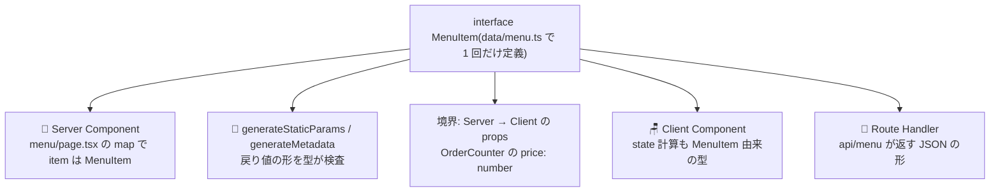

# 第13章 型が厨房から客席まで通る — フルスタック型安全

## 🍽️ 今日のお話

今日は新機能を 1 つも作りません。代わりに、**この 3 部作(TypeScript → React →
Next.js)を積み上げてきた最大の配当** を受け取りに行きます。

伝統的な Web 開発では、サーバー(たとえば [Go](../../03-go-fable-101/README.md) や
[Python](../../02-python-fable-101/README.md))とフロントエンド(JS)は **別の言語** でした。
API の境界では型情報が途切れ、「サーバーが `snake_case` に変えた」「int のつもりが
文字列で来た」という不一致は、実行時に画面が壊れて初めて発覚します。両者を繋ぐのは
API 仕様書と祈りです。

Next.js のフルスタックは違います。**厨房も客席も同じ TypeScript プロジェクト** ——
型が境界で途切れません。今日はその「途切れなさ」を 1 本ずつ確かめ、
どうしても途切れる場所(城壁)に門番を置き直します。

## 一気通貫の確認 — 1 つの interface が全工程を流れる

`data/menu.ts` の `MenuItem` interface(第 4 章)が、いまどこで働いているかを
追跡してみましょう:



試しに、台帳の `price` を `priceYen` にリネームしてみてください(エディタの
リネーム機能で)。**厨房のページ、客席のカウンター、API 窓口——影響箇所ぜんぶが
その場でコンパイルエラーになり、修正漏れが物理的に不可能** になります。
これが「サーバーとフロントが別言語」の世界では手に入らない開発体験です。
[TS 第 1 章で「実行する前に間違いが分かる」](../../04-typescript-fable-101/chapters/01_variables.md)と
学んだ価値が、いまやマシン境界をまたいで効いています。

## Server Actions — 「関数呼び出しの見た目」に型が乗る

第 8 章の Server Action をもう一度見ます。今度は型の視点で:

```ts
// 厨房側(actions.ts)
export async function reserveTable(formData: FormData) {
  ...
  return { ok: true as const, message: `...` };   // 戻り値の型はここから推論される
}
```

```tsx
// 客席側(ReserveForm.tsx)
const [result, formAction] = useActionState(...);
result.message   // ✅ string だと分かっている
result.mesage    // ❌ コンパイルエラー(境界の向こうの関数の typo を、こちらで検出!)
```

Action は実体こそ HTTP POST([第 8 章⚙️](08_server_actions.md))ですが、
**型システムの上では「ただの関数呼び出し」** です。引数と戻り値の型が境界を素通りする
——伝統的な API 開発でこれをやるには、OpenAPI 仕様書からの型生成や tRPC のような
仕掛けが必要でした。同一プロジェクト・同一言語だから、仕掛けなしで成立しています。

> 📜 **歴史の背景 — 「型を境界に通す」への長い道**
>
> フロントとサーバーの型の分断は、業界が 10 年以上戦ってきた問題です。
> API 仕様書を型の源にする(OpenAPI / GraphQL のコード生成)、TS サーバーと TS クライアントを
> 型だけで繋ぐ(tRPC)、そしてフレームワークが境界ごと抱え込む(Next.js の Server
> Actions、Remix の loader/action)——アプローチは違えど、目指す景色は同じ
> 「**境界を越えても型が生きている**」です。
> [TS の overview で「フルスタック性は TS 固有の武器」](../../04-typescript-fable-101/language-overview/README.md)と
> 書いたのは、この文脈です。Next.js はその武器を最大限に活かす場所、とも言えます。

## それでも型が通らない場所 — 城壁の総点検

ここで気を引き締めます。「全部型で守られている」は **誤解** です。
[型は実行時に消える(TS 第 14 章)](../../04-typescript-fable-101/chapters/14_runtime_validation.md)以上、
**プロセスの外から来るデータ** には型の保証がありません。Bistro Next の城壁を
総点検しましょう:

| 城壁の外からの入口 | 登場した章 | 門番の置き方 |
|---|---|---|
| URL の params / searchParams | [第 4 章](04_dynamic_routes.md) | 台帳との突き合わせ + notFound / zod |
| フォーム(FormData) | [第 8 章](08_server_actions.md) | Action 冒頭で zod |
| API の request body / query | [第 11 章](11_route_handlers.md) | Handler 冒頭で zod + 400 |
| Cookie | [第 12 章](12_middleware.md) | 信用しない。重要情報は署名付きへ |
| 読み込むファイル / DB / 外部 API | [第 5 章](05_server_components.md) / [第 9 章](09_loading_error.md) | 読み込み直後に zod |
| 環境変数(次節) | 本章 | 起動時に zod |

**「interface を書いたから安全」ではなく「門番を通したから安全」。** 型は城壁の
内側の秩序、zod は城門の検問——この二層構造は、3 部作をどう進んでも変わらない
背骨です。

## 環境変数 — 最後の検問所を作る

実務の Next.js で必ず扱う「城壁の外」が **環境変数** です(DB の接続先、API キー、
前章の合言葉など)。`process.env.X` の型は常に `string | undefined` ——設定し忘れれば
実行時に undefined が漏れ出します。**起動時に一度だけ検問する** のが定石です:

```ts
// lib/env.ts — 起動時の検問所
import { z } from "zod";

const EnvSchema = z.object({
  STAFF_PASSWORD: z.string().min(8, "合言葉は 8 文字以上にしてください"),
  GOURMET_API_URL: z.string().url().optional(),
});

export const env = EnvSchema.parse({
  STAFF_PASSWORD: process.env.STAFF_PASSWORD,
  GOURMET_API_URL: process.env.GOURMET_API_URL,
});
// 設定漏れ・様式違反なら、客が来る前(起動時)に大声で死ぬ。
// 以後 env.STAFF_PASSWORD の型は string(undefined ではない)として使える。
```

```bash
# .env.local(Git には入れない — .gitignore に最初から入っています)
STAFF_PASSWORD=himitsu-no-aikotoba
```

前章の合言葉直書きを `env.STAFF_PASSWORD` に置き換えれば、宿題が 1 つ片付きます。

> ⚙️ **厨房の真実 — NEXT_PUBLIC_ という名の境界線**
>
> 環境変数にも厨房/客席の境界があります。`process.env.X` は **厨房専用** ——
> 客席のコード(Client Component)では undefined です。バンドルに秘密が混入しない
> ための設計です。客席にも見せてよい値(解析ツールの ID など)だけ、
> **`NEXT_PUBLIC_` プレフィックス** を付けると、ビルド時に客席コードへ **焼き込まれます**。
> 逆に言えば `NEXT_PUBLIC_` を付けた瞬間、その値は全世界に公開されます。
> [第 6 章の「境界の意識はセキュリティの意識」](06_use_client.md)の環境変数版です。

## 型安全の三段活用 — まとめ

この章、ひいては 3 部作の型に関する結論を三行に圧縮します:

1. **1F(TypeScript)**: 型は「城壁の内側」を実行前に検査する。ただし実行時には消える
2. **2F(React)**: props・state・アクションに型を通し、「ありえない画面」を書けなくする
3. **3F(Next.js)**: 同一言語フルスタックにより、型の城壁が **サーバーとブラウザを
   1 つに囲む**。ただし城門(URL・フォーム・ファイル・env)の数も増えるので、
   門番(実行時検証)の配置がそのまま設計力になる

## 📝 今日の仕込み(演習)

1. `MenuItem` の `price` を `priceYen` にリネームし、コンパイルエラーの一覧を **修正前に全部読んで** ください(何ファイル・何箇所に波及したかを記録)。読み終えたら直すかリネームを戻すかはお好みで。
2. `lib/env.ts` を実装し、(a) `.env.local` なしで起動 → 起動時に落ちる、(b) 7 文字の合言葉 → メッセージ付きで落ちる、(c) 正しく設定 → 起動する、を確認してください。
3. 第 11 章の `GET /api/menu` のレスポンスの型を `NextResponse.json<T>` のジェネリクスで明示し、`items` から `price` を消すとコンパイルエラーになることを確認してください(API の後方互換を型で守る第一歩)。
4. (考察)「Server Action の戻り値に型が通るなら、zod は不要では?」——この問いに、[第 8 章⚙️の「Action は公開エンドポイント」](08_server_actions.md)を踏まえて反論してください。型が守る相手と門番が守る相手の違いが言語化できれば合格です。

---

次章、店の「見てくれ」を仕上げます。重い写真で遅くなった店を `next/image` が救い、
フォントのちらつきを `next/font` が消す——Web 最適化の道具箱です。
→ [第14章 店の外観を磨く](14_optimization.md)
