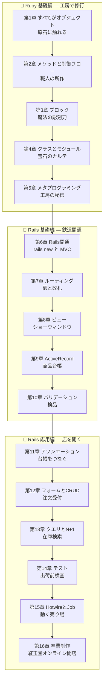

# 💎 Rails Fable 101 — 宝石工房「紅玉堂」で学ぶ Ruby と Ruby on Rails

ようこそ!この教材では、あなたは山あいの町にある小さな宝石工房
**「紅玉堂(こうぎょくどう)」**(紅玉 = ルビーの和名)の見習い職人になります。

前半(第1〜5章)では工房で **Ruby という言語そのもの** を学び、
後半(第6〜16章)では町に鉄道(Rails!)が開通したのを機に、
**Ruby on Rails でオンラインショップ「紅玉堂オンライン」** を築き上げます。
最終章では、商品カタログ・注文管理・ログイン機能を備えた本物の Web アプリが完成します。

> 🐍🐹 **この教材は [Python Fable 101](../02-python-fable-101/README.md) と
> [Go Fable 101](../03-go-fable-101/README.md) の両方を学んだ後に読む前提で書かれています。**
> 各章に「🐍 Python との違い」「🐹 Go との違い」コーナーがあり、
> 3 言語目だからこそ見える **Ruby の強み(表現力・ブロック・DSL・開発者の幸福)** に
> 焦点を当てます。どちらか未学習でも読めますが、比較部分の面白さは半減します。

## 📖 この教材の読み方

- **なぜ Ruby 基礎編が先にあるのか。** Rails は「Ruby の柔軟さを限界まで使った DSL の塊」です。
  `has_many :orders` が魔法ではなく **ただのメソッド呼び出し** だと分かってから Rails に入ると、
  学習速度がまるで違います。第1〜5章は Rails を読むための「Ruby 免許教習所」です。
- 各章は **前の章のコードを土台に** 進みます。順番に読むのがおすすめです。
- コードは実際に手を動かして実行してください(Ruby 3.4 以上・Rails 8 系を推奨)。
- 各章の最後に「今日の研磨(演習)」があります。**壊す実験を飛ばさないでください。**
- **🐍 Python との違い / 🐹 Go との違い** — 既習 2 言語との比較で Ruby の設計を立体視します。
- **🔍 なぜそうなっているの?** — Ruby / Rails の一見不思議な仕様の背景(思想・歴史)を解説します。
  Rails は「なぜ」を知らないと魔法に見え、知れば必然に見えるフレームワークです。
- 図は [Mermaid](https://mermaid.js.org/) 記法です。GitHub や VS Code のプレビューで表示できます。

## 🗺️ 学習マップ



## 📚 目次

| 章 | タイトル | 学ぶ概念 | 工房に起きること |
|---|---|---|---|
| [第1章](chapters/01_everything_is_object.md) | 原石に触れる | irb、変数、文字列、シンボル、「すべてがオブジェクト」 | 入門!初めて原石を磨く |
| [第2章](chapters/02_methods_and_flow.md) | 職人の所作 | メソッド、暗黙の return、後置 if、真偽値の罠 | 作業手順が言葉になる |
| [第3章](chapters/03_blocks.md) | 魔法の彫刻刀 | ブロック、each/map/select、Proc とラムダ | 大量の原石を一括加工できる |
| [第4章](chapters/04_classes_modules.md) | 宝石のカルテ | クラス、attr_accessor、モジュールと mixin | 宝石に台帳と振る舞いが付く |
| [第5章](chapters/05_metaprogramming.md) | 工房の秘伝 | クラスマクロの正体、define_method、DSL | Rails の「魔法」の種明かしを知る |
| [第6章](chapters/06_hello_rails.md) | 鉄道開通 | rails new、CoC、MVC、ディレクトリ構成 | 町に鉄道が通り、通販事業が始動 |
| [第7章](chapters/07_routes_controllers.md) | 駅と改札 | routes.rb、resources、コントローラ、params | 注文の受付窓口ができる |
| [第8章](chapters/08_views.md) | ショーウィンドウ | ERB、レイアウト、パーシャル、ヘルパー | 商品が美しく陳列される |
| [第9章](chapters/09_activerecord_basics.md) | 商品台帳 | モデル、マイグレーション、CRUD | 台帳が紙からデータベースへ |
| [第10章](chapters/10_validations.md) | 検品 | バリデーション、コールバック | 不良データが台帳に入らなくなる |
| [第11章](chapters/11_associations.md) | 台帳をつなぐ | belongs_to、has_many、through | 顧客・注文・商品がつながる |
| [第12章](chapters/12_forms_crud.md) | 注文受付 | form_with、strong parameters、CRUD 完成 | Web から注文を受けられる |
| [第13章](chapters/13_queries.md) | 在庫検索 | クエリ、scope、N+1 と includes | 台帳検索が速く・賢くなる |
| [第14章](chapters/14_testing.md) | 出荷前検査 | minitest、fixtures、システムテスト | 品質保証体制が整う |
| [第15章](chapters/15_modern_rails.md) | 動く売り場 | Hotwire、Active Job、API モード | 売り場が滑らかに動き出す |
| [第16章](chapters/16_final.md) | 卒業制作 | 認証、デプロイ、卒業後の地図 | 紅玉堂オンライン、グランドオープン |

## 🎯 対象読者

- Python と Go を学び終え、3 言語目として Ruby / Rails を学ぶ人
- 転職先・現場で Rails が使われており、「Rails チュートリアルを写経したが魔法にしか見えなかった」人
- `validates :name, presence: true` の **1 行を文法的に説明できるようになりたい** 人

## 🛠️ 準備

```bash
# Ruby 3.4 以上を確認(rbenv / mise / asdf などでの導入を推奨)
ruby -v

# 対話環境 irb が動くことを確認(第1章はこれだけで進みます)
irb

# Rails は第6章で導入します(今はまだ不要)
# gem install rails
```

> 💡 Ruby 基礎編(第1〜5章)は `atelier/` ディレクトリに 1 章 1 ファイルで書き、
> `ruby atelier/day1.rb` のように実行します。Rails 編(第6章〜)で
> `rails new kogyokudo` してアプリを育てていきます。

それでは、[第1章](chapters/01_everything_is_object.md) から工房に弟子入りです!💎
